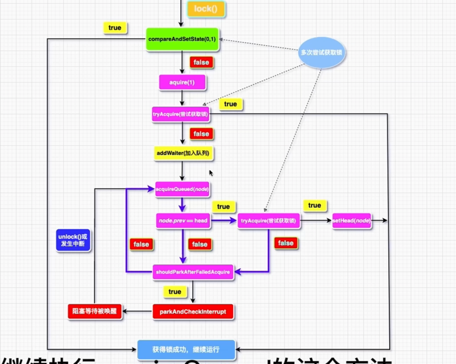

# AQS

## Reentrantlock

[代码分析](https://www.cnblogs.com/zaizhoumo/p/7756310.html)
[AQS代码分析](https://www.bilibili.com/video/BV1z44y1X7BJ)

单个线程或者交替执行 和队列无关 

* 自旋
* park unpark
* CAS

tryAquire false t2获取锁判断自己是否需要排队
true t2没拿到锁入队

公平锁与非公平锁的实现上差hasQueuedPredecessors()方法 此方法判断是否有线程在队列中等待

## AQS源码

AQS队列对头node的Thread永远为空

addWaiter() 线程入队改变头尾指针指向

enq()通过死循环方式维护队列关系，将等待线程入队 自旋，队列里第一个不是排队的，第二个才是排队的

入队之后判断能不能拿到锁 拿不到线程阻塞 LockSupport.park()

## 为什么自旋两次

尽量不park

下一个节点会把上一个节点的waitStatus由0修改为-1,因为上一个节点已经休眠不能再修改状态

## AQS加锁

持有锁的线程不再队列中，不参与排队

unparkSuccessor

## 文章

[tryAcquire()、addWaiter()、acquireQueued()挨个分析](https://blog.csdn.net/weixin_38003389/article/details/85935982)

[JUC AQS ReentrantLock源码分析](https://blog.csdn.net/java_lyvee/article/details/98966684)

[AQS同步队列器之一：使用和原理](https://www.cnblogs.com/wait-pigblog/archive/2018/07/16/9315700.html)

[JUC AQS ReentrantLock源码分析（一）](https://blog.csdn.net/java_lyvee/article/details/98966684?utm_medium=distribute.pc_relevant.none-task-blog-BlogCommendFromMachineLearnPai2-2.nonecase&depth_1-utm_source=distribute.pc_relevant.none-task-blog-BlogCommendFromMachineLearnPai2-2.nonecase)

## state

state=0 没被加锁
state=1 被一个线程加锁
state>1 同一线程多次加锁

## AQS问题

1. 为什么是抽象类，不希望别人直接使用这个类，这个类作为工具设计锁
2. 为什么AQS里面没有抽象方法，有些方法子类使用不到，就没有使用抽象方法。给了默认实现
3. 

node里面的waitStatus初始为0
signal = 1 reentrantlock 唤醒

## aqs队列第一个节点为什么是空

AQS队列第一个节点为空的原因是因为在队列初始化时，头节点并没有被赋值，导致其线程属性为null。 
在队列初始化的过程中，头节点的线程属性没有被赋值，因此其值为null。当队列已经初始化完成，
头节点的线程属性仍然保持为null，这是因为头节点已经获得了同步状态，
正在执行相应的业务逻辑。在执行完业务逻辑并释放同步状态后，头节点会被垃圾回收
，以防止内存浪费。因此，头节点的线程属性被置为null，方便后续的垃圾回收

## CountDownLatch

唤醒的时候使用waitStatus=PROPAGATE=-3 传播模式

基本是同步唤醒队列里面的阻塞线程

