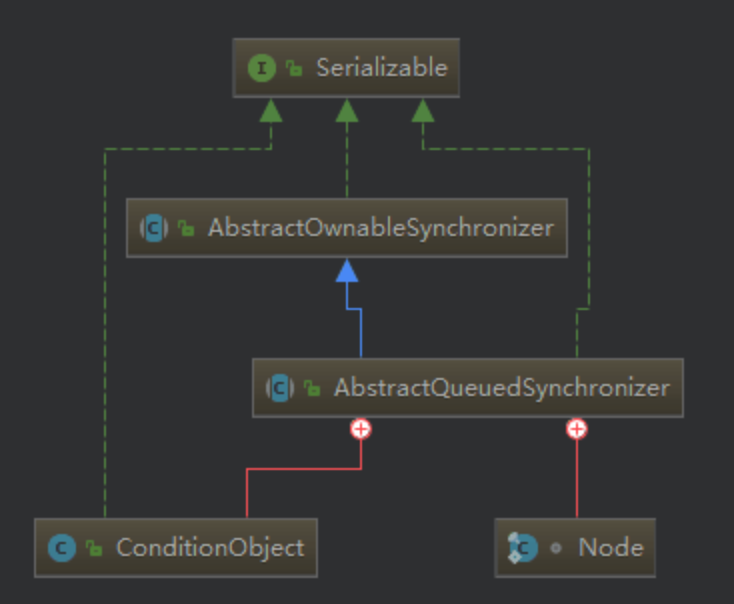
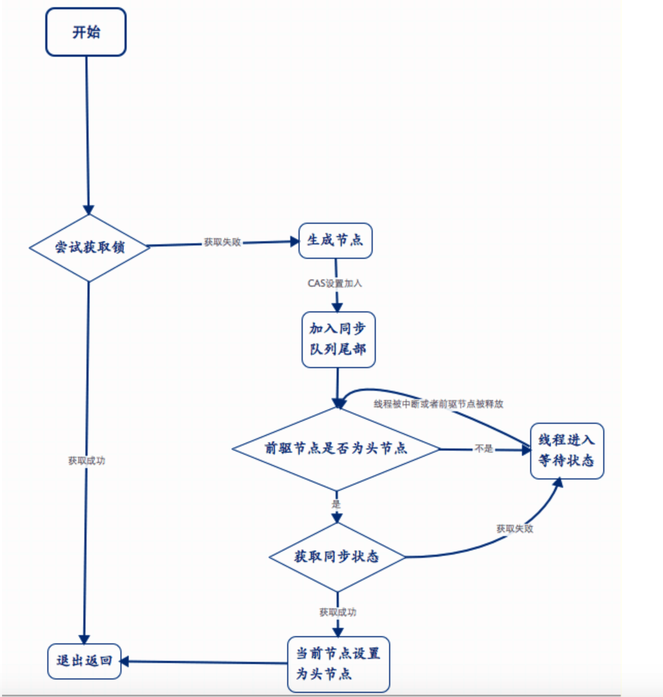
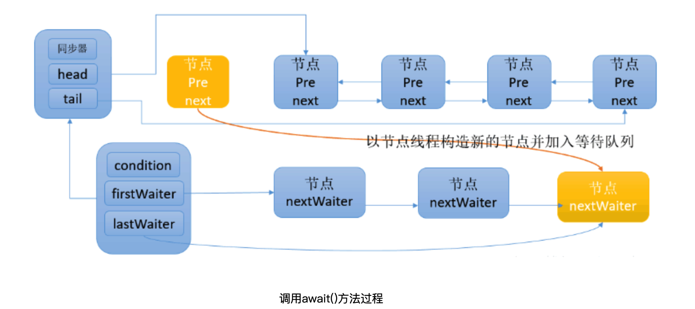
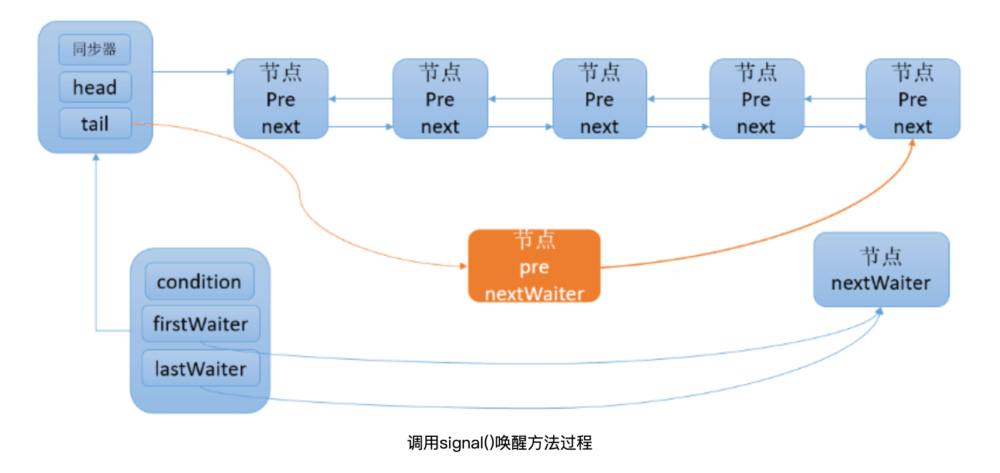

# AbstractQueuedSynchronizer源码分析

* [AQS同步队列器之一：使用和原理](https://www.cnblogs.com/wait-pigblog/archive/2018/07/16/9315700.html)
* [AQS同步队列器之二：等待通知机制](https://www.cnblogs.com/wait-pigblog/p/9342688.html)

## 1. 简介

AQS的主要使用方式是继承，子类通过继承同步器并实现它的抽象方法来管理同步状态

## 2. 简单使用示例

在使用AQS基础组件前，先了解一下内部的基本的方法，这些方法可以分为两类：

* 第一类：子类实现的方法，AQS不作处理（模板方法）
    - tryAcquire(int arg)：独占式的获取锁，返回值是boolean类型的，true代表获取锁，false代表获取失败。
    - tryRelease(int arg)：释放独占式同步状态，释放操作会唤醒其后继节点获取同步状态。
    - tryAcquireShared(int arg)：共享式的获取同步状态，返回大于0代表获取成功，否则就是获取失败。
    - tryReleaseShared(int arg)：共享式的释放同步状态。
    - isHeldExclusively()：判断当前的线程是否已经获取到了同步状态。
* 这些方法是子类实现时必须实现的方法，通过上面的这些方法来判断是否获取了锁，然后再通过AQS本身的方法执行获取锁与未获取锁的过程。
* 第二类：AQS本身的实现的方法，定义给子类通用实现的方法
    - acquire(int arg)：独占式的获取锁操作，独占式获取同步状态都调用这个方法，通过子类实现的tryAcquire方法判断是否获取了锁。
    - acquireShared(int arg)：共享式的获取锁操作，在读写锁中用到，通过tryAcquireShared方法判断是否获取到了同步状态。
    - release(int arg)：独占式的释放同步状态，通过tryRelease方法判断是否释放了独占式同步状态。
    - releaseShared(int arg)：共享式的释放同步状态，通过tryReleaseShared方法判断是否已经释放了共享同步状态。
* 从这两类方法可以看出，AQS为子类定义了一套获取锁和释放锁以后的操作，而具体的如何判断是否获取锁和释放锁都是交由不同的子类自己去实现其中的逻辑，这也是Java设计模式之一：模板模式的实现。有了AQS我们就可以实现一个属于自己的Lock，

## 3. 源码分析以及原理



从图中可以看出来，AbstractQueuedSynchronizer内部维护了一个Node节点类和一个ConditionObject内部类。Node内部类是一个双向的FIFO队列，用来保存阻塞中的线程以及获取同步状态的线程，而ConditionObject对应的是下一篇要讲的Lock中的等待和通知机制。

### 3.1 Node值

除了Node节点的这个FIFO队列，还有一个重要的概念就是waitStatus一个volatile关键字修饰的节点等待状态。在AQS中waitstatus(属于Node类)有五种值

* SIGNAL
  值为-1、后继节点的线程处于等待的状态、当前节点的线程如果释放了同步状态或者被取消、会通知后继节点、后继节点会获取锁并执行（当一个节点的状态为SIGNAL时就意味着在等待获取同步状态，前节点是头节点也就是获取同步状态的节点）
* CANCELLED
  值为1、因为超时或者中断，结点会被设置为取消状态，被取消状态的结点不应该去竞争锁，只能保持取消状态不变，不能转换为其他状态。处于这种状态的结点会被踢出队列，被GC回收（一旦节点状态值为1说明被取消，那么这个节点会从同步队列中删除）
* CONDITION 值为-2、节点在等待队列中、节点线程等待在Condition、当其它线程对Condition调用了singal()方法该节点会从等待队列中移到同步队列中
* PROPAGATE 值为-3、表示下一次共享式同步状态获取将会被无条件的被传播下去（读写锁中存在的状态，代表后续还有资源，可以多个线程同时拥有同步状态）
* initial 值为0、表示当前没有线程获取锁（初始状态）

了解了节点等待的状态以及同步队列的作用，AQS中还通过了一个volatile关键字修饰的status对象用来管理锁的状态并提供了getState()、setState()、compareAndSetStatus()
三个方法改变status的状态。知道了这些就可以开始真正看AQS是如何处理没有获取锁的线程的。在真正了解底层实现AQS之前还要介绍一下独占锁和共享锁：

* 独占锁：在同一个时刻只能有一个线程获得同步状态，一旦这个线程获取同步状态，其它线程就无法再获取将会进入阻塞的状态。
* 共享锁：在同一个时刻可以存在多个线程获取到同步状态。

### 3.2 acquire(int arg)方法

```java_method
public final void acquire(int arg){
              if(!tryAcquire(arg) && acquireQueued(addWaiter(Node.EXCLUSIVE))){
                         selfInterrupt();//如果这个过程中出现中断，在整个过程结束后再自我中断
              }
         }
```

acquire方法代码很少，但是它做了很多事，首先前面介绍过tryAcquire()方法是子类实现的具体获取锁的方法，
当锁获取到了就会立刻退出if条件也就代表获取锁具体的就是啥也不干。那么看锁获取失败具体干了啥呢。首先是addWaiter(Node.EXCLUSIVE)方法

#### 3.2.1 addWaiter(Node mode)：往同步队列中添加元素

addWaiter方法主要做的就是创建一个节点，如果通过CAS操作成功就直接将节点加入同步队列的尾部，否则需要enq方法的帮忙再次进行处理。 设置尾节点的操作必须是CAS类型的，因为会有多个线程同时去获取同步状态防止并发不安全。

```java_method
private Node addWaiter(Node mode){
  　　　　　　//通过当前线程和锁模式创建了一个Node节点
            Node node = new Node(Thread.currentThread(),mode);
  　　　　　　//获取尾节点
            Node pred = tail;
            if(pred != null){
               node.prev = pred;//新增的节点每次都是加在同步队列的尾部
               //通过CAS操作设置尾节点防止线程不安全
               if(compareAndSetTail(pred,node)){
                    pred.next = node;
                    return node;
               }
            }
            enq(node);//防止CAS操作失败，再次处理
            return node;
         }
```

#### 3.2.2 enq(final Node node)

enq方法就是通过死循环，不断的通过CAS操作设置尾节点，直到添加成功才返回。

```java_method
private Node enq(final Node node){
  　　　　   //死循环【发现很多的底层死循环都是这么写不知道是不是有什么优化点】
           for(;;){
              Node t = tail;
              if(t == null){//如果尾节点为null
              　　if(compareAndSetHead(new Node())){//创建一个新的节点并添加到队列中初始化
                  　　tail = head;
              　　}else{
                  　　node.prev = t;
　　　　　　　　　　 　　//还是通过CAS操作添加到尾部
                  　　if(compareAndSetTail(t,node)){
                       　　t.next = node;
                       　　return t;
                  　　}
              　　}
              }
           }
        }
```

#### 3.2.3 acquireQueued(final Node node,int arg)

acquireQueued(final Node node,int arg)：当线程获取锁失败并加入同步队列以后，就进入了一个自旋的状态，如果获取到了这个状态就退出阻塞状态否则就一直阻塞

```java_method
final boolean acquireQueued(final Node node,int arg){
           boolean failed = true;//用来判断是否获取了同步状态
              try{
                   boolean interrupted = false;//判断自旋过程中是否被中断过
                   for(;;){
                       final Node p = node.predecessor();//获取前继节点
                       if(p == head && tryAcquire(arg)){//如果当前的这个节点的前继节点是头节点就去尝试获取了同步状态
                           setHead(node);//设为头节点
                           p.next = null;
                           failed = false;//代表获取了同步状态
                           return interrupted;
                       }
 　　　　　　　　　　　　　//判断自己是否已经阻塞了检查这个过程中是否被中断过
                       if(shouldParkAfterFailedAcquire(p,node) && parkAndCheckInterrupt() ){
                           interrupted = true;
                       }
                   }finally{
                       if(failed){
                          cancelAcquired(node);
                       }
                   }
               }
        }
```

acquireQueued方法主要是让线程通过自旋的方式去获取同步状态，当然也不是每个节点都有获取的资格，因为是FIFO先进先出队列，
acquireQueued方法保证了只有头节点的后继节点才有资格去获取同步状态，如果线程可以休息了就让该线程休息然后记录下这个过程中是否被中断过，
当线程获取了同步状态就会从这个同步队列中移除这个节点。同时还会设置获取同步状态的线程为头节点，在设置头节点的过程中不需要任何的同步操作， 因为独占式锁中能获取同步状态的必定是同一个线程。

#### 3.2.4 shouldParkAfterFailedAcquire(Node node,Node node)：判断一个线程是否阻塞

整个流程中，如果前驱结点的状态不是SIGNAL，那么自己就不能安心去休息，也就是只有当前驱节点为SIGNAL时这个线程才可以进入等待状态。

```java_method
private static boolean shouldPArkAfterFailedAcquire(Node pred,Node node){
            int ws = pred.waitStatus;//获取节点的等待状态
            if(ws == Node.SIGNAL){//如果是SIGNAL就代表当头节点释放后，这个节点就会去尝试获取状态
                   return true;//代表阻塞中
            }
            if(ws > 0){//代表前继节点放弃了
              do {
                  node.prev = pred = pred.prev;//循环不停的往前找知道找到节点的状态是正常的
              }while(pred.waitStatus > 0 );
               pred.next = node;
              }else{
               　　compareAndSetWaitStatus(pred,ws,Node.SIGNAL);//通过CAS操作设置状态为SIGNAL
              }
              return false;
        }
```

#### 3.2.5 parkAndCheckInterrupt()

前面的方法是判断是否阻塞，而这个方法就是真正的执行阻塞的方法同时返回中断状态

```java_method
private final boolean parkAndCheckInterupt(){
             LockSupport.park(this);//阻塞当前线程
             return Thread.interrupted();//返回中断状态
         }
```

#### 3.2.6 acquire方法执行流程

* 首先通过子类判断是否获取了锁，如果获取了就什么也不干。
* 如果没有获取锁、通过线程创建节点加入同步队列的队尾。
* 当线程在同步队列中不断的通过自旋去获取同步状态，如果获取了锁，就把其设为同步队列中的头节点，否则在同步队列中不停的自旋等待获取同步状态。
* 如果在获取同步状态的过程中被中断过最后自行调用interrupted方法进行中断操作。



### 3.3 release(int arg)：独占式的释放锁

释放锁的流程很简单，首先子类自定义的方法如果释放了同步状态，如果头节点不为空并且头节点的等待状态不为0就唤醒其后继节点。主要依赖的就是子类自定义实现的释放操作。

```java_method
 　　　　 public final boolean release(int arg){
            if(tryRelease(arg)){//子类自定义实现
                Node h = head;
                if(h != null && h.waitStatus != 0){
                     unparkSuccessor(h);//唤醒下一个节点
                }
                return true;
            }
           return false;
         }
```

#### 3.3.1 unparkSuccessor(Node node)：唤醒后继节点获取同步状态

唤醒操作，通过判断后继节点是否存在，如果不存在就寻找等待时间最长的适合的节点将其唤醒唤醒操作通过LockSupport中的unpark方法唤醒底层也就是unsafe类的操作。

```java_method
private void unparkSuccessor(Node node){
　　　　　　　　　　 //获取头节点的状态
           int ws = node.waitStatus;
           if(ws < 0){
              compareAndSetWaitStatus(node,ws,0);//通过CAS将头节点的状态设置为初始状态
           }
           Node s = node.next;//后继节点
           if(s == null || s.waitStatus >0){//不存在或者已经取消
              s = null;
              for(Node t = tail;t != null && t != node;t = t.prev){//从尾节点开始往前遍历，寻找离头节点最近的等待状态正常的节点
                 if(t.waitStatus <= 0){
                    s = t;
                 }
              }
           }
           if(s != null){
              LockSupport.unpark(s.thread);//真正的唤醒操作
           }
        }
```

### 3.4 独占式的获取锁以及释放锁的过程总结

以上就是独占式的获取锁以及释放锁的过程总结的来说：线程获取锁，如果获取了锁就啥也不干，如果没获取就创造一个节点通过compareAndSetTail(CAS操作)
操作的方式将创建的节点加入同步队列的尾部，在同步队列中的节点通过自旋的操作不断去获取同步状态【当然由于FIFO先进先出的特性】等待时间越长就越先被唤醒。
当头节点释放同步状态的时候，首先查看是否存在后继节点，如果存在就唤醒自己的后继节点，如果不存在就获取等待时间最长的符合条件的线程。

### 3.5 acquireShared(int arg)：共享式的获取锁

```java_method
public final void acquireShared(int arg){
 　　　　　　　　　　//子类自定义实现的获取状态【也就是当返回为>=0的时候就代表获取锁】
                 if(tryAcquireShared(arg) < 0){
                         doAcquiredShared(arg);//具体的处理没有获取锁的线程的方法
                 }
         }
```

#### 3.5.1 doAcquiredShared(int arg)：处理未获取同步状态的线程

```java_method
private void doAcquire(int arg){
            final Node node = addWaiter(Node.SHARED);//创建一个节点加入同步队列尾部
            boolean failed = true;//判断获取状态
            try{
                boolean interrupted = false;//是否被中断过
                for(;;){
                    final Node p =node.predecessor();//获取前驱节点
                    if(p == head){
                       int r = tryAcquireShared(arg);//获取同步状态
                       if(r >= 0 ){//大于0代表获取到了
                          setHeadAndPropagate(node,r);//设置为头节点并且如果有多余资源一并唤醒
                          p.next = null;
                          if(interrupted){
                          　　selfInterrupted();//自我中断
                       　　}
                       　　failed = false;
                       　　return;
                     　}
                　　}
　　　　　　　　　　　//判断线程是否可以进行休息如果可以休息就调用park方法
               　　if(shouldParkAfterFailedAcquire(p,node) && parkAndCheckInterrupt()){
                  　　interrupted = true;
               　　}　　　　　　　　　　　　}
            　}finally{
               　　if(failed){
                 　　　　cancelAcquire(node);
              　　 }
     　　　　　}
 　　　　 }
```

共享式获取锁和独占式唯一的区别在于setHeadAndPropagate这个方法，独占式的锁会去判断是否为后继节点，
只有后继节点才有资格在头节点释放了同步状态以后获取到同步状态而共享式的实现依靠着setHeadAndPropagate这个方法

#### 3.5.2 setHeadAndPorpagate(Node node,int arg)：获取共享同步状态以后的操作

```java_method
private void setHeadAndPropaGate(Node node,int propagate){
                 Node h = head;
                 setHead(node);//设置为头节点
                if(propagate >0 || h == null || h.waitStatus < 0){//大于0代表还有其他资源一并可以唤醒
                         Node s = node.next;//下一个节点
                          if(s == null || s.isShared()){
                                  doReleaseShared();
                         }
                 }
         }
```

这个方法主要的目的就是将获取到同步状态的节点设置为头节点、如果存在多个资源就将多个资源一并唤醒

#### 3.5.3 doReleaseShared()：唤醒后继节点

```java_method
private void doReleaseShared(int arg){
           for(;;){
              Node h = head;
              if(h != null && h != tail){
                  int ws = h.waitStatus;//获取头节点的等待状态
                  if(!compareAndSetWaitStatus(h,Node.SIGNAL,0)){//设置不成功就一直进行设置
                       continue;
                  }
                  unparkSuccessor(h);//唤醒后继节点
              }else if (ws == 0 &&!compareAndSetWaitStatus(h, 0, Node.PROPAGATE))
                   continue;
            　}
              if (h == head)
                 break;
        }
```

#### 3.5.4 共享锁流程

1. tryAcquireShared()尝试获取资源，成功则直接返回；
2. 失败则通过doAcquireShared()进入同步队列中，直到头节点释放同步状态后唤醒后继节点并成功获取到资源才返回。整个等待过程也是忽略中断的。

其实跟acquire()的流程大同小异，只不过多了个自己拿到资源后，还会去唤醒后继队友的操作（这才是共享嘛）

#### 3.5.5 releaseShared()：释放共享同步状态

```java_method
public final boolean releaseShared(int arg){
  　　　　　　//子类自定义释放锁操作true代表释放
            if(tryReleaseShared(arg)){
                doReleaseShared();//处理释放的操作
                return true;
            }
         }
```

通过子类自定义实现的释放锁操作判断，如果未释放就什么也不干，而doReleased方法就是去唤醒当前的后继节点

### 3.6 AQS源码总结

1. AQS在并发中是一个非常重要的基础类，它定义了很多同步组件需要的方法。通过这些方法开发者可以简单的实现一个相关的锁。 我们详解了独占和共享两种模式下获取-释放资源(
   acquire-release、acquireShared-releaseShared)的源码，相信大家都有一定认识了。 值得注意的是，acquire()和acquireSahred()
   两种方法下，线程在等待队列中都是忽略中断的。AQS也支持响应中断的， acquireInterruptibly()/acquireSharedInterruptibly()即是，这里相应的源码跟acquire()
   和acquireSahred()差不多，这里就简单阐述一下。
2. 对于响应中断的获取同步状态操作而言：其会判断获取同步状态的线程是否处于被中断的状态，如果处于被中断的操作就会抛出InterruptedException异常
3. 对于超时响应的获取同步状态而言：内部多了一个时间判断。其实这些都是在最基础的获取锁上做了一些加强基本的原理还是相同的。

## 4. AQS同步队列器 等待通知机制

### 4.1 AQS简单使用

使用Condition具备两个条件，首先线程一定需要获取到当前的同步状态，其次必须从锁中获取到Condition对象， 而condition.await()方法就对应了Object.wait()
方法使得当前线程在满足某种条件的时候就进行等待， condition.signal()就是在某种条件下唤醒当前线程。其配合lock接口的使用非常方便。

### 4.2 Condition等待/通知机制的实现原理

```java
public interface Condition {

    void await() throws InterruptedException;

    void awaitUninterruptibly();

    long awaitNanos(long nanosTimeout) throws InterruptedException;

    boolean await(long time, TimeUnit unit) throws InterruptedException;

    boolean awaitUntil(Date deadline) throws InterruptedException;

    void signal();

    void signalAll();
}
```

* await()：使当前线程进入等待状态直到被signal()、signalAll()方法唤醒或者被中断
* signal()：唤醒等待中的一个线程
* signalAll()：唤醒等待中的全部线程
* Condition接口只是定义了相关的处理等待通知的方法，真正实现其等待通知效果的在AQS中的ConditionObject类，在了解源码之前先讲一下同步队列和等待队列：
* 当线程未获取到同步状态的时候，会创建一个Node节点并把这个节点放入同步队列的尾部，进入同步队列的中的线程都是阻塞的。
* 在AQS中同步队列和等待队列都复用了Node这个节点类，一个同步状态可以含有多个等待队列，同时等待队列只是一个单向的队列。

#### 4.2.1 await()：使当前线程进入等待状态

```java_method
public final void await() throws InterruptedException {
            if (Thread.interrupted())//响应中断
                throw new InterruptedException();
            Node node = addConditionWaiter();//放入到等待队列中
            int savedState = fullyRelease(node);//释放同步状态(同步队列头节点释放状态唤醒后继节点获取同步状态)
            int interruptMode = 0;　　　　　　　　　//判断是否在同步队列中
            while (!isOnSyncQueue(node)) {
                LockSupport.park(this);//存在等待队列中就阻塞该线程
                if ((interruptMode = checkInterruptWhileWaiting(node)) != 0)//判断等待过程中是否被中断过
                    break;
            }　　　　　　　　  //自旋去获取同步状态【在AQS中了解】获取成功并且在退出等待时不抛出中断异常（抛出了异常就会立马被中断）
            if (acquireQueued(node, savedState) && interruptMode != THROW_IE)
                interruptMode = REINTERRUPT;//在退出等待时重新中断
            if (node.nextWaiter != null) //如果存在其他节点
                unlinkCancelledWaiters();//移除所有不是等待状态的节点
            if (interruptMode != 0)
                reportInterruptAfterWait(interruptMode);//如果在等待过程中发现被中断，就执行中断的操作
        }
```

#### 4.2.2 addConditionWaiter()：往等待队列中添加元素

```java_method
 　　　　 private Node addConditionWaiter() {
             Node t = lastWaiter;//等待队列中的最后一个元素
             if (t != null && t.waitStatus != Node.CONDITION) {//如果尾节点部位null，并且尾节点不是等待状态中说明这个节点不应该待在等待队列中
                 unlinkCancelledWaiters();//从等待队列中移除
                 t = lastWaiter;
             }
             Node node = new Node(Thread.currentThread(), Node.CONDITION);//创建一个等待状态的节点
             if (t == null)
                 firstWaiter = node;
             else
                 t.nextWaiter = node;
             lastWaiter = node;//加入等待队列的尾部
             return node;
         }
```

#### 4.2.3 addConditionWaiter()：往等待队列中添加元素

```java_method
 　　　　 private Node addConditionWaiter() {
            Node t = lastWaiter;//等待队列中的最后一个元素
            if (t != null && t.waitStatus != Node.CONDITION) {//如果尾节点部位null，并且尾节点不是等待状态中说明这个节点不应该待在等待队列中
                unlinkCancelledWaiters();//从等待队列中移除
                t = lastWaiter;
            }
            Node node = new Node(Thread.currentThread(), Node.CONDITION);//创建一个等待状态的节点
            if (t == null)
                firstWaiter = node;
            else
                t.nextWaiter = node;
            lastWaiter = node;//加入等待队列的尾部
            return node;
        }
```

#### 4.2.4 unlinkCancelledWaiters()：将不是等待状态的节点从等待队列中移除

```java_method
private void unlinkCancelledWaiters() {
            Node t = firstWaiter;//头节点
            Node trail = null;
            while (t != null) {//存在节点
                Node next = t.nextWaiter;//下一个节点
                if (t.waitStatus != Node.CONDITION) {//如果不是出于等待中的状态
                    t.nextWaiter = null;//t的后指针引用清除
                    if (trail == null)//前面是否存在节点
                        firstWaiter = next;//下一个节点就是头节点
                    else
                        trail.nextWaiter = next;//赋值给前节点的后指针引用
                    if (next == null)//代表不存在元素了
                        lastWaiter = trail;
                }
                else
                    trail = t;//将t赋值给trail
                t = next;//next赋值给t
            }
        }
```

#### 4.2.5 fullyRelease(Node node)：释放当前状态值，返回同步状态

```java_method
final int fullyRelease(Node node) {
        boolean failed = true;//失败状态
        try {
            int savedState = getState();//获取当前同步状态值
            if (release(savedState)) {//独占模式下释放同步状态，AQS独占式释放锁、前面文章讲过
                failed = false;//失败状态为false
                return savedState;//返回同步状态
            } else {
                throw new IllegalMonitorStateException();
            }
        } finally {
            if (failed)
                node.waitStatus = Node.CANCELLED;//取消等待状态
        }
    }
```

#### 4.2.6 isOnSyncQueue：判断线程是否在同步队列中

```java_method
final boolean isOnSyncQueue(Node node) {
        //如果等待状态为等待中，或者前继节点为null代表第一种情况该节点出于等待状态，第二种情况可能已经被唤醒不在等待队列中了
        if (node.waitStatus == Node.CONDITION || node.prev == null)
            return false;
        if (node.next != null) //如果后继节点不为null代表肯定在等待队列中
            return true;
        return findNodeFromTail(node);//从后往前找判断是否在等待队列中
    }
```

#### 4.2.7 等待操作总结

首先等待操作没有进行CAS或者任何的同步操作，因为调用await()方法的是获取当前lock锁对象的线程，也就是同步队列中的首节点， 当调用await()
方法后，将同步队列的首节点创建一个等待节点放入等待队列的尾部，然后释放出同步状态（不释放同步状态就会造成死锁）， 唤醒同步队列中的后继节点，然后当前线程进入等待的状态



#### 4.2.8 signal()：唤醒等待队列中的一个线程

```java_method
public final void signal() {
            if (!isHeldExclusively())//判断当前线程是否已经获取同步状态
                throw new IllegalMonitorStateException();
            Node first = firstWaiter;//等待队列头节点
            if (first != null)
                doSignal(first);//具体实现方法唤醒第一个node
        }
```

#### 4.2.9 doSignal(Node node)：具体处理唤醒节点的操作

```java_method
private void doSignal(Node first) {
            do {
                if((firstWaiter = first.nextWaiter) == null)//执行移除头节点的操作
                    lastWaiter = null;
                first.nextWaiter = null;
            } while (!transferForSignal(first) && (first = firstWaiter) != null);
        }
```

### 4.2.10 transferForSignal(Node node)：唤醒的具体实现方式

```java_method
final boolean transferForSignal(Node node) {
        if (!compareAndSetWaitStatus(node, Node.CONDITION, 0))//将节点的等待状态设置更改为初始状态如果改变失败就会被取消
            return false;
        Node p = enq(node);//往同步队列中添加节点【死循环方式】
        int ws = p.waitStatus;//获取节点的等待状态
        if (ws > 0 || !compareAndSetWaitStatus(p, ws, Node.SIGNAL))//如果该结点的状态为cancel 或者修改waitStatus失败，则直接唤醒（这一步判断是为了不立刻唤醒脱离等待中的线程，因为他要等同步队列中的头节点释放同步状态再去竞争）
            LockSupport.unpark(node.thread);//具体的唤醒操作
        return true;
    }
```

### 4.2.11 唤醒操作的流程总结

当调用signal()方法时，将等待队列中的首节点拿出来，加入到同步队列中，此时该节点不会立刻被唤醒因为就算被唤醒也是需要重新去获取同步状态的，而是在调用lock.unlock()方法释放锁以后将其唤醒获取同步状态。




