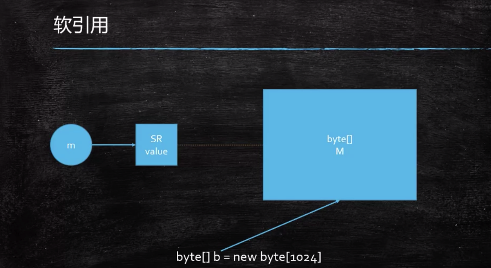
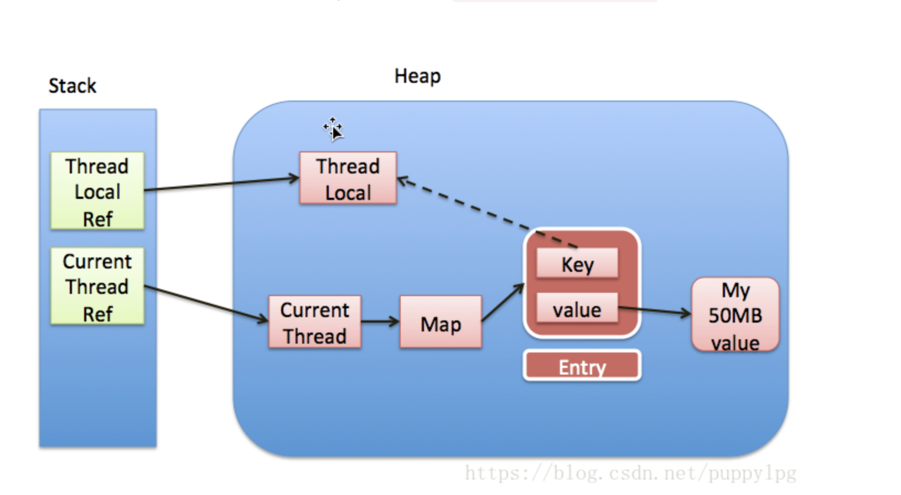

# ThreadLocal源码分析

## 1. java引用类型有哪些

### 1.1 强

普通引用，没有变量指向对象的时候，对象将被回收

### 1.2 软

SoftReference,空间不够时软引用会被垃圾回收器回收



### 1.3 弱

WeakReference，遇到垃圾回收器GC就会被回收

ThreadLocal 缓存

### 1.4 虚

PhantomReference ReferenceQueue

虚引用引用对象被回收的时候会将信息填入ReferenceQueue

用途管理堆外内存，jvm无法管理jvm以外的内存，当DirectByteBuffer指向堆外内存，
当DirectByteBuffer被回收的时候，会通知queue将堆外内存回收

## 2. ThreadLocal源码

###  2.1 ThreadLocal.ThreadLocalMap

每个线程Thread里面有一个ThreadLocalMap，ThreadLocalMap的key为ThreadLocal，value为Object值，

set方法源码，对当前线程进行设置达到线程隔离的效果
```java_holder_method_tree
public void set(T value) {
        //获取当前线程
        Thread t = Thread.currentThread();
        //获取当前线程的ThreadLocalMap
        ThreadLocalMap map = getMap(t);
        if (map != null)
            map.set(this, value);
        else
            createMap(t, value);
    }
```

get方法源码
```java_holder_method_tree
public T get() {
        //获取当前线程
        Thread t = Thread.currentThread();
        ThreadLocalMap map = getMap(t);
        if (map != null) {
            ThreadLocalMap.Entry e = map.getEntry(this);
            if (e != null) {
                @SuppressWarnings("unchecked")
                T result = (T)e.value;
                return result;
            }
        }
        return setInitialValue();
    }
```

remove
```java_holder_method_tree
public void remove() {
         ThreadLocalMap m = getMap(Thread.currentThread());
         if (m != null)
             m.remove(this);
     }
```

Entry的key是一个弱引用
```java_holder_method_tree
static class Entry extends WeakReference<ThreadLocal<?>> {
            /** The value associated with this ThreadLocal. */
            Object value;

            Entry(ThreadLocal<?> k, Object v) {
                super(k);
                value = v;
            }
        }
```

### 2.2 ThreadLocal弱引用及内存泄漏



#### 2.2.1 不用强引用原因

[ThreadLocal为什么要用WeakReference](https://www.cnblogs.com/zxporz/p/10900852.html)

强引用会导致，当线程不在引用ThreadLocal的时候，ThreadLocalMap中的key仍然引用这个ThreadLocal，
如果线程不结束会导致这个key内存泄漏

```
ThreadLocal local = new ThreadLocal();
local.set("当前线程名称："+Thread.currentThread().getName());//将ThreadLocal作为key放入threadLocals.Entry中
Thread t = Thread.currentThread();//注意断点看此时的threadLocals.Entry数组刚设置的referent是指向Local的，referent就是Entry中的key只是被WeakReference包装了一下
local = null;//断开强引用，即断开local与referent的关联，但Entry中此时的referent还是指向Local的，为什么会这样，当引用传递设置为null时无法影响传递内的结果
System.gc();//执行GC
t = Thread.currentThread();//这时Entry中referent是null了，被GC掉了，因为Entry和key的关系是WeakReference，并且在没有其他强引用的情况下就被回收掉了
//如果这里不采用WeakReference，即使local=null，那么也不会回收Entry的key，因为Entry和key是强关联
//但是这里仅能做到回收key不能回收value，如果这个线程运行时间非常长，即使referent GC了，value持续不清空，就有内存溢出的风险
//彻底回收最好调用remove
//即：local.remove();//remove相当于把ThreadLocalMap里的这个元素干掉了，并没有把自己干掉
System.out.println(local);
```

#### 2.2.2 弱引用问题

ThreadLocalMap的key是弱引用，但是value不是，所以要调用remove清空整个key-value

## 3. InheritableThreadLocal

1. InheritableThreadLocal继承了ThreadLocal，然后重写了上面三个方法，
所以除了上面三个方法之外，其他所有对InheritableThreadLocal的调用都是对ThreadLocal的调用
2. 使用大致与ThreadLocal的使用方法相同，只不过原理有些不同，内部处理时如果在主线程中给他赋值，
在子线程中也可以获取，当然如果在子线程中赋值，也只是在当前线程中可以得到当前的赋值数据。
3. 我们其实是根据 Thread.currentThread()，拿到该线程的 threadlocals，
从而进一步得到我们之前预先 set 好的值。那么如果我们新开一个线程，这个时候，
由于 Thread.currentThread() 已经变了，从而导致获得的 threadlocals 不一样，
我们之前并没有在这个新的线程的 threadlocals 中放入值，那么我就再通过 threadlocal.get()方法 是不可能拿到值的