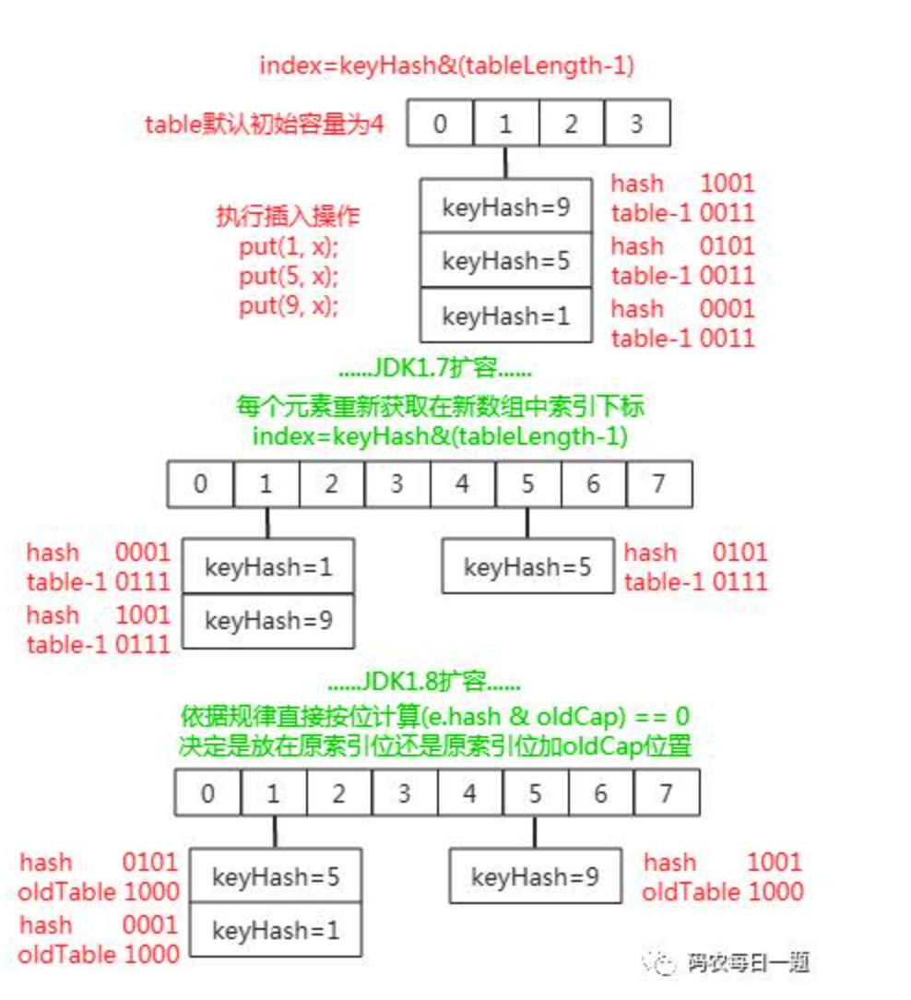

#  hashmap

## put

## resize

* [HashMap底层原理+扩容机制](https://blog.csdn.net/qq_40871196/article/details/101855801)
* jdk1.8是要看看原来的hash值新增的那个bit是1还是0好了，如果是0则索引没变，如果是1则索引变成"原索引+oldCap".这是jdk1.8的亮点，设计的确实非常的巧妙，即省去了重新计算hash值得时间，又均匀的把之前的冲突的节点分散到新的数组bucket上
* [HashMap的扩容机制---resize() JDK1.8的新特点](https://blog.csdn.net/runrun117/article/details/80249556)

