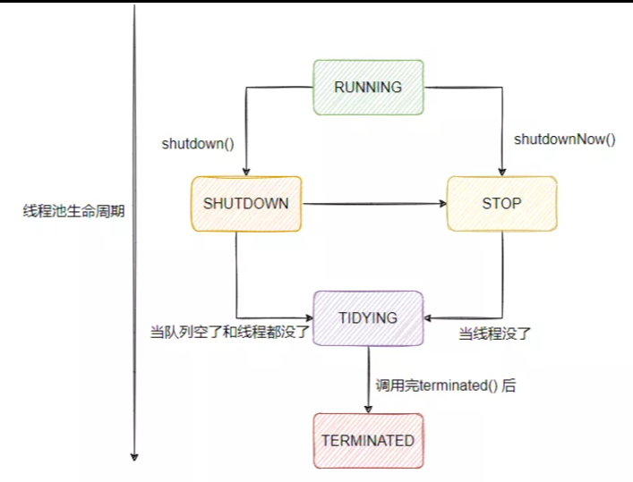
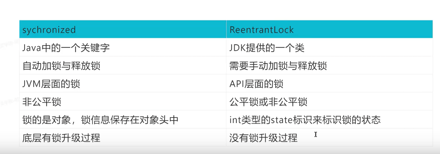

# java知识点

## 1 java创建线程

1. 继承Thread类 执行start方法 重写run方法
2. 实现Runnable接口 执行start方法 重写run方法
3. 实现Callable接口 执行submit方法 返回Future对象 重写call方法 FutureTask
4. 线程池

## 2 为什么不建议使用Executors创建线程池

1. FixedThreadPool 队列是一个无界队列，任务过多会不断添加到队列，最终耗尽内存 OOM
2. SingleThreadExecutor 单线程 无界队列 耗尽内存
3. 不能定义线程名称 不方便管理
4. 使用ThreadPoolExecutor创建线程池 可以定义线程数量 队列容量

## 3 线程池状态

* RUNNING（运行）——可以接收新的任务并执行
* SHUTDOWN（关闭）——不再接收新的任务，但是仍会处理已经提交的任务（包括线程正在执行的和处于阻塞队列中的）
* STOP（停止）——不再接收新的任务，不会处理阻塞队列中的额任务，并且会中断正在执行的任务
* TIDYING（整理）——所有的任务都已经终止，将线程池状态转换为TIDYING的线程会调用terminated()
* TERMINATED（终止）——已经执行完毕terminated()，线程池终止

## 4 synchronized关键字和ReentrantLock的区别

## ThreadLocal

[ThreadLocal源码分分析](ThreadLocal源码分分析.md)

## ReentrantLock公平锁和非公平锁

公平锁：如果有线程排队，就跟着排队
非公平锁：直接竞争锁

## synchronized锁升级

* 偏向锁 只有一个线程访问
* 轻量级锁 第二个线程竞争锁 底层竞争实现
* 自旋锁 CAS获取预期标记 获取到结束循环
* 重量级锁 两个或以上线程 并发 的在同一个对象上进行同步获取时，为了避免无用自旋消耗 cpu，轻量级锁会升级成重量级锁

