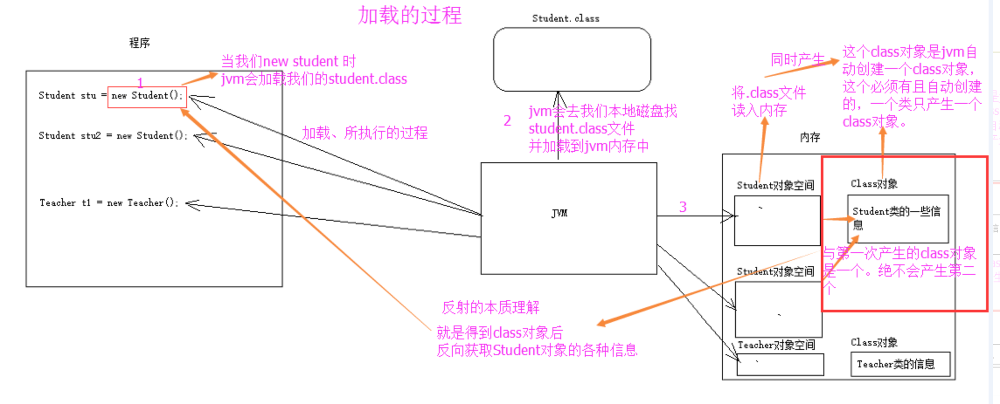

# java反射

* [Java基础之—反射（非常重要）](https://blog.csdn.net/qq_36226453/article/details/82790375)

## 1. 反射概述

* JAVA反射机制是在运行状态中，对于任意一个类，都能够知道这个类的所有属性和方法；对于任意一个对象，都能够调用它的任意一个方法和属性；这种动态获取的信息以及动态调用对象的方法的功能称为java语言的反射机制
* Class对象的由来是将class文件读入内存，并为之创建一个Class对象。



### 1.1 反射越过泛型检查

```java
public class Demo {
    public static void main(String[] args) throws Exception{
        ArrayList<String> strList = new ArrayList<>();
        strList.add("aaa");
        strList.add("bbb");
        
    //    strList.add(100);
        //获取ArrayList的Class对象，反向的调用add()方法，添加数据
        Class listClass = strList.getClass(); //得到 strList 对象的字节码 对象
        //获取add()方法
        Method m = listClass.getMethod("add", Object.class);
        //调用add()方法
        m.invoke(strList, 100);
        
        //遍历集合
        for(Object obj : strList){
            System.out.println(obj);
        }
    }
}
```
输出：
aaa
bbb
100

### 1.2 StackTraceElement

### 1.3 ClassLoader和Class.forName的区别

[ClassLoader和Class.forName的区别](https://blog.csdn.net/zhangdx001/article/details/106946544/)

