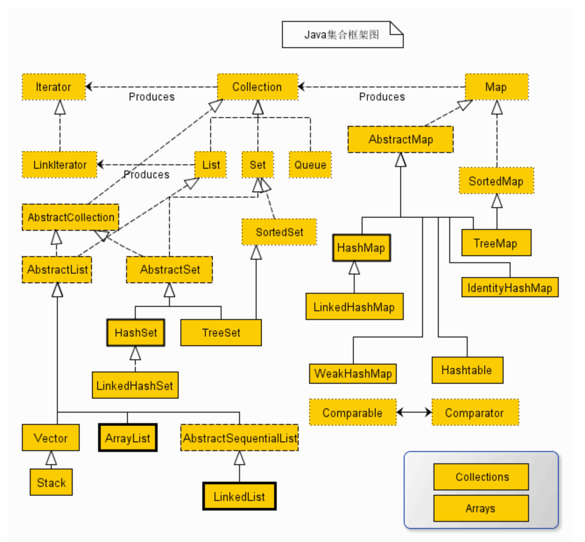

# java集合



## 1. PriorityQueue

使用二叉树小顶堆实现

[JAVA中PRIORITYQUEUE详解](https://www.cnblogs.com/Elliott-Su-Faith-change-our-life/p/7472265.html)

## 2. ArrayList

[ArrayList扩容机制](https://www.cnblogs.com/baichunyu/p/12965241.html)

### 2.1 add方法

```java_method
    /**
     * 将指定的元素追加到此列表的末尾。
     */
    public boolean add(E e) {
   //添加元素之前，先调用ensureCapacityInternal方法
        ensureCapacityInternal(size + 1);  // Increments modCount!!
        //这里看到ArrayList添加元素的实质就相当于为数组赋值
        elementData[size++] = e;
        return true;
    }
```

### 2.2 ensureCapacityInternal()

```java_method
    //得到最小扩容量
    private void ensureCapacityInternal(int minCapacity) {
        if (elementData == DEFAULTCAPACITY_EMPTY_ELEMENTDATA) {
              // 获取默认的容量和传入参数的较大值
            minCapacity = Math.max(DEFAULT_CAPACITY, minCapacity);
        }

        ensureExplicitCapacity(minCapacity);
    }
```

* 当我们要 add 进第1个元素到 ArrayList 时，elementData.length 为0 （因为还是一个空的 list），因为执行了 ensureCapacityInternal() 方法 ，所以 minCapacity 此时为10。此时，minCapacity - elementData.length > 0 成立，所以会进入 grow(minCapacity) 方法。
* 当add第2个元素时，minCapacity 为2，此时elementData.length(容量)在添加第一个元素后扩容成 10 了。此时，minCapacity - elementData.length > 0 不成立，所以不会进入 （执行）grow(minCapacity) 方法。
* 添加第3、4···到第10个元素时，依然不会执行grow方法，数组容量都为10。
* 直到添加第11个元素，minCapacity(为11)比elementData.length（为10）要大。进入grow方法进行扩容。

### 2.3 grow() 方法

```java_method
/**
     * 要分配的最大数组大小
     */
    private static final int MAX_ARRAY_SIZE = Integer.MAX_VALUE - 8;

    /**
     * ArrayList扩容的核心方法。
     */
    private void grow(int minCapacity) {
        // oldCapacity为旧容量，newCapacity为新容量
        int oldCapacity = elementData.length;
        //将oldCapacity 右移一位，其效果相当于oldCapacity /2，
        //我们知道位运算的速度远远快于整除运算，整句运算式的结果就是将新容量更新为旧容量的1.5倍，
        int newCapacity = oldCapacity + (oldCapacity >> 1);
        //然后检查新容量是否大于最小需要容量，若还是小于最小需要容量，那么就把最小需要容量当作数组的新容量，
        if (newCapacity - minCapacity < 0)
            newCapacity = minCapacity;
       // 如果新容量大于 MAX_ARRAY_SIZE,进入(执行) `hugeCapacity()` 方法来比较 minCapacity 和 MAX_ARRAY_SIZE，
       //如果minCapacity大于最大容量，则新容量则为`Integer.MAX_VALUE`，否则，新容量大小则为 MAX_ARRAY_SIZE 即为 `Integer.MAX_VALUE - 8`。
        if (newCapacity - MAX_ARRAY_SIZE > 0)
            newCapacity = hugeCapacity(minCapacity);
        // minCapacity is usually close to size, so this is a win:
        elementData = Arrays.copyOf(elementData, newCapacity);
    }
```