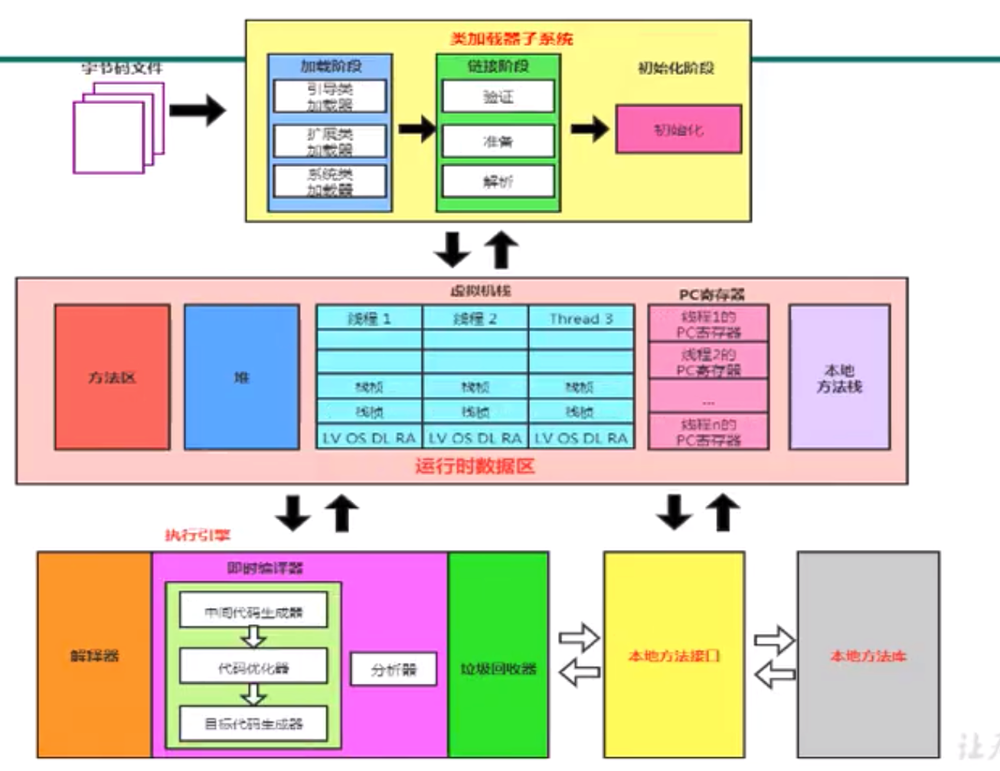
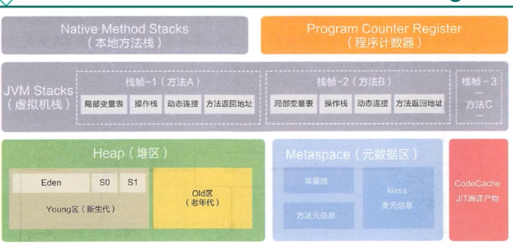

# jvm

* [JVM参数设置、分析](https://www.cnblogs.com/redcreen/archive/2011/05/04/2037057.html)

## 1. java虚拟机介绍

1. 执行java字节码
2. 一次编译到处运行
3. 自动内存管理垃圾回收

### 1.1 架构模型

1. 基于栈的
2. 基于寄存器的

基于栈的优点，跨平台性，指令集小，指令多，但是执行性能比寄存器差

javap -v class文件 可以看字节码

### 1.2 jvm生命周期

1. 虚拟机启动 启动通过引导类加载器 bootstrap class loader 创建初始类
2. 虚拟机执行 java程序执行的时候会有一个java虚拟机进程
3. 虚拟机退出 正常结束，异常，System.exit()

### 1.3 jvm发展历程

1. 1996 Sun Classic VM 只提供解释器
2. JDK1.2 Exact Memory VM 能知道内存中某个位置的数据类型，热点探测，编译器与解释器混合使用
3. HotSpot JDK1.3 jvm默认虚拟机 jdk8 引入元空间 之前叫方法区 
4. BEA公司 JRocket 针对服务端 
5. IBM J9
6. Oracle javaME CDC/CLDC
7. Azul VM 高性能 指定平台
8. Apache Harmony
9. Microsoft VM
10. TaoBao JVM 对intel cpu耦合
11. Dalvik VM 支持提前编译
12. Graal VM 跨语言全栈虚拟机 

#### 1.3.1 HotSpot热点探测技术

1. 通过计数器找到最具编译价值的代码，触发即时编译或者栈上替换
2. 通过编译器与解释器协同工作，在最优化程序响应时间和执行性能取得平衡

## 2. 内存结构概述

### 2.1 类加载过程

#### 2.1.1 类加载器

ClassLoader

#### 2.1.2 类加载过程

##### 1. 加载

1. 通过一个类的全限定名，获取定义此类的二进制字节流
2. 将这个字节流所代表的静态存储结构转化为方法区的运行时数据结构
3. 在内存中生成一个代表这个类的java.lang.Class对象，作为方法区各种数据的这个类的访问入口

加载class文件的方式

1. 本地系统获取
2. 网络获取
3. zip压缩包，jar包，war包
4. 运行时计算生成 动态代理
5. 其他文件生成 JSP
6. 数据库
7. 加密文件，防止反编译

##### 2. 链接

###### 2.1 验证

确保class文件安全性，不会导致虚拟机崩溃

###### 2.2 准备

* 为类变量分配内存，并且设置该类变量的默认初始值，即0值
* 这里不包含用final修饰的static，因为final在编译时就会分配了，准备阶段会显式初始化
* 这里不会包含实例变量分配的初始化，类变量会分配在方法区中，实例变量会随着对象一起分配到java堆中

###### 2.3 解析

* 将常量池内的 符号引用 转换为 直接引用的过程，
* 实际就是 把引用的类的符号转换为实际类的过程
* 方法 字段 类 的符号引用变为常量池地址引用

##### 3. 初始化

* clinit 给static修饰变量或者代码块赋值，赋值按照代码顺序来的
* 子类静态变量货者代码块执行晚于父类的执行

#### 2.1.3 类加载器分类

* jvm分类两类加载器，引导类类加载器，自定义类加载器
* 其他类加载器简介继承ClassLoader类
* 系统的核心类库由引导类加载器加载

### 2.2 双亲委派机制

1. 如果一个类收到类加载请求，它并不会自己先去加载，而是把这个请求交给其父类加载
2. 如果类加载器还存在父类加载器，继续向上委托
3. 如果父类完成加载，就成功返回，如果无法完成加载任务就交给子类加载器加载

优点：避免类重复加载，保护java核心api防止被篡改

#### 2.2.1 沙箱安全机制

不允许自定义的类或者包名与java核心api重复或者有主函数

#### 2.2.3 两个class对象相等的条件

1. 类的完整类名必须一致，包括包名，同一class文件
2. 加载这个类的classloader必须相同

#### 2.2.4 类的主动使用和被动使用

1. 主动使用 
2. 被动使用

## 3. 运行时数据区

* 95%垃圾回收在堆区，5%在方法区
* RumTime对象是单例的

### 3.1 线程

* 在hotspot中每个线程与操作系统的本地线程一一对应，java线程执行终止后，本地线程也会回收
* 一旦线程本地初始化成功，就会调用java线程中的run()方法
* 守护线程，普通线程

### 3.2 程序计数器，（PC寄存器）

* PC寄存器用来存储指向下一条指令的地址，也即将要执行的指令代码，由执行引擎读取下一条指令
* 没有垃圾回收
* 不会发生OOM

### 3.3 虚拟机栈

* 栈是运行时单位，堆是存储单位
* java虚拟机栈，每个线程在创建的时候都会创建一个虚拟机栈，其内部保存着一个个的栈桢，对应着一次又一次的方法调用
* 生命周期和线程一致
* 主管java程序的运行，它保存方法的局部变量（八中基本类型，引用类型的地址），部分结果，并参与方法的调用和返回
* 栈是一种快速有效的分配存储方式，速度仅次于程序计数器
* 方法运行进栈，方法运行完出栈
* 不存在垃圾回收

#### 3.3.1 栈异常

* 如果采用固定大小的虚拟机栈，那每一个线程的java虚拟机栈容量可以在线程创建的时候独立选定，如果线程请求分配的栈容量超过java虚拟机栈允许的最大容量，
  会抛出StackOverFlowError异常
* 如果java虚拟机栈可以动态扩展，在扩展的时候无法申请足够的内存，会抛出OutOfMemoryError异常

#### 3.3.2 设置大小

* -Xss 命令设置大小

#### 3.3.3 栈的存储结构和运行原理

* 每个线程都有自己的栈，栈中的数据都是以栈桢的格式存在
* 在这个线程上面正在执行的每个方法都有一个栈桢
* 栈桢是一个内存区块，是一个数据集，维系着方法执行过程中的各种数据信息
* 操作只有入栈出栈
* 活动的线程上，一个时间点上，只会有一个栈桢
* return和抛出异常都会使栈桢出栈，try catch可以捕捉异常

##### 3.3.3.1 栈桢结构

* 局部变量表
* 操作数栈
* 动态链接 （或指向运行时常量池的方法引用）
* 方法返回地址 （方法正常或者异常退出的定义）

###### 1. 局部变量表

* 定义一个数字数组，用于存储方法参数和定义在方法体内的局部变量
* 不存在数据安全问题
* 局部变量表所需的容量大小是在编译期确定下来
* 方法嵌套的次数由栈的大小决定
* 局部变量表中的变量只在当前方法中有效，随着栈桢销毁，局部变量表销毁

###### 2. 最基础的存储单位叫做变量槽，slot

* 32位占一个变量槽，64位占两个变量槽long和double类型
* 引用类型和其他基础类型占一个slot
* 如果需要访问局部变量表中的一个64bit的局部变量值时，只需要使用前一个索引就行了
* 如果当前栈桢是由构造方法或者实例方法创建的，那么this方法会放在index为0的slot处其余参数按照参数表顺序排列

###### 3. 成员变量和局部变量

* 成员变量
  - 类变量 在 linking和prepare阶段给类变量默认赋值
  - 成员变量 在类初始化时赋值
* 局部变量
  - 必须显示赋值
  
###### 4. 操作数栈

* 使用数组实现
* 操作数栈，在方法执行过程中，根据字节码指令，往栈中写入数据或提取数据，即入栈push/出栈pop
* 主要用于保存计算的中间结果，同时作为计算过程中变量的临时存储空间
* 只能通过入栈和出栈访问数据

栈顶缓存技术，将栈顶元素存储到cpu寄存器中，减少内存读取，提高效率

###### 5. 动态链接

* 每一个栈桢内部都包含一个指向运行时常量池中该栈桢所属方法的引用。包含这个引用的目的就是为了支持当前方法的代码能够实现动态链接
* 符号引用指向运行时常量池调用方法的直接引用

###### 6. 方法的绑定机制，静态绑定和动态绑定

* 静态链接 在编译期间确定下来的符号引用关系，运行期保持不变 早期绑定
* 动态链接 在运行期间确定的符号绑定关系 晚期绑定
* 非虚方法 编译器就确定了具体的调用版本，这个版本在运行时是不可变的 静态方法，私有方法，final方法 实例构造器，父类方法都是非虚方法
* 其他方法为非虚方法

* invokestatic 静态方法
* invokespecial 私有 父类方法
* invokevirtual final 子类非私有方法
* invokeinterface 接口方法

* invokedynamic 动态解析出想要调用的方法 lambda表达式引入表示java拥有动态语言特性
* 静态类型语言在编译器检查类型，检查变量类型 动态类型语言在运行时检查动态类型语言，检查变量值类型

###### 7. 方法重写的本质与虚方法表的使用

* 找到操作数栈顶的第一个元素所执行的对象的实际类型，记作 C
* 如果类型C在常量池中找到符合简单名称都相符的方法，则进行权限校验，通过则返回这个方法的直接引用
* 否则按照继承关系找父类的这个方法

* 在面向对象编程中，会很频繁使用动态分派，为了提高性能，jvm在类的方法区建立虚方法表
* 在类加载 链接-解析 阶段创建

* [java静态分配和动态分配](https://blog.csdn.net/dfdsggdgg/article/details/51290764)
* 方法重写是动态分配 方法重载是静态分配

###### 8. 方法返回地址

* 方法退出之后会回到该方法的调用位置
* 正常退出，调用者的pc计数器的值作为返回地址，即调用该方法的指令的下一条指令的地址
* 异常退出，返回地址通过异常表来确定，不会给调用者返回值

###### 9. 一些附加信息

程序调试提供的支持信息

###### 10. 栈面试题

1. 栈溢出情况
2. 逃逸分析

## 4. 本地方法接口

* native 不能与 abstract共用
* java应用需要与外部环境交互

### 4.1 本地方法栈的理解

## 5. 堆

* -Xms 初始堆大小 -Xmx 最大堆大小
* 进程中堆是唯一的，每一个jvm实例都对应一个堆空间
* 堆可以物理上不连续，但是在逻辑上连续
* 所有的线程共享java堆，在这里可以划分为线程私有的缓冲区，Thread Local Allocation Buffer TLAB
* 几乎所有的对象和数组都在堆上分配，逃逸分析可以在栈上分配
* 方法结束以后堆中的对象不会立即回收，需要等到垃圾回收时才会回收，需要判断是否存在引用进行垃圾回收，GC root
* 堆是垃圾回收重点区域

### 5.1 堆的细分内存结构

* 新生代
* 老年代
* 堆空间是新生代和老年代  
* 1.7永久区 1.8元空间 方法区

### 5.2 设置堆空间大小

* -Xms 初始堆大小
* -Xmx 最大堆大小
* 初始化堆大小默认为 系统内存的1/64 最大为1/4
* jps查看进程 jstat gc 进程号 查看 C为总量 U为使用量
* -XX:PrintGCDetails 打印GC信息

### 5.3 年轻代老年代

* 年轻代 eden survivor0 survivor1 8:1:1
* 老年代 Old Gen
* 默认-XX:NewRatio=2 表示新生代占1，老年代占2 新生代占整个堆的1/3
* -XX:NewRatio=4 新生代占1 老年代占4 新生代占整个堆的1/5
* -XX:-UseAdaptiveSizePolicy 关闭自适应内存分配比例
* -XX:SurvivorRatio=8 内存分配策略 8:1:1
* -Xmn 设置新生代最大内存大小 设置之后以这个为准

### 5.4 对象分配过程

* Eden区满了之后会触发 MinorGC，无用对象被回收，存活对象到survivor0区
* 第二次Minor GC的时候会将存活对象放到survivor1区 survivor0区的存活对象到survivor1区
* 年轻代重复上面步骤 存活对象每次年龄加1
* 当年龄达到15时 阈值 对象到老年代 -XX:MaxTenuringThreshold=<N>设置阈值大小

### 5.5 jvm 调优工具jprofiler

### 5.6 Minor GC, Major GC, Full GC

* jvm在进行GC时，并不会对上面三个内存（新生代，老年代，方法区）区域一起回收的，大部分回收的都是指新生代
* 新生代收集（Minor GC/Young GC）在新生代
* Major GC老年代收集。很多时候会与Full GC混合使用
* 混合收集 Mixed GC 收集整个新生代及部分老年代的垃圾收集 目前只有G1
* Full GC 整堆收集，整个堆和方法区垃圾回收

* 年轻代空间不足时会导致年轻代垃圾回收，Eden会回收，survivor区不会回收，晋升之后survivor区满了会伴随Eden区回收
* 老年代垃圾回收 Major GC回收至少伴随一次Minor GC，Minor之后内存还不足就会OOM
* Major的速度比Minor GC慢10倍以上 STW时间会更长
* Full GC System.gc(),
  - 老年代空间不足，
  - 方法区空间不足， 
  - 通过Minor GC后进入老年代的平均大小大于老年代的可用内存，
  - Eden->survivor from->survivor to->old den 所有的内存都比这个对象小
  - 调优要尽量避免Full GC 缩短停顿时间
  
### 5.7 总结

* 超大对象直接放在老年代，尽量在程序中避免大对象出现，尤其是朝生夕死的对象
* 长期存活的对象分配在老年代
* 动态年龄判断，survivor区中相同年龄的所有对象的大小的总和大于survivor空间的一半，年龄大于或者等于该年龄的对象直接分配到老年代
* 空间分配担保，-XX:HandlePromotionFailure

### 5.8 堆空间为每个线程分配的TLAB

为了保证Java对象的内存分配的安全性，同时提升效率，每个线程在Java堆中可以预先分配一小块内存，
这部分内存称之为TLAB（Thread Local Allocation Buffer），这块内存的分配时线程独占的，读取、使用、回收是线程共享的。

JVM在内存新生代Eden Space中开辟了一小块线程私有的区域，称作TLAB（Thread-local allocation buffer）。
默认设定为占用Eden Space的1%。在Java程序中很多对象都是小对象且用过即丢，它们不存在线程共享也适合被快速GC，
所以对于小对象通常JVM会优先分配在TLAB上，并且TLAB上的分配由于是线程私有所以没有锁开销。因此在实践中分配多
个小对象的效率通常比分配一个大对象的效率要高。 也就是说，Java中每个线程都会有自己的缓冲区称作
TLAB（Thread-local allocation buffer），每个TLAB都只有一个线程可以操作，TLAB结合bump-the-pointer技
术可以实现快速的对象分配，而不需要任何的锁进行同步，也就是说，在对象分配的时候不用锁住整个堆，而只需要在自己的缓冲区分配即可。

### 5.9 堆空间常用参数

* -XX:PrintFlagsInitial 打印所有参数默认初始值
* -XX:PrintFlagsFinal 打印所有参数最终值
* -Xms 初始堆空间内存 默认为物理内存的1/64
* -Xmx 最大堆空间内存 默认为物理内存的1/4
* -XX:SurvivorRatio: 设置新生代中Eden和s0/s1空间比例
* -XX:MaxTenuringThreshold : 设置新生代垃圾的最大年龄
* -XX:+PrintGCDetails:输出详细的GC处理日志
* -XX:+PrintGC 打印简要的GC信息
* -XX:HandlePromotionFailure:是否设置空间分配担保

### 5.10 堆是分配对象的唯一选择吗

* 随着JIT编译器的发展与逃逸分析的逐渐成熟，栈上分配，标量替换优化技术将会导致一些微妙的变化，如果经过逃逸分析后发现，如果一个对象没有逃逸出一个方法，那么可能会被优化为栈上分配
* JDK7 开始 HotSpot默认开启逃逸分析

### 5.11 逃逸分析代码优化

* 栈上分配
* 同步省略 如果一个对象被发现只能被一个线程访问到，那么不考虑同步 synchronized锁消除优化
* 分离对象或者标量替换 有的对象可能不需要作为一个连续的内存结构存在也可以被访问到，那么对象的部分或全部可以不存储在内存，而是存储在CPU寄存器中 将对象替换成对象

-server模式才可以开启逃逸分析

## 6. 方法区

* 堆中的对象类型指针指向方法区
* 方法区看作是一块独立于堆的内存空间

### 6.1 参数设置

### 6.2 方法区的内部结构

类型信息，常量，静态变量，即时编辑器编译后的代码缓存

* 类信息
* 运行时常量池
* 字符串常量池

* 域信息 字段属性 field 修饰符
* 方法信息 method 修饰符 异常表
* 类型信息

### 6.3 常量池

用于存放编译期生成的各种字面量与符号引用

### 6.4 运行时常量池

由字节码的常量池到方法区的常量池，具有动态性 String.intern()

### jvm垃圾回收器

* [Jvm垃圾回收器](https://www.cnblogs.com/chenpt/p/9803298.html)
*  serial收集器、parnew收集器、parallel scavenge收集器、serial  old 收集器、parallel old收集器、cms收集器、g1收集器

* 新生代收集器：Serial、ParNew、Parallel Scavenge
* 老年代收集器：CMS、Serial Old、Parallel Old
* 整堆收集器： G1

### CMS和G1的区别

CMS：以获取最短回收停顿时间为目标的收集器，基于并发“标记清理”实现

过程：

1、初始标记：独占PUC，仅标记GCroots能直接关联的对象

2、并发标记：可以和用户线程并行执行，标记所有可达对象

3、重新标记：独占CPU(STW)，对并发标记阶段用户线程运行产生的垃圾对象进行标记修正

4、并发清理：可以和用户线程并行执行，清理垃圾

优点:

并发，低停顿

缺点：

1、对CPU非常敏感：在并发阶段虽然不会导致用户线程停顿，但是会因为占用了一部分线程使应用程序变慢

2、无法处理浮动垃圾：在最后一步并发清理过程中，用户县城执行也会产生垃圾，但是这部分垃圾是在标记之后，所以只有等到下一次gc的时候清理掉，这部分垃圾叫浮动垃圾

3、CMS使用“标记-清理”法会产生大量的空间碎片，当碎片过多，将会给大对象空间的分配带来很大的麻烦，往往会出现老年代还有很大的空间但无法找到足够大的连续空间来分配当前对象，不得不提前触发一次FullGC，为了解决这个问题CMS提供了一个开关参数，用于在CMS顶不住，要进行FullGC时开启内存碎片的合并整理过程，但是内存整理的过程是无法并发的，空间碎片没有了但是停顿时间变长了

CMS 出现FullGC的原因：

1、年轻带晋升到老年带没有足够的连续空间，很有可能是内存碎片导致的

2、在并发过程中JVM觉得在并发过程结束之前堆就会满，需要提前触发FullGC

G1：是一款面向服务端应用的垃圾收集器

特点：

1、并行于并发：G1能充分利用CPU、多核环境下的硬件优势，使用多个CPU（CPU或者CPU核心）来缩短stop-The-World停顿时间。部分其他收集器原本需要停顿Java线程执行的GC动作，G1收集器仍然可以通过并发的方式让java程序继续执行。

2、分代收集：分代概念在G1中依然得以保留。虽然G1可以不需要其它收集器配合就能独立管理整个GC堆，但它能够采用不同的方式去处理新创建的对象和已经存活了一段时间、熬过多次GC的旧对象以获取更好的收集效果。也就是说G1可以自己管理新生代和老年代了。

3、空间整合：由于G1使用了独立区域（Region）概念，G1从整体来看是基于“标记-整理”算法实现收集，从局部（两个Region）上来看是基于“复制”算法实现的，但无论如何，这两种算法都意味着G1运作期间不会产生内存空间碎片。

4、可预测的停顿：这是G1相对于CMS的另一大优势，降低停顿时间是G1和CMS共同的关注点，但G1除了追求低停顿外，还能建立可预测的停顿时间模型，能让使用这明确指定一个长度为M毫秒的时间片段内，消耗在垃圾收集上的时间不得超过N毫秒。

与其它收集器相比，G1变化较大的是它将整个Java堆划分为多个大小相等的独立区域（Region），虽然还保留了新生代和来年代的概念，但新生代和老年代不再是物理隔离的了它们都是一部分Region（不需要连续）的集合。同时，为了避免全堆扫描，G1使用了Remembered Set来管理相关的对象引用信息。当进行内存回收时，在GC根节点的枚举范围中加入Remembered Set即可保证不对全堆扫描也不会有遗漏了。

如果不计算维护Remembered Set的操作，G1收集器的运作大致可划分为以下几个步骤：

1、初始标记（Initial Making）

2、并发标记（Concurrent Marking）

3、最终标记（Final Marking）

4、筛选回收（Live Data Counting and Evacuation）

看上去跟CMS收集器的运作过程有几分相似，不过确实也这样。初始阶段仅仅只是标记一下GC Roots能直接关联到的对象，并且修改TAMS（Next Top Mark Start）的值，让下一阶段用户程序并发运行时，能在正确可以用的Region中创建新对象，这个阶段需要停顿线程，但耗时很短。并发标记阶段是从GC Roots开始对堆中对象进行可达性分析，找出存活对象，这一阶段耗时较长但能与用户线程并发运行。而最终标记阶段需要吧Remembered Set Logs的数据合并到Remembered Set中，这阶段需要停顿线程，但可并行执行。最后筛选回收阶段首先对各个Region的回收价值和成本进行排序，根据用户所期望的GC停顿时间来制定回收计划，这一过程同样是需要停顿线程的，但Sun公司透露这个阶段其实也可以做到并发，但考虑到停顿线程将大幅度提高收集效率，所以选择停顿。下图为G1收集器运行示意图：

G1 GC和CMS GC相比的优缺点？

G1 GC 这是一种兼顾吞吐量和停顿时间的 GC 实现，是 Oracle JDK 9 以后的默认 GC 选
项。G1 可以直观的设定停顿时间的目标，相比于 CMS GC，G1 未必能做到 CMS 在最好情
况下的延时停顿，但是最差情况要好很多。

G1 GC 仍然存在着年代的概念，但是其内存结构并不是简单的条带式划分，而是类似棋盘的
一个个 region。Region 之间是复制算法，但整体上实际可看作是标记 - 整理（Mark-
Compact）算法，可以有效地避免内存碎片，尤其是当 Java 堆非常大的时候，G1 的优势更
加明显。

Parrallel GC，（jdk8默认GC）在早期 JDK 8 等版本中，它是 server 模式 JVM 的默认 GC 选择，也被称作
是吞吐量优先的 GC。

它的算法和 Serial GC(最早的GC,单线程) 比较相似(从年代的角度，通常将其老年代实现单独称作 Serial Old，它采用了标记 - 整理（Mark,Compact）算法，区别于新生代的复制算法)，尽管实现要复杂的多，其特点是新生
代和老年代 GC 都是并行进行的，在常见的服务器环境中更加高效。

