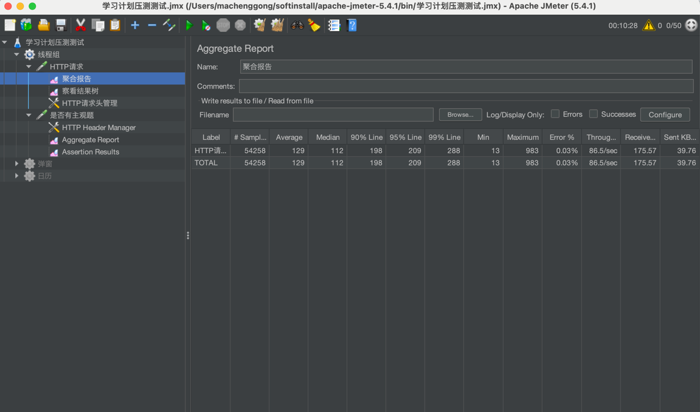

# jvm调优

1. 首先表态如果使用合理的 JVM 参数配置，在大多数情况应该是不需要调优的
2. 其次说明可能还是存在少量场景需要调优，我们可以对一些 JVM 核心指标配置监控告警，当出现波动时人为介入分析评估
3. 最后举一个实际的调优例子来加以说明


## hikari-tiku-quiz G1垃圾收集器调优

主站同事反馈getState接口有时超时严重 达到1秒

观测jvm监控发现 教务获取题目的两个接口在服务中会产生大对象导致G1 Evacuation Pause(年轻代暂停时间)时间达到254毫秒，此时Humongous Allocation(大对象分配时间)为74ms，STW时间达到254+74毫秒

此时需要考虑对jvm进行调优减少暂停时间，调优目标是加快年轻代收集速度，减少对象进入老年代

```shell
JVM_MEMORY="-Xmx6g \
  -Xms512m \
  -XX:G1HeapRegionSize=4M \
  -Xss1m"
JVM_GC="-XX:+UseG1GC \
  -XX:MaxGCPauseMillis=200 \
  -XX:InitiatingHeapOccupancyPercent=35\
  -XX:ConcGCThreads=4 \
  -XX:ParallelGCThreads=4"
```

1. InitiatingHeapOccupancyPercent ：触发G1 Young GC的堆占用率阈值，默认值为45%。 减少到35%提前触发G1 Young GC，减少STW时间
2. ConcGCThreads ：并发收集器线程数，默认值为ParallelGCThreads/4。 减少到4，减少STW时间
3. ParallelGCThreads ：并行收集器线程数，默认值为服务器核数。服务器核数我设置为4
4. G1HeapRegionSize G1的Region大小默认是根据堆的初始值和最大值来决定的，通常会在1MB到32MB之间，必须是2的幂次方。具体来说，
   JVM会根据整个堆的大小，选择一个合适的Region大小，使得整个堆大约有2048个Region。例如，如果堆是4G，那么每个Region大约是2MB（4G/2048 ≈ 2MB）
   现在这个参数设置为4M，大对象到老年代的概率降低，减少STW时间
   减少Region数量，降低管理开销

### 加大G1HeapRegionSize的好处 重要参数配置

G1 GC将堆划分为多个固定大小的Region（区域）。增大RegionSize会减少总Region数量，从而降低GC算法在管理Region（如标记、筛选、跨代引用追踪）时的元数据开销，提升GC效率。
改善大对象（Humongous Object）分配

定义：超过单个Region大小50%的对象称为“大对象”（Humongous Object），需占用连续多个Region。
问题：若RegionSize较小，大对象会频繁触发Full GC（因需连续空间）。
优化：增大RegionSize可减少大对象的产生，降低Full GC频率，减少停顿时间。
减少内存碎片化

RegionSize越大，内存分配的连续性更好，降低因小Region频繁分配/回收导致的内存碎片化，提升堆空间利用率。
提升吞吐量

减少GC线程的Region管理负担（如标记、筛选、跨代引用处理），间接提升应用吞吐量。

### 调优结果

1. qps提升8%
2. 响应时间减少13%
3. G1 Evacuation Pause(年轻代暂停时间)时间从243ms减少到94ms, Humongous Allocation时间从74ms减少到8ms，总的延迟减少200ms
4. G1HeapRegionSize每个区域大小为4M

* 
* 
* 
* 
* 
* 

1. 什么是Humongous Allocation？
   定义：当对象的大小超过单个Region容量的一半时，该对象被标记为 Humongous Object。
   G1将堆划分为多个固定大小的Region（默认约2MB，可调整）。
   若对象大小超过 单个Region的50%（例如默认Region为2MB时，对象超过1MB），则视为Humongous Object。
   分配方式：
   Humongous Object需要占用 连续的多个Region（称为Humongous Regions）。
   例如：一个5MB的Humongous Object在默认Region大小（2MB）下，需要3个连续的Region（2MB+2MB+1MB）。

