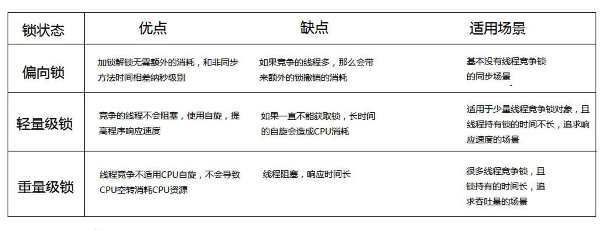

# synchronized

* [synchronized锁升级过程及其实现原理](https://blog.csdn.net/wangyy130/article/details/106495180/)
* [Synchronized底层实现，锁升级的具体过程](https://blog.csdn.net/zzti_erlie/article/details/103997713)
* [synchronized锁升级的过程（偏向锁到轻量锁再到重量级锁）](https://www.cnblogs.com/myseries/p/12213997.html)
## 1. 升级过程

synchronized锁有四种状态，无锁，偏向锁，轻量级锁，重量级锁，这几个状态会随着竞争状态逐渐升级，锁可以升级但不能降级，但是偏向锁状态可以被重置为无锁状态

* 只有一个线程进入临界区 -------偏向锁
* 多个线程交替进入临界区--------轻量级锁
* 多个线程同时进入临界区-------重量级锁

