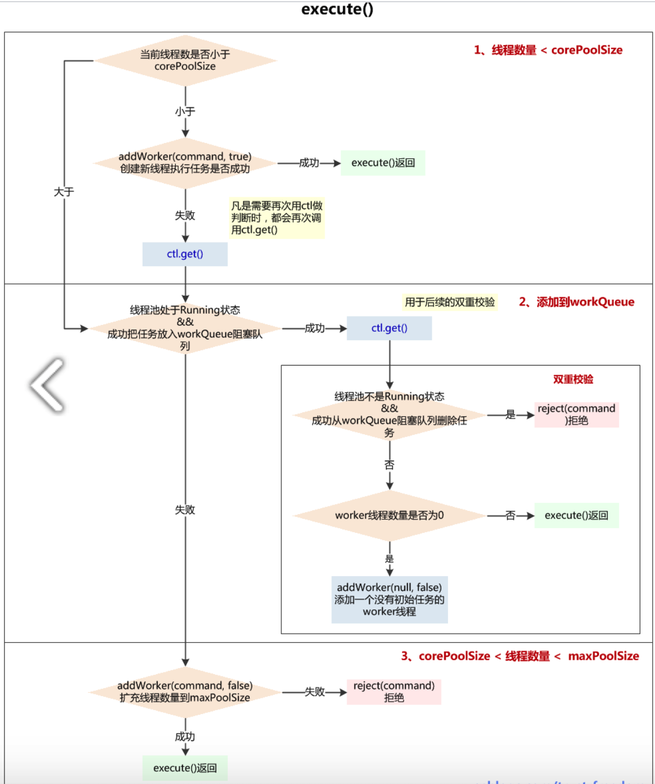
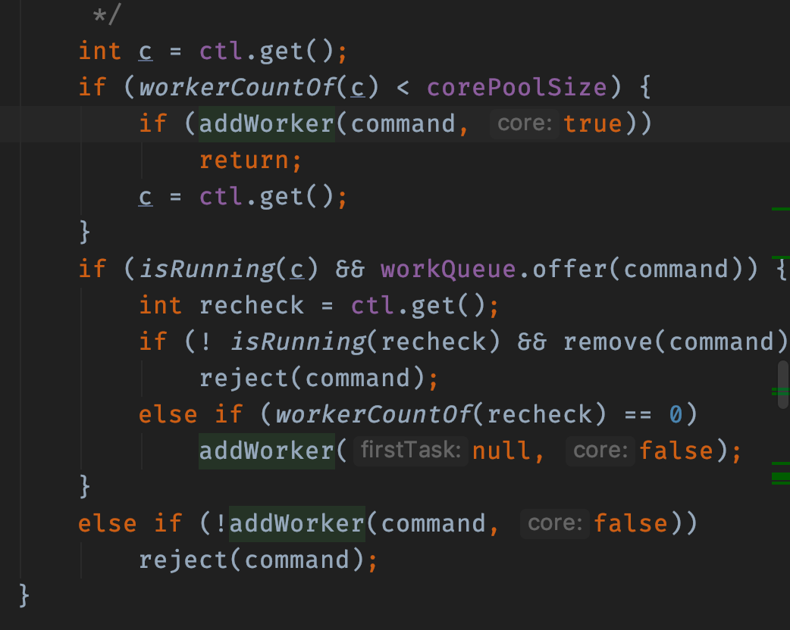
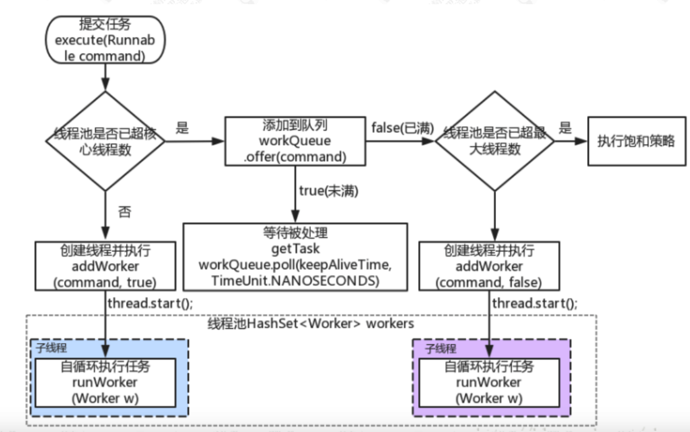

# 线程池

* [ThreadPoolExecutor的addWorker方法](https://blog.csdn.net/u011637069/article/details/79593114)
* [ThreadPoolExecutor源码解析](https://www.jianshu.com/p/a977ab6704d7)
* [Java线程池ThreadPoolExecutor使用和分析(一)](https://www.cnblogs.com/trust-freedom/p/6594270.html)
* [Java线程池ThreadPoolExecutor使用和分析(二) - execute()原理](https://www.cnblogs.com/trust-freedom/p/6681948.html)
* [Java线程池ThreadPoolExecutor使用和分析(三) - 终止线程池原理](https://www.cnblogs.com/trust-freedom/p/6693601.html)



## 线程池源码

### FutureTask 配合 Callable

callable实现

### submit和execute区别

1. submit有返回值 execute没有返回值
2. 

### ThreadPoolExecutor关系

java.util.concurrent.Executor 第一层执行接口execute
java.util.concurrent.ExecutorService 第二层提交接口 submit接口
java.util.concurrent.AbstractExecutorService 第三层 执行接口和提交接口整合
java.util.concurrent.ThreadPoolExecutor 具体实现

### ThreadPoolExecutor参数

1. int corePoolSize, 核心线程数
2. int maximumPoolSize, 最大线程数
3. long keepAliveTime, 存活时间
4. TimeUnit unit, 时间单位
5. BlockingQueue<Runnable> workQueue, 工作队列
6. ThreadFactory threadFactory, 线程工厂
7. RejectedExecutionHandler handler, 饱和策略

### ThreadPoolExecutor#execute 方法解析

execute->addWorker->new Worker(firstTask)->t.start()->run()->runWorker()->task.run()

Worker实现AQS和Runnable 实现run方法执行runWorker方法，task.run()执行真正的业务逻辑，
processWorkerExit方法退出->继续调用addWorker方法，达到线程池复用

### execute执行四种情况



1. 线程数量小于核心线程数，将work放入核心数量里面
2. 线程数量大于核心线程数，将work放入workQueue
3. 不满足前两种，创建非核心线程执行，失败之后执行拒绝策略



1. 如果线程池中的线程数量少于corePoolSize，就创建新的线程来执行新添加的任务
2. 如果线程池中的线程数量大于等于corePoolSize，但队列workQueue未满，则将新添加的任务放到workQueue中
3. 如果线程池中的线程数量大于等于corePoolSize，且队列workQueue已满，但线程池中的线程数量小于maximumPoolSize，则会创建新的线程来处理被添加的任务
4. 如果线程池中的线程数量等于了maximumPoolSize，就用RejectedExecutionHandler来执行拒绝策略

#### 线程池状态

ctl这个AtomicInteger的功能很强大，其高3位用于维护线程池运行状态，低29位维护线程池中线程数量

1. RUNNING：-1<<COUNT_BITS，即高3位为1，低29位为0，该状态的线程池会接收新任务，也会处理在阻塞队列中等待处理的任务
2. SHUTDOWN：0<<COUNT_BITS，即高3位为0，低29位为0，该状态的线程池不会再接收新任务，但还会处理已经提交到阻塞队列中等待处理的任务
3. STOP：1<<COUNT_BITS，即高3位为001，低29位为0，该状态的线程池不会再接收新任务，不会处理在阻塞队列中等待的任务，而且还会中断正在运行的任务
4. TIDYING：2<<COUNT_BITS，即高3位为010，低29位为0，所有任务都被终止了，workerCount为0，为此状态时还将调用terminated()方法
5. TERMINATED：3<<COUNT_BITS，即高3位为100，低29位为0，terminated()方法调用完成后变成此状态

这些状态均由int型表示，大小关系为 RUNNING<SHUTDOWN<STOP<TIDYING<TERMINATED，这个顺序基本上也是遵循线程池从 运行 到 终止这个过程。

* runStateOf(int c)  方法：c & 高3位为1，低29位为0的~CAPACITY，用于获取高3位保存的线程池状态
* workerCountOf(int c)方法：c & 高3位为0，低29位为1的CAPACITY，用于获取低29位的线程数量
* ctlOf(int rs, int wc)方法：参数rs表示runState，参数wc表示workerCount，即根据runState和workerCount打包合并成ctl

#### execute方法注释

```
public void execute(Runnable command) {
            if (command == null)
                throw new NullPointerException();
            int c = ctl.get();
            if (workerCountOf(c) < corePoolSize) {//1.当前池中线程比核心数少，新建一个线程执行任务
                if (addWorker(command, true))
                    return;
                c = ctl.get();
            }
            if (isRunning(c) && workQueue.offer(command)) {//2.核心池已满，但任务队列未满，添加到队列中
                int recheck = ctl.get();
                //任务成功添加到队列以后，再次检查是否需要添加新的线程，因为已存在的线程可能被销毁了
                if (! isRunning(recheck) && remove(command))
                    reject(command);//如果线程池处于非运行状态，并且把当前的任务从任务队列中移除成功，则拒绝该任务
                else if (workerCountOf(recheck) == 0)//如果之前的线程已被销毁完，新建一个线程
                addWorker(null, false);
            }
            else if (!addWorker(command, false)) //3.核心池已满，队列已满，试着创建一个新线程
                reject(command); //如果创建新线程失败了，说明线程池被关闭或者线程池完全满了，拒绝任务
        }
```

#### addWorker方法分析

如果工作线程数小于核心线程数的话，会调用 addWorker，顾名思义，其实就是要创建一个工作线程。我们来看看源码的实现
源码比较长，其实就做了两件事。

才用循环 CAS 操作来将线程数加 1；
新建一个线程并启用。


```java_holder_method_tree
private boolean addWorker(Runnable firstTask, boolean core) {
        retry: //goto 语句,避免死循环
        for (;;) {
            int c = ctl.get();
            int rs = runStateOf(c);
            // Check if queue empty only if necessary.
            /*如果线程处于非运行状态，并且 rs 不等于 SHUTDOWN 且 firstTask 不等于空且且
            workQueue 为空，直接返回 false（表示不可添加 work 状态）
            1. 线程池已经 shutdown 后，还要添加新的任务，拒绝
            2. （第二个判断）SHUTDOWN 状态不接受新任务，但仍然会执行已经加入任务队列的任
            务，所以当进入 SHUTDOWN 状态，而传进来的任务为空，并且任务队列不为空的时候，是允许添加
            新线程的,如果把这个条件取反，就表示不允许添加 worker*/
            if (rs >= SHUTDOWN &&
                    ! (rs == SHUTDOWN &&
                            firstTask == null &&
                            ! workQueue.isEmpty()))
                return false;
            for (;;) { //自旋
                int wc = workerCountOf(c);//获得 Worker 工作线程数
                //如果工作线程数大于默认容量大小或者大于核心线程数大小，则直接返回 false 表示不
                能再添加 worker。
                if (wc >= CAPACITY ||
                        wc >= (core ? corePoolSize : maximumPoolSize))
                    return false;
                if (compareAndIncrementWorkerCount(c))//通过 cas 来增加工作线程数，如果 cas 失败，则直接重试
                    break retry;
                c = ctl.get(); // Re-read ctl //再次获取 ctl 的值
                if (runStateOf(c) != rs) //这里如果不想等，说明线程的状态发生了变化，继续重试
                    continue retry;
                // else CAS failed due to workerCount change; retry inner loop
            }
        }

        
        //上面这段代码主要是对 worker 数量做原子+1 操作,下面的逻辑才是正式构建一个 worker


        boolean workerStarted = false; //工作线程是否启动的标识
        boolean workerAdded = false; //工作线程是否已经添加成功的标识
        Worker w = null;
        try {
            w = new Worker(firstTask); //构建一个 Worker，这个 worker 是什么呢？我们可以看到构造方法里面传入了一个 Runnable 对象
            final Thread t = w.thread; //从 worker 对象中取出线程
            if (t != null) {
                final ReentrantLock mainLock = this.mainLock;
                mainLock.lock(); //这里有个重入锁，避免并发问题
                try {
                    // Recheck while holding lock.
                    // Back out on ThreadFactory failure or if
                    // shut down before lock acquired.
                    int rs = runStateOf(ctl.get());
                    //只有当前线程池是正在运行状态，[或是 SHUTDOWN 且 firstTask 为空]，才能添加到 workers 集合中
                    if (rs < SHUTDOWN ||
                            (rs == SHUTDOWN && firstTask == null)) {
                        //任务刚封装到 work 里面，还没 start,你封装的线程就是 alive，几个意思？肯定是要抛异常出去的
                        if (t.isAlive()) // precheck that t is startable
                            throw new IllegalThreadStateException();
                        workers.add(w); //将新创建的 Worker 添加到 workers 集合中
                        int s = workers.size();
                        //如果集合中的工作线程数大于最大线程数，这个最大线程数表示线程池曾经出现过的最大线程数
                        if (s > largestPoolSize)
                            largestPoolSize = s; //更新线程池出现过的最大线程数
                        workerAdded = true;//表示工作线程创建成功了
                    }
                } finally {
                    mainLock.unlock(); //释放锁
                }
                if (workerAdded) {//如果 worker 添加成功
                    t.start();//启动线程
                    workerStarted = true;
                }
            }
        } finally {
            if (! workerStarted)
                addWorkerFailed(w); //如果添加失败，就需要做一件事，就是递减实际工作线程数(还记得我们最开始的时候增加了工作线程数吗)
        }
        return workerStarted;//返回结果
    }
```

##### addWorker参数

参数：
    firstTask：    worker线程的初始任务，可以为空
    core：           true：将corePoolSize作为上限，false：将maximumPoolSize作为上限
addWorker方法有4种传参的方式：

1. addWorker(command, true)
2. addWorker(command, false)
3. addWorker(null, false)
4. addWorker(null, true)

* 在execute方法中就使用了前3种，结合这个核心方法进行以下分析
  - 第一个：线程数小于corePoolSize时，放一个需要处理的task进Workers Set。如果Workers Set长度超过corePoolSize，就返回false
  - 第二个：当队列被放满时，就尝试将这个新来的task直接放入Workers Set，而此时Workers Set的长度限制是maximumPoolSize。如果线程池也满了的话就返回false
  - 第三个：放入一个空的task进workers Set，长度限制是maximumPoolSize。这样一个task为空的worker在线程执行的时候会去任务队列里拿任务，这样就相当于创建了一个新的线程，只是没有马上分配任务
  - 第四个：这个方法就是放一个null的task进Workers Set，而且是在小于corePoolSize时，如果此时Set中的数量已经达到corePoolSize那就返回false，什么也不干。实际使用中是在prestartAllCoreThreads()方法，这个方法用来为线程池预先启动corePoolSize个worker等待从workQueue中获取任务执行
* 执行流程：
  - 判断线程池当前是否为可以添加worker线程的状态，可以则继续下一步，不可以return false：
  - A、线程池状态>shutdown，可能为stop、tidying、terminated，不能添加worker线程
  - B、线程池状态==shutdown，firstTask不为空，不能添加worker线程，因为shutdown状态的线程池不接收新任务
  - C、线程池状态==shutdown，firstTask==null，workQueue为空，不能添加worker线程，因为firstTask为空是为了添加一个没有任务的线程再从workQueue获取task，而workQueue为空，说明添加无任务线程已经没有意义
* 线程池当前线程数量是否超过上限（corePoolSize 或 maximumPoolSize），超过了return false，没超过则对workerCount+1，继续下一步
* 在线程池的ReentrantLock保证下，向Workers Set中添加新创建的worker实例，添加完成后解锁，并启动worker线程，如果这一切都成功了，return true，如果添加worker入Set失败或启动失败，调用addWorkerFailed()逻辑

#### runWorker 方法

前面已经了解了 ThreadPoolExecutor 的核心方法 addWorker，主要作用是增加工作线程，而 Worker 简单理解其实就是一个线程，里面重新了 run 方法，这块是线程池中执行任务的真正处理逻辑，也就是 runWorker 方法，这个方法主要做几件事

1. 如果 task 不为空,则开始执行 task
2. 如果 task 为空,则通过 getTask()再去取任务,并赋值给 task,如果取到的 Runnable 不为空,则执行该任务
3. 执行完毕后,通过 while 循环继续 getTask()取任务
4. 如果 getTask()取到的任务依然是空,那么整个 runWorker()方法执行完毕

```java_holder_method_tree
final void runWorker(Worker w) {
        Thread wt = Thread.currentThread();
        Runnable task = w.firstTask;
        w.firstTask = null;
        //unlock，表示当前 worker 线程允许中断，因为 new Worker 默认的 state=-1,此处是调用
        //Worker 类的 tryRelease()方法，将 state 置为 0，
        //而 interruptIfStarted()中只有 state>=0 才允许调用中断
        w.unlock(); // allow interrupts
        boolean completedAbruptly = true;
        try {
            //注意这个 while 循环,在这里实现了 [线程复用] // 如果 task 为空，则通过getTask 来获取任务
            while (task != null || (task = getTask()) != null) {
                w.lock(); //上锁，不是为了防止并发执行任务，为了在 shutdown()时不终止正在运行的 worker
                //线程池为 stop 状态时不接受新任务，不执行已经加入任务队列的任务，还中断正在执行的任务
                //所以对于 stop 状态以上是要中断线程的
                //(Thread.interrupted() &&runStateAtLeast(ctl.get(), STOP)确保线程中断标志位为 true 且是 stop 状态以上，接着清除了中断标志
                //!wt.isInterrupted()则再一次检查保证线程需要设置中断标志位
                if ((runStateAtLeast(ctl.get(), STOP) ||
                        (Thread.interrupted() &&
                                runStateAtLeast(ctl.get(), STOP))) &&
                        !wt.isInterrupted())
                    wt.interrupt();
                try {
                    beforeExecute(wt, task);//这里默认是没有实现的，在一些特定的场景中我们可以自己继承 ThreadpoolExecutor 自己重写
                    Throwable thrown = null;
                    try {
                        task.run(); //执行任务中的 run 方法
                    } catch (RuntimeException x) {
                        thrown = x; throw x;
                    } catch (Error x) {
                        thrown = x; throw x;
                    } catch (Throwable x) {
                        thrown = x; throw new Error(x);
                    } finally {
                        afterExecute(task, thrown); //这里默认默认而也是没有实现
                    }
                } finally {
                    //置空任务(这样下次循环开始时,task 依然为 null,需要再通过 getTask()取) + 记录该 Worker 完成任务数量 + 解锁
                    task = null;
                    w.completedTasks++;
                    w.unlock();
                }
            }
            completedAbruptly = false;
        } finally {
            processWorkerExit(w, completedAbruptly);
            //1.将入参 worker 从数组 workers 里删除掉；
            //2.根据布尔值 allowCoreThreadTimeOut 来决定是否补充新的 Worker 进数组workers
        }
    }
```

#### getTask

worker 线程会从阻塞队列中获取需要执行的任务，这个方法不是简单的 take 数据，我们来分析下他的源码实现

你也许好奇是怎样判断线程有多久没有活动了，是不是以为线程池会启动一个监控线程，专门监控哪个线程正在偷懒？
想太多，其实只是在线程从工作队列 poll 任务时，加上了超时限制，如果线程在 keepAliveTime 的时间内 poll
不到任务，那我就认为这条线程没事做，可以干掉了，看看这个代码片段你就清楚了

```java_holder_method_tree
private Runnable getTask() {
        boolean timedOut = false; // Did the last poll() time out?
        for (;;) {//自旋
            int c = ctl.get();
            int rs = runStateOf(c);
            /* 对线程池状态的判断，两种情况会 workerCount-1，并且返回 null
            1. 线程池状态为 shutdown，且 workQueue 为空（反映了 shutdown 状态的线程池还是要执行 workQueue 中剩余的任务的）
            2. 线程池状态为 stop（shutdownNow()会导致变成 STOP）（此时不用考虑 workQueue的情况）*/
            // Check if queue empty only if necessary.
            if (rs >= SHUTDOWN && (rs >= STOP || workQueue.isEmpty())) {
                decrementWorkerCount();
                return null;//返回 null，则当前 worker 线程会退出
            }
            int wc = workerCountOf(c);
            // timed 变量用于判断是否需要进行超时控制。
            // allowCoreThreadTimeOut 默认是 false，也就是核心线程不允许进行超时；
            // wc > corePoolSize，表示当前线程池中的线程数量大于核心线程数量；
            // 对于超过核心线程数量的这些线程，需要进行超时控制
            boolean timed = allowCoreThreadTimeOut || wc > corePoolSize;
            /*1. 线程数量超过 maximumPoolSize 可能是线程池在运行时被调用了 setMaximumPoolSize()
            被改变了大小，否则已经 addWorker()成功不会超过 maximumPoolSize
            2. timed && timedOut 如果为 true，表示当前操作需要进行超时控制，并且上次从阻塞队列中
            获取任务发生了超时.其实就是体现了空闲线程的存活时间*/
            if ((wc > maximumPoolSize || (timed && timedOut))
                    && (wc > 1 || workQueue.isEmpty())) {
                if (compareAndDecrementWorkerCount(c))
                    return null;
                continue;
            }
            try {
                /*根据 timed 来判断，如果为 true，则通过阻塞队列 poll 方法进行超时控制，如果在
                keepaliveTime 时间内没有获取到任务，则返回 null.
                否则通过 take 方法阻塞式获取队列中的任务*/
                Runnable r = timed ?
                        workQueue.poll(keepAliveTime, TimeUnit.NANOSECONDS) :
                        workQueue.take();
                if (r != null)//如果拿到的任务不为空，则直接返回给 worker 进行处理
                    return r;
                timedOut = true;//如果 r==null，说明已经超时了，设置 timedOut=true，在下次自旋的时候进行回收
            } catch (InterruptedException retry) {
                timedOut = false;// 如果获取任务时当前线程发生了中断，则设置 timedOut 为false 并返回循环重试
            }
        }
    }
```

1. 首先判断是否可以满足从workQueue中获取任务的条件，不满足return null
    * 线程池状态是否满足：
         - shutdown状态 + workQueue为空 或 stop状态，都不满足，因为被shutdown后还是要执行workQueue剩余的任务，但workQueue也为空，就可以退出了
         - stop状态，shutdownNow()操作会使线程池进入stop，此时不接受新任务，中断正在执行的任务，workQueue中的任务也不执行了，故return null返回
    * 线程数量是否超过maximumPoolSize 或 获取任务是否超时
         - 线程数量超过maximumPoolSize可能是线程池在运行时被调用了setMaximumPoolSize()被改变了大小，否则已经addWorker()成功不会超过maximumPoolSize
         - 如果 当前线程数量>corePoolSize，才会检查是否获取任务超时，这也体现了当线程数量达到maximumPoolSize后，如果一直没有新任务，会逐渐终止worker线程直到corePoolSize
2. 如果满足获取任务条件，根据是否需要定时获取调用不同方法：
    * workQueue.poll()：如果在keepAliveTime时间内，阻塞队列还是没有任务，返回null
    * workQueue.take()：如果阻塞队列为空，当前线程会被挂起等待；当队列中有任务加入时，线程被唤醒，take方法返回任务
3. 在阻塞从workQueue中获取任务时，可以被interrupt()中断，代码中捕获了InterruptedException，重置timedOut为初始值false，再次执行第1步中的判断，满足就继续获取任务，不满足return null，会进入worker退出的流程

#### processWorkerExit

```java_holder_method_tree
/**
 * Performs cleanup and bookkeeping for a dying worker. Called
 * only from worker threads. Unless completedAbruptly is set,
 * assumes that workerCount has already been adjusted to account
 * for exit.  This method removes thread from worker set, and
 * possibly terminates the pool or replaces the worker if either
 * it exited due to user task exception or if fewer than
 * corePoolSize workers are running or queue is non-empty but
 * there are no workers.
 *
 * @param w the worker
 * @param completedAbruptly if the worker died due to user exception
 */
private void processWorkerExit(Worker w, boolean completedAbruptly) {
    /**
     * 1、worker数量-1
     * 如果是突然终止，说明是task执行时异常情况导致，即run()方法执行时发生了异常，那么正在工作的worker线程数量需要-1
     * 如果不是突然终止，说明是worker线程没有task可执行了，不用-1，因为已经在getTask()方法中-1了
     */
    if (completedAbruptly) // If abrupt, then workerCount wasn't adjusted 代码和注释正好相反啊
        decrementWorkerCount();
 
    /**
     * 2、从Workers Set中移除worker
     */
    final ReentrantLock mainLock = this.mainLock;
    mainLock.lock();
    try {
        completedTaskCount += w.completedTasks; //把worker的完成任务数加到线程池的完成任务数
        workers.remove(w); //从HashSet<Worker>中移除
    } finally {
        mainLock.unlock();
    }
 
    /**
     * 3、在对线程池有负效益的操作时，都需要“尝试终止”线程池
     * 主要是判断线程池是否满足终止的状态
     * 如果状态满足，但还有线程池还有线程，尝试对其发出中断响应，使其能进入退出流程
     * 没有线程了，更新状态为tidying->terminated
     */
    tryTerminate();
 
    /**
     * 4、是否需要增加worker线程
     * 线程池状态是running 或 shutdown
     * 如果当前线程是突然终止的，addWorker()
     * 如果当前线程不是突然终止的，但当前线程数量 < 要维护的线程数量，addWorker()
     * 故如果调用线程池shutdown()，直到workQueue为空前，线程池都会维持corePoolSize个线程，然后再逐渐销毁这corePoolSize个线程
     */
    int c = ctl.get();
    //如果状态是running、shutdown，即tryTerminate()没有成功终止线程池，尝试再添加一个worker
    if (runStateLessThan(c, STOP)) {
        //不是突然完成的，即没有task任务可以获取而完成的，计算min，并根据当前worker数量判断是否需要addWorker()
        if (!completedAbruptly) {
            int min = allowCoreThreadTimeOut ? 0 : corePoolSize; //allowCoreThreadTimeOut默认为false，即min默认为corePoolSize
             
            //如果min为0，即不需要维持核心线程数量，且workQueue不为空，至少保持一个线程
            if (min == 0 && ! workQueue.isEmpty())
                min = 1;
             
            //如果线程数量大于最少数量，直接返回，否则下面至少要addWorker一个
            if (workerCountOf(c) >= min)
                return; // replacement not needed
        }
         
        //添加一个没有firstTask的worker
        //只要worker是completedAbruptly突然终止的，或者线程数量小于要维护的数量，就新添一个worker线程，即使是shutdown状态
        addWorker(null, false);
    }
}
```

执行流程：
* worker数量-1
  - 如果是突然终止，说明是task执行时异常情况导致，即run()方法执行时发生了异常，那么正在工作的worker线程数量需要-1
  - 如果不是突然终止，说明是worker线程没有task可执行了，不用-1，因为已经在getTask()方法中-1了
* 从Workers Set中移除worker，删除时需要上锁mainlock
* tryTerminate()：在对线程池有负效益的操作时，都需要“尝试终止”线程池，大概逻辑：
  - 判断线程池是否满足终止的状态
  - 如果状态满足，但还有线程池还有线程，尝试对其发出中断响应，使其能进入退出流程
  - 没有线程了，更新状态为tidying->terminated
* 是否需要增加worker线程，如果线程池还没有完全终止，仍需要保持一定数量的线程
  - 线程池状态是running 或 shutdown
  - 如果当前线程是突然终止的，addWorker()
  - 如果当前线程不是突然终止的，但当前线程数量 < 要维护的线程数量，addWorker()
* 故如果调用线程池shutdown()，直到workQueue为空前，线程池都会维持corePoolSize个线程，然后再逐渐销毁这corePoolSize个线程

### 四种拒绝策略

1. CallerRunsPolicy 由当前线程调用
2. AbortPolicy，默认策略，抛异常
3. DiscardPolicy 什么都不做
4. DiscardOldestPolicy 移出队列

### Worker对象

```java
private final class Worker
        extends AbstractQueuedSynchronizer
        implements Runnable
    {
        /**
         * This class will never be serialized, but we provide a
         * serialVersionUID to suppress a javac warning.
         */
        private static final long serialVersionUID = 6138294804551838833L;

        /** Thread this worker is running in.  Null if factory fails. */
        final Thread thread;
        /** Initial task to run.  Possibly null. */
        Runnable firstTask;
        /** Per-thread task counter */
        volatile long completedTasks;

        /**
         * Creates with given first task and thread from ThreadFactory.
         * @param firstTask the first task (null if none)
         */
        Worker(Runnable firstTask) {
            setState(-1); // inhibit interrupts until runWorker
            this.firstTask = firstTask;
            this.thread = getThreadFactory().newThread(this);
        }

        /** Delegates main run loop to outer runWorker  */
        //运行Thread#start会执行run方法
        public void run() {
            runWorker(this);
        }

        // Lock methods
        //
        // The value 0 represents the unlocked state.
        // The value 1 represents the locked state.

        protected boolean isHeldExclusively() {
            return getState() != 0;
        }

        protected boolean tryAcquire(int unused) {
            if (compareAndSetState(0, 1)) {
                setExclusiveOwnerThread(Thread.currentThread());
                return true;
            }
            return false;
        }

        protected boolean tryRelease(int unused) {
            setExclusiveOwnerThread(null);
            setState(0);
            return true;
        }

        public void lock()        { acquire(1); }
        public boolean tryLock()  { return tryAcquire(1); }
        public void unlock()      { release(1); }
        public boolean isLocked() { return isHeldExclusively(); }

        void interruptIfStarted() {
            Thread t;
            if (getState() >= 0 && (t = thread) != null && !t.isInterrupted()) {
                try {
                    t.interrupt();
                } catch (SecurityException ignore) {
                }
            }
        }
    }
```

### 工作队列

* poll(long timeout, TimeUnit unit)：从BlockingQueue取出一个队首的对象，如果在指定时间内，队列一旦有数据可取，则立即返回队列中的数据。否则知道时间
超时还没有数据可取，返回失败

## 线程池终止原理

* shutdown()  --  温柔的终止线程池
  - interruptIdleWorkers()  --  中断空闲worker
  - tryTerminate()  --  尝试终止线程池
* shutdownNow()  --  强硬的终止线程池
  - interruptWorkers()  --  中断所有worker
  - awaitTermination()  --  等待线程池终止

### 1. shutdown()  --  温柔的终止线程池

```java_holder_method_tree
/**
 * Initiates an orderly shutdown in which previously submitted
 * tasks are executed, but no new tasks will be accepted.
 * Invocation has no additional effect if already shut down.
 * 开始一个有序的关闭，在关闭中，之前提交的任务会被执行（包含正在执行的，在阻塞队列中的），但新任务会被拒绝
 * 如果线程池已经shutdown，调用此方法不会有附加效应
 *
 * <p>This method does not wait for previously submitted tasks to
 * complete execution.  Use {@link #awaitTermination awaitTermination}
 * to do that.
 * 当前方法不会等待之前提交的任务执行结束，可以使用awaitTermination()
 *
 * @throws SecurityException {@inheritDoc}
 */
public void shutdown() {
    final ReentrantLock mainLock = this.mainLock;
    mainLock.lock(); //上锁
     
    try {
        //判断调用者是否有权限shutdown线程池
        checkShutdownAccess();
         
        //CAS+循环设置线程池状态为shutdown
        advanceRunState(SHUTDOWN);
         
        //中断所有空闲线程 workers里面的线程取出来遍历 执行t.interrupt() 需要加锁操作
        interruptIdleWorkers();
         
        onShutdown(); // hook for ScheduledThreadPoolExecutor
    } 
    finally {
        mainLock.unlock(); //解锁
    }
     
    //尝试终止线程池
    tryTerminate();
}
```

1. 上锁，mainLock是线程池的主锁，是可重入锁，当要操作workers set这个保持线程的HashSet时，需要先获取mainLock，还有当要处理largestPoolSize、completedTaskCount这类统计数据时需要先获取mainLock
2. 判断调用者是否有权限shutdown线程池
3. 使用CAS操作将线程池状态设置为shutdown，shutdown之后将不再接收新任务
4. 中断所有空闲线程  interruptIdleWorkers()
5. onShutdown()，ScheduledThreadPoolExecutor中实现了这个方法，可以在shutdown()时做一些处理
6. 解锁
7. 尝试终止线程池  tryTerminate()

#### 1.1 interruptIdleWorkers

```java_holder_method_tree
/**
 * Interrupts threads that might be waiting for tasks (as
 * indicated by not being locked) so they can check for
 * termination or configuration changes. Ignores
 * SecurityExceptions (in which case some threads may remain
 * uninterrupted).
 * 中断在等待任务的线程(没有上锁的)，中断唤醒后，可以判断线程池状态是否变化来决定是否继续
 *
 * @param onlyOne If true, interrupt at most one worker. This is
 * called only from tryTerminate when termination is otherwise
 * enabled but there are still other workers.  In this case, at
 * most one waiting worker is interrupted to propagate shutdown
 * signals in case(以免) all threads are currently waiting.
 * Interrupting any arbitrary thread ensures that newly arriving
 * workers since shutdown began will also eventually exit.
 * To guarantee eventual termination, it suffices to always
 * interrupt only one idle worker, but shutdown() interrupts all
 * idle workers so that redundant workers exit promptly, not
 * waiting for a straggler task to finish.
 * 
 * onlyOne如果为true，最多interrupt一个worker
 * 只有当终止流程已经开始，但线程池还有worker线程时,tryTerminate()方法会做调用onlyOne为true的调用
 * （终止流程已经开始指的是：shutdown状态 且 workQueue为空，或者 stop状态）
 * 在这种情况下，最多有一个worker被中断，为了传播shutdown信号，以免所有的线程都在等待
 * 为保证线程池最终能终止，这个操作总是中断一个空闲worker
 * 而shutdown()中断所有空闲worker，来保证空闲线程及时退出
 */
private void interruptIdleWorkers(boolean onlyOne) {
    final ReentrantLock mainLock = this.mainLock;
    mainLock.lock(); //上锁
    try {
        for (Worker w : workers) { 
            Thread t = w.thread;
             
            if (!t.isInterrupted() && w.tryLock()) {
                try {
                    t.interrupt();
                } catch (SecurityException ignore) {
                } finally {
                    w.unlock();
                }
            }
            if (onlyOne)
                break;
        }
    } finally {
        mainLock.unlock(); //解锁
    }
}
```

#### 1.2 尝试终止线程池  tryTerminate()

```java_holder_method_tree
/**
 * Transitions to TERMINATED state if either (SHUTDOWN and pool
 * and queue empty) or (STOP and pool empty).  If otherwise
 * eligible to terminate but workerCount is nonzero, interrupts an
 * idle worker to ensure that shutdown signals propagate. This
 * method must be called following any action that might make
 * termination possible -- reducing worker count or removing tasks
 * from the queue during shutdown. The method is non-private to
 * allow access from ScheduledThreadPoolExecutor.
 * 
 * 在以下情况将线程池变为TERMINATED终止状态
 * shutdown 且 正在运行的worker 和 workQueue队列 都empty
 * stop 且  没有正在运行的worker
 * 
 * 这个方法必须在任何可能导致线程池终止的情况下被调用，如：
 * 减少worker数量
 * shutdown时从queue中移除任务
 * 
 * 这个方法不是私有的，所以允许子类ScheduledThreadPoolExecutor调用
 */
final void tryTerminate() {
    //这个for循环主要是和进入关闭线程池操作的CAS判断结合使用的
    for (;;) {
        int c = ctl.get();
         
        /**
         * 线程池是否需要终止
         * 如果以下3中情况任一为true，return，不进行终止
         * 1、还在运行状态
         * 2、状态是TIDYING、或 TERMINATED，已经终止过了
         * 3、SHUTDOWN 且 workQueue不为空
         */
        if (isRunning(c) ||
            runStateAtLeast(c, TIDYING) ||
            (runStateOf(c) == SHUTDOWN && ! workQueue.isEmpty()))
            return;
         
        /**
         * 只有shutdown状态 且 workQueue为空，或者 stop状态能执行到这一步
         * 如果此时线程池还有线程（正在运行任务，正在等待任务）
         * 中断唤醒一个正在等任务的空闲worker
         * 唤醒后再次判断线程池状态，会return null，进入processWorkerExit()流程
         */
        if (workerCountOf(c) != 0) { // Eligible to terminate 资格终止
            interruptIdleWorkers(ONLY_ONE); //中断workers集合中的空闲任务，参数为true，只中断一个
            return;
        }
 
        /**
         * 如果状态是SHUTDOWN，workQueue也为空了，正在运行的worker也没有了，开始terminated
         */
        final ReentrantLock mainLock = this.mainLock;
        mainLock.lock();
        try {
            //CAS：将线程池的ctl变成TIDYING（所有的任务被终止，workCount为0，为此状态时将会调用terminated()方法），期间ctl有变化就会失败，会再次for循环
            if (ctl.compareAndSet(c, ctlOf(TIDYING, 0))) {
                try {
                    terminated(); //需子类实现
                } 
                finally {
                    ctl.set(ctlOf(TERMINATED, 0)); //将线程池的ctl变成TERMINATED
                    termination.signalAll(); //唤醒调用了 等待线程池终止的线程 awaitTermination() 
                }
                return;
            }
        }
        finally {
            mainLock.unlock();
        }
        // else retry on failed CAS
        // 如果上面的CAS判断false，再次循环
    }
}
```

1. 判断线程池是否需要进入终止流程（只有当shutdown状态+workQueue.isEmpty 或 stop状态，才需要）
2. 判断线程池中是否还有线程，有则 interruptIdleWorkers(ONLY_ONE) 尝试中断一个空闲线程（正是这个逻辑可以再次发出中断信号，中断阻塞在获取任务的线程）
3. 如果状态是SHUTDOWN，workQueue也为空了，正在运行的worker也没有了，开始terminated
4. 会先上锁，将线程池置为tidying状态，之后调用需子类实现的 terminated()，最后线程池置为terminated状态，并唤醒所有等待线程池终止这个Condition的线程

### 2. shutdownNow()  --  强硬的终止线程池

```java_holder_method_tree
/**
 * Attempts to stop all actively executing tasks, halts the
 * processing of waiting tasks, and returns a list of the tasks
 * that were awaiting execution. These tasks are drained (removed)
 * from the task queue upon return from this method.
 * 尝试停止所有活动的正在执行的任务，停止等待任务的处理，并返回正在等待被执行的任务列表
 * 这个任务列表是从任务队列中排出（删除）的
 *
 * <p>This method does not wait for actively executing tasks to
 * terminate.  Use {@link #awaitTermination awaitTermination} to
 * do that.
 * 这个方法不用等到正在执行的任务结束，要等待线程池终止可使用awaitTermination()
 *
 * <p>There are no guarantees beyond best-effort attempts to stop
 * processing actively executing tasks.  This implementation
 * cancels tasks via {@link Thread#interrupt}, so any task that
 * fails to respond to interrupts may never terminate.
 * 除了尽力尝试停止运行中的任务，没有任何保证
 * 取消任务是通过Thread.interrupt()实现的，所以任何响应中断失败的任务可能永远不会结束
 *
 * @throws SecurityException {@inheritDoc}
 */
public List<Runnable> shutdownNow() {
    List<Runnable> tasks;
    final ReentrantLock mainLock = this.mainLock;
    mainLock.lock(); //上锁
     
    try {
        //判断调用者是否有权限shutdown线程池
        checkShutdownAccess();
         
        //CAS+循环设置线程池状态为stop
        advanceRunState(STOP);
         
        //中断所有线程，包括正在运行任务的
        interruptWorkers();
         
        tasks = drainQueue(); //将workQueue中的元素放入一个List并返回
    } 
    finally {
        mainLock.unlock(); //解锁
    }
     
    //尝试终止线程池
    tryTerminate();
     
    return tasks; //返回workQueue中未执行的任务
}
```
1. 将线程池更新为stop状态
2. 调用 interruptWorkers() 中断所有线程，包括正在运行的线程
3. 将workQueue中待处理的任务移到一个List中，并在方法最后返回，说明shutdownNow()后不会再处理workQueue中的任务

#### 2.1 interruptWorkers()

private void interruptWorkers() {
    final ReentrantLock mainLock = this.mainLock;
    mainLock.lock();
    try {
        for (Worker w : workers)
            w.interruptIfStarted();
    } finally {
        mainLock.unlock();
    }
}

* interruptWorkers() 很简单，循环对所有worker调用 interruptIfStarted()，其中会判断worker的AQS state是否大于0，即worker是否已经开始运作，再调用Thread.interrupt()
* 需要注意的是，对于运行中的线程调用Thread.interrupt()并不能保证线程被终止，task.run()内部可能捕获了InterruptException，没有上抛，导致线程一直无法结束

### 3. awaitTermination()  --  等待线程池终止

```java_holder_method_tree
public boolean awaitTermination(long timeout, TimeUnit unit)
        throws InterruptedException {
        long nanos = unit.toNanos(timeout);
        final ReentrantLock mainLock = this.mainLock;
        mainLock.lock();
        try {
            for (;;) {
                if (runStateAtLeast(ctl.get(), TERMINATED))
                    return true;
                if (nanos <= 0)
                    return false;
                nanos = termination.awaitNanos(nanos);
            }
        } finally {
            mainLock.unlock();
        }
    }
```

* 参数
  - timeout：超时时间
  - unit：timeout超时时间的单位
* 返回
  - true：线程池终止
  - false：超过timeout指定时间

* 在发出一个shutdown请求后，在以下3种情况发生之前，awaitTermination()都会被阻塞

1. 所有任务完成执行
2. 到达超时时间
3. 当前线程被中断

## 线程池种类

### 1. newCachedThreadPool

* 创建一个可缓存线程池，如果线程池长度超过处理需要，可灵活回收空闲线程，若无可回收，则新建线程。
* 这种类型的线程池特点是：
* 工作线程的创建数量几乎没有限制(其实也有限制的,数目为Interger. MAX_VALUE), 这样可灵活的往线程池中添加线程。
* 如果长时间没有往线程池中提交任务，即如果工作线程空闲了指定的时间(默认为1分钟)，则该工作线程将自动终止。终止后，如果你又提交了新的任务，则线程池重新创建一个工作线程。
* 在使用CachedThreadPool时，一定要注意控制任务的数量，否则，由于大量线程同时运行，很有会造成系统OOM。

### 2. newFixedThreadPool

* 创建一个指定工作线程数量的线程池。每当提交一个任务就创建一个工作线程，如果工作线程数量达到线程池初始的最大数，则将提交的任务存入到池队列中。
* FixedThreadPool是一个典型且优秀的线程池，它具有线程池提高程序效率和节省创建线程时所耗的开销的优点。但是，在线程池空闲时，即线程池中没有可运行任务时，它不会释放工作线程，还会占用一定的系统资源。

### 3. newSingleThreadExecutor

* 创建一个单线程化的Executor，即只创建唯一的工作者线程来执行任务，它只会用唯一的工作线程来执行任务，保证所有任务按照指定顺序(FIFO, LIFO, 优先级)执行。如果这个线程异常结束，会有另一个取代它，
保证顺序执行。单工作线程最大的特点是可保证顺序地执行各个任务，并且在任意给定的时间不会有多个线程是活动的。
  
### 4. newScheduleThreadPool

* 创建一个定长的线程池，而且支持定时的以及周期性的任务执行，支持定时及周期性任务执行。

### 5. newSingleThreadScheduledExecutor

* 创建一个单线程执行程序，它可安排在给定延迟后运行命令或者定期地执行。线程池中最多执行1个线程，之后提交的线程活动将会排在队列中以此执行并且可定时或者延迟执行线程活动。