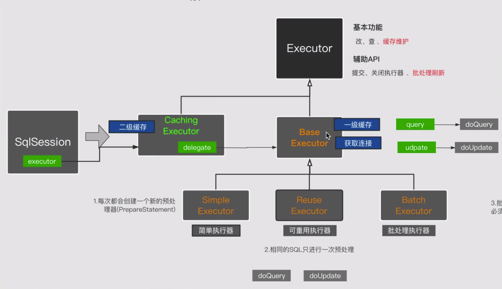
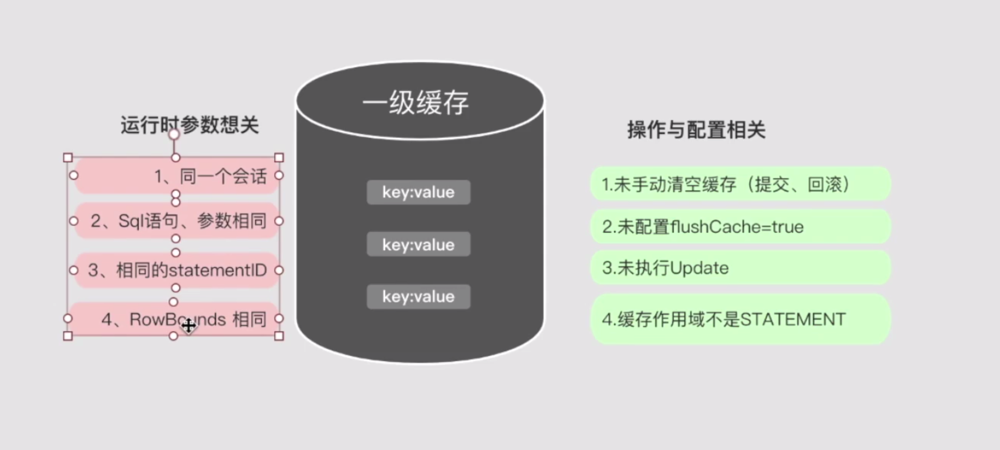
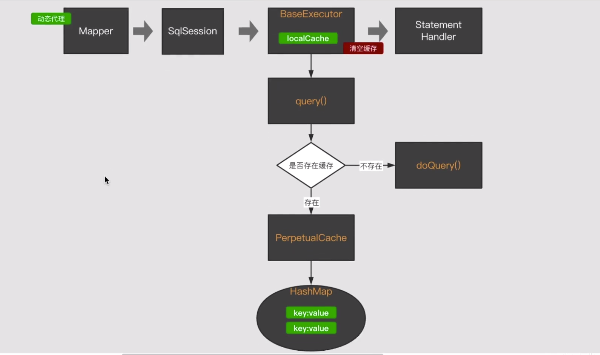
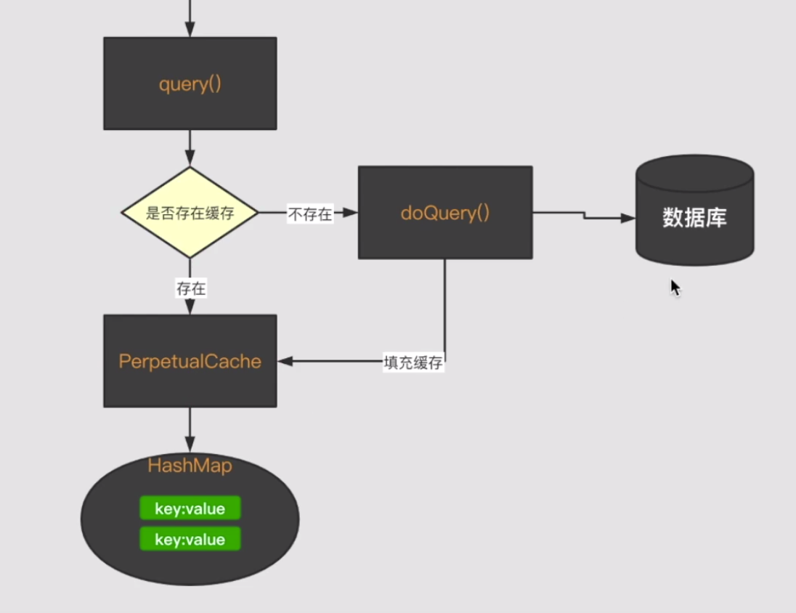
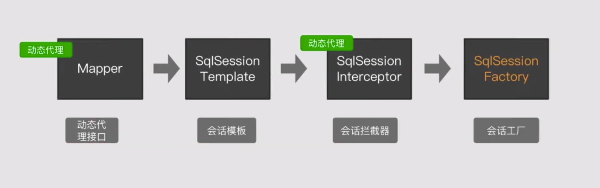

# 源码

## 1. 执行器 Executor

Executor接口中只有两种方法 update 和 query update操作包含insert update delete，query包含select操作，
这样设计的原因是update操作返回值为数字即影响的行数，select操作的返回值是ResultHandler返回的结果类型

1. 简单执行器 simpleExecutor，每次执行SQL需要预编译SQL语句。
2. 可重用执行器 ReuseExecutor，同一SQL语句执行只需要预编译一次SQL语句
3. 批处理执行器 BatchExecutor，只针对修改操作的SQL语句预编译一次，并且需要手动刷新SQL执行才生效。
4. 执行器抽象类 BaseExecutor，执行上面3个执行器的重复操作，比如一级缓存、doQuery、doUpdate方法。
5. 二级缓存 CachingExecutor，与一级缓存的区别：一级缓存查询数据库操作后会直接缓存，二级缓存需要当次数据库操作提交事务后才能进行缓存(二级缓存跨线程处理，一级缓存不用)。

### 执行逻辑



sqlSession->二级缓存->一级缓存->query->doQuery

二级缓存CachingExecutor中使用装饰器模式对BaseExecutor的实现类进行装饰，达到一级二级缓存同时使用的效果

### 一级缓存命中



1. sql和参数必须相同
2. 必须是相同的statementId即mapper中的方法名称
3. sqlSession必须相同
4. RowBound行范围必须相同
5. 未手动清空
5. 未调用flushCache=true查询
6. 未执行update操作，即使update语句中执行的是select语句
7. 缓存作用域是STATEMENT localCacheScope=STATEMENT
8. 不执行rollback

### 一级缓存源码





### 一级缓存总结

1. 和会话相关
2. 和查询条件有关
3. 和提交回滚有关

### 一级缓存失效

sqlSession和executor是一对一的，mybatis和spring整合之后sqlSession用的是不一样的， 会导致sqlSession失效，加上事务之后一级缓存生效

### spring



### 二级缓存

1. 一级缓存不能跨线程使用 与spring的整合中使用ThreadLocal作为sqlSession的缓存
2. 二级缓存可以跨线程调用，生命周期是整个应用，需要考虑容量

## 2. StatementHandler

### 2.1 StatementHandler接口

* Statement prepare(Connection connection)
    - 创建Statement对象，即该方法会通过Connection对象创建Statement对象。
* void parameterize(Statement statement)
    - 对Statement对象参数化，特别是PreapreStatement对象。
* void batch(Statement statement)
    - 批量执行SQL。
* int update(Statement statement)
    - 更新操作。
* < E> List< E> query(Statement statement, ResultHandler resultHandler)
    - 查询操作。
* BoundSql getBoundSql()
    - 获取SQL语句。
* ParameterHandler getParameterHandler()
    - 获取对应的参数处理器。

### 2.2 BaseStatementHandler StatementHandler接口实现类

StatementHandler的抽象实现类，SimpleStatementHandler、PrepareStatementHandler、CallableStatementHandler是其子类

* Configuration configuration
    - Mybatis全局配置对象。
* ObjectFactory objectFactory
    - 对象工厂。
* TypeHandlerRegistry typeHandlerRegistry
    - 类型注册器。
* ResultSetHandler resultSetHandler
    - 结果集Handler。
* ParameterHandler parameterHandler
    - 参数处理器Handler。
* Executor executor
    - SQL执行器。
* MappedStatement mappedStatement
    - SQL映射语句（Mapper.xml文件每一个方法对应一个MappedStatement对象）
* RowBounds rowBounds
    - 行边界，主要值分页参数limit、offset。
* BoundSql boundSql
    - 可以通过该对象获取SQL语句。

### 2.3 SimpleStatementHandler

具体的StatementHandler实现器，java.sql.Statement对象创建处理器。

### 2.4 PrepareStatementHandler

java.sql.PrepareStatement对象的创建处理器。

### 2.5 CallableStatementHandler

java.sql.CallableStatement对象的创建处理器，可用来执行存储过程调用的Statement。

### 2.6 RoutingStatementHandler

StatementHandler路由器，我们看一下其构造方法后

```java
public RoutingStatementHandler(Executor executor,MappedStatement ms,Object parameter,RowBounds rowBounds,ResultHandler resultHandler,BoundSql boundSql){

        switch(ms.getStatementType()){ // @1
        case STATEMENT:
        delegate=new SimpleStatementHandler(executor,ms,parameter,rowBounds,resultHandler,boundSql);
        break;
        case PREPARED:
        delegate=new PreparedStatementHandler(executor,ms,parameter,rowBounds,resultHandler,boundSql);
        break;
        case CALLABLE:
        delegate=new CallableStatementHandler(executor,ms,parameter,rowBounds,resultHandler,boundSql);
        break;
default:
        throw new ExecutorException("Unknown statement type: "+ms.getStatementType());
        }

        }
```

原来是会根据MappedStatement对象的statementType创建对应的StatementHandler

### 2.7 创建StatementHandler

Configuration#newStatementHandler

```java
public StatementHandler newStatementHandler(Executor executor,MappedStatement mappedStatement,Object parameterObject,RowBounds rowBounds,ResultHandler resultHandler,BoundSql boundSql){
        StatementHandler statementHandler=new RoutingStatementHandler(executor,mappedStatement,parameterObject,rowBounds,resultHandler,boundSql); // @1
        statementHandler=(StatementHandler)interceptorChain.pluginAll(statementHandler); // @2
        return statementHandler;
        }
```

该方法的两个关键点如下：

* 代码@1：创建RoutingStatementHandler对象，在其内部再根据SQL语句的类型，创建对应的StatementHandler对象。
* 代码@2：对StatementHandler引入拆件机制，该部分将在该专题的后续文章中会详细介绍，这里暂时跳过

## 3. ParameterHandler

参数处理器

### 3.1 ParameterHandler接口实现类

DefaultParameterHandler

### 3.2 创建ParameterHandler

Configuration#newParameterHandler

```java
public ParameterHandler newParameterHandler(MappedStatement mappedStatement,Object parameterObject,BoundSql boundSql){
        ParameterHandler parameterHandler=mappedStatement.getLang().createParameterHandler(mappedStatement,parameterObject,boundSql);
        parameterHandler=(ParameterHandler)interceptorChain.pluginAll(parameterHandler);  // @1
        return parameterHandler;
        }
```

同样该接口也支持插件化机制

## 4. ResultSetHandler

ResultSetHandler

### 4.1 ResultSetHandler实现类

DefaultParameterHandler

### 4.2 ResultSetHandler创建

Configuration#newResultSetHandler

```java
public ResultSetHandler newResultSetHandler(Executor executor,MappedStatement mappedStatement,RowBounds rowBounds,ParameterHandler parameterHandler,
        ResultHandler resultHandler,BoundSql boundSql){
        ResultSetHandler resultSetHandler=new DefaultResultSetHandler(executor,mappedStatement,parameterHandler,resultHandler,boundSql,rowBounds);
        resultSetHandler=(ResultSetHandler)interceptorChain.pluginAll(resultSetHandler);
        return resultSetHandler;
        }
```

同样支持插件化机制

## 5. mybatis插件

* [制作Mybatis插件---针对Mybatis的四大对象](https://blog.csdn.net/jinhaijing/article/details/84313668)