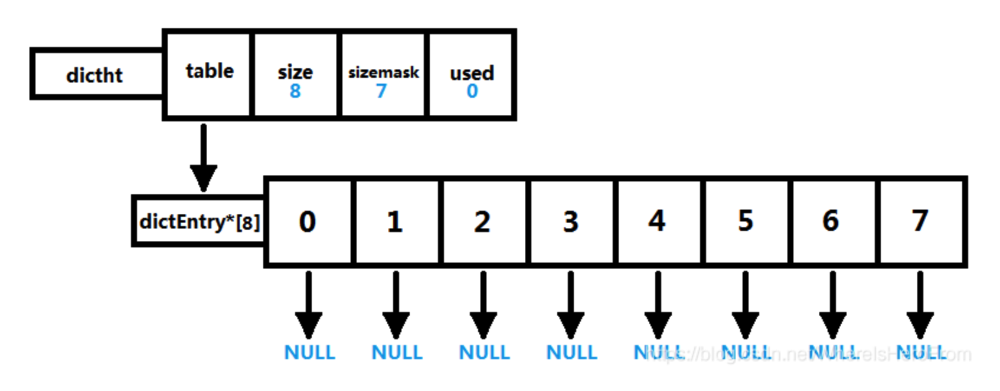
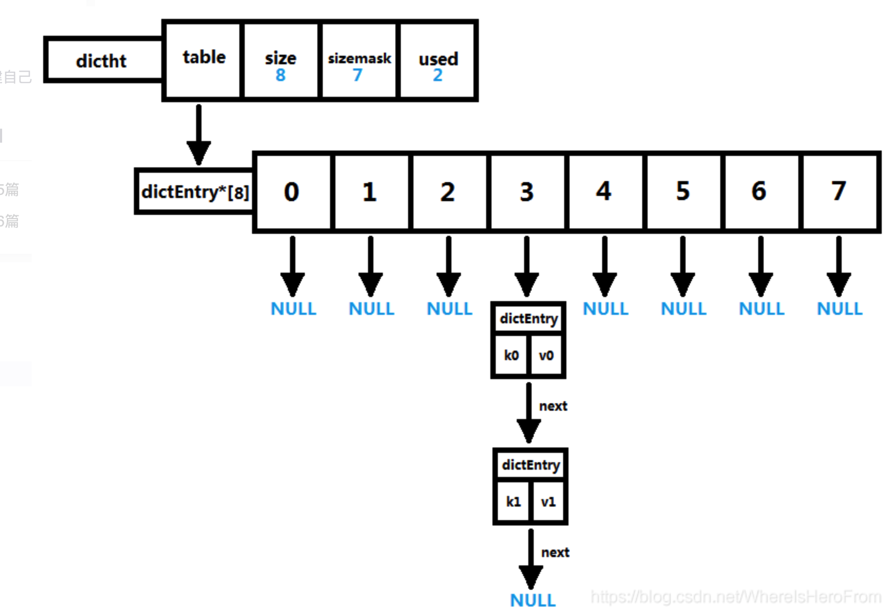
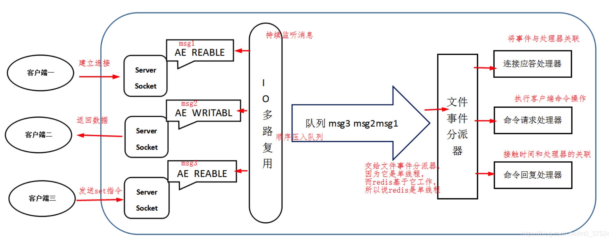
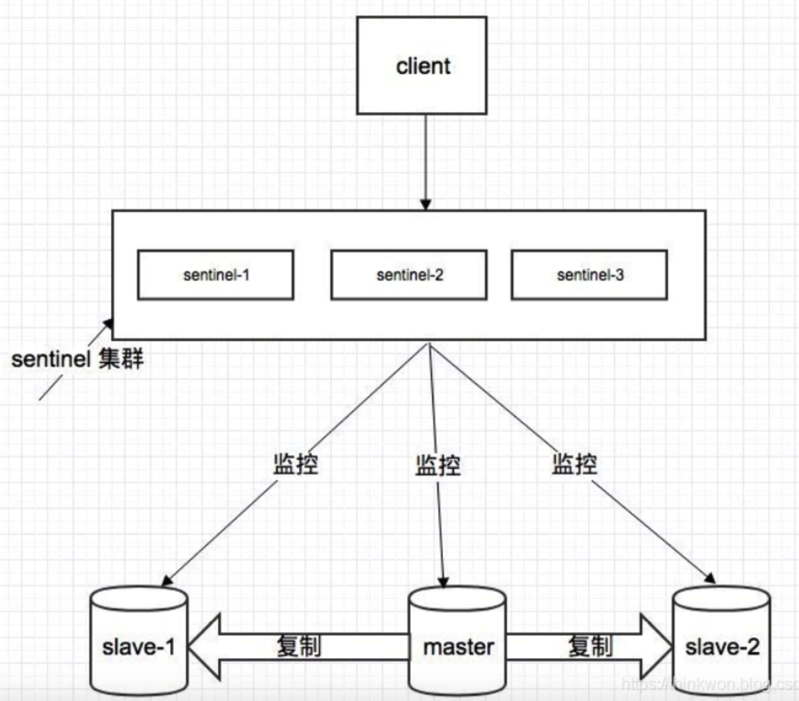
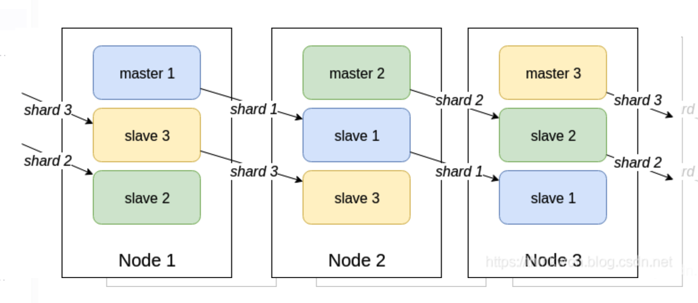
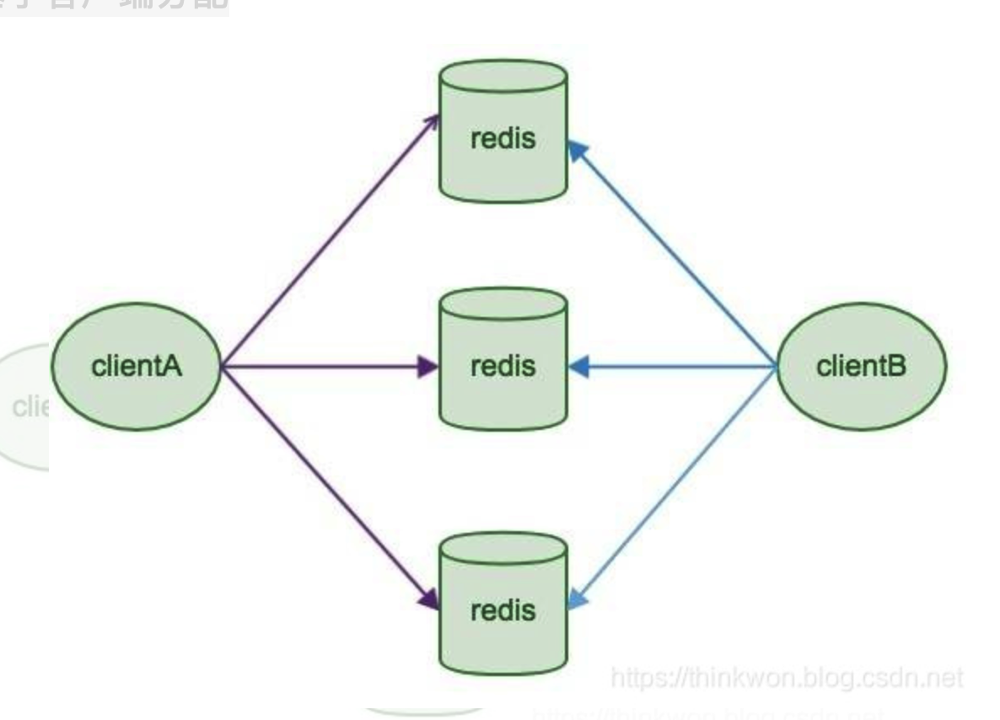
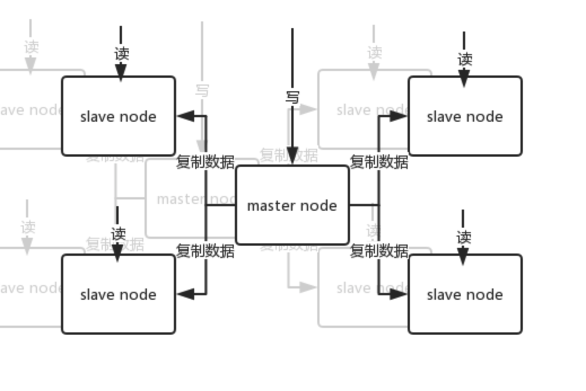

# Redis问题集锦

* [【redis】redis面试题](https://blog.csdn.net/qq_39733199/article/details/106626058)
* [Redis 和 IO 多路复用](https://www.cnblogs.com/john8169/p/9780484.html)

## 1. 概述

### 1.1 什么是 Redis？

1. Redis(Remote Dictionary Server) 是一个使用 C 语言编写的，开源的（BSD许可）高性能非关系型（NoSQL）的键值对数据库。
2. Redis 可以存储键和五种不同类型的值之间的映射。键的类型只能为字符串，值支持五种数据类型：字符串、列表、集合、散列表、有序集合。
3. 与传统数据库不同的是 Redis 的数据是存在内存中的，所以读写速度非常快，因此 redis 被广泛应用于缓存方向，每秒可以处理超过 10万次读写操作，
是已知性能最快的Key-Value DB。另外，Redis 也经常用来做分布式锁。除此之外，Redis 支持事务 、持久化、LUA脚本、LRU驱动事件、多种集群方案。

### 1.2 Redis 有哪些优缺点？

1. 优点
* 读写性能优异， Redis能读的速度是110000次/s，写的速度是81000次/s。
* 支持数据持久化，支持AOF和RDB两种持久化方式。
* 支持事务，Redis的所有操作都是原子性的，同时Redis还支持对几个操作合并后的原子性执行。
* 数据结构丰富，除了支持string类型的value外还支持hash、set、zset、list等数据结构。
* 支持主从复制，主机会自动将数据同步到从机，可以进行读写分离。
2. 缺点
* 数据库容量受到物理内存的限制，不能用作海量数据的高性能读写，因此Redis适合的场景主要局限在较小数据量的高性能操作和运算上。
* Redis 不具备自动容错和恢复功能，主机从机的宕机都会导致前端部分读写请求失败，需要等待机器重启或者手动切换前端的IP才能恢复。
* 主机宕机，宕机前有部分数据未能及时同步到从机，切换IP后还会引入数据不一致的问题，降低了系统的可用性。
* Redis 较难支持在线扩容，在集群容量达到上限时在线扩容会变得很复杂。为避免这一问题，运维人员在系统上线时必须确保有足够的空间，这对资源造成了很大的浪费。

### 1.3 为什么要用 Redis / 为什么要用缓存？

1. 完全基于内存，绝大部分请求是纯粹的内存操作，非常快速。数据存在内存中，类似于 HashMap，HashMap 的优势就是查找和操作的时间复杂度都是O(1)；
2. 数据结构简单，对数据操作也简单，Redis 中的数据结构是专门进行设计的；
3. 采用单线程，避免了不必要的上下文切换和竞争条件，也不存在多进程或者多线程导致的切换而消耗 CPU，不用去考虑各种锁的问题，不存在加锁释放锁操作，没有因为可能出现死锁而导致的性能消耗；
4. 使用多路 I/O 复用模型，非阻塞 IO；
5. 使用底层模型不同，它们之间底层实现方式以及与客户端之间通信的应用协议不一样，Redis 直接自己构建了 VM 机制 ，因为一般的系统调用系统函数的话，会浪费一定的时间去移动和请求；

### 1.4 为什么要用 Redis 而不用 map/guava 做缓存?
### 1.5 Redis 为什么这么快？

## 2. 数据类型

### 2.1 Redis 有哪些数据类型？

Redis主要有8种数据类型，包括String，List，Set，Zset，Hash，满足大部分的使用要求
bitmaps(位图),hyperloglog,GEO(地理位置定位)
### 2.2 Redis 的应用场景？

* 计数器
  - 可以对 String 进行自增自减运算，从而实现计数器功能。Redis 这种内存型数据库的读写性能非常高，很适合存储频繁读写的计数量。
* 缓存
  - 将热点数据放到内存中，设置内存的最大使用量以及淘汰策略来保证缓存的命中率。
* 会话缓存
  - 可以使用 Redis 来统一存储多台应用服务器的会话信息。当应用服务器不再存储用户的会话信息，也就不再具有状态，一个用户可以请求任意一个应用服务器，从而更容易实现高可用性以及可伸缩性。
* 全页缓存（FPC）
  - 除基本的会话token之外，Redis还提供很简便的FPC平台。以Magento为例，Magento提供一个插件来使用Redis作为全页缓存后端。此外，对WordPress的用户来说，Pantheon有一个非常好的插件 wp-redis，这个插件能帮助你以最快速度加载你曾浏览过的页面。
* 查找表
  - 例如 DNS 记录就很适合使用 Redis 进行存储。查找表和缓存类似，也是利用了 Redis 快速的查找特性。但是查找表的内容不能失效，而缓存的内容可以失效，因为缓存不作为可靠的数据来源。
* 消息队列(发布/订阅功能)
  - List 是一个双向链表，可以通过 lpush 和 rpop 写入和读取消息。不过最好使用 Kafka、RabbitMQ 等消息中间件。
* 分布式锁实现
  - 在分布式场景下，无法使用单机环境下的锁来对多个节点上的进程进行同步。可以使用 Redis 自带的 SETNX 命令实现分布式锁，除此之外，还可以使用官方提供的 RedLock 分布式锁实现。
* 其它
  - Set 可以实现交集、并集等操作，从而实现共同好友等功能。ZSet 可以实现有序性操作，从而实现排行榜等功能。

### 2.3 跳跃表

[redis跳跃表](https://blog.csdn.net/lz710117239/article/details/78408919)

1. Redis使用跳跃表作为有序集合键的底层实现之一，若一个有序集合包含的元素数量比较多，
或者有序集合中的成员是比较长的字符串时，Redis就会使用跳跃表来作为有序集合键的底层实现
2. 和链表、字典等数据结构被广泛地应用在Redis内部不同，Redis只在两个地方用到了跳跃表，
一个是实现有序集合键，另一个是在集群结点中用作内部数据结构。除此之外，跳跃表在Redis里面没有其他用途。

```cpp
typedef struct zskiplistNode {  
    robj *obj;  
    double score;  
    struct zskiplistNode *backward;  
    struct zskiplistLevel {  
        struct zskiplistNode *forward;  
        unsigned int span;  
    } level[];  
} zskiplistNode;
```
3. 每次创建一个新跳跃表结点的时候，程序都根据幂次定律（power law，越大的数出现的概率越小）
随机生成一个介于1和32之间的值作为level数组的大小，这个大小就是该结点包含的层数。
4. Redis中的跳跃表，与普通跳跃表的区别之一，就是包含了层跨度(level[i].span)的概念。
这是因为在有序集合支持的命令中，有些跟元素在集合中的排名有关，比如获取元素的排名，根据排名获取、删除元素等。
通过跳跃表结点的层跨度，可以快速得到该结点在跳跃表中的排名。
5. 计算结点的排名，就是在查找某个结点的过程中，将沿途访问过的所有结点的层跨度累加起来，得到的结果就是目标结点在跳跃表中的排名。
6. 层跨度用于记录本层两个相邻结点之间的距离，举个例子，如下图的跳跃表：

7. 跳跃表头结点（header指向的节点）排名为0，之后的节点排名以此类推。在上图跳跃表中查找计算分值为3.0、成员对象为o3的结点的排名。查找过程只遍历了头结点的L5层就找到了，并且头结点该层的跨度为3，因此得到该结点在跳跃表中的排名为3。
8. 如果要查找分值为2.0、成员对象为o2的结点，查找结点的过程中，首先经过头结点的L4层，然后是o1结点的L2层，也就是经过了两个层跨度为1的结点，因此得到目标结点在跳跃表中的排名为2。
9. Redis中的跳跃表，与普通跳跃表的另一个区别就是，每个结点还有一个前继指针backward。可用于从表尾向表头方向访问结点。通过结点的前继指针，组成了一个普通的链表。因为每个结点只有一个前继指针，所以只能依次访问结点，而不能跳过结点。

```cpp
typedef struct zskiplist {  
    struct zskiplistNode *header, *tail;  
    unsigned long length;  
    int level;  
} zskiplist;
```
10. header和tail指针分别指向跳跃表的表头结点和表尾结点，通过这两个指针，定位表头结点和表尾结点的复杂度为O(1)。表尾结点是表中最后一个结点。而表头结点实际上是一个伪结点，该结点的成员对象为NULL，分值为0，它的层数固定为32（层的最大值）。
11. length属性记录结点的数最，程序可以在O(1)的时间复杂度内返回跳跃表的长度。
12. level属性记录跳跃表的层数，也就是表中层高最大的那个结点的层数，注意，表头结点的层高并不计算在内。
13. 下面就是一个zskiplist表示的跳跃表：


### 2.4 哈希表

### 2.4.1 哈希表结构

[哈希表](https://blog.csdn.net/whereisherofrom/article/details/80833863)

1. 哈希表的结构定义在 dict.h/dictht ：

```cpp
typedef struct dictht {
    dictEntry **table;             // 哈希表数组
    unsigned long size;            // 哈希表数组的大小
    unsigned long sizemask;        // 用于映射位置的掩码，值永远等于(size-1)
    unsigned long used;            // 哈希表已有节点的数量
} dictht;
```
  * table 是一个数组，数组的每个元素都是一个指向 dict.h/dictEntry 结构的指针；
  * size 记录哈希表的大小，即 table 数组的大小，且一定是2的幂；
  * used 记录哈希表中已有结点的数量；
  * sizemask 用于对哈希过的键进行映射，索引到 table 的下标中，且值永远等于 size-1。
  具体映射方法很简单，就是对 哈希值 和 sizemask 进行位与操作，由于 size 一定是2的幂，
  所以 sizemask=size-1，自然它的二进制表示的每一个位(bit)都是1，等同于上文提到的取模；
2. 如图所示，为一个长度为8的空哈希表。


### 2.4.2 哈希表节点

1. 哈希表节点用 dict.h/dictEntry 结构表示，每个 dictEntry 结构存储着一个键值对，且存有一个 next 指针来保持链表结构：

```cpp
typedef struct dictEntry {
    void *key;                  // 键
    union {                     // 值
        void *val;
        uint64_t u64;
        int64_t s64;
        double d;
    } v;
    struct dictEntry *next;     // 指向下一个哈希表节点，形成单向链表
} dictEntry;
```
  * key 是键值对中的键；
  * v 是键值对中的值，它是一个联合类型，方便存储各种结构；
  * next 是链表指针，指向下一个哈希表节点，他将多个哈希值相同的键值对串联在一起，用于解决键冲突；
  如图所示，两个dictEntry 的 key 分别是 k0 和 k1，通过某种哈希算法计算出来的哈希值和 sizemask 
  进行位与运算后都等于 3，所以都被放在了 table 数组的 3号槽中，并且用 next 指针串联起来。


### 2.4.3 字典

1. Redis中字典结构由 dict.h/dict 表示：
```cpp
typedef struct dict {
    dictType *type;                        // 和类型相关的处理函数
    void *privdata;                        // 上述类型函数对应的可选参数
    dictht ht[2];                          // 两张哈希表，ht[0]为原生哈希表，ht[1]为 rehash 哈希表
    long rehashidx;                        // 当等于-1时表示没有在 rehash，否则表示 rehash 的下标
    int iterators;                         // 迭代器数量(暂且不谈)
} dict;
```
  * type 是一个指向 dict.h/dictType 结构的指针，保存了一系列用于操作特定类型键值对的函数；
  * privdata 保存了需要传给上述特定函数的可选参数；
  * ht 是两个哈希表，一般情况下，只使用ht[0]，只有当哈希表的键值对数量超过负载(元素过多)时，才会将键值对迁移到ht[1]，这一步迁移被称为 rehash (重哈希)，rehash 会在下文进行详细介绍；
  * rehashidx 由于哈希表键值对有可能很多很多，所以 rehash 不是瞬间完成的，需要按部就班，那么 rehashidx 就记录了当前 rehash 的进度，当 rehash 完毕后，将 rehashidx 置为-1；
  
### 2.4.4 类型处理函数

类型处理函数全部定义在 dict.h/dictType 中：

```cpp
typedef struct dictType {
    unsigned int (*hashFunction)(const void *key);                                         // 计算哈希值的函数
    void *(*keyDup)(void *privdata, const void *key);                                      // 复制键的函数
    void *(*valDup)(void *privdata, const void *obj);                                      // 复制值的函数
    int (*keyCompare)(void *privdata, const void *key1, const void *key2);                 // 比较键的函数
    void (*keyDestructor)(void *privdata, void *key);                                      // 销毁键的函数
    void (*valDestructor)(void *privdata, void *obj);                                      // 销毁值的函数
} dictType;
```

### 2.4.5 rehash

随着字典操作的不断执行，哈希表保存的键值对会不断增多（或者减少），为了让哈希表的负载因子维持在一个合理的范围之内，当哈希表保存的键值对数量太多或者太少时，需要对哈希表大小进行扩展或者收缩。

1. 负载因子
 * 这里提到了一个负载因子，其实就是当前已使用结点数量除上哈希表的大小，即：
    ```load_factor = ht[0].used / ht[0].size```
2. 哈希表扩展
  * 当哈希表的负载因子大于5时，为 ht[1] 分配空间，大小为第一个大于等于 ht[0].used * 2 的 2 的幂；
  * 将保存在 ht[0] 上的键值对 rehash 到 ht[1] 上，rehash 就是重新计算哈希值和索引，并且重新插入到 ht[1] 中，插入一个删除一个；
  * 当 ht[0] 包含的所有键值对全部 rehash 到 ht[1] 上后，释放 ht[0] 的控件， 将 ht[1] 设置为 ht[0]，并且在 ht[1] 上新创件一个空的哈希表，为下一次 rehash 做准备；
  * Redis 中 实现哈希表扩展调用的是 dict.c/_dictExpandIfNeeded 函数：
```cpp
static int _dictExpandIfNeeded(dict *d)
{
    if (dictIsRehashing(d)) return DICT_OK;
    if (d->ht[0].size == 0) return dictExpand(d, DICT_HT_INITIAL_SIZE);          // 大小为0需要设置初始哈希表大小为4
    if (d->ht[0].used >= d->ht[0].size &&
        (dict_can_resize ||
         d->ht[0].used/d->ht[0].size > dict_force_resize_ratio))                 // 负载因子超过5，执行 dictExpand
    {
        return dictExpand(d, d->ht[0].used*2);
    }
    return DICT_OK;
}
```
3. 哈希表收缩
 * 哈希表的收缩，同样是为 ht[1] 分配空间， 大小等于 max( ht[0].used, DICT_HT_INITIAL_SIZE )，然后和扩展做同样的处理即可。

### 2.4.6 渐进式rehash

扩展或者收缩哈希表的时候，需要将 ht[0] 里面所有的键值对 rehash 到 ht[1] 里，当键值对数量非常多的时候，
这个操作如果在一帧内完成，大量的计算很可能导致服务器宕机，所以不能一次性完成，需要渐进式的完成。
渐进式 rehash 的详细步骤如下：

1. 为 ht[1] 分配指定空间，让字典同时持有 ht[0] 和 ht[1] 两个哈希表；
2. 将 rehashidx 设置为0，表示正式开始 rehash，前两步是在 dict.c/dictExpand 中实现的：
```cpp

int dictExpand(dict *d, unsigned long size)
{
    dictht n;
    unsigned long realsize = _dictNextPower(size);                      // 找到比size大的最小的2的幂
    if (dictIsRehashing(d) || d->ht[0].used > size)
        return DICT_ERR;
    if (realsize == d->ht[0].size) return DICT_ERR;
 
    n.size = realsize;                                                 // 给ht[1]分配 realsize 的空间
    n.sizemask = realsize-1;
    n.table = zcalloc(realsize*sizeof(dictEntry*));
    n.used = 0;
    if (d->ht[0].table == NULL) {                                      // 处于初始化阶段
        d->ht[0] = n;
        return DICT_OK;
    }
    d->ht[1] = n;
    d->rehashidx = 0;                                                  // rehashidx 设置为0，开始渐进式 rehash
    return DICT_OK;
}
```

3. 在进行 rehash 期间，每次对字典执行 增、删、改、查操作时，程序除了执行指定的操作外，
还会将 哈希表 ht[0].table中下标为 rehashidx 位置上的所有的键值对 全部迁移到 ht[1].table 上，
完成后 rehashidx 自增。这一步就是 rehash 的关键一步。为了防止 ht[0] 是个稀疏表 （遍历很久遇到的都是NULL），
从而导致函数阻塞时间太长，这里引入了一个 “最大空格访问数”，也即代码中的 enmty_visits，初始值为 n*10。
当遇到NULL的数量超过这个初始值直接返回。
4. 最后，当 ht[0].used 变为0时，代表所有的键值对都已经从 ht[0] 迁移到 ht[1] 了，释放 ht[0].table， 
并且将 ht[0] 设置为 ht[1]，rehashidx 标记为 -1 代表 rehash 结束

## 3. 持久化

### 3.1 什么是 Redis 持久化？

持久化就是把内存的数据写到磁盘中去，防止服务宕机了内存数据丢失

### 3.2 Redis 的持久化机制是什么？各自的优缺点？

1. RDB 持久化：该机制可以在指定的时间间隔内生成数据集的时间点快照（point-in-time snapshot）。
2. AOF 持久化：记录服务器执行的所有写操作命令，并在服务器启动时，通过重新执行这些命令来还原数据集。AOF
文件中的命令全部以 Redis 协议的格式来保存，新命令会被追加到文件的末尾。 Redis 还可以在后台对 AOF 文件
进行重写（rewrite），使得 AOF 文件的体积不会超出保存数据集状态所需的实际大小
无持久化：让数据只在服务器运行时存在。
同时应用 AOF 和 RDB：当 Redis 重启时， 它会优先使用 AOF 文件来还原数据集， 因为 AOF 文件保存的
数据集通常比 RDB 文件所保存的数据集更完整。

3. RDB 的优缺点：
  * 优点：RDB 是一个非常紧凑（compact）的文件，它保存了 Redis 在某个时间点上的数据集。 这种文件非
常适合用于进行备份： 比如说，你可以在最近的 24 小时内，每小时备份一次 RDB 文件，并且在每个月的每一
天，也备份一个 RDB 文件。 这样的话，即使遇上问题，也可以随时将数据集还原到不同的版本。RDB 非常适
用于灾难恢复（disaster recovery）：它只有一个文件，并且内容都非常紧凑，可以（在加密后）将它传送到别的
数据中心，或者亚马逊 S3 中。RDB 可以最大化 Redis 的性能：父进程在保存 RDB 文件时唯一要做的就是 fork
出一个子进程，然后这个子进程就会处理接下来的所有保存工作，父进程无须执行任何磁盘 I/O 操作。RDB 在
恢复大数据集时的速度比 AOF 的恢复速度要快。
  * 缺点：如果你需要尽量避免在服务器故障时丢失数据，那么 RDB 不适合你。 虽然 Redis 允许你设置不同
的保存点（save point）来控制保存 RDB 文件的频率， 但是， 因为 RDB 文件需要保存整个数据集的状态， 所
以它并不是一个轻松的操作。 因此你可能会至少 5 分钟才保存一次 RDB 文件。 在这种情况下， 一旦发生故
障停机， 你就可能会丢失好几分钟的数据。每次保存 RDB 的时候，Redis 都要 fork() 出一个子进程，并由子
进程来进行实际的持久化工作。 在数据集比较庞大时， fork() 可能会非常耗时，造成服务器在某某毫秒内停止
处理客户端；如果数据集非常巨大，并且 CPU 时间非常紧张的话，那么这种停止时间甚至可能会长达整整一秒。
4. AOF 的优缺点。
  * 优点：
    - 使用 AOF 持久化会让 Redis 变得非常耐久（much more durable）：你可以设置不同的 fsync 策略，比如
无 fsync ，每秒钟一次 fsync ，或者每次执行写入命令时 fsync 。 AOF 的默认策略为每秒钟 fsync 一次，在这种
配置下，Redis 仍然可以保持良好的性能，并且就算发生故障停机，也最多只会丢失一秒钟的数据（ fsync 会在后台
线程执行，所以主线程可以继续努力地处理命令请求）。AOF 文件是一个只进行追加操作的日志文件（append only
log）， 因此对 AOF 文件的写入不需要进行 seek ， 即使日志因为某些原因而包含了未写入完整的命令（比如写入
时磁盘已满，写入中途停机，等等）， redis-check-aof 工具也可以轻易地修复这种问题。
    - Redis 可以在 AOF 文件体积变得过大时，自动地在后台对 AOF 进行重写： 重写后的新 AOF 文件包含了
恢复当前数据集所需的最小命令集合。 整个重写操作是绝对安全的，因为 Redis 在创建新 AOF 文件的过程中，会
继续将命令追加到现有的 AOF 文件里面，即使重写过程中发生停机，现有的 AOF 文件也不会丢失。 而一旦新 AOF
文件创建完毕，Redis 就会从旧 AOF 文件切换到新 AOF 文件，并开始对新 AOF 文件进行追加操作。
  * 缺点：
    - 对于相同的数据集来说，AOF 文件的体积通常要大于 RDB 文件的体积。根据所使用的 fsync 策略，AOF 的速
度可能会慢于 RDB 。 在一般情况下， 每秒 fsync 的性能依然非常高， 而关闭 fsync 可以让 AOF 的速度和 RDB
一样快， 即使在高负荷之下也是如此。 不过在处理巨大的写入载入时，RDB 可以提供更有保证的最大延迟时间
（latency）。
   - AOF 在过去曾经发生过这样的 bug ： 因为个别命令的原因，导致 AOF 文件在重新载入时，无法将数据集恢复
成保存时的原样。 （举个例子，阻塞命令 BRPOPLPUSH 就曾经引起过这样的 bug 。） 测试套件里为这种情况添
加了测试： 它们会自动生成随机的、复杂的数据集， 并通过重新载入这些数据来确保一切正常。 虽然这种 bug 在
AOF 文件中并不常见， 但是对比来说， RDB 几乎是不可能出现这种 bug 的。

### 3.3 如何选择合适的持久化方式

1. 一般来说， 如果想达到足以媲美PostgreSQL的数据安全性，你应该同时使用两种持久化功能。在这种情况下，
当 Redis 重启的时候会优先载入AOF文件来恢复原始的数据，因为在通常情况下AOF文件保存的数据集要比RDB文件保存的数据集要完整。
2. 如果你非常关心你的数据， 但仍然可以承受数分钟以内的数据丢失，那么你可以只使用RDB持久化。
3. 有很多用户都只使用AOF持久化，但并不推荐这种方式，因为定时生成RDB快照（snapshot）非常便于进行数据库备份， 
并且 RDB 恢复数据集的速度也要比AOF恢复的速度要快，除此之外，使用RDB还可以避免AOF程序的bug。
4. 如果你只希望你的数据在服务器运行的时候存在，你也可以不使用任何持久化方式。

### 3.4 Redis 持久化数据和缓存怎么做扩容？

1. 如果Redis被当做缓存使用，使用一致性哈希实现动态扩容缩容。
2. 如果Redis被当做一个持久化存储使用，必须使用固定的keys-to-nodes映射关系，节点的数量一旦确定不能变化。
否则的话(即Redis节点需要动态变化的情况），必须使用可以在运行时进行数据再平衡的一套系统，而当前只有Redis集群可以做到这样。

### 3.5 过期键的删除策略

我们都知道，Redis是key-value数据库，我们可以设置Redis中缓存的key的过期时间。Redis的过期策略就是指当Redis中缓存的key过期了，Redis如何处理。

1. 定时过期：每个设置过期时间的key都需要创建一个定时器，到过期时间就会立即清除。该策略可以立即清除过期的数据，对内存很友好；但是会占用大量的CPU资源去处理过期的数据，从而影响缓存的响应时间和吞吐量。
2. 惰性过期：只有当访问一个key时，才会判断该key是否已过期，过期则清除。该策略可以最大化地节省CPU资源，却对内存非常不友好。极端情况可能出现大量的过期key没有再次被访问，从而不会被清除，占用大量内存。
3. 定期过期：每隔一定的时间，会扫描一定数量的数据库的expires字典中一定数量的key，并清除其中已过期的key。该策略是前两者的一个折中方案。通过调整定时扫描的时间间隔和每次扫描的限定耗时，可以在不同情况下使得CPU和内存资源达到最优的平衡效果。
(expires字典会保存所有设置了过期时间的key的过期时间数据，其中，key是指向键空间中的某个键的指针，value是该键的毫秒精度的UNIX时间戳表示的过期时间。键空间是指该Redis集群中保存的所有键。)

### 3.6 Redis 的过期键的删除策略

#### 3.6.1 定时删除

* 在设置键的过期时间的同时，创建一个定时器，让定时器在键的过期时间来临时，立即执行对键的删除操作。
* 定时删除策略通过使用定时器，定时删除策略可以保证过期键尽可能快地被删除，并释放过期键占用的内存。
  - 优点：对内存非常友好
  - 缺点：对CPU时间非常不友好
  - 举个例子，如果有大量的命令请求等待服务器处理，并且服务器当前不缺少内存，如果服务器将大量的CPU时间用来删除过期键，那么服务器的响应时间和吞吐量就会受到影响。
 也就是说，如果服务器创建大量的定时器，服务器处理命令请求的性能就会降低，
 因此Redis目前并没有使用定时删除策略。
 
#### 3.6.2 惰性删除

* 放任过期键不管，每次从键空间中获取键时，检查该键是否过期，如果过期，就删除该键，如果没有过期，就返回该键。
* 惰性删除策略只会在获取键时才对键进行过期检查，不会在删除其它无关的过期键花费过多的CPU时间。
  - 优点：对CPU时间非常友好
  - 缺点：对内存非常不友好
  - 举个例子，如果数据库有很多的过期键，而这些过期键又恰好一直没有被访问到，那这些过期键就会一直占用着宝贵的内存资源，造成资源浪费。
  
#### 3.6.3 定期删除

* 每隔一段时间，程序对数据库进行一次检查，删除里面的过期键，至于要删除哪些数据库的哪些过期键，则由算法决定。
* 定期删除策略是定时删除策略和惰性删除策略的一种整合折中方案。
* 定期删除策略每隔一段时间执行一次删除过期键操作，并通过限制删除操作执行的时长和频率来减少删除操作对CPU时间的影响，同时，通过定期删除过期键，也有效地减少了因为过期键而带来的内存浪费。

redis 会将每个设置了过期时间的 key 放入到一个独立的字典中，以后会定期遍历这个字典来删除到期的 key。

Redis 默认会每秒进行十次过期扫描（100ms一次），过期扫描不会遍历过期字典中所有的 key，而是采用了一种简单的贪心策略。

1.从过期字典中随机 20 个 key；

2.删除这 20 个 key 中已经过期的 key；

3.如果过期的 key 比率超过 1/4，那就重复步骤 1；

redis默认是每隔 100ms就随机抽取一些设置了过期时间的key，检查其是否过期，如果过期就删除。注意这里是随机抽取的。为什么要随机呢？你想一想假如 redis 存了几十万个 key ，每隔100ms就遍历所有的设置过期时间的 key 的话，就会给 CPU 带来很大的负载。

#### 3.6.4 Redis使用的过期键删除策略

Redis服务器使用的是惰性删除策略和定期删除策略。

##### 1. 惰性删除策略的实现

过期键的惰性删除策略由expireIfNeeded函数实现，所有读写数据库的Redis命令在执行之前都会调用expireIfNeeded函数对输入键进行检查：
* 如果输入键已经过期，那么将输入键从数据库中删除
* 如果输入键未过期，那么不做任何处理

##### 2. 定期删除策略的实现

过期键的定期删除策略由activeExpireCycle函数实现，每当Redis服务器的周期性操作serverCron函数执行时，activeExpireCycle函数就会被调用，它在规定的时间内，分多次遍历服务器中的各个数据库，从数据库的expires字典中随机检查一部分键的过期时间，并删除其中的过期键。

activeExpireCycle函数的大体流程为：

函数每次运行时，都从一定数量的数据库中随机取出一定数量的键进行检查，并删除其中的过期键，比如先从0号数据库开始检查，下次函数运行时，可能就是从1号数据库开始检查，直到15号数据库检查完毕，又重新从0号数据库开始检查，这样可以保证每个数据库都被检查到。

##### 3. RDB对过期键的处理

1. 在执行SAVE命令或者BGSAVE命令创建一个新的RDB文件时，程序会对数据库中的键进行检查，已过期的键不会被保存到新创建的RDB文件中。
举个例子，如果数据库中包含3个键k1、k2、k3，并且k2已经过期，那么创建新的RDB文件时，程序只会将k1和k3保存到RDB文件中，k2则会被忽略。
2. 载入RDB文件
* 在启动Redis服务器时，如果服务器只开启了RDB持久化，那么服务器将会载入RDB文件：
  - 如果服务器以主服务器模式运行，在载入RDB文件时，程序会对文件中保存的键进行检查，未过期的键会被载入到数据库中，过期键会被忽略。
  - 如果服务器以从服务器模式运行，在载入RDB文件时，文件中保存的所有键，不论是否过期，都会被载入到数据库中。
  - 因为主从服务器在进行数据同步（完整重同步）的时候，从服务器的数据库会被清空，所以一般情况下，过期键对载入RDB文件的从服务器不会造成影响。
  
##### 4. AOF对过期键的处理

AOF文件写入
1. 如果数据库中的某个键已经过期，并且服务器开启了AOF持久化功能，当过期键被惰性删除或者定期删除后，程序会向AOF文件追加一条DEL命令，显式记录该键已被删除。
举个例子，如果客户端执行命令GET message访问已经过期的message键，那么服务器将执行以下3个动作：

2. 从数据库中删除message键
  * 追加一条DEL message命令到AOF文件
  * 向执行GET message命令的客户端返回空回复
3. AOF文件重写
在执行AOF文件重写时，程序会对数据库中的键进行检查，已过期的键不会被保存到重写后的AOF文件中。

##### 5. 复制功能对过期键的处理

在主从复制模式下，从服务器的过期键删除动作由主服务器控制：
         
* 主服务器在删除一个过期键后，会显式地向所有从服务器发送一个DEL命令，告知从服务器删除这个过期键。
* 从服务器在执行客户端发送的读命令时，即使发现该键已过期也不会删除该键，照常返回该键的值。
* 从服务器只有接收到主服务器发送的DEL命令后，才会删除过期键。

### 3.7 Redis key 的过期时间和永久有效分别怎么设置？

1. Redis Expire 命令用于设置 key 的过期时间，key 过期后将不再可用。单位以秒计
2. Redis PERSIST 命令用于移除给定 key 的过期时间，使得 key 永不过期。

### 3.8 我们知道通过 expire 来设置 key 的过期时间，那么对过期的数据怎么处理呢?

1. 除了缓存服务器自带的缓存失效策略之外（Redis默认的有6中策略可供选择），我们还可以根据具体的业务需求进行自定义的缓存淘汰，常见的策略有两种：
2. 定时去清理过期的缓存；当有用户请求过来时，再判断这个请求所用到的缓存是否过期，过期的话就去底层系统得到新数据并更新缓存

## 4. 内存相关

### 4.1 MySQL 里有 2000w 数据，redis 中只存 20w 的数据，如何保证 redis 中的数据都是热点数据

redis内存数据集大小上升到一定大小的时候，就会施行数据淘汰策略。

### 4.2 Redis 的内存淘汰策略有哪些

如果redis的内存占用过多的时候，此时会进行内存淘汰，有如下一些策略：

1. noeviction：当内存不足以容纳新写入数据时，新写入操作会报错，这个一般没人用吧
2. allkeys-lru：当内存不足以容纳新写入数据时，在键空间中，移除最近最少使用的key（这个是最常用的）
3. allkeys-random：当内存不足以容纳新写入数据时，在键空间中，随机移除某个key，这个一般没人用吧
4. volatile-lru：当内存不足以容纳新写入数据时，在设置了过期时间的键空间中，移除最近最少使用的key（这个一般不太合适）
5. volatile-random：当内存不足以容纳新写入数据时，在设置了过期时间的键空间中，随机移除某个key
6. volatile-ttl：当内存不足以容纳新写入数据时，在设置了过期时间的键空间中，有更早过期时间的key优先移除

Redis的内存淘汰策略的选取并不会影响过期的key的处理。内存淘汰策略用于处理内存不足时的需要申请额外空间的数据；过期策略用于处理过期的缓存数据。

1. noeviction：当内存使用超过配置的时候会返回错误，不会驱逐任何键
2. allkeys-lru：加入键的时候，如果过限，首先通过LRU算法驱逐最久没有使用的键
3. volatile-lru：加入键的时候如果过限，首先从设置了过期时间的键集合中驱逐最久没有使用的键
4. allkeys-random：加入键的时候如果过限，从所有key随机删除
5. volatile-random：加入键的时候如果过限，从过期键的集合中随机驱逐
6. volatile-ttl：从配置了过期时间的键中驱逐马上就要过期的键
7. volatile-lfu：从所有配置了过期时间的键中驱逐使用频率最少的键
8. allkeys-lfu：从所有键中驱逐使用频率最少的键

### 4.3 Redis 主要消耗什么物理资源？

内存

### 4.4 Redis 的内存用完了会发生什么？

如果达到设置的上限，Redis的写命令会返回错误信息（但是读命令还可以正常返回。）或者你可以配置内存淘汰机制，当Redis达到内存上限时会冲刷掉旧的内容。

### 4.5 Redis 如何做内存优化？

可以好好利用Hash,list,sorted set,set等集合类型数据，因为通常情况下很多小的Key-Value可以用更紧凑的方式存放到一起。
尽可能使用散列表（hashes），散列表（是说散列表里面存储的数少）使用的内存非常小，所以你应该尽可能的将你的数据模型抽象到一个散列表里面。
比如你的web系统中有一个用户对象，不要为这个用户的名称，姓氏，邮箱，密码设置单独的key，而是应该把这个用户的所有信息存储到一张散列表里面

## 5. 线程模型

### 5.1 Redis 线程模型

Redis基于Reactor模式开发了网络事件处理器，这个处理器被称为文件事件处理器（file event handler）。
它的组成结构为4部分：多个套接字、IO多路复用程序、文件事件分派器、事件处理器。因为文件事件分派器队列的消费是单线程的，所以Redis才叫单线程模型。

* 文件事件处理器使用 I/O 多路复用（multiplexing）程序来同时监听多个套接字， 并根据套接字目前执行的任务来为套接字关联不同的事件处理器。
* 当被监听的套接字准备好执行连接应答（accept）、读取（read）、写入（write）、关闭（close）等操作时， 与操作相对应的文件事件就会产生，
这时文件事件处理器就会调用套接字之前关联好的事件处理器来处理这些事件。

虽然文件事件处理器以单线程方式运行， 但通过使用 I/O 多路复用程序来监听多个套接字， 文件事件处理器既实现了高性能的网络通信模型，
又可以很好地与 redis 服务器中其他同样以单线程方式运行的模块进行对接， 这保持了 Redis 内部单线程设计的简单性。

* 

## 6. 事务

### 6.1 什么是事务？

### 6.2 Redis 事务的概念

Redis 事务的本质是通过MULTI、EXEC、WATCH等一组命令的集合。事务支持一次执行多个命令，一个事务中所有命令都会被序列化。在事务执行过程，会按照顺序串行化执行队列中的命令，其他客户端提交的命令请求不会插入到事务执行命令序列中。

总结说：redis事务就是一次性、顺序性、排他性的执行一个队列中的一系列命令

### 6.3 Redis 事务的三个阶段

1. 事务开始 MULTI
2. 命令入队
3. 事务执行 EXEC

### 6.4 Redis 事务相关命令

Redis事务功能是通过MULTI、EXEC、DISCARD和WATCH 四个原语实现的

Redis会将一个事务中的所有命令序列化，然后按顺序执行。

1. redis 不支持回滚，“Redis 在事务失败时不进行回滚，而是继续执行余下的命令”， 所以 Redis 的内部可以保持简单且快速。
2. 如果在一个事务中的命令出现错误，那么所有的命令都不会执行；
3. 如果在一个事务中出现运行错误，那么正确的命令会被执行。
* WATCH 命令是一个乐观锁，可以为 Redis 事务提供 check-and-set （CAS）行为。 可以监控一个或多个键，一旦其中有一个键被修改（或删除），之后的事务就不会执行，监控一直持续到EXEC命令。
* MULTI命令用于开启一个事务，它总是返回OK。 MULTI执行之后，客户端可以继续向服务器发送任意多条命令，这些命令不会立即被执行，而是被放到一个队列中，当EXEC命令被调用时，所有队列中的命令才会被执行。
* EXEC：执行所有事务块内的命令。返回事务块内所有命令的返回值，按命令执行的先后顺序排列。 当操作被打断时，返回空值 nil 。
* 通过调用DISCARD，客户端可以清空事务队列，并放弃执行事务， 并且客户端会从事务状态中退出。
* UNWATCH命令可以取消watch对所有key的监控。

### 6.5 事务管理（ACID）概述

原子性（Atomicity）
原子性是指事务是一个不可分割的工作单位，事务中的操作要么都发生，要么都不发生。

一致性（Consistency）
事务前后数据的完整性必须保持一致。

隔离性（Isolation）
多个事务并发执行时，一个事务的执行不应影响其他事务的执行

持久性（Durability）
持久性是指一个事务一旦被提交，它对数据库中数据的改变就是永久性的，接下来即使数据库发生故障也不应该对其有任何影响

Redis的事务总是具有ACID中的一致性和隔离性，其他特性是不支持的。当服务器运行在AOF持久化模式下，并且appendfsync选项的值为always时，事务也具有耐久性

### 6.6 Redis 事务支持隔离性吗

Redis 是单进程程序，并且它保证在执行事务时，不会对事务进行中断，事务可以运行直到执行完所有事务队列中的命令为止。因此，Redis 的事务是总是带有隔离性的。

### 6.7 Redis 事务保证原子性吗，支持回滚吗

Redis中，单条命令是原子性执行的，但事务不保证原子性，且没有回滚。事务中任意命令执行失败，其余的命令仍会被执行。

### 6.8 Redis 事务其他实现

* 基于Lua脚本，Redis可以保证脚本内的命令一次性、按顺序地执行，其同时也不提供事务运行错误的回滚，执行过程中如果部分命令运行错误，剩下的命令还是会继续运行完
* 基于中间标记变量，通过另外的标记变量来标识事务是否执行完成，读取数据时先读取该标记变量判断是否事务执行完成。但这样会需要额外写代码实现，比较繁琐

## 7. 集群方案

### 7.1 哨兵模式



哨兵的介绍

1. sentinel，中文名是哨兵。哨兵是 redis 集群机构中非常重要的一个组件，主要有以下功能：

  * 集群监控：负责监控 redis master 和 slave 进程是否正常工作。
  * 消息通知：如果某个 redis 实例有故障，那么哨兵负责发送消息作为报警通知给管理员。
  * 故障转移：如果 master node 挂掉了，会自动转移到 slave node 上。
  * 配置中心：如果故障转移发生了，通知 client 客户端新的 master 地址。

2. 哨兵用于实现 redis 集群的高可用，本身也是分布式的，作为一个哨兵集群去运行，互相协同工作。

  * 故障转移时，判断一个 master node 是否宕机了，需要大部分的哨兵都同意才行，涉及到了分布式选举的问题。
  * 即使部分哨兵节点挂掉了，哨兵集群还是能正常工作的，因为如果一个作为高可用机制重要组成部分的故障转移系统本身是单点的，那就很坑爹了
  
3. 哨兵的核心知识

  * 哨兵至少需要 3 个实例，来保证自己的健壮性。
  * 哨兵 + redis 主从的部署架构，是不保证数据零丢失的，只能保证 redis 集群的高可用性。
  * 对于哨兵 + redis 主从这种复杂的部署架构，尽量在测试环境和生产环境，都进行充足的测试和演练。

### 7.2 官方 Redis Cluster 方案(服务端路由查询)



#### 7.2.1 redis 集群模式的工作原理能说一下么？在集群模式下，redis 的 key 是如何寻址的？分布式寻址都有哪些算法？了解一致性 hash 算法吗？

Redis Cluster是一种服务端Sharding技术，3.0版本开始正式提供。Redis Cluster并没有使用一致性hash，而是采用slot(槽)的概念，一共分成16384个槽。将请求发送到任意节点，接收到请求的节点会将查询请求发送到正确的节点上执行

#### 7.2.2 方案说明

1. 通过哈希的方式，将数据分片，每个节点均分存储一定哈希槽(哈希值)区间的数据，默认分配了16384 个槽位
2. 每份数据分片会存储在多个互为主从的多节点上
3. 数据写入先写主节点，再同步到从节点(支持配置为阻塞同步)
4. 同一分片多个节点间的数据不保持一致性
5. 读取数据时，当客户端操作的key没有分配在该节点上时，redis会返回转向指令，指向正确的节点
6. 扩容时时需要需要把旧节点的数据迁移一部分到新节点

在 redis cluster 架构下，每个 redis 要放开两个端口号，比如一个是 6379，另外一个就是 加1w 的端口号，比如 16379。

16379 端口号是用来进行节点间通信的，也就是 cluster bus 的东西，cluster bus 的通信，用来进行故障检测、配置更新、故障转移授权。cluster bus 用了另外一种二进制的协议，gossip 协议，用于节点间进行高效的数据交换，占用更少的网络带宽和处理时间。

#### 7.2.3 节点间的内部通信机制

基本通信原理

集群元数据的维护有两种方式：集中式、Gossip 协议。redis cluster 节点间采用 gossip 协议进行通信。

#### 7.2.4 分布式寻址算法

* hash 算法（大量缓存重建）
* 一致性 hash 算法（自动缓存迁移）+ 虚拟节点（自动负载均衡）
* redis cluster 的 hash slot 算法

* 优点
  - 无中心架构，支持动态扩容，对业务透明
  - 具备Sentinel的监控和自动Failover(故障转移)能力
  - 客户端不需要连接集群所有节点，连接集群中任何一个可用节点即可
  - 高性能，客户端直连redis服务，免去了proxy代理的损耗
* 缺点
  - 运维也很复杂，数据迁移需要人工干预
  - 只能使用0号数据库
  - 不支持批量操作(pipeline管道操作)
  - 分布式逻辑和存储模块耦合等

### 7.3 基于客户端分配



* 简介
  - Redis Sharding是Redis Cluster出来之前，业界普遍使用的多Redis实例集群方法。其主要思想是采用哈希算法将Redis数据的key进行散列，通过hash函数，特定的key会映射到特定的Redis节点上。Java redis客户端驱动jedis，支持Redis Sharding功能，即ShardedJedis以及结合缓存池的ShardedJedisPool
* 优点
  - 优势在于非常简单，服务端的Redis实例彼此独立，相互无关联，每个Redis实例像单服务器一样运行，非常容易线性扩展，系统的灵活性很强
* 缺点
  - 由于sharding处理放到客户端，规模进一步扩大时给运维带来挑战。
  - 客户端sharding不支持动态增删节点。服务端Redis实例群拓扑结构有变化时，每个客户端都需要更新调整。连接不能共享，当应用规模增大时，资源浪费制约优化

### 7.4 基于代理服务器分片

## 8. Redis 主从架构

### 8.1 Redis 集群的主从复制模型是怎样的？

单机的 redis，能够承载的 QPS 大概就在上万到几万不等。对于缓存来说，一般都是用来支撑读高并发的。因此架构做成主从(master-slave)架构，一主多从，主负责写，并且将数据复制到其它的 slave 节点，从节点负责读。所有的读请求全部走从节点。这样也可以很轻松实现水平扩容，支撑读高并发。



* redis replication -> 主从架构 -> 读写分离 -> 水平扩容支撑读高并发
* redis replication 的核心机制
  - redis 采用异步方式复制数据到 slave 节点，不过 redis2.8 开始，slave node 会周期性地确认自己每次复制的数据量；
  - 一个 master node 是可以配置多个 slave node 的；
  - slave node 也可以连接其他的 slave node；
  - slave node 做复制的时候，不会 block master node 的正常工作；
  - slave node 在做复制的时候，也不会 block 对自己的查询操作，它会用旧的数据集来提供服务；但是复制完成的时候，需要删除旧数据集，加载新数据集，这个时候就会暂停对外服务了；
  - slave node 主要用来进行横向扩容，做读写分离，扩容的 slave node 可以提高读的吞吐量。
* 注意，如果采用了主从架构，那么建议必须开启 master node 的持久化，不建议用 slave node 作为 master node 的数据热备，因为那样的话，如果你关掉 master 的持久化，可能在 master 宕机重启的时候数据是空的，然后可能一经过复制， slave node 的数据也丢了。
* 另外，master 的各种备份方案，也需要做。万一本地的所有文件丢失了，从备份中挑选一份 rdb 去恢复 master，这样才能确保启动的时候，是有数据的，即使采用了后续讲解的高可用机制，slave node 可以自动接管 master node，但也可能 sentinel 还没检测到 master failure，master node 就自动重启了，还是可能导致上面所有的 slave node 数据被清空。

### 8.2 生产环境中的 redis 是怎么部署的？


### 8.3 说说 Redis 哈希槽的概念？

Redis集群没有使用一致性hash,而是引入了哈希槽的概念，Redis集群有16384个哈希槽，每个key通过CRC16校验后对16384取模来决定放置哪个槽，集群的每个节点负责一部分hash槽。

### 8.4 Redis 集群会有写操作丢失吗？为什么？

Redis并不能保证数据的强一致性，这意味这在实际中集群在特定的条件下可能会丢失写操作。

### 8.5 Redis 集群之间是如何复制的？

异步复制

### 8.6 Redis 集群最大节点个数是多少？

16384

### 8.7 Redis 集群如何选择数据库？

Redis集群目前无法做数据库选择，默认在0数据库。

## 9. 分区

### 9.1 Redis 是单线程的，如何提高多核CPU的利用率？
### 9.2 为什么要做 Redis 分区？
### 9.3 你知道有哪些 Redis 分区实现方案？
### 9.4 Redis 分区有什么缺点？

## 10. 分布式问题

## 10.1 Redis 实现分布式锁
### 10.2 如何解决 Redis 的并发竞争 Key 问题
### 10.3 分布式 Redis 是前期做还是后期规模上来了再做好？为什么？

### 10.4 什么是 RedLock

Redis 官方站提出了一种权威的基于 Redis 实现分布式锁的方式名叫 Redlock，此种方式比原先的单节点的方法更安全。它可以保证以下特性：

1. 安全特性：互斥访问，即永远只有一个 client 能拿到锁
2. 避免死锁：最终 client 都可能拿到锁，不会出现死锁的情况，即使原本锁住某资源的 client crash 了或者出现了网络分区
3. 容错性：只要大部分 Redis 节点存活就可以正常提供服务

## 11. 缓存异常

### 11.1 缓存雪崩

* 缓存雪崩是指缓存同一时间大面积的失效，所以，后面的请求都会落到数据库上，造成数据库短时间内承受大量请求而崩掉。
* 解决方案
  - 缓存数据的过期时间设置随机，防止同一时间大量数据过期现象发生。
  - 一般并发量不是特别多的时候，使用最多的解决方案是加锁排队。
  - 给每一个缓存数据增加相应的缓存标记，记录缓存的是否失效，如果缓存标记失效，则更新数据缓存。

### 11.2 缓存穿透

* 缓存穿透是指缓存和数据库中都没有的数据，导致所有的请求都落到数据库上，造成数据库短时间内承受大量请求而崩掉。
* 解决方案
  - 接口层增加校验，如用户鉴权校验，id做基础校验，id<=0的直接拦截；
  - 从缓存取不到的数据，在数据库中也没有取到，这时也可以将key-value对写为key-null，缓存有效时间可以设置短点，如30秒（设置太长会导致正常情况也没法使用）。这样可以防止攻击用户反复用同一个id暴力攻击
  - 采用布隆过滤器，将所有可能存在的数据哈希到一个足够大的 bitmap 中，一个一定不存在的数据会被这个 bitmap 拦截掉，从而避免了对底层存储系统的查询压力
* 附加
  - 对于空间的利用到达了一种极致，那就是Bitmap和布隆过滤器(Bloom Filter)。
  - Bitmap： 典型的就是哈希表
  - 缺点是，Bitmap对于每个元素只能记录1bit信息，如果还想完成额外的功能，恐怕只能靠牺牲更多的空间、时间来完成了。

### 11.3 缓存击穿

* 缓存击穿是指缓存中没有但数据库中有的数据（一般是缓存时间到期），这时由于并发用户特别多，同时读缓存没读到数据，又同时去数据库去取数据，引起数据库压力瞬间增大，造成过大压力。和缓存雪崩不同的是，缓存击穿指并发查同一条数据，缓存雪崩是不同数据都过期了，很多数据都查不到从而查数据库。
* 解决方案
  - 设置热点数据永远不过期。
  - 加互斥锁，互斥锁

### 11.4 缓存预热

* 缓存预热就是系统上线后，将相关的缓存数据直接加载到缓存系统。这样就可以避免在用户请求的时候，先查询数据库，然后再将数据缓存的问题！用户直接查询事先被预热的缓存数据！
* 解决方案
  - 直接写个缓存刷新页面，上线时手工操作一下；
  - 数据量不大，可以在项目启动的时候自动进行加载；
  - 定时刷新缓存；

### 11.5 缓存降级

* 当访问量剧增、服务出现问题（如响应时间慢或不响应）或非核心服务影响到核心流程的性能时，仍然需要保证服务还是可用的，即使是有损服务。系统可以根据一些关键数据进行自动降级，也可以配置开关实现人工降级。
* 缓存降级的最终目的是保证核心服务可用，即使是有损的。而且有些服务是无法降级的（如加入购物车、结算）。
* 在进行降级之前要对系统进行梳理，看看系统是不是可以丢卒保帅；从而梳理出哪些必须誓死保护，哪些可降级；比如可以参考日志级别设置预案：
  - 一般：比如有些服务偶尔因为网络抖动或者服务正在上线而超时，可以自动降级； 
  - 警告：有些服务在一段时间内成功率有波动（如在95~100%之间），可以自动降级或人工降级，并发送告警；
  - 错误：比如可用率低于90%，或者数据库连接池被打爆了，或者访问量突然猛增到系统能承受的最大阀值，此时可以根据情况自动降级或者人工降级；
  - 严重错误：比如因为特殊原因数据错误了，此时需要紧急人工降级。
* 服务降级的目的，是为了防止Redis服务故障，导致数据库跟着一起发生雪崩问题。因此，对于不重要的缓存数据，可以采取服务降级策略，例如一个比较常见的做法就是，Redis出现问题，不去数据库查询，而是直接返回默认值给用户。

### 11.6 热点数据和冷数据
### 11.7 缓存热点 key

## 12. 常用工具

### 12.1 Redis 支持的 Java 客户端都有哪些？官方推荐用哪个？

Redisson、Jedis、lettuce等等，官方推荐使用Redisson。

### 12.2 Redis 和 Redisson 有什么关系？

Redisson是一个高级的分布式协调Redis客服端，能帮助用户在分布式环境中轻松实现一些Java的对象 
(Bloom filter, BitSet, Set, SetMultimap, ScoredSortedSet, SortedSet, Map, 
ConcurrentMap, List, ListMultimap, Queue, BlockingQueue, Deque, BlockingDeque,
 Semaphore, Lock, ReadWriteLock, AtomicLong, CountDownLatch, Publish / Subscribe, HyperLogLog)。

### 12.3 Jedis 与 Redisson 对比有什么优缺点？

Jedis是Redis的Java实现的客户端，其API提供了比较全面的Redis命令的支持；Redisson实现了分布式和可扩展的Java数据结构，
和Jedis相比，功能较为简单，不支持字符串操作，不支持排序、事务、管道、分区等Redis特性。Redisson的宗旨是促进使用者对Redis
的关注分离，从而让使用者能够将精力更集中地放在处理业务逻辑上。

## 13. 其他问题

### 13.1 Redis 与 Memcached 的区别
### 13.2 如何保证缓存与数据库双写时的数据一致性？

### 13.3 Redis 常见性能问题和解决方案？

1. Master最好不要做任何持久化工作，包括内存快照和AOF日志文件，特别是不要启用内存快照做持久化。
2. 如果数据比较关键，某个Slave开启AOF备份数据，策略为每秒同步一次。
3. 为了主从复制的速度和连接的稳定性，Slave和Master最好在同一个局域网内。
4. 尽量避免在压力较大的主库上增加从库
5. Master调用BGREWRITEAOF重写AOF文件，AOF在重写的时候会占大量的CPU和内存资源，导致服务load过高，出现短暂服务暂停现象。
6. 为了Master的稳定性，主从复制不要用图状结构，用单向链表结构更稳定，即主从关系为：Master<–Slave1<–Slave2<–Slave3…，
这样的结构也方便解决单点故障问题，实现Slave对Master的替换，也即，如果Master挂了，可以立马启用Slave1做Master，其他不变。

### 13.4 Redis 官方为什么不提供 Windows 版本？

因为目前Linux版本已经相当稳定，而且用户量很大，无需开发windows版本，反而会带来兼容性等问题。

### 13.5 一个字符串类型的值能存储最大容量是多少？

512M

### 13.6 Redis 如何做大量数据插入？

Redis2.6开始redis-cli支持一种新的被称之为pipe mode的新模式用于执行大量数据插入工作。

### 13.7 假如 Redis 里面有 1 亿个 key，其中有 10w 个 key 是以某个固定的已知的前缀开头的，如果将它们全部找出来？

使用keys指令可以扫出指定模式的key列表。

对方接着追问：如果这个redis正在给线上的业务提供服务，那使用keys指令会有什么问题？
这个时候你要回答redis关键的一个特性：redis的单线程的。keys指令会导致线程阻塞一段时间，
线上服务会停顿，直到指令执行完毕，服务才能恢复。这个时候可以使用scan指令，scan指令可以
无阻塞的提取出指定模式的key列表，但是会有一定的重复概率，在客户端做一次去重就可以了，但
是整体所花费的时间会比直接用keys指令长

### 13.8 使用 Redis 做过异步队列吗，是如何实现的

使用list类型保存数据信息，rpush生产消息，lpop消费消息，当lpop没有消息时，可以sleep一段时间，然后再检查有没有信息，
如果不想sleep的话，可以使用blpop, 在没有信息的时候，会一直阻塞，直到信息的到来。redis可以通过pub/sub主题订阅模式
实现一个生产者，多个消费者，当然也存在一定的缺点，当消费者下线时，生产的消息会丢失。

### 13.9 Redis 如何实现延时队列

使用sortedset，使用时间戳做score, 消息内容作为key,调用zadd来生产消息，消费者使用zrangbyscore获取n秒之前的数据做轮询处理。

### 13.10 Redis 回收进程如何工作的？

1. 一个客户端运行了新的命令，添加了新的数据。
2. Redis检查内存使用情况，如果大于maxmemory的限制， 则根据设定好的策略进行回收。
3. 一个新的命令被执行，等等。
4. 所以我们不断地穿越内存限制的边界，通过不断达到边界然后不断地回收回到边界以下。

如果一个命令的结果导致大量内存被使用（例如很大的集合的交集保存到一个新的键），不用多久内存限制就会被这个内存使用量超越。

### 13.11 Redis 回收使用的是什么算法？

LRU算法

## redis单线程为什么快

* 纯内存访问：数据存放在内存中，内存的响应时间大约是100纳秒，这是Redis每秒万亿级别访问的重要基础。
* 非阻塞I/O：Redis采用epoll做为I/O多路复用技术的实现，再加上Redis自身的事件处理模型将epoll中的连接，读写，关闭都转换为了时间，不在I/O上浪费过多的时间。
* 单线程避免了线程切换和竞态产生的消耗。
* Redis采用单线程模型，每条命令执行如果占用大量时间，会造成其他线程阻塞，对于Redis这种高性能服务是致命的，所以Redis是面向高速执行的数据库

## redis为什么单线程

因为CPU不是Redis的瓶颈。Redis的瓶颈最有可能是机器内存或者网络带宽。（以上主要来自官方FAQ）既然单线程容易实现，而且CPU不会成为瓶颈，那就顺理成章地采用单线程的方案了。关于redis的性能，官方网站也有，普通笔记本轻松处理每秒几十万的请求，参见：How fast is Redis?(https://link.zhihu.com/?target=https%3A//redis.io/topics/benchmarks)