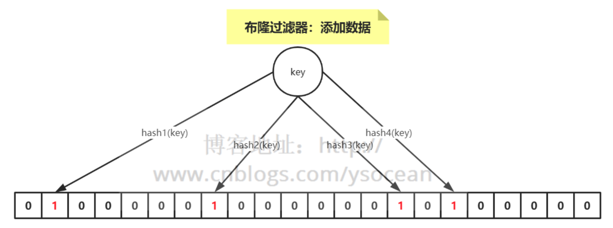

# 布隆过滤器

* [Redis详解（十三）------ Redis布隆过滤器](https://www.cnblogs.com/ysocean/p/12594982.html)
* [Redis 布隆过滤器](https://www.cnblogs.com/happydreamzjl/p/11834277.html)
* [SpringBoot+Redis布隆过滤器防恶意流量击穿缓存的正确姿势](https://blog.csdn.net/lifetragedy/article/details/103945885)
* [Redis 布隆过滤器实战「缓存击穿、雪崩效应」](https://blog.csdn.net/u011277123/article/details/88757861)

## 1. 布隆过滤器使用场景

大数据量进行匹配

## 2. 布隆过滤器简介

一种数据结构，是由一串很长的二进制向量组成，可以将其看成一个二进制数组。既然是二进制，那么里面存放的不是0，就是1，但是初始默认值都是0。

### 2.1 添加数据

* 介绍概念的时候，我们说可以将布隆过滤器看成一个容器，那么如何向布隆过滤器中添加一个数据呢？
* 如下图所示：当要向布隆过滤器中添加一个元素key时，我们通过多个hash函数，算出一个值，然后将这个值所在的方格置为1。
* 比如，下图hash1(key)=1，那么在第2个格子将0变为1（数组是从0开始计数的），hash2(key)=7，那么将第8个格子置位1，依次类推



### 2.2 判断数据是否存在

* 知道了如何向布隆过滤器中添加一个数据，那么新来一个数据，我们如何判断其是否存在于这个布隆过滤器中呢？
* 很简单，我们只需要将这个新的数据通过上面自定义的几个哈希函数，分别算出各个值，然后看其对应的地方是否都是1，如果存在一个不是1的情况，那么我们可以说，该新数据一定不存在于这个布隆过滤器中。
* 反过来说，如果通过哈希函数算出来的值，对应的地方都是1，那么我们能够肯定的得出：这个数据一定存在于这个布隆过滤器中吗？
* 答案是否定的，因为多个不同的数据通过hash函数算出来的结果是会有重复的，所以会存在某个位置是别的数据通过hash函数置为的1。
* 我们可以得到一个结论：布隆过滤器可以判断某个数据一定不存在，但是无法判断一定存在。

### 2.3 布隆过滤器优缺点

* 优点：优点很明显，二进制组成的数组，占用内存极少，并且插入和查询速度都足够快。
* 缺点：随着数据的增加，误判率会增加；还有无法判断数据一定存在；另外还有一个重要缺点，无法删除数据。

## 3. Redis实现布隆过滤器

### 3.1 bitmap

我们知道计算机是以二进制位作为底层存储的基础单位，一个字节等于8位。
比如“big”字符串是由三个字符组成的，这三个字符对应的ASCII码分为是98、105、103，对应的二进制存储如下：

### Redisson

* Redis 实现布隆过滤器的底层就是通过 bitmap 这种数据结构，至于如何实现，这里就不重复造轮子了，介绍业界比较好用的一个客户端工具——Redisson。
* Redisson 是用于在 Java 程序中操作 Redis 的库，利用Redisson 我们可以在程序中轻松地使用 Redis。
* 下面我们就通过 Redisson 来构造布隆过滤器。

```java
import org.redisson.Redisson;
import org.redisson.api.RBloomFilter;
import org.redisson.api.RedissonClient;
import org.redisson.config.Config;

public class RedissonBloomFilter {

    public static void main(String[] args) {
        Config config = new Config();
        config.useSingleServer().setAddress("redis://192.168.14.104:6379");
        config.useSingleServer().setPassword("123");
        //构造Redisson
        RedissonClient redisson = Redisson.create(config);

        RBloomFilter<String> bloomFilter = redisson.getBloomFilter("phoneList");
        //初始化布隆过滤器：预计元素为100000000L,误差率为3%
        bloomFilter.tryInit(100000000L,0.03);
        //将号码10086插入到布隆过滤器中
        bloomFilter.add("10086");

        //判断下面号码是否在布隆过滤器中
        System.out.println(bloomFilter.contains("123456"));//false
        System.out.println(bloomFilter.contains("10086"));//true
    }
}
```
