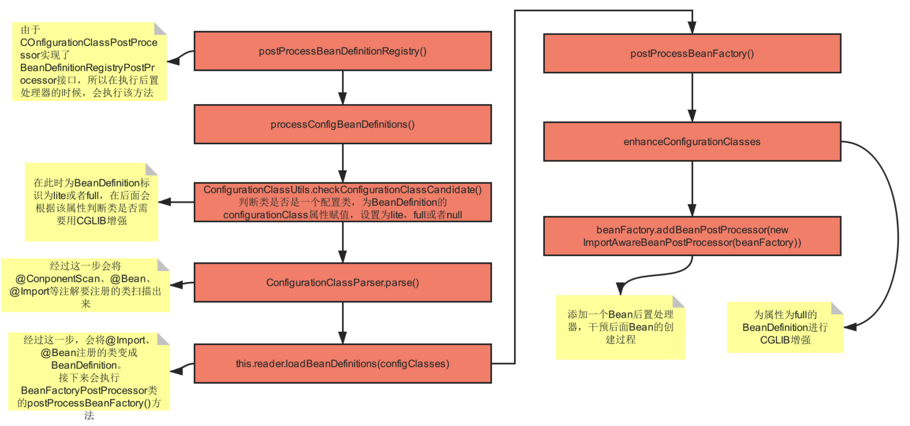

# ConfigurationClassPostProcessor 后置处理器

[ConfigurationClassPostProcessor —— Spring中最！最！最！重要的后置处理器！没有之一！！！](https://blog.csdn.net/qq_34436819/article/details/100944204)

## 1. 问题 疑惑

1. @Configuration注解的作用是什么，Spring是如何解析加了@Configuration注解的类？
2. Spring在什么时候对@ComponentScan、@ComponentScans注解进行了解析？
3. Spring什么时候解析了@Import注解，如何解析的？
4. Spring什么时候解析了@Bean注解？

## 2. 作用

* ConfigurationClassPostProcessor是一个BeanFactory的后置处理器，因此它的主要功能是参与BeanFactory的建造，
在这个类中，会解析加了@Configuration的配置类，还会解析@ComponentScan、@ComponentScans注解扫描的包，以及解析@Import等注解。
* ConfigurationClassPostProcessor 实现了 BeanDefinitionRegistryPostProcessor 接口，而 BeanDefinitionRegistryPostProcessor
接口继承了 BeanFactoryPostProcessor 接口，所以 ConfigurationClassPostProcessor 中需要重写 postProcessBeanDefinitionRegistry() 
方法和 postProcessBeanFactory() 方法。而ConfigurationClassPostProcessor类的作用就是通过这两个方法去实现的。
* 执行流程

## 3. postProcessBeanDefinitionRegistry()

postProcessBeanDefinitionRegistry()方法中调用了processConfigBeanDefinitions()，所以核心逻辑在processConfigBeanDefinition()方法中。

### 3.1 processConfigBeanDefinitions()

ConfigurationClassUtils.checkConfigurationClassCandidate方法

* 如果加了@Configuration，那么对应的BeanDefinition为full;
* 如果加了@Bean,@Component,@ComponentScan,@Import,@ImportResource这些注解，则为lite

### 3.2 parser.parse()

* parse()方法会解析配置类上的注解(ComponentScan扫描出的类，@Import注册的类，以及@Bean方法定义的类)，解析完以后(解析成ConfigurationClass类)，
会将解析出的结果放入到parser的configurationClasses这个属性中(这个属性是个Map)。parse会将@Import注解要注册的类解析为BeanDefinition，
但是不会把解析出来的BeanDefinition放入到BeanDefinitionMap中，真正放入到map中是在这一行代码实现的:
this.reader.loadBeanDefinitions(configClasses)
* 下面先看下parse()的具体代码parser.parse(candidates)， parse()方法需要一个参数，参数candidates是一个集合，集合中的元素个数由我们写的这一行代码决定

### 3.3 doProcessConfigurationClass() 核心方法

1. 处理内部类，如果内部类也是一个配置类(判断一个类是否是一个配置类，通过ConfigurationClassUtils.checkConfigurationClassCandidate()可以判断)。
2. 处理属性资源文件，加了@PropertySource注解。
3. 首先解析出类上的@ComponentScan和@ComponentScans注解，然后根据配置的扫描包路径，利用ASM技术(ASM技术是一种操作字节码的技术，有兴趣的朋友可以去网上了解下)扫描出所有需要交给Spring管理的类，由于扫描出的类中可能也被加了@ComponentScan和@ComponentScans注解，因此需要进行递归解析，直到所有加了这两个注解的类被解析完成。
4. 处理@Import注解。通过@Import注解，有三种方式可以将一个Bean注册到Spring容器中。
5. 处理@ImportResource注解，解析配置文件。
6. 处理加了@Bean注解的方法。
7. 通过processInterfaces()处理接口的默认方法，从JDK8开始，接口中的方法可以有自己的默认实现，因此，如果这个接口中的方法也加了@Bean注解，也需要被解析。(很少用)
8. 解析父类，如果被解析的配置类继承了某个类，那么配置类的父类也会被进行解析doProcessConfigurationClass()(父类是JDK内置的类例外，即全类名以java开头的)。

### 3.4 this.reader.loadBeanDefinitions()

该方法实际上是将通过@Import、@Bean等注解方式注册的类解析成BeanDefinition，然后注册到BeanDefinitionMap中。

## 4. postProcessBeanFactory()方法

该方法是对BeanFactory进行处理，用来干预BeanFactory的创建过程。主要干了两件事，(1)对加了@Configuration注解的类进行CGLIB代理。(2)向Spring中添加一个后置处理器ImportAwareBeanPostProcessor。

### 4.1 CGLIB增强Configuration类

* 利用enhanceConfigurationClasses(beanFactory)方法对Configuration类进行增强，采用CGLIB来创建动态代理
* ConfigurationClassEnhancer.enhance()方法
* ConfigurationClassEnhancer.newEnhancer()方法
* CGLIB创建动态代理是基于继承来是实现的(JDK的动态代理是基于接口实现)，因此enhancer.setSupperclass(configSuperClass)这一行代码，就是为即将产生的代理对象设置父类，同时为产生的代理对象实现EnhancedConfiguration.class接口，实现该接口的目的，是为了该Configuration类在实例化、初始化过程中，执行相关的BeanPostProcessor。
* 例如在执行ImportAwareBeanPostProcessor后置处理器时，postProcessPropertyValues()方法，会对EnhancedConfiguration类进行属性设置，实际就是为EnhancedConfiguration实现类的beanfactory属性赋值

### 4.2 添加ImportAwareBeanPostProcessor后置处理器

* ConfigurationClassPostProcessor类的postProcessBeanFactory()方法在最后会向spring容器中添加一个Bean后置处理器：ImportAwareBeanPostProcessor，
Bean后置处理器最终会在Bean实例化和初始化的过程中执行，参与Bean的创建过程。在上面已经通过源码分析了该后置处理器postProcessPropertyValues()方法，其作用是为
EnhanceConfiguration类的beanFactory属性赋值。
* ImportAwareBeanPostProcessor代码

## 5. 总结

* 本文主要分析了 ConfigurationClassPostProcessor 类的作用，由于该类实现了 BeanFactoryPostProcessor 接口和 BeanDefinitionRegistryPostProcessor 接口，所以会重写 postProcessBeanDefinitionRegistry() 方法和 postProcessBeanFactory() 方法。
* 在postProcessBeanDefinitionRegistry()方法中解析了加了Configuration注解的类，同时解析出 @ComponentScan 和 @ComponentScans 扫描出的Bean，也会解析出加了 @Bean 注解的方法所注册的Bean，以及通过 @Import 注解注册的Bean和 @ImportResource 注解导入的配置文件中配置的Bean。在 postProcessBeanDefinitionRegistry() 方法中，通过源码分析了两个十分重要的方法:ConfigurationClassParser.parse()和this.reader.loadBeanDefinitions()
* 在postProcessBeanFactory()方法中，会利用CGLIB对加了@Configuration注解的类创建动态代理，进行增强。最后还会向spring容器中添加一个Bean后置处理器：ImportAwareBeanPostProcessor
