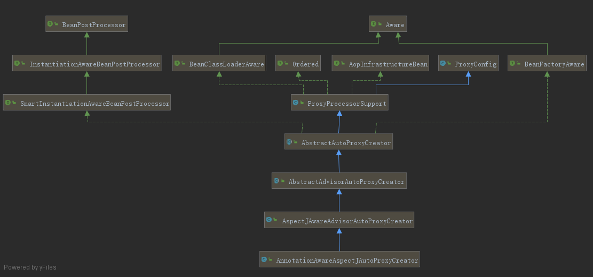

# Spring Aop 源码分析

* [Spring AOP源码解析](https://www.cnblogs.com/toby-xu/p/11444288.html)

## 1. @EnableAspectJAutoProxy注解

```java
@Target(ElementType.TYPE)
@Retention(RetentionPolicy.RUNTIME)
@Documented
@Import(AspectJAutoProxyRegistrar.class)
public @interface EnableAspectJAutoProxy {
    
	boolean proxyTargetClass() default false;
	
	boolean exposeProxy() default false;

}
```

### 1.1 AspectJAutoProxyRegistrar

调用registerBeanDefinitions方法，主要作用就是往Spring容器中注册AnnotationAwareAspectJAutoProxyCreator的Bean的定义信息：

### 1.2 AnnotationAwareAspectJAutoProxyCreator



### 1.3 AnnotationAwareAspectJAutoProxyCreator创建代理

* 首先AnnotationAwareAspectJAutoProxyCreator继承了AbstractAutoProxyCreator实现了BeanFactoryAware接口：
* 所以在创建AnnotationAwareAspectJAutoProxyCreatorBean的过程中初始化方法里面会调用setBeanFactory方法：
* AbstractAutoProxyCreator#postProcessBeforeInstantiation()->AspectJAwareAdvisorAutoProxyCreator#shouldSkip()
* 第一步找事务相关的Advisor：AspectJAwareAdvisorAutoProxyCreator#findCandidateAdvisors()
* 第二步找构建AspectJAdvisors：AnnotationAwareAspectJAutoProxyCreator#buildAspectJAdvisors()
* AnnotationAwareAspectJAutoProxyCreator#initBeanFactory-> new ReflectiveAspectJAdvisorFactory(beanFactory)
* ReflectiveAspectJAdvisorFactory继承ReflectiveAspectJAdvisorFactory

### 1.4 ReflectiveAspectJAdvisorFactory获取切面及内容

* BeanFactoryAspectJAdvisorsBuilder#buildAspectJAdvisors()->getAdvisors()->getAdvisorMethods()获取切面类中所有方法除了@PointCut标注->getAdvisor()
* ->InstantiationModelAwarePointcutAdvisorImpl#构造器->instantiateAdvice()->ReflectiveAspectJAdvisorFactory#getAdvice()
* AbstractAutoProxyCreator#postProcessAfterInitialization()->wrapIfNecessary()->getAdvicesAndAdvisorsForBean()->findEligibleAdvisors()
* findEligibleAdvisors()->AopUtils.findAdvisorsThatCanApply(candidateAdvisors, beanClass)->canApply()
* 跟进到找到真正能用的增强器方法，canApply(pca.getPointcut(), targetClass, hasIntroductions)
* createProxy() 创建代理

## 2. 小结

* 增强处理核心在shouldSkip()
* 代理在createProxy()

