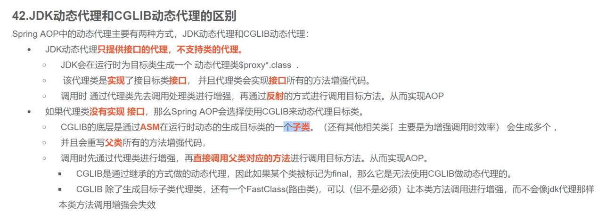

# Spring 2024

## spring aop

### jdk动态代理和cglib动态代理的区别



jdk代理生成快调用满，cglib生成慢调用快

jdk代理后续迭代比cglib快20%

### aop的实现方式

1. spring1.2基于接口
2. spring2.0 xml
3. sping2.0 @AspectJ
4. AspectJ和spring无关 AspectJ编译器单独编译

### aop失效原因

1. 内部调用不走代理导致aop失效

### aop流程

## spring事务

### 事务四大特性

### spring事务实现方式

1. 编程式事务
2. 声明式事务 基于接口，标签，注解

### spring事务传播行为

### spring事务隔离

### spring事务实现原理

[spring事务源码解析](https://www.cnblogs.com/toby-xu/p/11645162.html)

### spring多线程事务能否保证一致性

不能，事务信息存在ThreadLocal中，不能向子线程传播

可以通过编程式事务控制，或者分布式事务二阶段提交解决

### spring事务失效原因

AOP失效原因

捕获异常会失效

## spring事件监听核心原理

原理：观察者模式
事件，发布者，监听者

## spring框架设计模式

简单工厂 BeanFactory，工厂方法 FactoryBean，单例，代理，模板方法，观察者，适配器，装饰器，代理模式，责任链

## spring如何管理mybatis的mapper接口的

扫描，MapperFactoryBean geObject代理

## spring MVC

### 如何解决get post乱码

### spring MVC的控制器是不是单例的 线程安全的 如果是 怎么解决

默认单例的，成员变量读写是有并发问题的

### spring MVC处理流程

dispatcherServlet

### spring mvc处理json数据原理

[SpringMVC流程分析(七)：HttpMessageConverter——SpringMVC中的消息转换](https://article.juejin.cn/post/7265218003863420982)

默认使用jackson处理

使用HttpMessageConverter处理
MappingJackson2HttpMessageConverter 处理json

### spring和spring mvc为什么要父子容器

1. 划分框架边界 单一职责 service和dao交给spring，controller交给spring mvc
2. 子容器可以访问父容器 父容器不能访问子容器
3. 方便子容器切换structs2 父容器不用

### 是否可以把所有spring mvc 的 bean都交给父容器 spring管理

不可以，会404

### 是否可以将父容器的bean交给spring mvc子容器管理

可以，但是aop和事务也要放到子容器，不然会失效

### 如何实现零配置的mvc 实现原理是什么

servlet3.0 使用servlet3.0的api
使用@WebServlet @WebFilter @WebListener 注解 零配置

1.省略web.xml
  a. servlet3.0之后规范中提供了SPI扩展:META-INF/services,javax.servlet.ServletContainerInitializer
  b. SpringMVC通过实现ServletContainerInitializer接口
  c. 动态注册ContextLoaderListener 和DispatcherServlet幷创建子父容器(Application)
2.省略spring.xml和spring-mvc.xml(只是springmvc方式，springboot在自动配置类完成)
  a. 实现一个继承AbstractAnnotationConfigDispatcherServletInitializer的类
  b. 该类就实现了ServetContainerInitializer,它会创建ContextLoaderListener 和DispatcherServlet
  c. 还会创建父子容器， 创建容器时传入父子容器配置类则可以替代spring.xml和spring-mvc.xml

### spring mvc拦截器和过滤器的区别

1. 拦截器不依赖servlet容器,过滤器依赖servlet容器
2. 拦截器只能对 DispatcherServlet 进行拦截,过滤器可以对任意的Servlet进行拦截
3. 拦截器可以访问 DispatcherServlet 上下文 值栈对象，过滤器不可以
4. 拦截器可以访问Bean，过滤器不可以

执行顺序：
controller->拦截器->servlet->过滤器

### springboot特性

1. 内置web服务器
2. 带健康检查
3. 管理第三方依赖版本
4. 内置很多starter自动配置
5. 不需要再用xml配置文件

### spring和springboot关系和区别

### springboot核心注解

### springboot自动配置原理

EnableAutoConfiguration->AutoConfigurationImportSelector 会去spring.factories里面加载
AutoConfigurationImportSelector为@Import修饰

1. 通过@SpringBootConfiguration 引入了@EnableAutoConflguration(负责启动自动配置功能
2. @EnableAutoConfiguration引入了@Import
3. Spring容器启动时:加载loc容器时会解析@Import 注解
4. @Import导入了一个deferredImportSelector(它会使SpringBoot的自动配置类的顺序在最后，这样方便我们扩展和盖?)
5. 然后读取所有的/META-INF/spring.factories文件(SPI)
6. 过滤出所有AutoConfigurationClass类型的类
7. 最后通过@ConditioonXXX排除无效的自动配置类

### springboot jar包可以直接运行

打成jar包之后 生成MANIFEST.MF文件

Start-class：
Main-class

spring-boot-maven-plugin插件

spring-boot-loader 重写类加载器

1. SpringBoot提供了一个插件spring-boot-maven-plugin用于把程序打包,成一个可执行的jar包.。
2. Spring Boot应用打包之后，生成一个Fat jar(jar包中包含jar)，包含了应用依赖的jar包和Spring Boot loader相关的类.
3. java -jar会去找jar中的manifest文件，在那里面找到真正的启动类;
4. Fat jar的启动Main函数是JarLauncher，它负责创建一个LaunchedURLClassLoader来加载boot-lib下面的jar，并以一个新线程启动应用的Main函数。

### springboot启动原理

1. 发布事件
2. 读取环境配置信息
3. 创建容器 SERVLET 或者 REACTIVE
4. prepareContext 配置注册生成BeanDefinition
5. invokeBeanFactoryPostProcessor 解析import注解
6. onRefresh 创建内置tomcat
7. 事件监听器

### springboot内置tomcat的启动原理

1. invokeBeanFactoryPostProcessor 解析tomcat自动配置类
2. ServletWebServerApplicationContext#onRefresh createWebServer方法
3. org.springframework.boot.web.embedded.tomcat.TomcatServletWebServerFactory#getWebServer 启动tomcat
4. DispatcherServletConfiguration 自动配置类 [DispatcherServletConfiguration](https://blog.csdn.net/z69183787/article/details/131438512)

### springboot外部tomcat启动原理

1. SPI机制 对org.springframework.web.SpringServletContainerInitializer进行初始化 

### springboot读取配置原理及加载顺序

1. 事件监听的机制读取的配置文件 ConfigFileApplicationListener
```xml
 <ul>
 <li>file:./config/</li>
 <li>file:./</li>
 <li>classpath:config/</li>
 <li>classpath:</li>
 </ul>
```

### springboot默认日志实现框架是什么 怎么切换成别的

logback slf4j

### springboot扩展

## 微服务

### 微服务架构优缺点


