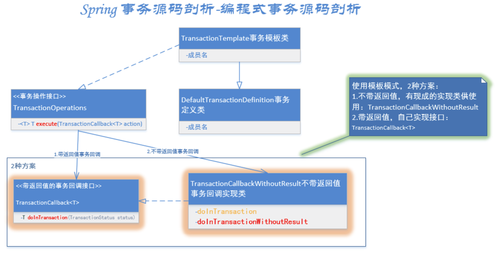
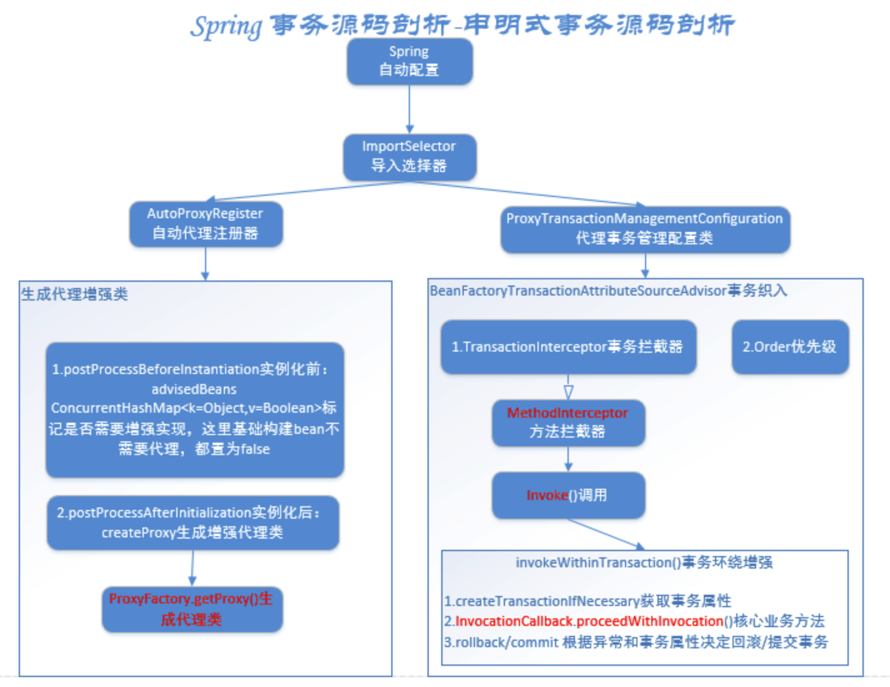
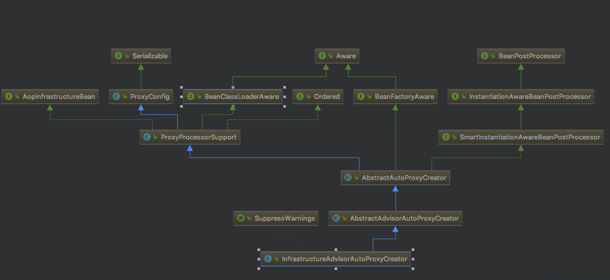
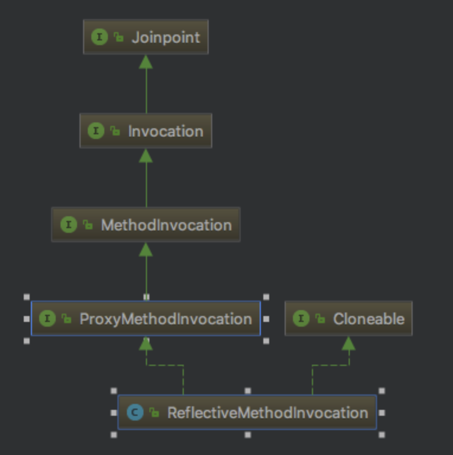
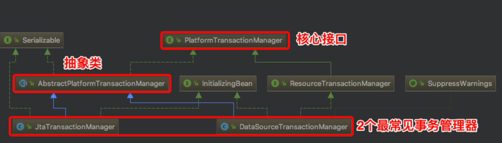
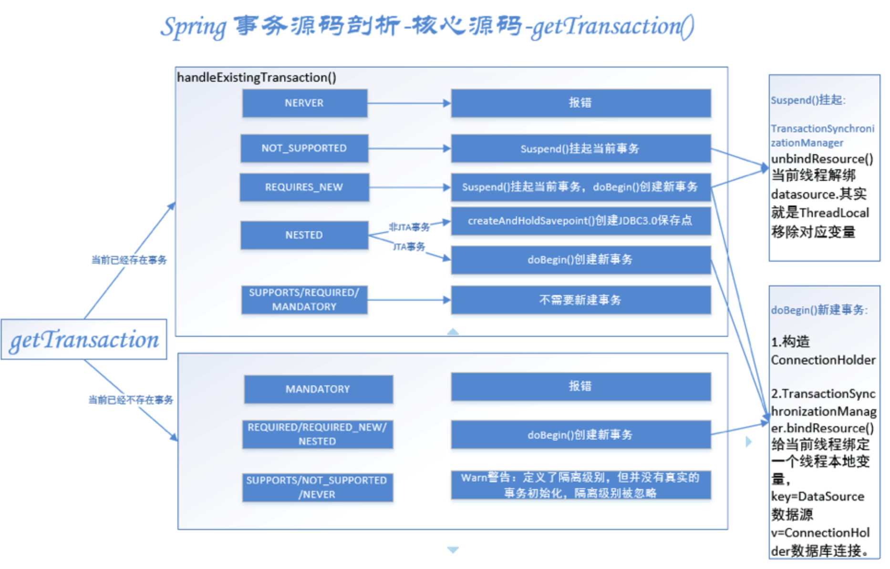
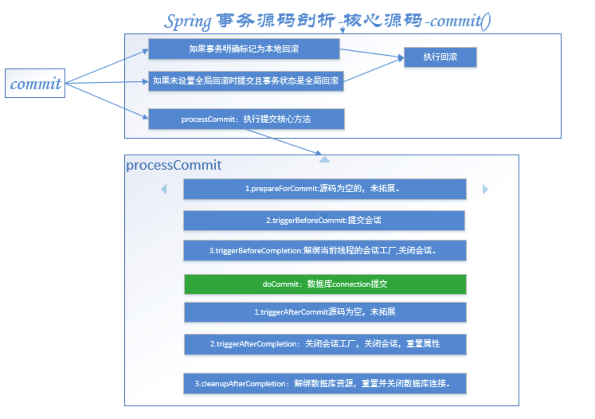
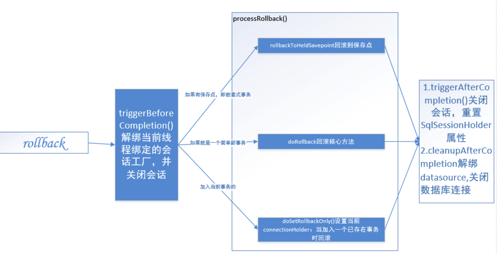

# spring事务源码

* [spring事务源码详解](https://www.cnblogs.com/dennyzhangdd/p/9602673.html)

## 1. 引子

* 编程式事务管理： 编程式事务管理使用TransactionTemplate可实现更细粒度的事务控制。
* 申明式事务管理： 基于Spring AOP实现。其本质是对方法前后进行拦截，然后在目标方法开始之前创建或者加入一个事务，在执行完目标方法之后根据执行情况提交或者回滚事务。

两种事务管理方式底层核心代码一致

## 2. 事务源码

### 2.1 编程式事务TransactionTemplate

* Spring已经给我们提供好了模板类TransactionTemplate，可以很方便的使用，如下图：




* TransactionOperations这个接口用来执行事务的回调方法，InitializingBean这个是典型的spring bean初始化流程中的预留接口，专用用来在bean属性加载完毕时执行的方法
* TransactionTemplate的2个接口的impl方法做了什么

```java_method
@Override
      public void afterPropertiesSet() {
          if (this.transactionManager == null) {
              throw new IllegalArgumentException("Property 'transactionManager' is required");
          }
}
```
* 核心方法execute
```java_method
 @Override
    public <T> T execute(TransactionCallback<T> action) throws TransactionException {　　　　　　　// 内部封装好的事务管理器
        if (this.transactionManager instanceof CallbackPreferringPlatformTransactionManager) {
            return ((CallbackPreferringPlatformTransactionManager) this.transactionManager).execute(this, action);
        }// 需要手动获取事务，执行方法，提交事务的管理器
        else {// 1.获取事务状态
            TransactionStatus status = this.transactionManager.getTransaction(this);
            T result;
            try {// 2.执行业务逻辑
                result = action.doInTransaction(status);
            }
            catch (RuntimeException ex) {
                // 应用运行时异常 -> 回滚
                rollbackOnException(status, ex);
                throw ex;
            }
            catch (Error err) {
                // Error异常 -> 回滚
                rollbackOnException(status, err);
                throw err;
            }
            catch (Throwable ex) {
                // 未知异常 -> 回滚
                rollbackOnException(status, ex);
                throw new UndeclaredThrowableException(ex, "TransactionCallback threw undeclared checked exception");
            }// 3.事务提交
            this.transactionManager.commit(status);
            return result;
        }
    }
```

1. getTransaction()获取事务
2. doInTransaction()执行业务逻辑，这里就是用户自定义的业务代码。如果是没有返回值的，就是doInTransactionWithoutResult()。
3. commit()事务提交：调用AbstractPlatformTransactionManager的commit，rollbackOnException()异常回滚：调用AbstractPlatformTransactionManager的rollback()，事务提交回滚

### 2.2 申明式事务@Transactional

#### 2.2.1 AOP相关概念

* 通知（Advice）:定义了切面(各处业务代码中都需要的逻辑提炼成的一个切面)做什么what+when何时使用。例如：前置通知Before、后置通知After、返回通知After-returning、异常通知After-throwing、环绕通知Around.
* 连接点（Joint point）：程序执行过程中能够插入切面的点，一般有多个。比如调用方式时、抛出异常时。
* 切点（Pointcut）:切点定义了连接点，切点包含多个连接点,即where哪里使用通知.通常指定类+方法 或者 正则表达式来匹配 类和方法名称。
* 切面（Aspect）:切面=通知+切点，即when+where+what何时何地做什么。
* 引入（Introduction）:允许我们向现有的类添加新方法或属性。
* 织入（Weaving）:织入是把切面应用到目标对象并创建新的代理对象的过程。

#### 2.2.2 申明式事务

申明式事务整体调用过程，可以抽出2条线：

1.使用代理模式，生成代理增强类。
2.根据代理事务管理配置类，配置事务的织入，在业务方法前后进行环绕增强，增加一些事务的相关操作。例如获取事务属性、提交事务、回滚事务。



#### 2.2.3 @EnableTransactionManagement

```java
@Target(ElementType.TYPE)
@Retention(RetentionPolicy.RUNTIME)
@Documented
@Import(TransactionManagementConfigurationSelector.class)
public @interface EnableTransactionManagement {

    //proxyTargetClass = false表示是JDK动态代理支持接口代理。true表示是Cglib代理支持子类继承代理。
    boolean proxyTargetClass() default false;

    //事务通知模式(切面织入方式)，默认代理模式（同一个类中方法互相调用拦截器不会生效），可以选择增强型AspectJ
    AdviceMode mode() default AdviceMode.PROXY;

    //连接点上有多个通知时，排序，默认最低。值越大优先级越低。
    int order() default Ordered.LOWEST_PRECEDENCE;

}
```

#### 2.2.4 TransactionManagementConfigurationSelector

TransactionManagementConfigurationSelector继承自AdviceModeImportSelector实现了ImportSelector接口

```java
public class TransactionManagementConfigurationSelector extends AdviceModeImportSelector<EnableTransactionManagement> {
    
    @Override
    protected String[] selectImports(AdviceMode adviceMode) {
        switch (adviceMode) {
            case PROXY:
                return new String[] {AutoProxyRegistrar.class.getName(), ProxyTransactionManagementConfiguration.class.getName()};
            case ASPECTJ:
                return new String[] {TransactionManagementConfigUtils.TRANSACTION_ASPECT_CONFIGURATION_CLASS_NAME};
            default:
                return null;
        }
    }

}
```
* AutoProxyRegistrar：给容器中注册一个 InfrastructureAdvisorAutoProxyCreator 组件；利用后置处理器机制在对象创建以后，包装对象，返回一个代理对象（增强器），代理对象执行方法利用拦截器链进行调用；
* ProxyTransactionManagementConfiguration：就是一个配置类，定义了事务增强器。

##### 1. AutoProxyRegistrar

AutoProxyRegistrar实现了ImportBeanDefinitionRegistrar接口，复写registerBeanDefinitions方法，源码如下：

```java_method
public void registerBeanDefinitions(AnnotationMetadata importingClassMetadata, BeanDefinitionRegistry registry) {
        boolean candidateFound = false;
        Set<String> annoTypes = importingClassMetadata.getAnnotationTypes();
        for (String annoType : annoTypes) {
            AnnotationAttributes candidate = AnnotationConfigUtils.attributesFor(importingClassMetadata, annoType);
            if (candidate == null) {
                continue;
            }
            Object mode = candidate.get("mode");
            Object proxyTargetClass = candidate.get("proxyTargetClass");
            if (mode != null && proxyTargetClass != null && AdviceMode.class == mode.getClass() &&
                    Boolean.class == proxyTargetClass.getClass()) {
                candidateFound = true;
                if (mode == AdviceMode.PROXY) {//代理模式
                    AopConfigUtils.registerAutoProxyCreatorIfNecessary(registry);
                    if ((Boolean) proxyTargetClass) {//如果是CGLOB子类代理模式
                        AopConfigUtils.forceAutoProxyCreatorToUseClassProxying(registry);
                        return;
                    }
                }
            }
        }
        if (!candidateFound) {
            String name = getClass().getSimpleName();
            logger.warn(String.format("%s was imported but no annotations were found " +
                    "having both 'mode' and 'proxyTargetClass' attributes of type " +
                    "AdviceMode and boolean respectively. This means that auto proxy " +
                    "creator registration and configuration may not have occurred as " +
                    "intended, and components may not be proxied as expected. Check to " +
                    "ensure that %s has been @Import'ed on the same class where these " +
                    "annotations are declared; otherwise remove the import of %s " +
                    "altogether.", name, name, name));
        }
    }
```

* 代理模式：AopConfigUtils.registerAutoProxyCreatorIfNecessary(registry);
* 最终调用的是：registerOrEscalateApcAsRequired(InfrastructureAdvisorAutoProxyCreator.class, registry, source);基础构建增强自动代理构造器

```java_method
private static BeanDefinition registerOrEscalateApcAsRequired(Class<?> cls, BeanDefinitionRegistry registry, Object source) {
        Assert.notNull(registry, "BeanDefinitionRegistry must not be null");　　　　　　 //如果当前注册器包含internalAutoProxyCreator
        if (registry.containsBeanDefinition(AUTO_PROXY_CREATOR_BEAN_NAME)) {//org.springframework.aop.config.internalAutoProxyCreator内部自动代理构造器
            BeanDefinition apcDefinition = registry.getBeanDefinition(AUTO_PROXY_CREATOR_BEAN_NAME);
            if (!cls.getName().equals(apcDefinition.getBeanClassName())) {//如果当前类不是internalAutoProxyCreator
                int currentPriority = findPriorityForClass(apcDefinition.getBeanClassName());
                int requiredPriority = findPriorityForClass(cls);
                if (currentPriority < requiredPriority) {//如果下标大于已存在的内部自动代理构造器，index越小，优先级越高,InfrastructureAdvisorAutoProxyCreator index=0,requiredPriority最小，不进入
                    apcDefinition.setBeanClassName(cls.getName());
                }
            }
            return null;//直接返回
        }//如果当前注册器不包含internalAutoProxyCreator，则把当前类作为根定义
        RootBeanDefinition beanDefinition = new RootBeanDefinition(cls);
        beanDefinition.setSource(source);
        beanDefinition.getPropertyValues().add("order", Ordered.HIGHEST_PRECEDENCE);//优先级最高
        beanDefinition.setRole(BeanDefinition.ROLE_INFRASTRUCTURE);
        registry.registerBeanDefinition(AUTO_PROXY_CREATOR_BEAN_NAME, beanDefinition);
        return beanDefinition;
    }
```

##### 2. InfrastructureAdvisorAutoProxyCreator

```java_code
/**
     * Stores the auto proxy creator classes in escalation order.
     */
    private static final List<Class<?>> APC_PRIORITY_LIST = new ArrayList<Class<?>>();

    /**
     * 优先级上升list
     */
    static {
        APC_PRIORITY_LIST.add(InfrastructureAdvisorAutoProxyCreator.class);
        APC_PRIORITY_LIST.add(AspectJAwareAdvisorAutoProxyCreator.class);
        APC_PRIORITY_LIST.add(AnnotationAwareAspectJAutoProxyCreator.class);
    }
```

* 由于InfrastructureAdvisorAutoProxyCreator这个类在list中第一个index=0,requiredPriority最小，不进入，所以没有重置beanClassName，啥都没做，返回null
* 那么何时生成代理
* InfrastructureAdvisorAutoProxyCreator类图如下

* InstantiationAwareBeanPostProcessor接口的postProcessBeforeInstantiation实例化前+BeanPostProcessor接口的postProcessAfterInitialization初始化后
* 走spring动态代理逻辑

##### 3. ProxyTransactionManagementConfiguration

```java
@Configuration
public class ProxyTransactionManagementConfiguration extends AbstractTransactionManagementConfiguration {

    @Bean(name = TransactionManagementConfigUtils.TRANSACTION_ADVISOR_BEAN_NAME)
    @Role(BeanDefinition.ROLE_INFRASTRUCTURE)
    //定义事务增强器
    //核心方法
    public BeanFactoryTransactionAttributeSourceAdvisor transactionAdvisor() {
        BeanFactoryTransactionAttributeSourceAdvisor j = new BeanFactoryTransactionAttributeSourceAdvisor();
        advisor.setTransactionAttributeSource(transactionAttributeSource());
        advisor.setAdvice(transactionInterceptor());
        advisor.setOrder(this.enableTx.<Integer>getNumber("order"));
        return advisor;
    }

    @Bean
    @Role(BeanDefinition.ROLE_INFRASTRUCTURE)//定义基于注解的事务属性资源
    public TransactionAttributeSource transactionAttributeSource() {
        return new AnnotationTransactionAttributeSource();
    }

    @Bean
    @Role(BeanDefinition.ROLE_INFRASTRUCTURE)//定义事务拦截器
    public TransactionInterceptor transactionInterceptor() {
        TransactionInterceptor interceptor = new TransactionInterceptor();
        interceptor.setTransactionAttributeSource(transactionAttributeSource());
        if (this.txManager != null) {
            interceptor.setTransactionManager(this.txManager);
        }
        return interceptor;
    }

}
```

* 核心方法：transactionAdvisor()事务织入
* 定义了一个advisor，设置事务属性、设置事务拦截器TransactionInterceptor、设置顺序。核心就是事务拦截器TransactionInterceptor。
* TransactionInterceptor使用通用的spring事务基础架构实现“声明式事务”，继承自TransactionAspectSupport类（该类包含与Spring的底层事务API的集成），实现了MethodInterceptor接口。spring类图如下：
* 事务拦截器的拦截功能就是依靠实现了MethodInterceptor接口，熟悉spring的同学肯定很熟悉MethodInterceptor了，这个是spring的方法拦截器，主要看invoke方法：
* TransactionInterceptor复写MethodInterceptor接口的invoke方法，并在invoke方法中调用了父类TransactionAspectSupport的invokeWithinTransaction()方法

1.createTransactionIfNecessary():如果有必要，创建事务
2.InvocationCallback的proceedWithInvocation()：InvocationCallback是父类的内部回调接口，子类中实现该接口供父类调用，子类TransactionInterceptor中invocation.proceed()。回调方法执行
3.异常回滚completeTransactionAfterThrowing()

###### createTransactionIfNecessary()

1. getTransaction()，根据事务属性获取事务TransactionStatus，大道归一，都是调用PlatformTransactionManager.getTransaction()
2. prepareTransactionInfo(),构造一个TransactionInfo事务信息对象，绑定当前线程：ThreadLocal<TransactionInfo>。

###### invocation.proceed()回调业务方法

最终实现类是ReflectiveMethodInvocation，类图如下



* ReflectiveMethodInvocation类实现了ProxyMethodInvocation接口，但是ProxyMethodInvocation继承了3层接口...ProxyMethodInvocation->MethodInvocation->Invocation->Joinpoint
* Joinpoint：连接点接口，定义了执行接口：Object proceed() throws Throwable; 执行当前连接点，并跳到拦截器链上的下一个拦截器。
* Invocation：调用接口，继承自Joinpoint，定义了获取参数接口： Object[] getArguments();是一个带参数的、可被拦截器拦截的连接点。
* MethodInvocation：方法调用接口，继承自Invocation，定义了获取方法接口：Method getMethod(); 是一个带参数的可被拦截的连接点方法。
* ProxyMethodInvocation：代理方法调用接口，继承自MethodInvocation，定义了获取代理对象接口：Object getProxy();是一个由代理类执行的方法调用连接点方法。
* ReflectiveMethodInvocation：实现了ProxyMethodInvocation接口，自然就实现了父类接口的的所有接口。获取代理类，获取方法，获取参数，用代理类执行这个方法并且自动跳到下一个连接点。

###### completeTransactionAfterThrowing()

最终调用AbstractPlatformTransactionManager的rollback()，提交事务commitTransactionAfterReturning()最终调用AbstractPlatformTransactionManager的commit()

### 2.3 事务小结

可见不管是编程式事务，还是声明式事务，最终源码都是调用事务管理器的PlatformTransactionManager接口的3个方法：

1. getTransaction
2. commit
3. rollback

## 3. 事务核心源码

* 

PlatformTransactionManager顶级接口定义了最核心的事务管理方法，下面一层是AbstractPlatformTransactionManager抽象类，实现了PlatformTransactionManager接口的方法并定义了一些抽象方法，供子类拓展。最后下面一层是2个经典事务管理器：

1. DataSourceTransactionManager,即JDBC单数据库事务管理器，基于Connection实现，
2. JtaTransactionManager,即多数据库事务管理器（又叫做分布式事务管理器），其实现了JTA规范，使用XA协议进行两阶段提交。

```java
public interface PlatformTransactionManager {
    // 获取事务状态
    TransactionStatus getTransaction(TransactionDefinition definition) throws TransactionException;
    // 事务提交
    void commit(TransactionStatus status) throws TransactionException;
    // 事务回滚
    void rollback(TransactionStatus status) throws TransactionException;
}
```

### 3.1 getTransaction获取事务



1.当前已存在事务：isExistingTransaction()判断是否存在事务，存在事务handleExistingTransaction()根据不同传播机制不同处理
2.当前不存在事务: 不同传播机制不同处理

#### 3.1.1 handleExistingTransaction()

```java_method
private TransactionStatus handleExistingTransaction(
            TransactionDefinition definition, Object transaction, boolean debugEnabled)
            throws TransactionException {
　　　　　// 1.NERVER（不支持当前事务;如果当前事务存在，抛出异常）报错
        if (definition.getPropagationBehavior() == TransactionDefinition.PROPAGATION_NEVER) {
            throw new IllegalTransactionStateException(
                    "Existing transaction found for transaction marked with propagation 'never'");
        }
　　　　  // 2.NOT_SUPPORTED（不支持当前事务，现有同步将被挂起）挂起当前事务
        if (definition.getPropagationBehavior() == TransactionDefinition.PROPAGATION_NOT_SUPPORTED) {
            if (debugEnabled) {
                logger.debug("Suspending current transaction");
            }
            Object suspendedResources = suspend(transaction);
            boolean newSynchronization = (getTransactionSynchronization() == SYNCHRONIZATION_ALWAYS);
            return prepareTransactionStatus(
                    definition, null, false, newSynchronization, debugEnabled, suspendedResources);
        }
　　　　  // 3.REQUIRES_NEW挂起当前事务，创建新事务
        if (definition.getPropagationBehavior() == TransactionDefinition.PROPAGATION_REQUIRES_NEW) {
            if (debugEnabled) {
                logger.debug("Suspending current transaction, creating new transaction with name [" +
                        definition.getName() + "]");
            }// 挂起当前事务
            SuspendedResourcesHolder suspendedResources = suspend(transaction);
            try {// 创建新事务
                boolean newSynchronization = (getTransactionSynchronization() != SYNCHRONIZATION_NEVER);
                DefaultTransactionStatus status = newTransactionStatus(
                        definition, transaction, true, newSynchronization, debugEnabled, suspendedResources);
                doBegin(transaction, definition);
                prepareSynchronization(status, definition);
                return status;
            }
            catch (RuntimeException beginEx) {
                resumeAfterBeginException(transaction, suspendedResources, beginEx);
                throw beginEx;
            }
            catch (Error beginErr) {
                resumeAfterBeginException(transaction, suspendedResources, beginErr);
                throw beginErr;
            }
        }
　　　　 // 4.NESTED嵌套事务
        if (definition.getPropagationBehavior() == TransactionDefinition.PROPAGATION_NESTED) {
            if (!isNestedTransactionAllowed()) {
                throw new NestedTransactionNotSupportedException(
                        "Transaction manager does not allow nested transactions by default - " +
                        "specify 'nestedTransactionAllowed' property with value 'true'");
            }
            if (debugEnabled) {
                logger.debug("Creating nested transaction with name [" + definition.getName() + "]");
            }// 是否支持保存点：非JTA事务走这个分支。AbstractPlatformTransactionManager默认是true，JtaTransactionManager复写了该方法false，DataSourceTransactionmanager没有复写，还是true,
            if (useSavepointForNestedTransaction()) {
                // Usually uses JDBC 3.0 savepoints. Never activates Spring synchronization.
                DefaultTransactionStatus status =
                        prepareTransactionStatus(definition, transaction, false, false, debugEnabled, null);
                status.createAndHoldSavepoint();// 创建保存点
                return status;
            }
            else {
                // JTA事务走这个分支，创建新事务
                boolean newSynchronization = (getTransactionSynchronization() != SYNCHRONIZATION_NEVER);
                DefaultTransactionStatus status = newTransactionStatus(
                        definition, transaction, true, newSynchronization, debugEnabled, null);
                doBegin(transaction, definition);
                prepareSynchronization(status, definition);
                return status;
            }
        }


        if (debugEnabled) {
            logger.debug("Participating in existing transaction");
        }
        if (isValidateExistingTransaction()) {
            if (definition.getIsolationLevel() != TransactionDefinition.ISOLATION_DEFAULT) {
                Integer currentIsolationLevel = TransactionSynchronizationManager.getCurrentTransactionIsolationLevel();
                if (currentIsolationLevel == null || currentIsolationLevel != definition.getIsolationLevel()) {
                    Constants isoConstants = DefaultTransactionDefinition.constants;
                    throw new IllegalTransactionStateException("Participating transaction with definition [" +
                            definition + "] specifies isolation level which is incompatible with existing transaction: " +
                            (currentIsolationLevel != null ?
                                    isoConstants.toCode(currentIsolationLevel, DefaultTransactionDefinition.PREFIX_ISOLATION) :
                                    "(unknown)"));
                }
            }
            if (!definition.isReadOnly()) {
                if (TransactionSynchronizationManager.isCurrentTransactionReadOnly()) {
                    throw new IllegalTransactionStateException("Participating transaction with definition [" +
                            definition + "] is not marked as read-only but existing transaction is");
                }
            }
        }// 到这里PROPAGATION_SUPPORTS 或 PROPAGATION_REQUIRED或PROPAGATION_MANDATORY，存在事务加入事务即可，prepareTransactionStatus第三个参数就是是否需要新事务。false代表不需要新事物
        boolean newSynchronization = (getTransactionSynchronization() != SYNCHRONIZATION_NEVER);
        return prepareTransactionStatus(definition, transaction, false, newSynchronization, debugEnabled, null);
    }
```

* NEVER：不支持当前事务;如果当前事务存在，抛出异常:"Existing transaction found for transaction marked with propagation 'never'"
* NOT_SUPPORTED：不支持当前事务，现有同步将被挂起:suspend()
* REQUIRES_NEW挂起当前事务，创建新事务:
  - suspend()
  - doBegin()
* NESTED嵌套事务
  - 非JTA事务：createAndHoldSavepoint()创建JDBC3.0保存点，不需要同步
  - JTA事务：开启新事务，doBegin()+prepareSynchronization()需要同步

这里有几个核心方法：挂起当前事务suspend()、开启新事务doBegin()。

#### 3.1.2 suspend()

```java_method
protected final SuspendedResourcesHolder suspend(Object transaction) throws TransactionException {
        if (TransactionSynchronizationManager.isSynchronizationActive()) {// 1.当前存在同步，
            List<TransactionSynchronization> suspendedSynchronizations = doSuspendSynchronization();
            try {
                Object suspendedResources = null;
                if (transaction != null) {// 事务不为空，挂起事务
                    suspendedResources = doSuspend(transaction);
                }// 解除绑定当前事务各种属性：名称、只读、隔离级别、是否是真实的事务.
                String name = TransactionSynchronizationManager.getCurrentTransactionName();
                TransactionSynchronizationManager.setCurrentTransactionName(null);
                boolean readOnly = TransactionSynchronizationManager.isCurrentTransactionReadOnly();
                TransactionSynchronizationManager.setCurrentTransactionReadOnly(false);
                Integer isolationLevel = TransactionSynchronizationManager.getCurrentTransactionIsolationLevel();
                TransactionSynchronizationManager.setCurrentTransactionIsolationLevel(null);
                boolean wasActive = TransactionSynchronizationManager.isActualTransactionActive();
                TransactionSynchronizationManager.setActualTransactionActive(false);
                return new SuspendedResourcesHolder(
                        suspendedResources, suspendedSynchronizations, name, readOnly, isolationLevel, wasActive);
            }
            catch (RuntimeException ex) {
                // doSuspend failed - original transaction is still active...
                doResumeSynchronization(suspendedSynchronizations);
                throw ex;
            }
            catch (Error err) {
                // doSuspend failed - original transaction is still active...
                doResumeSynchronization(suspendedSynchronizations);
                throw err;
            }
        }// 2.没有同步但，事务不为空，挂起事务
        else if (transaction != null) {
            // Transaction active but no synchronization active.
            Object suspendedResources = doSuspend(transaction);
            return new SuspendedResourcesHolder(suspendedResources);
        }// 2.没有同步但，事务为空，什么都不用做
        else {
            // Neither transaction nor synchronization active.
            return null;
        }
    }
```
* doSuspend(),挂起事务，AbstractPlatformTransactionManager抽象类doSuspend()会报错：不支持挂起，如果具体事务执行器支持就复写doSuspend()，DataSourceTransactionManager实现如下：
```java_method
    protected Object doSuspend(Object transaction) {
        DataSourceTransactionObject txObject = (DataSourceTransactionObject) transaction;
        txObject.setConnectionHolder(null);
        return TransactionSynchronizationManager.unbindResource(this.dataSource);
    }
```

挂起DataSourceTransactionManager事务的核心操作就是：

* 把当前事务的connectionHolder数据库连接持有者清空。
* 当前线程解绑datasource.其实就是ThreadLocal移除对应变量（TransactionSynchronizationManager类中定义的private static final ThreadLocal<Map<Object, Object>> resources = new NamedThreadLocal<Map<Object, Object>>("Transactional resources");）

#### 3.1.3 doBegin()

```java_method
@Override
    protected void doBegin(Object transaction, TransactionDefinition definition) {
        DataSourceTransactionObject txObject = (DataSourceTransactionObject) transaction;
        Connection con = null;

        try {// 如果事务还没有connection或者connection在事务同步状态，重置新的connectionHolder
            if (!txObject.hasConnectionHolder() ||
                    txObject.getConnectionHolder().isSynchronizedWithTransaction()) {
                Connection newCon = this.dataSource.getConnection();
                if (logger.isDebugEnabled()) {
                    logger.debug("Acquired Connection [" + newCon + "] for JDBC transaction");
                }// 重置新的connectionHolder
                txObject.setConnectionHolder(new ConnectionHolder(newCon), true);
            }
　　　　　　　//设置新的连接为事务同步中
            txObject.getConnectionHolder().setSynchronizedWithTransaction(true);
            con = txObject.getConnectionHolder().getConnection();
　　　　     //conn设置事务隔离级别,只读
            Integer previousIsolationLevel = DataSourceUtils.prepareConnectionForTransaction(con, definition);
            txObject.setPreviousIsolationLevel(previousIsolationLevel);//DataSourceTransactionObject设置事务隔离级别

            // 如果是自动提交切换到手动提交
            // so we don't want to do it unnecessarily (for example if we've explicitly
            // configured the connection pool to set it already).
            if (con.getAutoCommit()) {
                txObject.setMustRestoreAutoCommit(true);
                if (logger.isDebugEnabled()) {
                    logger.debug("Switching JDBC Connection [" + con + "] to manual commit");
                }
                con.setAutoCommit(false);
            }
　　　　　　　// 如果只读，执行sql设置事务只读
            prepareTransactionalConnection(con, definition);
            txObject.getConnectionHolder().setTransactionActive(true);// 设置connection持有者的事务开启状态

            int timeout = determineTimeout(definition);
            if (timeout != TransactionDefinition.TIMEOUT_DEFAULT) {
                txObject.getConnectionHolder().setTimeoutInSeconds(timeout);// 设置超时秒数
            }

            // 绑定connection持有者到当前线程
            if (txObject.isNewConnectionHolder()) {
                TransactionSynchronizationManager.bindResource(getDataSource(), txObject.getConnectionHolder());
            }
        }

        catch (Throwable ex) {
            if (txObject.isNewConnectionHolder()) {
                DataSourceUtils.releaseConnection(con, this.dataSource);
                txObject.setConnectionHolder(null, false);
            }
            throw new CannotCreateTransactionException("Could not open JDBC Connection for transaction", ex);
        }
    }
```

1. DataSourceTransactionObject“数据源事务对象”，设置ConnectionHolder，再给ConnectionHolder设置各种属性：自动提交、超时、事务开启、隔离级别。
2. 给当前线程绑定一个线程本地变量，key=DataSource数据源  v=ConnectionHolder数据库连接

#### 3.1.4 commit提交事务

##### 1. 讲解源码之前先看一下资源管理类

* SqlSessionSynchronization是SqlSessionUtils的一个内部类，继承自TransactionSynchronizationAdapter抽象类，实现了事务同步接口TransactionSynchronization。
* TransactionSynchronization接口定义了事务操作时的对应资源的（JDBC事务那么就是SqlSessionSynchronization）管理方法

##### 2. AbstractPlatformTransactionManager#commit提交事务



1. 如果事务明确标记为本地回滚，-》执行回滚
2. 如果不需要全局回滚时提交 且 全局回滚-》执行回滚
3. 提交事务，核心方法processCommit()

##### 3. AbstractPlatformTransactionManager#processCommit

commit事务时，有6个核心操作，分别是3个前置操作，3个后置操作
* prepareForCommit(status);源码是空的，没有拓展目前。
* triggerBeforeCommit(status); 提交前触发操作
* triggerBeforeCompletion(status);完成前触发操作，如果是jdbc事务，那么最终就是，
SqlSessionUtils.beforeCompletion->TransactionSynchronizationManager.unbindResource(sessionFactory); 解绑当前线程的会话工厂
this.holder.getSqlSession().close();关闭会话。(源码由于是spring管理实务，最终不会执行事务close操作，例如是DefaultSqlSession，也会执行各种清除收尾操作)
* triggerAfterCommit(status);提交事务后触发操作。TransactionSynchronizationUtils.triggerAfterCommit();->TransactionSynchronizationUtils.invokeAfterCommit
* triggerAfterCompletion(status, TransactionSynchronization.STATUS_COMMITTED); 
   TransactionSynchronizationUtils.TransactionSynchronizationUtils.invokeAfterCompletion
* cleanupAfterCompletion(status)
  - 设置事务状态为已完成。
  - 如果是新的事务同步，解绑当前线程绑定的数据库资源，重置数据库连接
  - 如果存在挂起的事务（嵌套事务），唤醒挂起的老事务的各种资源：数据库资源、同步器。

#### 3.1.5 AbstractPlatformTransactionManager#rollback回滚事务



* rollback->processRollback()->doRollback()

## 4. 时序图


