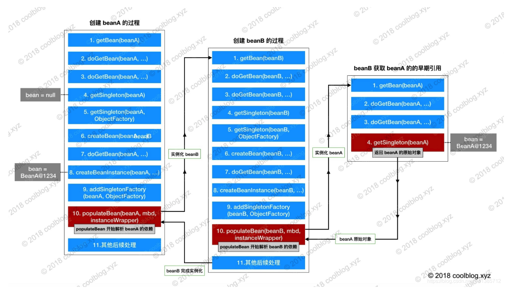

# spring解决循环依赖

[三级缓存解决循环依赖](https://www.cnblogs.com/longy2012/articles/12834762.html)

## 单例模式

只有单例模式并且是属性注入的方式可以解决循环依赖

## AbstractAutowireCapableBeanFactory#doCreateBean#populateBean

populateBean方法中使用的递归解决循环依赖，A类引用了B类，在populateBean方法中A发现自己引用了B，会进行递归创建B

## 三级缓存解决循环依赖

```java_holder_method_tree
/** Cache of singleton objects: bean name --> bean instance */
	/**
	 * 初始化之后的Bean实例存储在这里
	 */
	private final Map<String, Object> singletonObjects = new ConcurrentHashMap<>(256);

	/**
	 * Cache of singleton factories: bean name --> ObjectFactory
	 */
	private final Map<String, ObjectFactory<?>> singletonFactories = new HashMap<>(16);

	/**
	 * Cache of early singleton objects: bean name --> bean instance
	 */
	private final Map<String, Object> earlySingletonObjects = new HashMap<>(16);

	/**
	 * Set of registered singletons, containing the bean names in registration order
	 */
	private final Set<String> registeredSingletons = new LinkedHashSet<>(256);

	/**
	 * Names of beans that are currently in creation
	 * 正在创建singletons bean集合
     * 这个缓存也十分重要：它表示bean创建过程中都会在里面呆着~
     * 它在Bean开始创建时放值，创建完成时会将其移出~
	 */
	private final Set<String> singletonsCurrentlyInCreation = Collections.newSetFromMap(new ConcurrentHashMap<>(16));

	/**
	 * Names of beans currently excluded from in creation checks
	 */
	private final Set<String> inCreationCheckExclusions = Collections.newSetFromMap(new ConcurrentHashMap<>(16));
```

主要用的的缓存为:
* singletonObjects 一级缓存:初始化之后的Bean实例存储在这里 getSingleton(String beanName, ObjectFactory<?> singletonFactory)->addSingleton
* singletonFactories 三级缓存: AbstractAutowireCapableBeanFactory#doCreateBean->addSingletonFactory 添加条件 单例 && 允许循环依赖 && 当前bean正在创建中
* earlySingletonObjects 二级缓存: 发现Bean当前为isSingletonCurrentlyInCreation 将 Bean放入earlySingletonObjects二级缓存并清空一级缓存
* registeredSingletons
* singletonsCurrentlyInCreation:正在创建singletons bean集合 doGetBean->DefaultSingletonBeanRegistry#getSingleton->beforeSingletonCreation()
* inCreationCheckExclusions

## 流程




* 先从一级缓存singletonObjects中去获取。（如果获取到就直接return）
* 如果获取不到或者对象正在创建中（isSingletonCurrentlyInCreation()），那就再从二级缓存earlySingletonObjects中获取。（如果获取到就直接return）
* 如果还是获取不到，且允许singletonFactories（allowEarlyReference=true）通过getObject()获取。就从三级缓存singletonFactory.getObject()获取。
（如果获取到了就从singletonFactories中移除，并且放进earlySingletonObjects。其实也就是从三级缓存移动（是剪切、不是复制哦~）到了二级缓存

## 流程

创建bean-A -> 将A放入正在创建过程中singletonsCurrentlyInCreation-> 满足三个条件放入singletonFactories
-> populateBean填充属性发现依赖B -> 创建B发现引用A A已经实例化 B先创建成功 getSingleton(String beanName, ObjectFactory<?> singletonFactory)这个方法中将B创建成功-> B成功之后继续创建A

## 总结

1. 使用context.getBean(A.class)，旨在获取容器内的单例A(若A不存在，就会走A这个Bean的创建流程)，显然初次获取A是不存在的，因此走A的创建之路~
2. 实例化A（注意此处仅仅是实例化），并将它放进缓存（此时A已经实例化完成，已经可以被引用了）
3. 初始化A：@Autowired依赖注入B（此时需要去容器内获取B）
4. 为了完成依赖注入B，会通过getBean(B)去容器内找B。但此时B在容器内不存在，就走向B的创建之路~
5. 实例化B，并将其放入缓存。（此时B也能够被引用了）
6. 初始化B，@Autowired依赖注入A（此时需要去容器内获取A）
7. 此处重要：初始化B时会调用getBean(A)去容器内找到A，上面我们已经说过了此时候因为A已经实例化完成了并且放进了缓存里，所以这个时候去看缓存里是已经存在A的引用了的，所以getBean(A)能够正常返回
8. B初始化成功（此时已经注入A成功了，已成功持有A的引用了），return（注意此处return相当于是返回最上面的getBean(B)这句代码，回到了初始化A的流程中~）。
9. 因为B实例已经成功返回了，因此最终A也初始化成功
10. 到此，B持有的已经是初始化完成的A，A持有的也是初始化完成的B