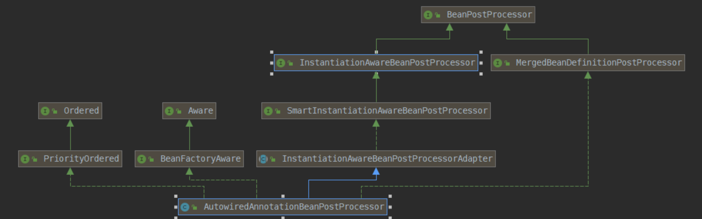

# spring开天辟地的processor

## 1. AnnotationConfigApplicationContext容器启动为例

* AnnotationConfigApplicationContext()构造方法->
* AnnotatedBeanDefinitionReader(BeanDefinitionRegistry registry)->AnnotatedBeanDefinitionReader(BeanDefinitionRegistry registry, Environment environment)->
* AnnotationConfigUtils.registerAnnotationConfigProcessors(this.registry)->registerAnnotationConfigProcessors(registry, null)

```java_method
public static Set<BeanDefinitionHolder> registerAnnotationConfigProcessors(
			BeanDefinitionRegistry registry, @Nullable Object source) {

		DefaultListableBeanFactory beanFactory = unwrapDefaultListableBeanFactory(registry);
		if (beanFactory != null) {
			if (!(beanFactory.getDependencyComparator() instanceof AnnotationAwareOrderComparator)) {
				beanFactory.setDependencyComparator(AnnotationAwareOrderComparator.INSTANCE);
			}
			if (!(beanFactory.getAutowireCandidateResolver() instanceof ContextAnnotationAutowireCandidateResolver)) {
				beanFactory.setAutowireCandidateResolver(new ContextAnnotationAutowireCandidateResolver());
			}
		}

		Set<BeanDefinitionHolder> beanDefs = new LinkedHashSet<>(8);

		if (!registry.containsBeanDefinition(CONFIGURATION_ANNOTATION_PROCESSOR_BEAN_NAME)) {
			RootBeanDefinition def = new RootBeanDefinition(ConfigurationClassPostProcessor.class);
			def.setSource(source);
			beanDefs.add(registerPostProcessor(registry, def, CONFIGURATION_ANNOTATION_PROCESSOR_BEAN_NAME));
		}

		if (!registry.containsBeanDefinition(AUTOWIRED_ANNOTATION_PROCESSOR_BEAN_NAME)) {
			RootBeanDefinition def = new RootBeanDefinition(AutowiredAnnotationBeanPostProcessor.class);
			def.setSource(source);
			beanDefs.add(registerPostProcessor(registry, def, AUTOWIRED_ANNOTATION_PROCESSOR_BEAN_NAME));
		}

		if (!registry.containsBeanDefinition(REQUIRED_ANNOTATION_PROCESSOR_BEAN_NAME)) {
			RootBeanDefinition def = new RootBeanDefinition(RequiredAnnotationBeanPostProcessor.class);
			def.setSource(source);
			beanDefs.add(registerPostProcessor(registry, def, REQUIRED_ANNOTATION_PROCESSOR_BEAN_NAME));
		}

		// Check for JSR-250 support, and if present add the CommonAnnotationBeanPostProcessor.
		if (jsr250Present && !registry.containsBeanDefinition(COMMON_ANNOTATION_PROCESSOR_BEAN_NAME)) {
			RootBeanDefinition def = new RootBeanDefinition(CommonAnnotationBeanPostProcessor.class);
			def.setSource(source);
			beanDefs.add(registerPostProcessor(registry, def, COMMON_ANNOTATION_PROCESSOR_BEAN_NAME));
		}

		// Check for JPA support, and if present add the PersistenceAnnotationBeanPostProcessor.
		if (jpaPresent && !registry.containsBeanDefinition(PERSISTENCE_ANNOTATION_PROCESSOR_BEAN_NAME)) {
			RootBeanDefinition def = new RootBeanDefinition();
			try {
				def.setBeanClass(ClassUtils.forName(PERSISTENCE_ANNOTATION_PROCESSOR_CLASS_NAME,
						AnnotationConfigUtils.class.getClassLoader()));
			}
			catch (ClassNotFoundException ex) {
				throw new IllegalStateException(
						"Cannot load optional framework class: " + PERSISTENCE_ANNOTATION_PROCESSOR_CLASS_NAME, ex);
			}
			def.setSource(source);
			beanDefs.add(registerPostProcessor(registry, def, PERSISTENCE_ANNOTATION_PROCESSOR_BEAN_NAME));
		}

		if (!registry.containsBeanDefinition(EVENT_LISTENER_PROCESSOR_BEAN_NAME)) {
			RootBeanDefinition def = new RootBeanDefinition(EventListenerMethodProcessor.class);
			def.setSource(source);
			beanDefs.add(registerPostProcessor(registry, def, EVENT_LISTENER_PROCESSOR_BEAN_NAME));
		}

		if (!registry.containsBeanDefinition(EVENT_LISTENER_FACTORY_BEAN_NAME)) {
			RootBeanDefinition def = new RootBeanDefinition(DefaultEventListenerFactory.class);
			def.setSource(source);
			beanDefs.add(registerPostProcessor(registry, def, EVENT_LISTENER_FACTORY_BEAN_NAME));
		}

		return beanDefs;
	}
```

### 2. AutowiredAnnotationBeanPostProcessor

* AutowiredAnnotationBeanPostProcessor， AutowiredAnnotationBeanPostProcessor 完成了 
  Spring基本的属性注入功能(@Autowired、@Value 、@Inject 注解功能)。下面我们来详细介绍



* 可以看到 AutowiredAnnotationBeanPostProcessor 继承InstantiationAwareBeanPostProcessorAdapter类、 
  实现 MergedBeanDefinitionPostProcessor、PriorityOrdered、BeanFactoryAware 接口。 
  - 继承InstantiationAwareBeanPostProcessorAdapter、实现 MergedBeanDefinitionPostProcessor 是为了根据后处理器的调用时机来完成一些功能。
  - 实现 PriorityOrdered 接口是为了标注自身优先注入。
  - 实现 BeanFactoryAware 是为了拿到 BeanFactory。
  
#### 2.1 AutowiredAnnotationBeanPostProcessor()构造器

在 AutowiredAnnotationBeanPostProcessor初始化的时， autowiredAnnotationTypes 中添加了三个注解@Autowired、@Value、 和通过反射得到的 javax.inject.Inject。这三个注解也就是本类负责解析的三个注解了(@Inject 并不一定能加载到，看用户是否引入相应的包)

#### 2.2 determineCandidateConstructors()

determineCandidateConstructors 方法是 InstantiationAwareBeanPostProcessorAdapter 接口中的方法。其作用是从 注入bean的所有构造函数中过滤出可以作为构造注入的构造函数列表。

##### 2.2.1 determineCandidateConstructors()调用链

AbstractAutowireCapableBeanFactory#createBeanInstance->AbstractAutowireCapableBeanFactory#determineConstructorsFromBeanPostProcessors->AutowiredAnnotationBeanPostProcessor#determineCandidateConstructors

* 解析@Lookup 注解的方法，保存到 RootBeanDefinition 中
* 从缓存中获取筛选好的构造函数列表，若有直接返回，没有则进行下一步
* 通过反射获取bean 的所有构造函数，并进行构造函数遍历。筛选每个构造函数是否被 @Autowired、@Inject 注解修饰。
* 当前构造函数没有被修饰，则判断当前bean是否 是 Cglib动态代理类，如果是，则获取原始类的构造函数，再判断 构造函数是否被 @Autowired、@Inject 注解修饰。
* 如果第三步或者第四步成功，则根据如下规则筛选
  - 如果有一个必须注入的构造函数(@Autowired(required =true) 或者 @Inject )，则不允许有其他候选构造函数出现。有且只能筛选出一个必须注入的构造函数
  - 如果不存在必须注入的构造含函数 （@Autowired(required =false) 或者 @Inject) ，则允许多个候选注入构造函数出现（@Autowired(required = false) 修饰的构造函数）。并且将这个几个候选构造函数返回
  - 如果bean有且只有一个构造函数，即使没有被注解修饰，也会调用该构造函数作为bean创建的构造函使用
  - 上面三种情况都不满足，就按照指定的规则来进行判断返回候选列表(其实是我没看懂else if 后面的逻辑 )

##### 2.2.2 postProcessProperties & postProcessPropertyValues

在这两个方法中完成了@Autowired、@Inject、 @Value 注解的解析。

在调用 postProcessProperties 时正是完成Bean 属性注入的时候，详情请看 Spring源码分析四：bean的属性注入 - populateBean。这里不多讲。

在postProcessProperties 方法中完成了Bean 中@Autowired、@Inject、 @Value 注解的解析并注入的功能。

##### 2.2.3 findAutowiringMetadata

findAutowiringMetadata完成了对需要注入属性的筛选工作

##### 2.2.4 InjectionMetadata#inject

筛选出需要注入的元素，则开始进行注入，这里可以看到，inject 的实现很简单，遍历所有元素，调用元素的 inject 方法。不过这里就知道上面针对属性和方法，
保存的类型分别是 AutowiredFieldElement、AutowiredMethodElement。所以属性调用的是AutowiredFieldElement.inject， 方法调用的是
AutowiredMethodElement.inject

##### 2.2.5 AutowiredAnnotationBeanPostProcessor.AutowiredFieldElement#inject

反射赋值

##### 2.2.6 AutowiredAnnotationBeanPostProcessor.AutowiredMethodElement#inject

反射调用方法