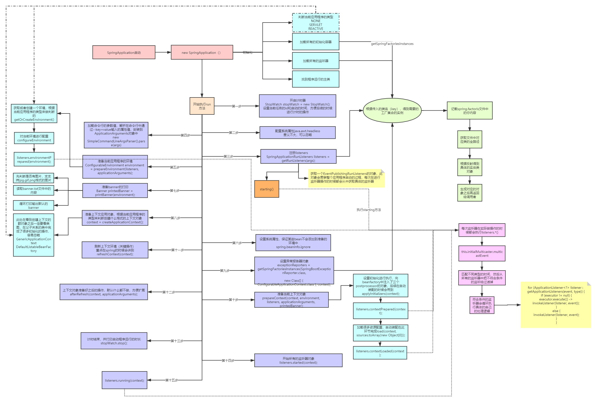

# springboot源码解析

* [SpringBoot 2.2.2 源码详解(一)：启动过程](https://blog.csdn.net/qq_43186095/article/details/103840365)
* [SpringBoot2 | SpringBoot启动流程源码分析（一）](https://blog.csdn.net/woshilijiuyi/article/details/82219585)

## 1. 启动过程

## 2. 零配置tomcat

使用java spi机制 对 ServletContainerInitializer进行默认实现
实现类为 SpringServletContainerInitializer
@HandlesTypes注解 找接口的实现 不找配置的类本身

