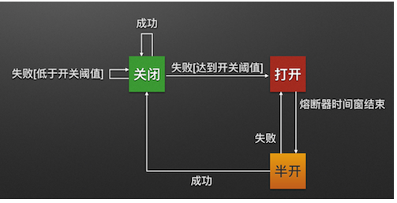

# Hystrix源码分析

https://www.bilibili.com/video/BV1wQ4y1f7hw

https://blog.csdn.net/allenchan_/article/details/126508680

## 降级

* 降级与熔断紧密相关，熔断后业务如何表现，约定一个快速失败的 Fallback，即为服务降级

## 熔断

https://www.cnblogs.com/dalianpai/p/12273618.html

OPEN HALF_OPEN CLOSE 

* 当我的应用无法提供服务时，我要对上游请求熔断，避免上游把我压垮
* 当我的下游依赖成功率过低时，我要对下游请求熔断，避免下游把我拖垮

## 请求合并

[请求合并的使用](https://www.cnblogs.com/hellxz/p/9071163.html)

将自定义时间范围内多个单个请求合并成批量请求

### 隔离策略

[微服务组件之Hystrix实现线程池隔离和信号量隔离](https://blog.csdn.net/qq_39826207/article/details/130038440)

## 线程池隔离

每一个请求都可以设置一个线程池

在一个微服务中，所有的接口如果都是运行在同一个线程池里面，那么如果其中某一个接口出现大量的请求，并且这个接口又没办法处理过来，
这个时候服务就可能会出现资源耗尽的情况，从而导致整个服务崩溃。所以，Hystrix为了解决这个问题，提出了线程池隔离的方案，
将不同的接口放到不同的线程池里面进行管理，并且不同的线程池互不干扰，这样即使其中一个线程池发生故障，也不会影响其他的线程池，
也就降低了服务崩溃的可能性。

线程池隔离虽然解决了服务崩溃的问题，但是同时也带来了一个问题，那就是线程的创建和销毁是需要消耗系统资源的，如果采用线程池隔离，
当这个微服务的请求越来越大，对应的线程也就会创建的越来越多，这就会导致线程的切换非常频繁，从而也就降低了系统的一个性能。
线程池隔离适用于隔离实例较少的场景里面。

## 信号量隔离

采用线程池隔离，可能会导致线程过多而降低系统的性能，所以为了解决这个问题，Hystrix又提出了一个信号量隔离。信号量隔离是采用同步阻塞等待的思想，
它通过设置一个信号量，这个信号量用于表示可以同时访问的最大请求数量，当系统中到达的请求数量超过这个信号量之后，超出的请求就会处于阻塞状态，
或者直接采用快速失败机制，返回一个错误提示。

