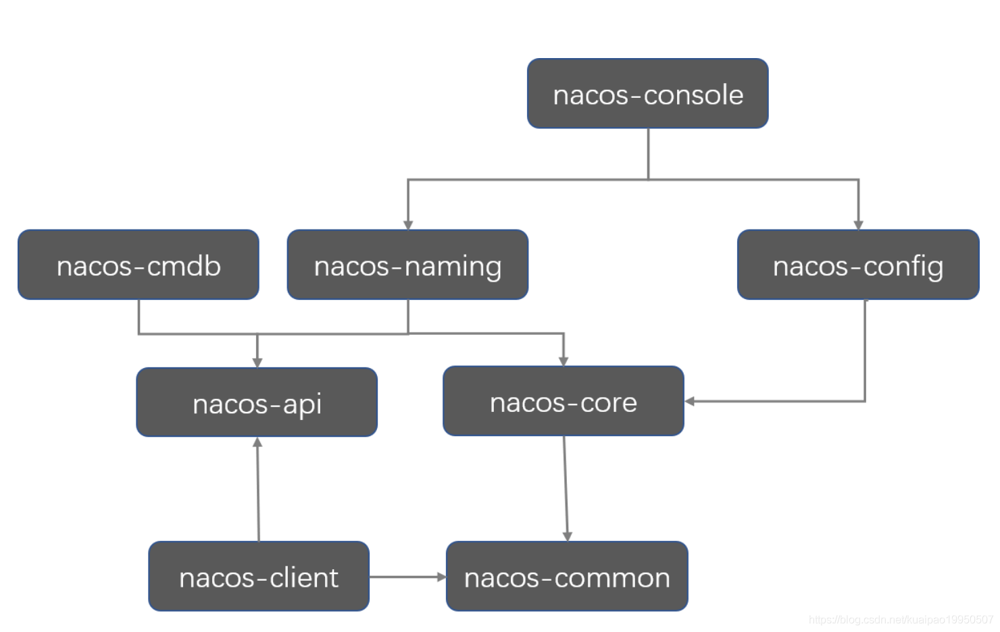

# Nacos源码

* [Nacos源码环境搭建和源码流程图](https://blog.csdn.net/weixin_42437633/article/details/105336354)
* [Nacos服务注册源码分析](https://blog.csdn.net/lizc_lizc/article/details/106269351)

## 1. nacos项目结构

1. address ：地址服务相关
2. api ： 这个里面，主要是把naming和config的api进行了抽取，从结构上看更清晰一些，api的具体实现，都还在client模块里面
3. client： 这个里面放的是Nacos客户端的代码，服务发现和配置管理2个功能的客户端
4. cmdb：Nacos近期发布了0.7.0版本，该版本支持对接第三方CMDB获取CMDB数据、使用Selector机制来配置服务的路由类型、支持单机模式使用MySQL数据库、上线Node.js客户端，并修复了一些bug
5. common：共用工具类
6. config： Nacos配置中心的实现
7. console: Nacos 控制台相关实现
8. core： 属性加载，初始化，监听器相关
9. distribution：发布相关
10. naming：Nacos的核心功能，动态服务发现



启动类在nacos-console,启动方式如下

## 2. nacos源码build

* maven命令build
```mvn
mvn -Prelease-nacos -Dmaven.test.skip=true -Drat.skip=true clean install -U
```
* 启动Nacos.java前增加jvm参数-Dnacos.standalone=true -Dnacos.home=D:\xxxxx\nacos\distribution