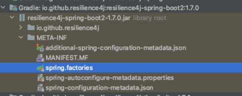
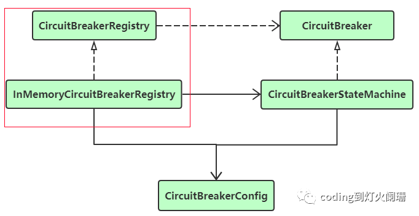
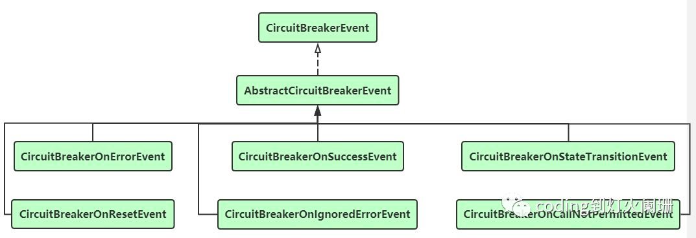
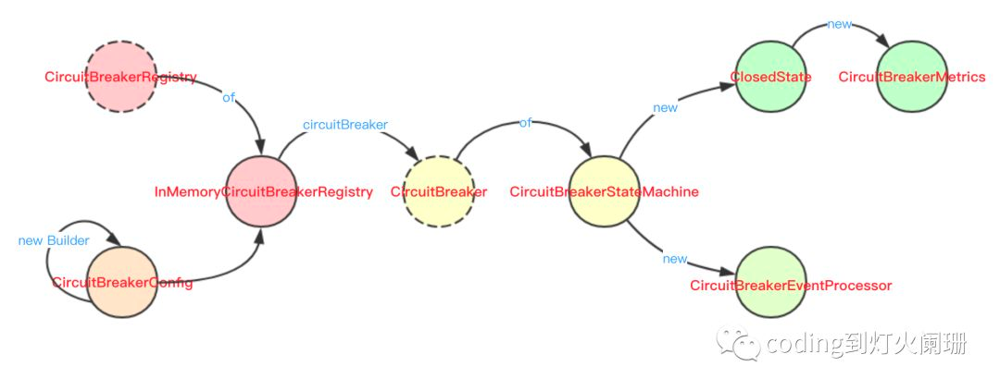
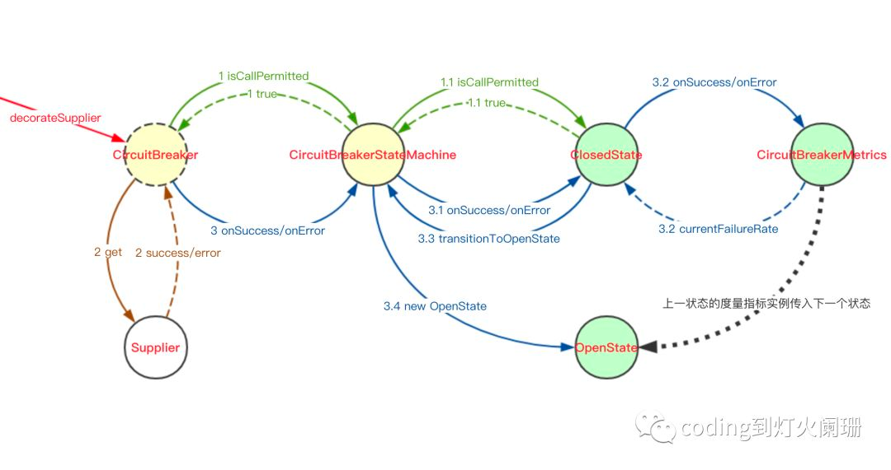
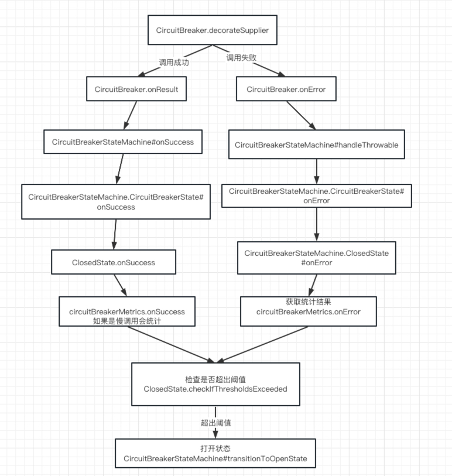
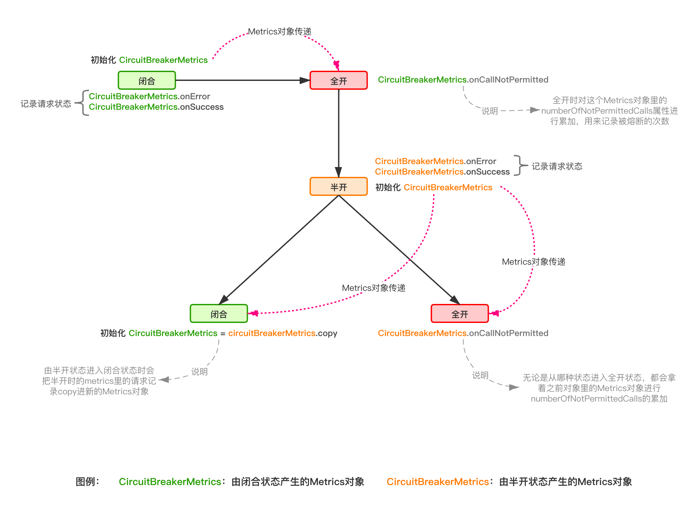

# springcloud-resilience4j 使用

* [熔断器配置](https://blog.csdn.net/hataksumo/article/details/128854295)
* [resilience4j源码分析](https://www.cnblogs.com/hama1993/p/12019485.html)
* [Resilience4j 源码解析](https://www.iocoder.cn/categories/Resilience4j/)

## 1. CircuitBreakerRegistry创建



1. springboot starter启动 CircuitBreakerAutoConfiguration中创建
2. 默认使用的是InMemoryCircuitBreakerRegistry 注册器
3. CircuitBreakerStateMachine其内部持有一个CircuitBreakerState对象的引用

## 2. CircuitBreaker模块(熔断器)模块总体介绍



* 线程安全的单例模式生成了CircuitBreakerStateMachine的实例，有三种实现方式：

```java
public interface CircuitBreaker {

    /**
     * 默认配置
     *
     * @param name
     * @return
     */
    static CircuitBreaker ofDefaults(String name) {
        return new CircuitBreakerStateMachine(name);
    }

    static CircuitBreaker of(String name, CircuitBreakerConfig circuitBreakerConfig) {
        return new CircuitBreakerStateMachine(name, circuitBreakerConfig);
    }

    static CircuitBreaker of(String name, CircuitBreakerConfig circuitBreakerConfig, Map<String, String> tags) {
        return new CircuitBreakerStateMachine(name, circuitBreakerConfig, tags);
    }
}
```

* 三个default方法

```java
public interface CircuitBreaker {

    default <T> T executeSupplier(Supplier<T> supplier) {
        return decorateSupplier(this, supplier).get();
    }

    default <T> T executeCallable(Callable<T> callable) throws Exception {
        return decorateCallable(this, callable).call();
    }

    default void executeRunnable(Runnable runnable) {
        decorateRunnable(this, runnable).run();
    }
}
```

* 常用的decorateSupplier方法

```java
public interface CircuitBreaker {

    static <T> Supplier<T> decorateSupplier(CircuitBreaker circuitBreaker, Supplier<T> supplier) {
        return () -> {
            // 尝试获取权限 没权限会抛出异常
            circuitBreaker.acquirePermission();
            final long start = circuitBreaker.getCurrentTimestamp();
            try {
                // 执行业务逻辑
                T result = supplier.get();
                // 耗时
                long duration = circuitBreaker.getCurrentTimestamp() - start;
                // 执行成功
                circuitBreaker.onResult(duration, circuitBreaker.getTimestampUnit(), result);
                return result;
            } catch (Exception exception) {
                // Do not handle java.lang.Error
                // 执行失败 记录在度量指标里面
                long duration = circuitBreaker.getCurrentTimestamp() - start;
                circuitBreaker.onError(duration, circuitBreaker.getTimestampUnit(), exception);
                throw exception;
            }
        };
    }
}
```

### 2.1 CircuitBreakerRegistry注册器

1. CircuitBreakerRegistry接口的实现类InMemoryCircuitBreakerRegistry, 使用RegistryStore存储CircuitBreaker实例
2. 通过CircuitBreakerRegistry可以创建新的CircuitBreaker实例及检索创建的CircuitBreaker实例。
3. 注册的时候会把CircuitBreakerConfig注册给CircuitBreaker对象

```java
    @Override
public CircuitBreaker circuitBreaker(String name,CircuitBreakerConfig config,
        Map<String, String> tags){
        return computeIfAbsent(name,()->CircuitBreaker
        .of(name,Objects.requireNonNull(config,CONFIG_MUST_NOT_BE_NULL),getAllTags(tags)));
        }
```

## 3. CircuitBreakerConfig 配置

1. 存储配置

```java
public class CircuitBreakerConfig implements Serializable {
    private static final long serialVersionUID = -5429814941777001669L;

    // 请求调用失败的阈值，百分比。默认是50%
    public static final int DEFAULT_FAILURE_RATE_THRESHOLD = 50; // Percentage
    // 慢调用的阈值，百分比
    public static final int DEFAULT_SLOW_CALL_RATE_THRESHOLD = 100; // Percentage
    // 熔断器在打开状态时的持续时间。默认是60秒
    public static final int DEFAULT_WAIT_DURATION_IN_OPEN_STATE = 60; // Seconds
    // 熔断器在半开状态下 限制调用次数
    public static final int DEFAULT_PERMITTED_CALLS_IN_HALF_OPEN_STATE = 10;
    // 熔断器在关闭状态下的可以计算失败率的最小值，默认100
    public static final int DEFAULT_MINIMUM_NUMBER_OF_CALLS = 100;
    // 滑动窗口大小，熔断器在关闭状态下的ring buffer大小
    public static final int DEFAULT_SLIDING_WINDOW_SIZE = 100;
    // 慢调用的时间，即当服务A调用服务B时，B的执行时间超过了60秒就算作是慢调用
    public static final int DEFAULT_SLOW_CALL_DURATION_THRESHOLD = 60; // Seconds
    public static final int DEFAULT_WAIT_DURATION_IN_HALF_OPEN_STATE = 0; // Seconds. It is an optional parameter
    // 滑动窗口类型，默认为基于计数的 COUNT_BASED
    public static final SlidingWindowType DEFAULT_SLIDING_WINDOW_TYPE = SlidingWindowType.COUNT_BASED;
    public static final boolean DEFAULT_WRITABLE_STACK_TRACE_ENABLED = true;
    // 是否记录请求调用失败的断言，默认所有异常都记录
    private static final Predicate<Throwable> DEFAULT_RECORD_EXCEPTION_PREDICATE = throwable -> true;
    // 忽略异常
    private static final Predicate<Throwable> DEFAULT_IGNORE_EXCEPTION_PREDICATE = throwable -> false;
    private static final Function<Clock, Long> DEFAULT_TIMESTAMP_FUNCTION = clock -> System.nanoTime();
    private static final TimeUnit DEFAULT_TIMESTAMP_UNIT = TimeUnit.NANOSECONDS;
    private static final Predicate<Object> DEFAULT_RECORD_RESULT_PREDICATE = (Object object) -> false;
    private static final Function<Either<Object, Throwable>, TransitionCheckResult> DEFAULT_TRANSITION_ON_RESULT
            = any -> TransitionCheckResult.noTransition();
    // The default exception predicate counts all exceptions as failures.

    private transient Predicate<Throwable> recordExceptionPredicate = DEFAULT_RECORD_EXCEPTION_PREDICATE;
    // The default exception predicate ignores no exceptions.
    private transient Predicate<Throwable> ignoreExceptionPredicate = DEFAULT_IGNORE_EXCEPTION_PREDICATE;
    private transient Function<Clock, Long> currentTimestampFunction = DEFAULT_TIMESTAMP_FUNCTION;
    private TimeUnit timestampUnit = DEFAULT_TIMESTAMP_UNIT;

    private transient Predicate<Object> recordResultPredicate = DEFAULT_RECORD_RESULT_PREDICATE;

    // 请求调用失败，存储异常记录的集合
    @SuppressWarnings("unchecked")
    private Class<? extends Throwable>[] recordExceptions = new Class[0];
    // 请求调用失败，忽略异常记录的集合
    @SuppressWarnings("unchecked")
    private Class<? extends Throwable>[] ignoreExceptions = new Class[0];

    private float failureRateThreshold = DEFAULT_FAILURE_RATE_THRESHOLD;
    private int permittedNumberOfCallsInHalfOpenState = DEFAULT_PERMITTED_CALLS_IN_HALF_OPEN_STATE;
    private int slidingWindowSize = DEFAULT_SLIDING_WINDOW_SIZE;
    private SlidingWindowType slidingWindowType = DEFAULT_SLIDING_WINDOW_TYPE;
    private int minimumNumberOfCalls = DEFAULT_MINIMUM_NUMBER_OF_CALLS;
    private boolean writableStackTraceEnabled = DEFAULT_WRITABLE_STACK_TRACE_ENABLED;
    // 默认为false，是否自动从打开到半开,当waitDurationInOpenState时间一过，是否自动从OPEN切换到HALF_OPEN
    // true：waitDurationInOpenState到期后open自动变为half_open
    //false，得等到再有请求后状态才会变为half_open,否则即使waitDurationInOpenState到期状态依然是open
    private boolean automaticTransitionFromOpenToHalfOpenEnabled = false;
    private transient IntervalFunction waitIntervalFunctionInOpenState = IntervalFunction
            .of(Duration.ofSeconds(DEFAULT_WAIT_DURATION_IN_OPEN_STATE));
    private transient Function<Either<Object, Throwable>, TransitionCheckResult> transitionOnResult
            = DEFAULT_TRANSITION_ON_RESULT;
    private float slowCallRateThreshold = DEFAULT_SLOW_CALL_RATE_THRESHOLD;
    private Duration slowCallDurationThreshold = Duration
            .ofSeconds(DEFAULT_SLOW_CALL_DURATION_THRESHOLD);
    private Duration maxWaitDurationInHalfOpenState = Duration
            .ofSeconds(DEFAULT_WAIT_DURATION_IN_HALF_OPEN_STATE);


    public static CircuitBreakerConfig ofDefaults() {
        return new Builder().build();
    }
}
```

## 4. CircuitBreakerStateMachine有限状态机

## 5. CircuitBreakerMetrics熔断器度量指标

```java
class CircuitBreakerMetrics implements CircuitBreaker.Metrics {
    private final Metrics metrics;
    private final float failureRateThreshold;
    private final float slowCallRateThreshold;
    private final long slowCallDurationThresholdInNanos;
    // 不允许请求调用通过的数量，采用并发更加高效的LongAdder类型
    private final LongAdder numberOfNotPermittedCalls;
    private int minimumNumberOfCalls;

    private CircuitBreakerMetrics(int slidingWindowSize,
                                  CircuitBreakerConfig.SlidingWindowType slidingWindowType,
                                  CircuitBreakerConfig circuitBreakerConfig,
                                  Clock clock) {
        // 使用不同的滑动窗口
        if (slidingWindowType == CircuitBreakerConfig.SlidingWindowType.COUNT_BASED) {
            this.metrics = new FixedSizeSlidingWindowMetrics(slidingWindowSize);
            this.minimumNumberOfCalls = Math
                    .min(circuitBreakerConfig.getMinimumNumberOfCalls(), slidingWindowSize);
        } else {
            this.metrics = new SlidingTimeWindowMetrics(slidingWindowSize, clock);
            this.minimumNumberOfCalls = circuitBreakerConfig.getMinimumNumberOfCalls();
        }
        this.failureRateThreshold = circuitBreakerConfig.getFailureRateThreshold();
        this.slowCallRateThreshold = circuitBreakerConfig.getSlowCallRateThreshold();
        this.slowCallDurationThresholdInNanos = circuitBreakerConfig.getSlowCallDurationThreshold()
                .toNanos();
        this.numberOfNotPermittedCalls = new LongAdder();
    }
}
```

* 滑动窗口算法接口

```java
public interface Metrics {

    /**
     * Records a call. 记录调用 生成快照
     *
     * @param duration     the duration of the call
     * @param durationUnit the time unit of the duration
     * @param outcome      the outcome of the call
     */
    Snapshot record(long duration, TimeUnit durationUnit, Outcome outcome);

    /**
     * Returns a snapshot. 
     *
     * @return a snapshot
     */
    Snapshot getSnapshot();

    enum Outcome {
        SUCCESS, ERROR, SLOW_SUCCESS, SLOW_ERROR
    }

}
```

固定大小滑动窗口

```java
public class FixedSizeSlidingWindowMetrics implements Metrics {

    private final int windowSize;
    /**
     * 全部数据 完整统计 进行加减运算
     */
    private final TotalAggregation totalAggregation;
    /**
     * 数组记录请求信息 每一个都是一次调用的数据
     */
    private final Measurement[] measurements;
    int headIndex;

}
```

## 6. CircuitBreakerEvent熔断器事件



* CircuitBreakerOnErrorEvent: 请求调用失败时发布的事件
* CircuitBreakerOnSuccessEvent：请求调用成功时发布的事件
* CircuitBreakerOnStateTransitionEvent：熔断器状态转换时发布的事件
* CircuitBreakerOnResetEvent：熔断器重置时发布的事件
* CircuitBreakerOnIgnoredErrorEvent：当忽略的调用异常发生时发布的事件
* CircuitBreakerOnCallNotPermittedEvent：当请求不被允许调用时发布的事件

## 7. 创建流程



* ClosedState ==> OpenState 状态的转换过程
  

## 8. 请求流程



```java
enum Result {
    /**
     * 低于阈值                                           
     */
    BELOW_THRESHOLDS,
    /**
     * 失败率高于阈值
     */
    FAILURE_RATE_ABOVE_THRESHOLDS,
    /**
     * 慢调用率超出阈值
     */
    SLOW_CALL_RATE_ABOVE_THRESHOLDS,
    /**
     * 失败率和慢调用率都超过阈值
     */
    ABOVE_THRESHOLDS,
    /**
     * 低于最小调用阈值
     */
    BELOW_MINIMUM_CALLS_THRESHOLD;

    /**
     * 判断是否超出阈值
     * @param result
     * @return
     */
    public static boolean hasExceededThresholds(Result result) {
        return hasFailureRateExceededThreshold(result) ||
                hasSlowCallRateExceededThreshold(result);
    }

    public static boolean hasFailureRateExceededThreshold(Result result) {
        return result == ABOVE_THRESHOLDS || result == FAILURE_RATE_ABOVE_THRESHOLDS;
    }

    public static boolean hasSlowCallRateExceededThreshold(Result result) {
        return result == ABOVE_THRESHOLDS || result == SLOW_CALL_RATE_ABOVE_THRESHOLDS;
    }
}
```

```java
/**
 * 统计调用信息
 */
class AbstractAggregation {

    long totalDurationInMillis = 0;
    int numberOfSlowCalls = 0;
    int numberOfSlowFailedCalls = 0;
    int numberOfFailedCalls = 0;
    int numberOfCalls = 0;

    void record(long duration, TimeUnit durationUnit, Metrics.Outcome outcome) {
        this.numberOfCalls++;
        this.totalDurationInMillis += durationUnit.toMillis(duration);
        switch (outcome) {
            case SLOW_SUCCESS:
                numberOfSlowCalls++;
                break;

            case SLOW_ERROR:
                numberOfSlowCalls++;
                numberOfFailedCalls++;
                numberOfSlowFailedCalls++;
                break;

            case ERROR:
                numberOfFailedCalls++;
                break;

            default:
                break;
        }
    }
}
```

* 通过快照获取检查结果

```
    private Result checkIfThresholdsExceeded(Snapshot snapshot) {
        float failureRateInPercentage = getFailureRate(snapshot);
        float slowCallsInPercentage = getSlowCallRate(snapshot);

        if (failureRateInPercentage == -1 || slowCallsInPercentage == -1) {
            return Result.BELOW_MINIMUM_CALLS_THRESHOLD;
        }
        if (failureRateInPercentage >= failureRateThreshold
            && slowCallsInPercentage >= slowCallRateThreshold) {
            return Result.ABOVE_THRESHOLDS;
        }
        if (failureRateInPercentage >= failureRateThreshold) {
            return Result.FAILURE_RATE_ABOVE_THRESHOLDS;
        }

        if (slowCallsInPercentage >= slowCallRateThreshold) {
            return Result.SLOW_CALL_RATE_ABOVE_THRESHOLDS;
        }
        return Result.BELOW_THRESHOLDS;
    }
```



全开到半开是使用 ScheduledFuture<?> transitionToHalfOpenFuture 线程池来自动转换的

```java
private class OpenState implements CircuitBreakerState {

    private final int attempts;
    private final Instant retryAfterWaitDuration;
    private final CircuitBreakerMetrics circuitBreakerMetrics;
    private final AtomicBoolean isOpen;

    @Nullable
    private final ScheduledFuture<?> transitionToHalfOpenFuture;

    OpenState(final int attempts, final long waitDurationInMillis, final Instant retryAfterWaitDuration,
              CircuitBreakerMetrics circuitBreakerMetrics) {
        this.attempts = attempts;
        this.retryAfterWaitDuration = retryAfterWaitDuration;
        this.circuitBreakerMetrics = circuitBreakerMetrics;

        if (circuitBreakerConfig.isAutomaticTransitionFromOpenToHalfOpenEnabled()) {
            ScheduledExecutorService scheduledExecutorService = schedulerFactory.getScheduler();
            transitionToHalfOpenFuture = scheduledExecutorService
                    .schedule(this::toHalfOpenState, waitDurationInMillis, TimeUnit.MILLISECONDS);
        } else {
            transitionToHalfOpenFuture = null;
        }
        isOpen = new AtomicBoolean(true);
    }


    /**
     * Should never be called when tryAcquirePermission returns false.
     */
    @Override
    public void onError(long duration, TimeUnit durationUnit, Throwable throwable) {
        //当线程1在状态为CLOSED时调用acquirePermission时可以调用，但同时另一个
        //线程2调用onError，在线程1调用onError之前，状态从CLOSED变为OPEN。
        //但是onError事件仍然应该被记录，即使它发生在状态转换之后。
        // Could be called when Thread 1 invokes acquirePermission when the state is CLOSED, but in the meantime another
        // Thread 2 calls onError and the state changes from CLOSED to OPEN before Thread 1 calls onError.
        // But the onError event should still be recorded, even if it happened after the state transition.
        circuitBreakerMetrics.onError(duration, durationUnit);
    }

    /**
     * Should never be called when tryAcquirePermission returns false.
     */
    @Override
    public void onSuccess(long duration, TimeUnit durationUnit) {
        // Could be called when Thread 1 invokes acquirePermission when the state is CLOSED, but in the meantime another
        // Thread 2 calls onError and the state changes from CLOSED to OPEN before Thread 1 calls onSuccess.
        // But the onSuccess event should still be recorded, even if it happened after the state transition.
        circuitBreakerMetrics.onSuccess(duration, durationUnit);
    }

}
```


