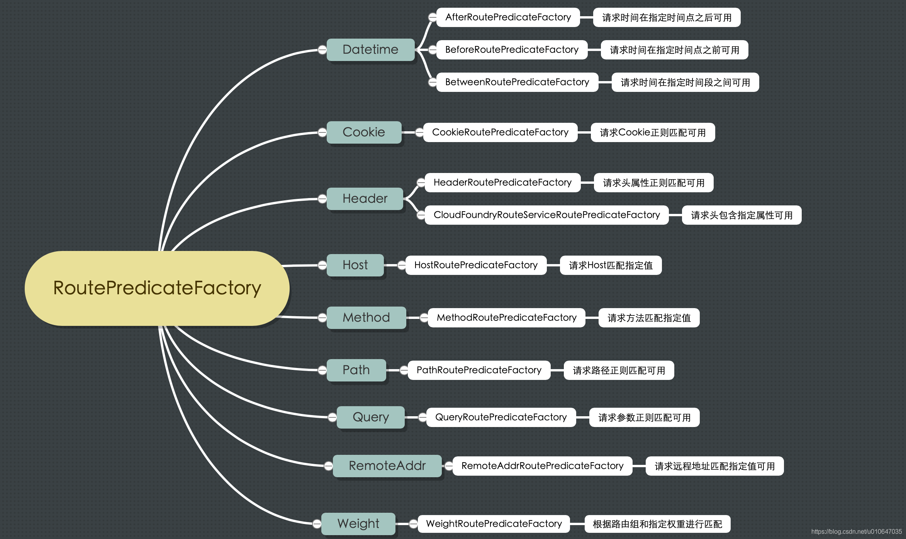

# Spring Cloud Gateway

- [Spring Cloud Gateway](#spring-cloud-gateway)
  - [1. 网关启动\&配置加载流程](#1-网关启动配置加载流程)
    - [1.1 springboot reactive项目启动](#11-springboot-reactive项目启动)
    - [1.2 GatewayAutoConfiguration](#12-gatewayautoconfiguration)
    - [GatewayReactiveLoadBalancerClientAutoConfiguration](#gatewayreactiveloadbalancerclientautoconfiguration)
    - [GatewayNoLoadBalancerClientAutoConfiguration](#gatewaynoloadbalancerclientautoconfiguration)
  - [2. 请求流程](#2-请求流程)
    - [2.1 DispatcherHandler](#21-dispatcherhandler)
      - [2.1.1 invokeHandler方法调用拦截器链](#211-invokehandler方法调用拦截器链)
  - [3. Routes配置](#3-routes配置)
    - [3.1 Predicate](#31-predicate)
      - [3.1.1 RoutePredicateFactory](#311-routepredicatefactory)
      - [3.1.2 自定义RoutePredicateFactory](#312-自定义routepredicatefactory)
    - [3.2 Filters](#32-filters)
      - [3.2.1 GlobalFilter 全局拦截器](#321-globalfilter-全局拦截器)
      - [3.2.2 GatewayFilter 配置化拦截器](#322-gatewayfilter-配置化拦截器)
      - [3.2.3 spring.cloud.gateway.default-filters配置](#323-springcloudgatewaydefault-filters配置)
      - [3.2.4 自定义GatewayFilterFactory](#324-自定义gatewayfilterfactory)
        - [3.2.4.1 NameValue 键值对类型](#3241-namevalue-键值对类型)
        - [3.2.4.2 多参数类型](#3242-多参数类型)
    - [3.3 Metadata](#33-metadata)
  - [4. 熔断 SpringCloudCircuitBreakerFilterFactory](#4-熔断-springcloudcircuitbreakerfilterfactory)
    - [4.1 SpringCloudCircuitBreakerFilterFactory#apply源码分析](#41-springcloudcircuitbreakerfilterfactoryapply源码分析)
  - [5. 限流](#5-限流)
    - [5.1 redis限流使用](#51-redis限流使用)
    - [5.2 redis限流源码分析](#52-redis限流源码分析)
      - [5.2.1 配置加载](#521-配置加载)
      - [5.2.2 RedisRateLimiter核心方法isAllowed](#522-redisratelimiter核心方法isallowed)
      - [5.2.3 lua执行流程图](#523-lua执行流程图)
    - [5.3 如何正确使用限流](#53-如何正确使用限流)

## 1. 网关启动&配置加载流程

### 1.1 springboot reactive项目启动

最终服务启动的是netty服务

1. refresh()
2. ReactiveWebServerApplicationContext#onRefresh
3. ReactiveWebServerApplicationContext#createWebServer 
4. ReactiveWebServerApplicationContext.ServerManager#get 
5. ReactiveWebServerApplicationContext.ServerManager#ServerManager
6. NettyReactiveWebServerFactory#getWebServer

### 1.2 GatewayAutoConfiguration

* GatewayProperties

routes属性对应配置文件相关配置


```java
public class RouteDefinitionRouteLocator
        implements RouteLocator, BeanFactoryAware, ApplicationEventPublisherAware {

    /**
     * Default filters name.
     */
    public static final String DEFAULT_FILTERS = "defaultFilters";

    protected final Log logger = LogFactory.getLog(getClass());

    private final RouteDefinitionLocator routeDefinitionLocator;

    private final ConfigurationService configurationService;

    private final Map<String, RoutePredicateFactory> predicates = new LinkedHashMap<>();

    private final Map<String, GatewayFilterFactory> gatewayFilterFactories = new HashMap<>();

    private final GatewayProperties gatewayProperties;
}
```

* RouteDefinitionRouteLocator 断言，过滤器等的实际加载类
* GatewayFilterFactory子类
* RoutePredicateFactory子类

```
@Bean
public RouteLocator routeDefinitionRouteLocator(GatewayProperties properties,
        List<GatewayFilterFactory> gatewayFilters,
        List<RoutePredicateFactory> predicates,
        RouteDefinitionLocator routeDefinitionLocator,
        ConfigurationService configurationService){
        return new RouteDefinitionRouteLocator(routeDefinitionLocator,predicates,
        gatewayFilters,properties,configurationService);
        }

```

使用名称简写

```
    public RouteDefinitionRouteLocator(RouteDefinitionLocator routeDefinitionLocator,
        List<RoutePredicateFactory> predicates,
        List<GatewayFilterFactory> gatewayFilterFactories,
        GatewayProperties gatewayProperties,
        ConfigurationService configurationService){
        this.routeDefinitionLocator=routeDefinitionLocator;
        this.configurationService=configurationService;
        initFactories(predicates);
        gatewayFilterFactories.forEach(
        factory->this.gatewayFilterFactories.put(factory.name(),factory));
        this.gatewayProperties=gatewayProperties;
        }
```

### GatewayReactiveLoadBalancerClientAutoConfiguration

### GatewayNoLoadBalancerClientAutoConfiguration

## 2. 请求流程

* [请求流程](https://www.jianshu.com/p/f5f6cebcdf88)

ReactorHttpHandlerAdapter#apply开始执行


### 2.1 DispatcherHandler

* org.springframework.web.reactive.DispatcherHandler#handle

```
@Override
public Mono<Void> handle(ServerWebExchange exchange){
        if(this.handlerMappings==null){
        return createNotFoundError();
        }
        if(CorsUtils.isPreFlightRequest(exchange.getRequest())){
        return handlePreFlight(exchange);
        }
        return Flux.fromIterable(this.handlerMappings)// 轮询
        //流式执行 getHandler方法
        .concatMap(mapping->mapping.getHandler(exchange))
        // 将流操作中返回的第一个项发送到新的Mono中 
        .next()
        .switchIfEmpty(createNotFoundError())
        // 从获取到的handler中执行 invokeHandler(exchange, handler) 调用拦截器链
        .flatMap(handler->invokeHandler(exchange,handler))
        //从获取到的handler获取到result执行  handleResult(exchange, result)
        .flatMap(result->handleResult(exchange,result));}
```

#### 2.1.1 invokeHandler方法调用拦截器链

DispatcherHandler#invokeHandler ->SimpleHandlerAdapter#handle ->
org.springframework.cloud.gateway.handler.FilteringWebHandler#handle 过滤器排序 ->DefaultGatewayFilterChain#filter

```
		@Override
		public Mono<Void> filter(ServerWebExchange exchange) {
			return Mono.defer(() -> {
				if (this.index < filters.size()) {
					GatewayFilter filter = filters.get(this.index);
					DefaultGatewayFilterChain chain = new DefaultGatewayFilterChain(this,
							this.index + 1);
					return filter.filter(exchange, chain);
				}
				else {
					return Mono.empty(); // complete
				}
			});
		}
```

## 3. Routes配置

|  名称   | 作用  |
|:----:|:----|
|Route |一个Route模块由一个 ID，一个目标 URI，一组断言和一组过滤器定义 |
|Predicate|匹配来自 HTTP 请求的任何内容,如果断言为真，则路由匹配，目标URI会被访问    |
|Filter|拦截和修改请求|

### 3.1 Predicate

1. DispatcherHandler#handle
2. AbstractHandlerMapping#getHandler
3. RoutePredicateHandlerMapping#getHandlerInternal
4. RoutePredicateHandlerMapping#lookupRoute断言匹配
5. RouteDefinitionRouteLocator#getRoutes
6. RouteDefinitionRouteLocator#convertToRoute
7. RouteDefinitionRouteLocator#combinePredicates
8. RouteDefinitionRouteLocator#lookup

```
	protected Mono<Route> lookupRoute(ServerWebExchange exchange) {
		return this.routeLocator.getRoutes()
				// individually filter routes so that filterWhen error delaying is not a
				// problem
				.concatMap(route -> Mono.just(route).filterWhen(r -> {
					// add the current route we are testing
					exchange.getAttributes().put(GATEWAY_PREDICATE_ROUTE_ATTR, r.getId());
					// 断言匹配
					return r.getPredicate().apply(exchange);
				})
						// instead of immediately stopping main flux due to error, log and
						// swallow it
						.doOnError(e -> logger.error(
								"Error applying predicate for route: " + route.getId(),
								e))
						.onErrorResume(e -> Mono.empty()))
				// .defaultIfEmpty() put a static Route not found
				// or .switchIfEmpty()
				// .switchIfEmpty(Mono.<Route>empty().log("noroute"))
				.next()
				// TODO: error handling
				.map(route -> {
					if (logger.isDebugEnabled()) {
						logger.debug("Route matched: " + route.getId());
					}
					validateRoute(route, exchange);
					return route;
				});

		/*
		 * TODO: trace logging if (logger.isTraceEnabled()) {
		 * logger.trace("RouteDefinition did not match: " + routeDefinition.getId()); }
		 */
	}
```

断言未匹配上


#### 3.1.1 RoutePredicateFactory

* [路由谓词工厂 RoutePredicateFactory](https://blog.csdn.net/u010647035/article/details/84495302)
* [SpringCloud-Gateway之RoutePredicateFactory](https://blog.csdn.net/weixin_44100910/article/details/106439122)



#### 3.1.2 自定义RoutePredicateFactory

* 优点：

### 3.2 Filters

过滤器用来修改请求内容

* [Spring Cloud GateWay-过滤器](https://blog.csdn.net/lucky_love816/article/details/124978639)

#### 3.2.1 GlobalFilter 全局拦截器


#### 3.2.2 GatewayFilter 配置化拦截器

* 需要通过spring.cloud.routes.filters 配置在具体路由下，只作用在当前路由上或通过spring.cloud.default-filters配置在全局，作用在所有路由上。
  

* HystrixGatewayFilterFactory已经不再维护，现在使用SpringCloudCircuitBreakerFilterFactory

#### 3.2.3 spring.cloud.gateway.default-filters配置

过滤器全局生效

```yaml
spring:
  cloud:
    gateway:
      default-filters:
        - name: Retry
          args:
            retries: 2
            statuses: BAD_GATEWAY
            methods: GET,POST
        - name: RequestRateLimiter
          args:
            key-resolver: '#{@pathKeyResolver}'
            redis-rate-limiter.replenishRate: 1
            redis-rate-limiter.burstCapacity: 5
```

#### 3.2.4 自定义GatewayFilterFactory

1. 优点: 可以自定义对应自己业务的拦截器，对指定的路由生效。比如，有些路由需要校验权限，cookie等，可以在有需要的路由下配置权限校验，cookie校验的拦截器

* AbstractGatewayFilterFactory
* AbstractNameValueGatewayFilterFactory: Config为key value键值类型

##### 3.2.4.1 NameValue 键值对类型

java代码

```java
public class NameValueGatewayFilterFactory extends AbstractNameValueGatewayFilterFactory {

  /**
   * 自定义过滤器名称 如果不重写name()方法 默认名称为NameValue
   */
  public static final String NAME = "NameValueTest";

    @Override
    public GatewayFilter apply(NameValueConfig config) {
        return new GatewayFilter() {
            @Override
            public Mono<Void> filter(ServerWebExchange exchange, GatewayFilterChain chain) {
                String value = ServerWebExchangeUtils.expand(exchange, config.getValue());
                ServerHttpRequest request = exchange.getRequest().mutate()
                        .headers(httpHeaders -> httpHeaders.add(config.getName(), value)).build();

                return chain.filter(exchange.mutate().request(request).build());
            }
        };
    }

    @Override
    public String name() {
        return NAME;
    }
}
```

配置

```yaml
spring:
  cloud:
    gateway:
      routes:
        - id: circuitBreakerTest
          uri: http://xxx.com
          order: 10000
          predicates:
            - Path=/ai-planner/api/admin/class/**,/ai-planner/api/app/class/**
          filters:
            - StripPrefix=4
            - NameValueTest=A,B # NameValueGatewayFilterFactory过滤器，name=A，value=B
#            - name: NameValueTest 或者使用这种配置
#              args:
#                name: A
#                value: B
```

##### 3.2.4.2 多参数类型

```java
public class ParamCheckGatewayFilterFactory extends AbstractGatewayFilterFactory<ParamCheckGatewayFilterFactory.Config> {

    public ParamCheckGatewayFilterFactory() {
        super(Config.class);
    }

  /**
   * 快捷式配置
   * @return
   */
  @Override
    public List<String> shortcutFieldOrder() {
        return Arrays.asList("arg1", "arg2", "arg3");
    }

    @Override
    public GatewayFilter apply(Config config) {

        return new GatewayFilter() {
            @Override
            public Mono<Void> filter(ServerWebExchange exchange, GatewayFilterChain chain) {
                System.out.println(config);
                return null;
            }
        };
    }


    public static class Config {

        private String arg1;

        private String arg2;

        private String arg3;

        public String getArg1() {
            return arg1;
        }

        public void setArg1(String arg1) {
            this.arg1 = arg1;
        }

        public String getArg2() {
            return arg2;
        }

        public void setArg2(String arg2) {
            this.arg2 = arg2;
        }

        public String getArg3() {
            return arg3;
        }

        public void setArg3(String arg3) {
            this.arg3 = arg3;
        }
    }

}
```

```yaml
spring:
  cloud:
    gateway:
      routes:
        - id: gateway_filter_factory
          uri: http://xxx.com
          order: 10000
          predicates:
            - Path=/ai-planner/api/admin/class/**,/ai-planner/api/app/class/**
          filters:
            - StripPrefix=4
#            - name: ParamCheck
#              args:
#                arg1: 1
#                arg2: 2
#                arg3: 3
            - ParamCheck=1,2,3 # 需要重写 shortcutFieldOrder() 方法
```

### 3.3 Metadata

默认的配置就两个 连接超时和响应超时，在NettyRoutingFilter过滤器中使用

```java
public final class RouteMetadataUtils {

    /**
     * Response timeout attribute name.
     */
    public static final String RESPONSE_TIMEOUT_ATTR = "response-timeout";

    /**
     * Connect timeout attribute name.
     */
    public static final String CONNECT_TIMEOUT_ATTR = "connect-timeout";

    private RouteMetadataUtils() {
        throw new AssertionError("Must not instantiate utility class.");
    }

}
```

自定义配置之后可以在 route.getMetadata().get(nameKey)使用

```
Route route = exchange.getAttribute(GATEWAY_ROUTE_ATTR);
// get all metadata properties
route.getMetadata();
// get a single metadata property
route.getMetadata(someKey);
```

```yaml
spring:
  cloud:
    gateway:
      routes:
        - id: gateway_filter_factory
          uri: http://xxx.com
          order: 10000
          predicates:
            - Path=/ai-planner/api/admin/class/**,/ai-planner/api/app/class/**
          filters:
            - StripPrefix=4
          metadata:
            response-timeout: 5000
            connect-timeout: 100
```

## 4. 熔断 SpringCloudCircuitBreakerFilterFactory

* spring cloud gateway 使用resilience4j进行熔断 项目引入implementation 'org.springframework.cloud:
  spring-cloud-starter-circuitbreaker-reactor-resilience4j'
* 现在使用SpringCloudCircuitBreakerFilterFactory

```yaml
spring:
  cloud:
    gateway:
      routes:
        #        # =====================================
        - id: circuitBreakerTest
          uri: http://xxx.com
          order: 10000
          predicates:
            - Path=/ai-planner/api/admin/class/**,/ai-planner/api/app/class/**
          filters:
            - StripPrefix=4
            - name: CircuitBreaker
              args:
                name: myCircuitBreaker
                statusCodes: # 定义状态码 会解析出500和404两种状态
                  - 500
                  - "NOT_FOUND"
                fallbackUri: /ai-planner/api/app/class/toc/class/listMyClasses # 熔断跳转路径
```

### 4.1 SpringCloudCircuitBreakerFilterFactory#apply源码分析

```java
public abstract class SpringCloudCircuitBreakerFilterFactory
        extends AbstractGatewayFilterFactory<SpringCloudCircuitBreakerFilterFactory.Config> {

    /** CircuitBreaker component name. */
    public static final String NAME = "CircuitBreaker";

    // do not use this dispatcherHandler directly, use getDispatcherHandler() instead.
    private volatile DispatcherHandler dispatcherHandler;

    @Override
    public GatewayFilter apply(Config config) {
        ReactiveCircuitBreaker cb = reactiveCircuitBreakerFactory.create(config.getId());
        Set<HttpStatus> statuses = config.getStatusCodes().stream().map(HttpStatusHolder::parse)
                .filter(statusHolder -> statusHolder.getHttpStatus() != null).map(HttpStatusHolder::getHttpStatus)
                .collect(Collectors.toSet());

        return new GatewayFilter() {
            @Override
            public Mono<Void> filter(ServerWebExchange exchange, GatewayFilterChain chain) {
                // ReactiveCircuitBreaker#run(Mono<T> toRun, Function<Throwable, Mono<T>> fallback) 执行中抛出异常会调用fallback运行
                // fallback代码中如果fallbackUri是空的抛出异常，否则请求fallbackUri路径，如果请求失败进入handleErrorWithoutFallback
                return cb.run(chain.filter(exchange).doOnSuccess(v -> {
                    if (statuses.contains(exchange.getResponse().getStatusCode())) {
                        HttpStatus status = exchange.getResponse().getStatusCode();
                        throw new CircuitBreakerStatusCodeException(status);
                    }
                }), t -> {
                    if (config.getFallbackUri() == null) {
                        return Mono.error(t);
                    }

                    exchange.getResponse().setStatusCode(null);
                    reset(exchange);

                    // TODO: copied from RouteToRequestUrlFilter
                    URI uri = exchange.getRequest().getURI();
                    // TODO: assume always?
                    boolean encoded = containsEncodedParts(uri);
                    URI requestUrl = UriComponentsBuilder.fromUri(uri).host(null).port(null)
                            .uri(config.getFallbackUri()).scheme(null).build(encoded).toUri();
                    exchange.getAttributes().put(GATEWAY_REQUEST_URL_ATTR, requestUrl);
                    addExceptionDetails(t, exchange);

                    // Reset the exchange
                    reset(exchange);

                    ServerHttpRequest request = exchange.getRequest().mutate().uri(requestUrl).build();
                    return getDispatcherHandler().handle(exchange.mutate().request(request).build());
                }).onErrorResume(t -> handleErrorWithoutFallback(t, config.isResumeWithoutError()));
            }
        };
    }

}
```

## 5. 限流

* [Spring-Cloud-Gateway 源码解析 —— 过滤器 (4.10) 之 RequestRateLimiterGatewayFilterFactory 请求限流](https://blog.csdn.net/weixin_42073629/article/details/106934827)
* [服务限流限流算法、限流策略以及该在哪里限流](https://www.cnblogs.com/jokay/p/15019249.html)

### 5.1 redis限流使用

引入org.springframework.boot:spring-boot-starter-data-redis-reactive之后使用RedisRateLimiter

spring cloud gateway限流使用RequestRateLimiterGatewayFilterFactory过滤器

自定义KeyResolver

```java

@Configuration
public class KeyResolverConfiguration {

    @Primary
    @Bean
    public KeyResolver pathKeyResolver() {
        return exchange -> Mono.just(exchange.getRequest().getURI().getPath());
    }

    @Bean
    public KeyResolver parameterKeyResolver() {
        return exchange -> Mono.just(exchange.getRequest().getHeaders().get("userId").get(0));
    }

    @Bean
    public KeyResolver ipKeyResolver() {
        return exchange -> Mono.just(exchange.getRequest().getURI().getHost());
    }

}
```

配置文件配置

```yml
spring:
  application:
    name: hikari-ai-planner-gateway
  redis:
    host: localhost
    port: 6379
  cloud:
    gateway:
      routes:
        # =====================================
        - id: default_path_to_httpbin
          uri: http://xxx.com
          order: 10000
          predicates:
            - Path=/ai-planner/api/admin/class/**,/ai-planner/api/app/class/**
          filters:
            - StripPrefix=4
            - name: RequestRateLimiter
              args:
                redis-rate-limiter.replenishRate: 1     # 令牌桶每秒填充速率, 指的是允许用户每秒执行多少请求，不丢弃任何请求;
                redis-rate-limiter.burstCapacity: 5     # 令牌桶总容量, 指的是用户在一秒钟内允许执行的最大请求数，也就是令牌桶可以保存的令牌数, 如果将此值设置为零将阻止所有请求;
                redis-rate-limiter.requestedTokens: 1   # 指的是每个请求消耗多少个令牌, 默认是1.
                key-resolver: "#{@pathKeyResolver}"     # 指的是限流的时候以什么维度来判断，使用SpEL表达式按名称引用BEAN(REDIS中限流相关的KEY和此处的配置相关).
```

在redis中生成key 时间比较短


### 5.2 redis限流源码分析

#### 5.2.1 配置加载

```java
class GatewayRedisAutoConfiguration {

    /**
     * lua脚本路径 META-INF/scripts/request_rate_limiter.lua
     *
     * @return
     */
    @Bean
    @SuppressWarnings("unchecked")
    public RedisScript redisRequestRateLimiterScript() {
        DefaultRedisScript redisScript = new DefaultRedisScript<>();
        redisScript.setScriptSource(new ResourceScriptSource(new ClassPathResource("META-INF/scripts/request_rate_limiter.lua")));
        redisScript.setResultType(List.class);
        return redisScript;
    }

    /**
     * RedisTemplate使用ReactiveRedisTemplate
     *
     * @param reactiveRedisConnectionFactory
     * @param resourceLoader
     * @return
     */
    @Bean
    //TODO: replace with ReactiveStringRedisTemplate in future
    public ReactiveRedisTemplate<String, String> stringReactiveRedisTemplate(
            ReactiveRedisConnectionFactory reactiveRedisConnectionFactory,
            ResourceLoader resourceLoader) {
        RedisSerializer<String> serializer = new StringRedisSerializer();
        RedisSerializationContext<String, String> serializationContext = RedisSerializationContext
                .<String, String>newSerializationContext()
                .key(serializer)
                .value(serializer)
                .hashKey(serializer)
                .hashValue(serializer)
                .build();
        return new ReactiveRedisTemplate<>(reactiveRedisConnectionFactory,
                serializationContext);
    }

    /**
     * RateLimiter 使用 RedisRateLimiter
     * @param redisTemplate
     * @param redisScript
     * @return
     */
    @Bean
    public RedisRateLimiter redisRateLimiter(ReactiveRedisTemplate<String, String> redisTemplate,
                                             @Qualifier("redisRequestRateLimiterScript") RedisScript<List<Long>> redisScript) {
        return new RedisRateLimiter(redisTemplate, redisScript);


    }
}
```

#### 5.2.2 RedisRateLimiter核心方法isAllowed

```
	public Mono<Response> isAllowed(String routeId, String id) {
		if (!this.initialized.get()) {
			throw new IllegalStateException("RedisRateLimiter is not initialized");
		}

		Config routeConfig = loadConfiguration(routeId);

		// How many requests per second do you want a user to be allowed to do?
		int replenishRate = routeConfig.getReplenishRate();

		// How much bursting do you want to allow?
		int burstCapacity = routeConfig.getBurstCapacity();

		// How many tokens are requested per request?
		int requestedTokens = routeConfig.getRequestedTokens();

		try {
			List<String> keys = getKeys(id);

			// The arguments to the LUA script. time() returns unixtime in seconds.
			List<String> scriptArgs = Arrays.asList(replenishRate + "", burstCapacity + "", "", requestedTokens + "");
			// allowed, tokens_left = redis.eval(SCRIPT, keys, args)
			Flux<List<Long>> flux = this.redisTemplate.execute(this.script, keys, scriptArgs);
			// .log("redisratelimiter", Level.FINER);
			return flux.onErrorResume(throwable -> {
				if (log.isDebugEnabled()) {
					log.debug("Error calling rate limiter lua", throwable);
				}
				return Flux.just(Arrays.asList(1L, -1L));
			}).reduce(new ArrayList<Long>(), (longs, l) -> {
				longs.addAll(l);
				return longs;
			}).map(results -> {
				boolean allowed = results.get(0) == 1L;
				Long tokensLeft = results.get(1);

				Response response = new Response(allowed, getHeaders(routeConfig, tokensLeft));

				if (log.isDebugEnabled()) {
					log.debug("response: " + response);
				}
				return response;
			});
		}
		catch (Exception e) {
			/*
			 * We don't want a hard dependency on Redis to allow traffic. Make sure to set
			 * an alert so you know if this is happening too much. Stripe's observed
			 * failure rate is 0.01%.
			 */
			log.error("Error determining if user allowed from redis", e);
		}
		return Mono.just(new Response(true, getHeaders(routeConfig, -1L)));
	}
```

#### 5.2.3 lua执行流程图

lua脚本内容 两个key 3个参数

* 第一个key ：request_rate_limiter.${id}.tokens ，令牌桶剩余令牌数
* 第二个key ：request_rate_limiter.${id}.timestamp ，令牌桶最后填充令牌时间，单位：秒
* 第一个参数 ：replenishRate 令牌桶每秒填充速率
* 第二个参数 ：burstCapacity 令牌桶总容量
* 第三个参数 ：空字符串 过去版本从 1970-01-01 00:00:00 开始的秒数 当前时间使用local now = redis.call('TIME')[1]
* 第四个参数 ：消耗令牌数量，默认 1 ,指的是每个请求消耗多少个令牌

```lua
redis.replicate_commands()

local tokens_key = KEYS[1]
local timestamp_key = KEYS[2]
--redis.log(redis.LOG_WARNING, "tokens_key " .. tokens_key)

local rate = tonumber(ARGV[1])
local capacity = tonumber(ARGV[2])
local now = redis.call('TIME')[1]
local requested = tonumber(ARGV[4])

-- 计算令牌桶填充满令牌需要多久时间，单位：秒
local fill_time = capacity/rate
-- 2倍时间保证时间充足
local ttl = math.floor(fill_time*2)

--redis.log(redis.LOG_WARNING, "rate " .. ARGV[1])
--redis.log(redis.LOG_WARNING, "capacity " .. ARGV[2])
--redis.log(redis.LOG_WARNING, "now " .. now)
--redis.log(redis.LOG_WARNING, "requested " .. ARGV[4])
--redis.log(redis.LOG_WARNING, "filltime " .. fill_time)
--redis.log(redis.LOG_WARNING, "ttl " .. ttl)

-- 调用 get 命令，获得令牌桶剩余令牌数( last_tokens )
local last_tokens = tonumber(redis.call("get", tokens_key))
if last_tokens == nil then
  last_tokens = capacity
end
--redis.log(redis.LOG_WARNING, "last_tokens " .. last_tokens)
-- 令牌桶最后填充令牌时间(last_refreshed)
local last_refreshed = tonumber(redis.call("get", timestamp_key))
if last_refreshed == nil then
  last_refreshed = 0
end
--redis.log(redis.LOG_WARNING, "last_refreshed " .. last_refreshed)

-- 填充令牌，计算新的令牌桶剩余令牌数( filled_tokens )。填充不超过令牌桶令牌上限
local delta = math.max(0, now-last_refreshed)
local filled_tokens = math.min(capacity, last_tokens+(delta*rate))
-- 获取令牌是否成功 
-- 若成功，令牌桶剩余令牌数(new_tokens) 减消耗令牌数( requested )，并设置获取成功( allowed_num = 1 ) 
-- 若失败，设置获取失败( allowed_num = 0 ) 
local allowed = filled_tokens >= requested
local new_tokens = filled_tokens
local allowed_num = 0
if allowed then
  new_tokens = filled_tokens - requested
  allowed_num = 1
end

--redis.log(redis.LOG_WARNING, "delta " .. delta)
--redis.log(redis.LOG_WARNING, "filled_tokens " .. filled_tokens)
--redis.log(redis.LOG_WARNING, "allowed_num " .. allowed_num)
--redis.log(redis.LOG_WARNING, "new_tokens " .. new_tokens)

-- 设置令牌桶剩余令牌数( new_tokens ) ，令牌桶最后填充令牌时间(now) 
if ttl > 0 then
  redis.call("setex", tokens_key, ttl, new_tokens)
  redis.call("setex", timestamp_key, ttl, now)
end

-- return { allowed_num, new_tokens, capacity, filled_tokens, requested, new_tokens }
-- 返回数组结果，[是否获取令牌成功, 剩余令牌数]
return { allowed_num, new_tokens }
```


### 5.3 如何正确使用限流

* 什么场景应通过userId限流，通过路径限流，ip限流

