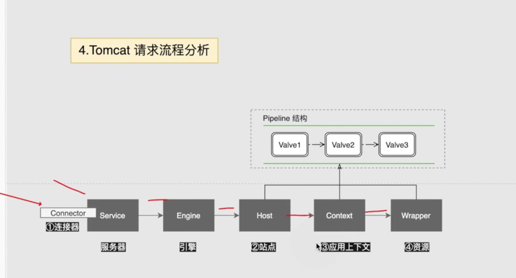
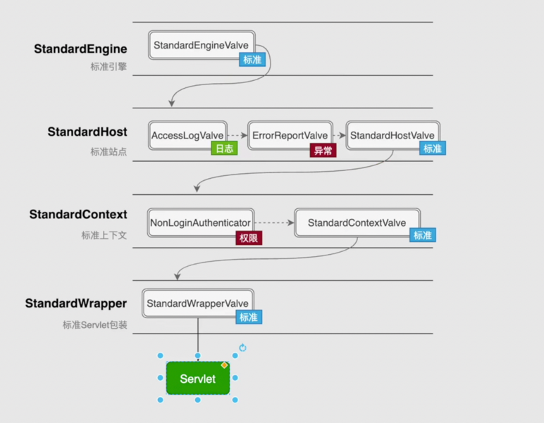
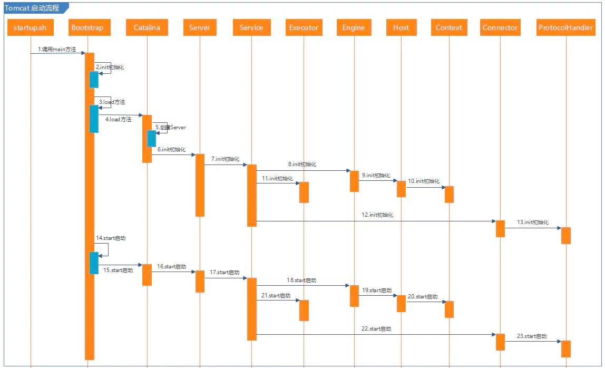

# tomcat

* [tomcat参数](https://www.cnblogs.com/kismetv/p/7806063.html#t2)
* [tomcat源码分析](https://www.jianshu.com/p/7c9401b85704)

## 请求流程分析

### valve pipeline

每个组件都可以使用valve管道，valve有标准的执行顺序

Http11NioProtocol NioEndpoint Acceptor 源码

lsof -i:8080

maxThreads=5
maxConnections=10 大于5个的部分会进入线程池队列等待
acceptCount=5
最大连接数是maxConnections+acceptCount

相当于医院科室 maxThreads是5个医生
maxConnections是十个挂号 包含看病的5个病人
acceptCount+maxConnections=15是科室最多容纳15个人

## tomcat源码分析

### 启动类

Bootstrap.main里面

### 请求处理

* [tomcat处理请求](https://blog.csdn.net/u013857458/article/details/82355879)
* [请求流程](https://blog.csdn.net/toking1979/article/details/83874978)

1. org.apache.tomcat.util.net.NioEndpoint.Acceptor#run()
2. org.apache.tomcat.util.net.NioEndpoint#setSocketOptions
3. org.apache.tomcat.util.net.NioEndpoint.Poller#register
4. org.apache.tomcat.util.net.NioEndpoint.Poller#addEvent
5. org.apache.tomcat.util.net.NioEndpoint.Poller#run
6. org.apache.tomcat.util.net.NioEndpoint.Poller#processKey
7. org.apache.tomcat.util.net.AbstractEndpoint#processSocket
8. java.util.concurrent.Executor.execute
9. org.apache.tomcat.util.net.SocketProcessorBase#run
10. org.apache.tomcat.util.net.NioEndpoint.SocketProcessor#doRun
11. org.apache.tomcat.util.net.AbstractEndpoint.Handler#process
12. org.apache.coyote.AbstractProtocol.ConnectionHandler#process
13. org.apache.coyote.Processor#process
14. org.apache.coyote.http11.Http11Processor#service
15. org.apache.catalina.connector.CoyoteAdapter#service
16. 顺序执行Pipeline Valve

### servlet启动执行流程

* [Tomcat之StandardWrapperValve的Servlet请求处理](https://blog.csdn.net/iteye_14395/article/details/82541852)
* [StandarWrapper源码分析](https://blog.csdn.net/fjslovejhl/article/details/21984391)

1. org.apache.catalina.core.StandardWrapperValve#invoke
2. org.apache.catalina.core.StandardWrapper#allocate 初始化servlet
3. org.apache.catalina.core.ApplicationFilterChain#doFilter 执行servlet的service方法

### tomcat参数配置生效代码

* [server.xml加载过程](https://www.cnblogs.com/jiaan-geng/p/4866009.html)

1. org.apache.catalina.startup.Catalina#load()
2. org.apache.catalina.startup.Catalina#createStartDigester 配置类 此方法创建解析server.xml的Digester，根据server.xml的元素标签，为每个标签设置相应的规则组，在解析标签时进行调用
3. org.apache.tomcat.util.digester.Digester#parse(org.xml.sax.InputSource) 加载xml
4. org.apache.tomcat.util.digester.Digester#getFactory

### 参数使用

1. org.apache.catalina.core.StandardThreadExecutor#startInternal
2. org.apache.tomcat.util.net.NioEndpoint#startInternal
3. org.apache.tomcat.util.net.AbstractEndpoint#createExecutor 创建线程池 使用配置的参数
4. org.apache.tomcat.util.net.AbstractEndpoint#processSocket 使用线程池

