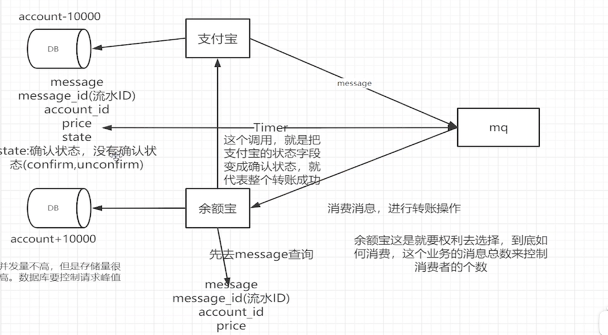

# 分布式事务

* [分布式事务：深入理解什么是2PC、3PC及TCC协议](https://blog.csdn.net/bjweimengshu/article/details/86698036)
* [分布式事务之2PC、3PC、TCC](https://blog.csdn.net/Delicious_Life/article/details/107934574/)

##  1. 二阶段提交 2PC

阶段

* 准备阶段
* 提交阶段

参与角色

* 协调者：事务的发起者
* 参与者：事务的执行者

### 1.1 阶段概述

1. 投票阶段
2. 提交阶段

案例 运动会 裁判为协调者 运动员为参与者

1. 性能问题：参与者事务阻塞，第三方访问资源进入阻塞状态
2. 可靠性问题：参与者发生故障的时候，协调者需要给每个参与者额外指定超时机制，超时后整个事务失败，
   协调者发生故障的时候，参与者会一致阻塞下去，需要额外的备机进行容错
3. 数据一致性问题：二阶段无法解决的问题，协调者在发出commit消息之后宕机，而唯一接收到这条消息的参与者同时也
   宕机了，那么即使协调者通过选举协议产生了新的协调者，这条事务的状态也是不确定的，没人知道事务是否已经被提交
   
* 优点：尽量保证了数据的强一致，适合对数据强一致要求很高的关键领域
* 缺点：实现复杂，牺牲了可用性，对性能影响较大，不适合高并发高性能场景

## 2. 三阶段提交协议 3PC

3PC是2PC的改进
* 在协调者和参与者中都引入的超时机制
* 在第一阶段和第二阶段中插入一个准备阶段，保证了在最后提交阶段之前各参节点状态是一致的

### 2.1 流程

* 1. can-commit 询问各个参与者是否可以正常执行，预估判断是否可以执行
* 2. pre-commit 正常执行进入pre-commit 不满足或者超时进入abort，执行事务但不提交
* 3. do-commit 向所有参与者发出事务提交通知
    
在doCommit阶段，如果参与者无法及时接收到来自协调者的doCommit或者rebort请求时，会在等待超时之后继续进行事务的提交

优点：相比2PC，3PC降低了阻塞范围，在等待超时后协调者或参与者会中断事务，避免了协调者单点问题，阶段3中协调者出现问题时，
参与者会继续提交事务

缺点：数据不一致性问题依然存在，协调者与参与者通信出现问题时，协调者想要终止事务会失败，参与者会继续进行事务提交

## 3. 分布式事务解决方案

* TCC
* 全局消息
* 基于可靠消息服务的分布式事务
* 最大努力通知

## 4. 事务补偿TCC

TCC是一种应用层面侵入业务的两阶段提交 代表项目ByteTCC

1. try阶段：主要是对业务系统做检测及资源预留 加锁 锁住资源
2. confirm cancel 

P10

## 5. seata

[alibaba seata](https://www.it235.com/%E9%AB%98%E7%BA%A7%E6%A1%86%E6%9E%B6/SpringCloudAlibaba/seata.html#seata%E7%AE%80%E4%BB%8B)

### 5.1 seata术语

* TC 事务协调者 维护全局和分支事务的状态，驱动全局事务提交或回滚
* TM 事务管理器 定义全局事务的范围，开始全局事务，提交或回滚全局事务
* RM 资源管理器 管理分支事务处理的资源，与TC交谈以注册分支事务和报告分支事务的状态，并驱动分支事务提交或回滚

undo_log表必须在每个业务数据库中创建，用于报错回滚操作数据

### 5.2 AT模式

* 三张表
* AT模式的一阶段二阶段提交和回滚均由seata框架自动生成，用户只需编写业务sql，便能轻松接入分布式事务，AT模式是一中对业务无侵入的分布式事务解决方案
最终一致性 性能较好，不是强一致性，会直接提交事务，通过undo log回滚

脏写问题 
脏读 其他事务可以读到部分提交事务
使用全局锁控制

#### 5.2.1 读写隔离

##### 1. 写隔离

* 一阶段本地事务提交前，需要确保先拿到 全局锁 。
* 拿不到 全局锁 ，不能提交本地事务。
* 拿 全局锁 的尝试被限制在一定范围内，超出范围将放弃，并回滚本地事务，释放本地锁。

##### 2. 读隔离

AT模式默认隔离级别是读未提交 RU，刻意使用for update进行加锁，申请seata全局锁

### 5.3 TCC

### 5.3 Saga

[saga分布式事务](https://zhuanlan.zhihu.com/p/705802862)

Saga事务与TCC事务实现方式相比，少了预留资源的操作，导致补偿动作的实现比较麻烦:Ti 就是commit，比如一个业务是发送邮件，在TCC模式下，先保存草稿 (Try)再发送(Confirm)，撤销的话直接删除草稿(Cancel)就行了。 而Saga则就直接发送邮件了(Ti)，如果要撤销则得再发送一份邮件说明 撤销(Ci)，实现起来有一些麻烦。

Saga和TCC都是补偿型事务，他们的区别为: 

劣势:
无法保证隔离性;

优势:
一阶段提交本地事务，无锁，高性能;
事件驱动模式，参与者可异步执行，高吞吐;
Saga 对业务侵入较小，只需要提供一个逆向操作的Cancel即可;而 TCC需要对业务进行全局性的流程改造;

Saga事务对于ACID的保证:

原子性（Atomicity）：正常情况下保证。
一致性（Consistency）：在某个时间点，会出现A库和B库的数据违反一致性要求的情况，但是最终是一致的。
隔离性（Isolation）：在某个时间点，A事务能够读到B事务部分提交的结果。
持久性（Durability）：和本地事务一样，只要commit则数据被持久。

### 5.4 XA模式

类似于2PC，强一致性，获取事务不提交，都执行完一起提交

性能较差

事务开启之后会锁定数据库资源，其他事务获取不到

## 基于mq实现的分布式事务

* [基于MQ的分布式事务实现方案](https://blog.csdn.net/m0_71777195/article/details/126622078)

1. 两张消息表 发消息和收消息都要表
2. 发消息的表 要存状态 消费者消息成功之后更新状态 解决消息丢失问题 
3. 收消息的表 存储业务id 幂等操作 解决重复消费问题
4. messageId 跨系统 唯一凭证 流水id
5. 余额宝处理成功之后 向支付宝发消息 更新状态
6. 定时任务定时处理 支付宝 未改状态的消息 重新发送

