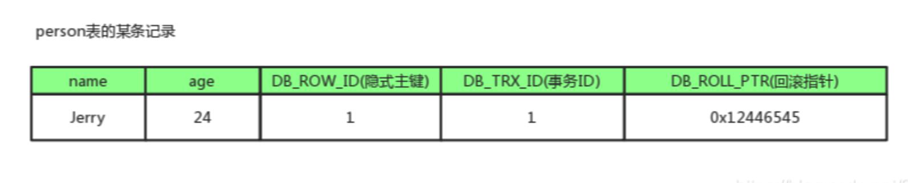

# innodb mvcc(多版本并发控制) 实现原理

* [【MySQL笔记】正确的理解MySQL的MVCC及实现原理](https://blog.csdn.net/SnailMann/article/details/94724197)

## 1. 什么是MVCC?

1. MVCC，全称Multi-Version Concurrency Control，即多版本并发控制。MVCC是一种并发控制的方法，一般在数据库管理系统中，实现对数据库的并发访问，在编程语言中实现事务内存。
2. MVCC在MySQL InnoDB中的实现主要是为了提高数据库并发性能，用更好的方式去处理读-写冲突，做到即使有读写冲突时，也能做到不加锁，非阻塞并发读

## 2. 什么是当前读和快照读？

### 2.1 当前读

像select lock in share mode(共享锁), select for update ; update, insert ,delete(排他锁)这些操作都是一种当前读，
为什么叫当前读？就是它读取的是记录的最新版本，读取时还要保证其他并发事务不能修改当前记录，会对读取的记录进行加锁

### 2.2 快照读

像不加锁的select操作就是快照读，即不加锁的非阻塞读；快照读的前提是隔离级别不是串行级别，串行级别下的快照读会退化成当前读；
之所以出现快照读的情况，是基于提高并发性能的考虑，快照读的实现是基于多版本并发控制，即MVCC,可以认为MVCC是行锁的一个变种，
但它在很多情况下，避免了加锁操作，降低了开销；既然是基于多版本，即快照读可能读到的并不一定是数据的最新版本，而有可能是之前的历史版本

## 3. 当前读，快照读和MVCC的关系

* 准确的说，MVCC多版本并发控制指的是 “维持一个数据的多个版本，使得读写操作没有冲突” 这么一个概念。仅仅是一个理想概念
* 而在MySQL中，实现这么一个MVCC理想概念，我们就需要MySQL提供具体的功能去实现它，而快照读就是MySQL为我们实现MVCC理想模型的其中一个具体非阻塞读功能。而相对而言，当前读就是悲观锁的具体功能实现
* 要说的再细致一些，快照读本身也是一个抽象概念，再深入研究。MVCC模型在MySQL中的具体实现则是由 3个隐式字段，undo日志 ，Read View 等去完成的，具体可以看下面的MVCC实现原理

## 4. MVCC能解决什么问题，好处是

### 4.1 数据库并发场景有三种，分别为：

读-读：不存在任何问题，也不需要并发控制
读-写：有线程安全问题，可能会造成事务隔离性问题，可能遇到脏读，幻读，不可重复读
写-写：有线程安全问题，可能会存在更新丢失问题，比如第一类更新丢失，第二类更新丢失

### 4.2 MVCC带来的好处是？

多版本并发控制（MVCC）是一种用来解决读-写冲突的无锁并发控制，也就是为事务分配单向增长的时间戳，为每个修改保存一个版本，版本与事务时间戳关联，读操作只读该事务开始前的数据库的快照。 所以MVCC可以为数据库解决以下问题

* 在并发读写数据库时，可以做到在读操作时不用阻塞写操作，写操作也不用阻塞读操作，提高了数据库并发读写的性能
* 同时还可以解决脏读，幻读，不可重复读等事务隔离问题，但不能解决更新丢失问题

## 5. MVCC的实现原理

MVCC的目的就是多版本并发控制，在数据库中的实现，就是为了解决读写冲突，它的实现原理主要是依赖记录中的 3个隐式字段，undo日志 ，Read View 来实现的。所以我们先来看看这个三个point的概念

### 5.1 隐式字段

每行记录除了我们自定义的字段外，还有数据库隐式定义的DB_TRX_ID,DB_ROLL_PTR,DB_ROW_ID等字段

1. DB_TRX_ID: 6byte，最近修改(修改/插入)事务ID：记录创建这条记录/最后一次修改该记录的事务ID
2. DB_ROLL_PTR: 7byte，回滚指针，指向这条记录的上一个版本（存储于rollback segment里）
3. DB_ROW_ID: 6byte，隐含的自增ID（隐藏主键），如果数据表没有主键，InnoDB会自动以DB_ROW_ID产生一个聚簇索引
实际还有一个删除flag隐藏字段, 既记录被更新或删除并不代表真的删除，而是删除flag变了

DB_ROW_ID是数据库默认为该行记录生成的唯一隐式主键，DB_TRX_ID是当前操作该记录的事务ID,而DB_ROLL_PTR是一个回滚指针，用于配合undo日志，指向上一个旧版本

### 5.2 undo日志

#### 5.2.1 insert undo log

代表事务在insert新记录时产生的undo log, 只在事务回滚时需要，并且在事务提交后可以被立即丢弃

#### 5.2.2 update undo log

事务在进行update或delete时产生的undo log; 不仅在事务回滚时需要，在快照读时也需要；所以不能随便删除，只有在快速读或事务回滚不涉及该日志时，对应的日志才会被purge线程统一清除

#### 5.2.3 purge

* 从前面的分析可以看出，为了实现InnoDB的MVCC机制，更新或者删除操作都只是设置一下老记录的deleted_bit，并不真正将过时的记录删除。
* 为了节省磁盘空间，InnoDB有专门的purge线程来清理deleted_bit为true的记录。为了不影响MVCC的正常工作，purge线程自己也维护了
一个read view（这个read view相当于系统中最老活跃事务的read view）;如果某个记录的deleted_bit为true，并且DB_TRX_ID相对
于purge线程的read view可见，那么这条记录一定是可以被安全清除的。

## 6. Read View(读视图)

每个事务在快照读的时候会生成一个read view，通过四个关键参数来判断某个版本是否对当前事务可见，当前事务主动去访问某个版本

Read View就是事务进行快照读操作的时候生产的读视图(Read View)，在该事务执行的快照读的那一刻，会生成数据库系统当前的一个快照，
记录并维护系统当前活跃事务的ID(当每个事务开启时，都会被分配一个ID, 这个ID是递增的，所以最新的事务，ID值越大)

所以我们知道 Read View主要是用来做可见性判断的, 即当我们某个事务执行快照读的时候，对该记录创建一个Read View读视图，
把它比作条件用来判断当前事务能够看到哪个版本的数据，既可能是当前最新的数据，也有可能是该行记录的undo log里面的某个版本的数据。

Read View遵循一个可见性算法，主要是将要被修改的数据的最新记录中的DB_TRX_ID（即当前事务ID）取出来，
与系统当前其他活跃事务的ID去对比（由Read View维护），如果DB_TRX_ID跟Read View的属性做了某些比较，
不符合可见性，那就通过DB_ROLL_PTR回滚指针去取出Undo Log中的DB_TRX_ID再比较，即遍历链表的DB_TRX_ID
（从链首到链尾，即从最近的一次修改查起），直到找到满足特定条件的DB_TRX_ID, 那么这个DB_TRX_ID所在的旧
记录就是当前事务能看见的最新老版本

### Read View 三个全局属性

* m_ids：表示在生成readview时，当前系统中活跃的读写事务id列表；
* min_trx_id：表示在生成readview时，当前系统中活跃的读写事务中最小的事务id，也就是m_ids中最小的值；
* max_trx_id：表示生成readview时，系统中应该分配给下一个事务的id值；
* creator_trx_id：表示生成该readview的事务的事务id；
  
### 判断记录的某个版本是否可见

1. 如果被访问版本的trx_id，与readview中的creator_trx_id值相同，表明当前事务在访问自己修改过的记录，该版本可以被当前事务访问；
2. 如果被访问版本的trx_id，小于readview中的min_trx_id值，表明生成该版本的事务在当前事务生成readview前已经提交，该版本可以被当前事务访问；
3. 如果被访问版本的trx_id，大于或等于readview中的max_trx_id值，表明生成该版本的事务在当前事务生成readview后才开启，该版本不可以被当前事务访问；
4. 如果被访问版本的trx_id，值在readview的min_trx_id和max_trx_id之间，就需要判断trx_id属性值是不是在m_ids列表中？

* 如果在：说明创建readview时生成该版本的事务还是活跃的，该版本不可以被访问
* 如果不在：说明创建readview时生成该版本的事务已经被提交，该版本可以被访问；

## 7. 整体流程

我们在了解了隐式字段，undo log， 以及Read View的概念之后，就可以来看看MVCC实现的整体流程是怎么样了

整体的流程是怎么样的呢？我们可以模拟一下

当事务2对某行数据执行了快照读，数据库为该行数据生成一个Read View读视图，假设当前事务ID为2，此时还有事务1和事务3在活跃中，事务4在事务2快照读前一刻提交更新了，所以Read View记录了系统当前活跃事务1，3的ID，维护在一个列表上，假设我们称为trx_list

## 8. RC,RR级别下的InnoDB快照读有什么不同？

正是Read View生成时机的不同，从而造成RC,RR级别下快照读的结果的不同

* 在RR级别下的某个事务的对某条记录的第一次快照读会创建一个快照及Read View, 将当前系统活跃的其他事务记录起来，此后在调用快照读的时候，
还是使用的是同一个Read View，所以只要当前事务在其他事务提交更新之前使用过快照读，那么之后的快照读使用的都是同一个Read View，所以对之后的修改不可见；
* 即RR级别下，快照读生成Read View时，Read View会记录此时所有其他活动事务的快照，这些事务的修改对于当前事务都是不可见的。而早于Read View创建的事务所做的修改均是可见
* 而在RC级别下的，事务中，每次快照读都会新生成一个快照和Read View, 这就是我们在RC级别下的事务中可以看到别的事务提交的更新的原因

### 8.1 重要结论

总之在RC隔离级别下，是每个快照读都会生成并获取最新的Read View；而在RR隔离级别下，则是同一个事务中的第一个快照读才会创建Read View, 之后的快照读获取的都是同一个Read View。
