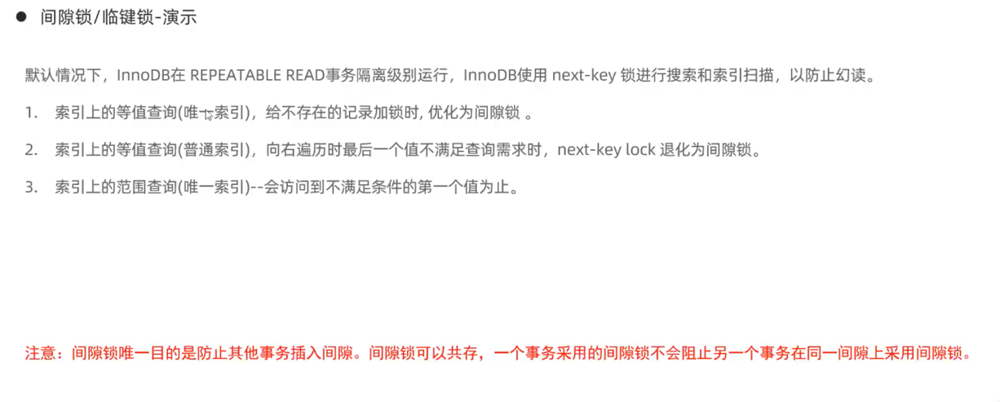

# mysql锁

* [mysql数据库锁的原理](https://www.bilibili.com/video/BV1Z8411F7M3)

## 全局锁

加锁之后只能读 不能写 用作备份
加锁
flush tables with read lock;

解锁
unlock tables;

可以不加全局锁进行备份 使用innodb快照读实现
mysqldump --single-transaction -u root -p 数据库名 > 备份文件.sql

## 表锁

1. 表共享读锁 read lock 可以正常读取select,不能写入insert,update,delete
2. 表独占写锁 write lock 其他客户端不能读写

加锁
lock table 表名 read/write;
解锁
unlock tables;

## 元数据锁 meta data lock

查看元数据锁
select * from performance_schema.meta_locks;

alter 语句会申请EXCLUSIVE排它锁 与其他锁互斥

## 意向锁 

解决innodb引擎行锁与表锁冲突问题

加表锁的时候需要检查是否已经加了行锁，这种效率低下，出现意向锁减少检查

通过意向锁和意向锁类型判断表锁是否加成功

意向共享锁 IS select lock in share mode，与表锁共享锁read兼容，与表锁排它锁write互斥
意向排它锁 IX insert update，select for update，与表锁两个锁都互斥，意向锁之间不会互斥

select * from performance_schema.data_locks 查看加锁情况

## 行级锁

行锁对索引上的索引项进行加锁实现，而不是对记录加锁

1. 行锁：锁住单个行记录，防止其他事务对此行进行update delete，在RC，RR下都支持
2. 间隙锁：锁住索引间的间隙，不包含该记录，确保索引记录间隙不变，防止其他事务在这个间隙进行insert，产生幻读，RR级别支持
3. 临键锁（next-key lock）：行锁和间隙锁的结合，同时锁住数据，并锁住数据前面的间隙gap，在RR隔离级别下支持

### 行锁

1. 针对唯一索引进行检索时，对已存在的记录进行等值匹配时，将会自动优化为行锁
2. 不通过索引进行检索数据，加锁会升级为表锁

* 
* 

### 间隙锁和临键锁

1. 间隙锁不包含间隙两端的数据

* 

## 死锁

X锁：读锁
S锁：写锁

https://www.bilibili.com/video/BV1TC4y1Q7Ym

两种死锁情况
使用 show engine innodb status 查看最新一条死锁信息
