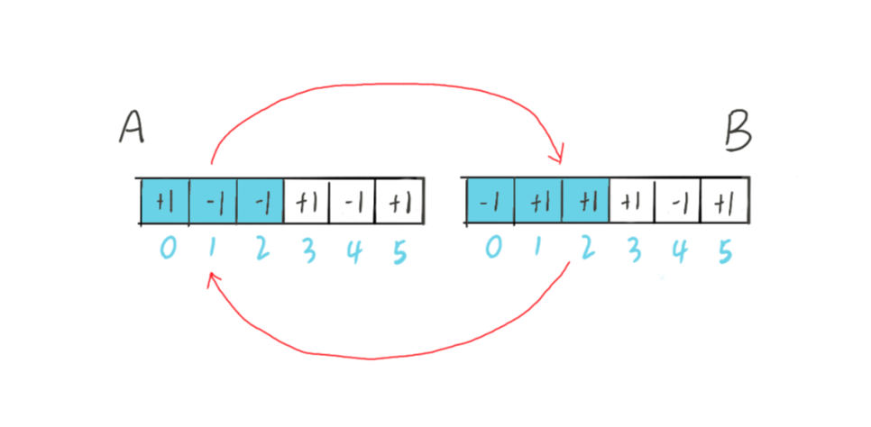

# 有序进栈下出栈元素总数 卡特兰数

* [卡特兰数](https://zhuanlan.zhihu.com/p/97619085)
* 

有n个元素进栈，出栈元素总数为多少？

进栈：1，出栈 -1

总共有2n个0和1

n位是1 n位是-1

2n个位置中选n个位置放1，剩下的位置放-1 总共有C(2n,n)种可能

但是有不符合要求的序列

比如n=3的序列 ：+1 -1 -1 +1 -1 +1
奇数位 -1 的个数 多余 1 的个数，这种序列是不合理的

前缀和概念：从第一位到任意一位相加

合法序列前缀和：任何一个前缀和都大于等于0
不合法序列前缀和：存在一个前缀和小于0

不合法序列取反 -1 +1 +1 +1 -1 +1

这时进栈n+1，出栈n-1

下面这张图表示A和B序列是一一对应的

假设非法序列为 A，对应的序列为 B。每个 A 只有一个"第一个前缀和小于 0 的前缀"，
所以每个 A 只能产生一个 B。而每个 B 想要还原到 A，就需要找到"第一个前缀和大于 0 的前缀"，
显然 B 也只能产生一个 A。

所有B序列转换到A都是不合法的，因为B序列+1的个数是大于-1的个数，所以不合法的序列个数是C(2n,n+1)

进出栈总数=C(2n,n)-C(2n,n+1) = C(2n,n)/(n+1)
