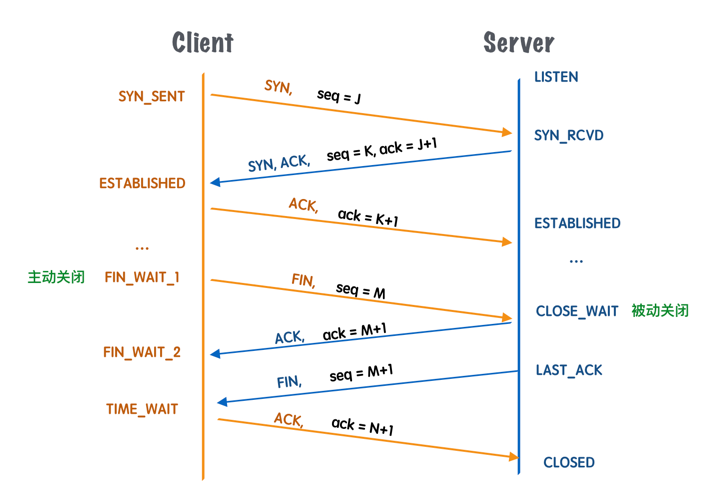
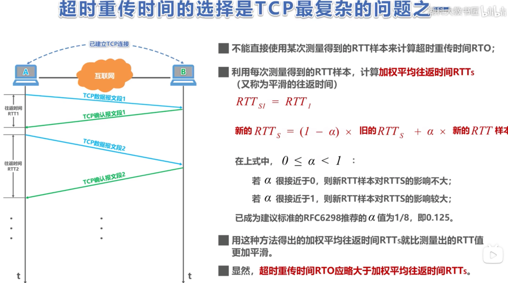
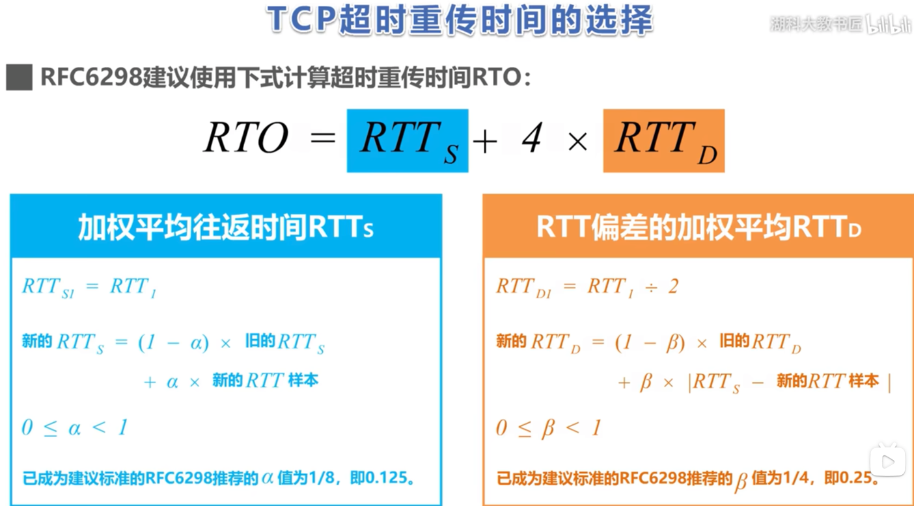
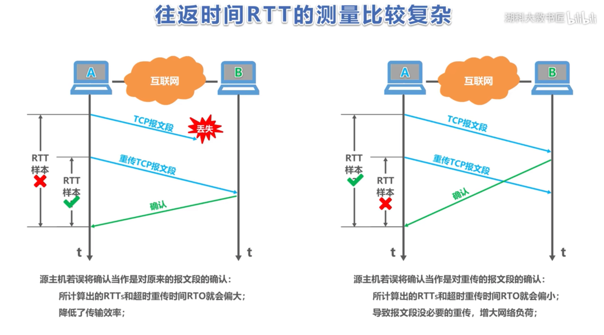
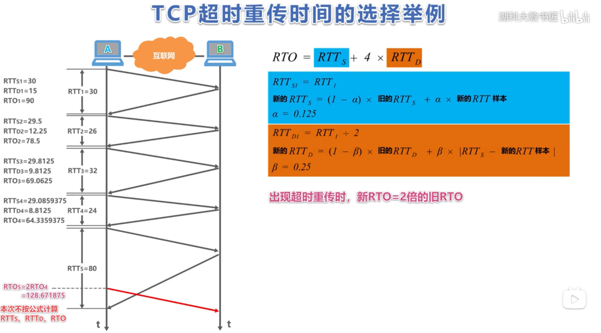

# TCP/IP

* [关于TCP为什么三次握手和四次挥手，满分回答在此](https://zhuanlan.zhihu.com/p/496244348)
* [计算机网络—RTT-RTTS-RTTD和RTO的解释及例题讲解](https://blog.csdn.net/weixin_41826637/article/details/137674049)
* [TCP超时重传时间的选择](https://www.bilibili.com/video/BV1S4411E7rx)

## 三次握手四次挥手

SYN请求同步 握手，ACK 确认

* 第一次握手（客户端发送 SYN 报文给服务器，服务器接收该报文）：客户端什么都不能确认；服务器确认了对方发送正常，自己接收正常
* 第二次握手（服务器响应 SYN 报文给客户端，客户端接收该报文）：客户端确认了：自己发送、接收正常，对方发送、接收正常；服务器确认了：对方发送正常，自己接收正常
* 第三次握手（客户端发送 ACK 报文给服务器）：客户端确认了：自己发送、接收正常，对方发送、接收正常； 服务器确认了：自己发送、接收正常，对方发送、接收正常

* 四次挥手 客户端在发送完ACK消息后进入TIME_WAIT状态，不会立即close，如果服务端接收消息失败会重新发送FIN消息

## 超时重传

* [计算机网络—RTT-RTTS-RTTD和RTO的解释及例题讲解](https://blog.csdn.net/weixin_41826637/article/details/137674049)
* [TCP超时重传时间的选择](https://www.bilibili.com/video/BV1S4411E7rx)

1. RTT：往返时延
2. RTTS：平滑往返时间
3. RTTD：往返偏移时间
4. RTO：超时重传时间

RTO（超时重传时间）的值要稍微大于往返时间RTT1（往返时间）的值

不能使用某次测量的RTT时间来确定RTO时间

* 针对出现超时重传时无法测准往返时间RTT的问题，
Karn提出了一个算法:在计算加权平均往返时间RTTS时，
只要报文段重传了，就不采用其往返时间RTT样本。
也就是出现重传时，不重新计算RTTS，进而超时重传时间RTO也不会重新计算
* 这又引起了新的问题。设想出现这样的情况:报文段的时延突然增大了很多，
并且之后很长一段时间都会保持这种时延。因此在原来得出的重传时间内，
不会收到确认报文段。于是就重传报文段。但根据Karn算法，
不考虑重传的报文段的往返时间样本。这样，超时重传时间就无法更新。这会导致报文段反复被重传。
* 因此，要对Karn算法进行修正。方法是:报文段每重传一次，
就把超时重传时间RTO增大一些。典型的做法是将新RTO的值取为I日RTO值的2倍。

## 为什么不是3次挥手

1. 客户端向服务端发送FIN ack报文
2. 服务端接到1的报文 发送ACK报文给客户端 进入CLOSE_WAIT状态
3. 服务端需要等一段时间释放资源再发送FIN报文给客户端
4. 如何两次合并成一次 可能会触发超时重发 超过30秒会重发 资源浪费
