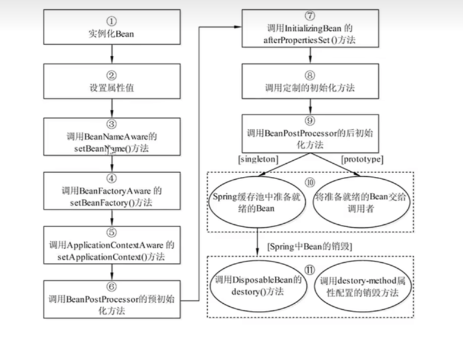
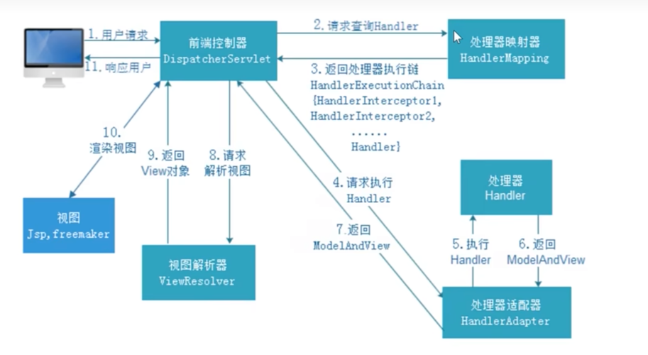
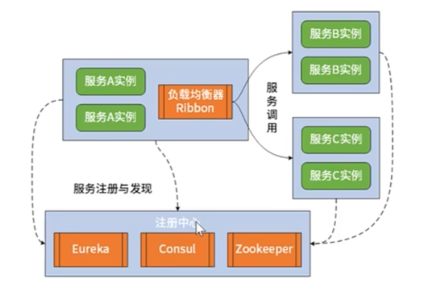
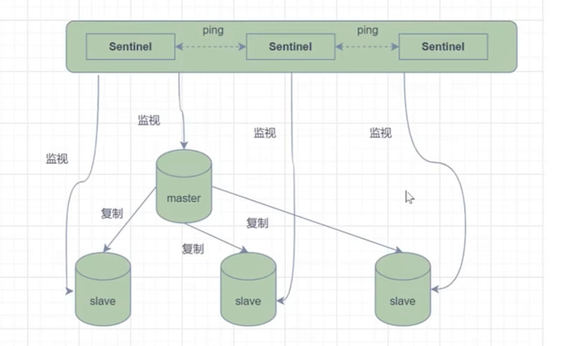

# 问题2024

https://www.bilibili.com/video/BV1Pmy6YuEmn

## mybatis缓存机制

从源码角度分析mybatis缓存机制

实际使用情况缓存都是关闭状态

* [Mybatis的缓存机制](https://blog.csdn.net/qq_45794852/article/details/139259512)

关闭一级缓存 二级缓存默认关闭
mybatis-plus.configuration.local-cache-scope: statement

## jvm区域

移除了永久代(PermGen)，替换为元空间(Metaspace)。
* 永久代中的class metadata(类元信息)转移到了native memory(本地内存，而不是虚拟机)
* 永久代中的interned Strings(字符串常量池)和 class static variables(类静态变量)转移到了Java heap
* 永久代参数(PermSize MaxPermSize)->元空间参数(MetaspaceSize。MaxMetaspaceSize)

Java8为什么要将永久代替换成Metaspace?
* 字符串存在永久代中，容易出现性能问题和内存溢出。
* 类及方法的信息等比较难确定其大小，因此对于永久代的大小指定比较困难，太小容易出现永久代溢出，太大则容易导致老年代溢出。
* 永久代会为 GC 带来不必要的复杂度，并且回收效率偏低。
* Oracle 可能会将HotSpot 与 JRockit 合二为一，JRockit没有所谓的永久代。

## 常用的垃圾收集器介绍

* [jvm垃圾回收器](https://www.cnblogs.com/chenpt/p/9803298.html)

* [jvm](/doc/java/jvm.md)

### 串行回收器

* Serial收集器

### 并行回收器

* CMS

### 组合

jdk8 默认使用 Parallel Scavenge + Parallel Old 组合收集器
jdk9 默认使用 G1 组合收集器
jdk14 弃用Parallel Scavenge + Parallel Old 组合收集器
jdk14 移除了CMS收集器，使用G1

新生代收集器：Serial、ParNew、Parallel Scavenge
老年代收集器：CMS、Serial Old、Parallel Old

### CMS

初始标记：标记GC Roots能直接到的对象。速度很快但是仍存在Stop The World问题。

并发标记：进行GC Roots Tracing 的过程，找出存活对象且用户线程可并发执行。

重新标记：为了修正并发标记期间因用户程序继续运行而导致标记产生变动的那一部分对象的标记记录。仍然存在Stop The World问题。

并发清除：对标记的对象进行清除回收。

1. 初始标记（CMS initial mark），根节点直接引用的对象标记为灰色（短暂的STW）
2. 并发标记（CMS concurrent mark）扫描灰色对象引用的对象并标记为灰色，原灰色对象标记为黑色
3. 重新标记（CMS remark）增量更新方案矫正并发标记阶段的错误（短暂的STW）
4. 并发清除（CMS concurrent sweep）清除白色的对象，内存回收

### G1

初始标记：仅标记GC Roots能直接到的对象，并且修改TAMS（Next Top at Mark Start）的值，让下一阶段用户程序并发运行时，能在正确可用的Region中创建新对象。（需要线程停顿，但耗时很短。）

并发标记：从GC Roots开始对堆中对象进行可达性分析，找出存活对象。（耗时较长，但可与用户程序并发执行）

最终标记：为了修正在并发标记期间因用户程序执行而导致标记产生变化的那一部分标记记录。且对象的变化记录在线程Remembered Set  Logs里面，把Remembered Set  Logs里面的数据合并到Remembered Set中。（需要线程停顿，但可并行执行。）

筛选回收：对各个Region的回收价值和成本进行排序，根据用户所期望的GC停顿时间来制定回收计划。（可并发执行）

### 漏标多标

* [JVM 中的三色标记法](https://blog.csdn.net/qq_45038038/article/details/134621784)

* CMS在重新标记矫正
* G1在最终标记修正

## 可达性分析

### 能作为GC Roots的对象

* 在虚拟机栈（栈帧中的本地变量表）中引用的对象，如各个线程被调用的方法堆栈中使用到的参数，局部变量，临时变量
* 在方法区中类静态属性引用的对象，如Java类的引用类型静态变量
* 在方法区中常量引用的对象，如字符串常量池里的引用
* 在本地方法栈中JNI（Native方法）引用的对象
* Java虚拟机内部的引用，如基本数据类型对应的Class对象，一些异常对象（如NullPointException，OutOfMemoryError）等，还有系统类加载器
* 所有被synchronized关键字持有的对象
* 反映Java虚拟机内部情况的JMXBean，JVMTI中注册的回调，本地代码缓存等

### finalize()方法最终判定对象是否存活

* [可达性分析算法中不可达的对象还有机会存活吗](https://blog.csdn.net/weixin_50687701/article/details/141804134)

即使在可达性分析中判定不可达的对象，也不是一定要回收的，至少还要经历两次标记过程

1. 第一次标记
2. 第二次标记

## 如何防止重复下单

1. 前端控制，点击第一次之后不可点击
2. 后端使用redis setnx key=用户token+商品url+redisKey 过期时间 3-5秒 可以使用自定义注解抽象功能

## 如何理解双亲委派模型

### 什么是双亲委派模型

启动类加载器（Bootstrap ClassLoader）负责加载主类。
扩展类加载器（Extension ClassLoader）负责加载被扩展类。
应用程序类加载器（Application ClassLoader）负责加载用户自定义的类。

如果一个类加载器收到了请求，它首先不会自己去尝试加载这个类，而是把请求委托给父类加载器去完成。

### 为什么要用双亲委派模型

自定义java.lang.String类，双亲委派模型这个类是不会被加载的，因为String类是java.lang包下的。
安全考虑

### 如何实现双亲委派模型

* 在加载类的时候，如果父类加载器不能完成请求，则交给子类加载器去完成。

#### 几个重要函数

loadClass()

自定义类加载器 重写findClass方法

### 如果指定的名称类为字节数组的话 如何处理

defineClass() 方法把字节数组转为class对象

## 如何理解内存泄露

### 什么是内存泄露

内存中开辟的空间一直没有得到释放，导致内存无法被回收。

1. 大量使用static变量
2. 连接资源未关闭
3. equals()和hashCode()方法使用不当 集合添加对象认为是不同对象
4. 内部类持有外部类对象
5. finalize方法 进入队列但是一直没有调用这段时间回一直占用内存导致内存无法回收 在对象被回收之前，JVM 会检查该对象是否重写了 finalize() 方法。如果重写了，JVM 会将该对象放入 finalization 队列中
6. ThreadLocal错误使用

### 如何检查内存泄露

VisualVM

IDEA -verbose:gc

### 内存泄露危害

### 如何避免内存泄露

## 什么是内存溢出 如何处理内存溢出

申请的内存不够了，导致OOM，内存溢出是内存无法释放，最终会导致内存溢出

### 出现的几种情况

1. 永久代溢出 OOM PermGen Space 持久带溢出，常量池溢出，字符串常量池溢出，大量的jar或者class
2. 老年代溢出 OOM java heap Space 堆溢出 创建对象太多 -Xmx最大堆 -Xms初始最小堆
3. 虚拟机栈和本地方法栈溢出 stackOverflow 请求栈的深度超过最大栈深度，内存不够OOM

### 如何排查

MAT 分析dump快照文件 查看堆内存使用情况

GC排查 启动打印参数-XX:+PrintGCDetails -XX:+PrintGCDateStamps -Xloggc:/tmp/gc.log

#### 堆内内存

#### 堆外内存

### GC日志排查

youngGC过于频繁（小对象多），时间过高（GC耗时分布），FULL GC

## 堆内存参数如何设置

* 6区:jdk8开始的metaspace、直接内存、codeCache、堆、栈、持久代
* 3器:JIT编译模式，垃圾回收器，并发收集器配置
* 3日志:gc日志、快照dump、NM千日志1GC:代码禁用GC

### 堆设置
* -Xms:初始堆大小，如4096M
* -Xmx:最大堆大小，如4096M,如果xms>xmx，那默认空余堆内存小于40%会触发调整到xmx
* -XX:Newsize=n:设置年轻代大小，如1024-Xmn1024M 设置年轻代大小为1024M
* -XX:NewRatio=n:设置年老代和年轻代的比值。建议值为3至5，如4，表示年老代:年轻代=4:1，年轻代占整个年轻代年老代和的1/5
* -XX:SurvivorRatio=n:年轻代中Eden区与两个Survivor区的比值。建议值3-5。注意Survivor区有两个。如8，表示2*Survivor:Eden=2:8，一个Survivor区占整个年轻代的1/10

注意:如果伊甸园和生存者太小，新出来的对象直接进入旧的，那么除非发生全GC，否则对象不可能被回收。

### 持久代大小(jdk1.8开始已消除该区域，由metaspace替代)
* -XX:MaxPermsize=n:设置持久代最大内存
* -XX:Permsize=512m:持久代初始内存
* -XX:+CMSClassUnloadingEnabled
如果你启用了cMSClassUnloadingEnabled ，垃圾回收会清理持久代，移除不再使用的classes。这个参数只有在 UseconcMarksweepGc 也启用的情况下才有用。
* 持久代和老生代、新生代的关系:
持久代本质就是方法区的一部分，存放class信息，静态代码，类信息等。
新生代和老生代都是属于堆，所以总结下就是持久代和新生代老生代没有关系。

### 单个线程堆栈大小设置
* -Xss512k 现在默认1M，一般建议512k就够了。如果Xss设置过大，则浪费内存空间，使得线程个数受限制;操作系统也会限制进程允许创建的线程数，使用ulimit -u命令查看限制。某些服务器上此阈值设置的过小，比如1024。此时可以调大。
如果Xss设置过小，代码中有遍历或递归导致调用太深的时候，就有可能耗尽StackSpace，爆出Stackoverflow的错误;

### 垃圾回收统计信息

* -XX:+PrintGC
* -XX:+PrintGCDetails
* -XX:+PrintGCTimeStamps
* -Xloggc:filename

### 禁止显示GC和快异常处理

### metaspace参数设置

### oom时是否dump快照
* -XX:+HeapDumpOnoutOfMemoryError 发生0utofMemoryError错误时,进行快照存储-XX:HeapDumpPath=/data/zhipin-bi/tomcat/bin/dump.hprof 设置快照存储的位置 

### 直接内存:类似direce buffer直接分配的内存
-XX:MaxDirectMemorySize=512M

### codeCatch

### JIT编译器设置

## mysql主从同步如何实现的

### 主从同步的重要性

* 解决数据可靠性
* mysql高可用
* 应对高并发

### 常见问题

* 为什么从节点故障会影响主节点
* 为什么主从切换之后丢数据了
* 为什么没有更新数据 客户端读到的数据还是变来变去的

### 如何配置mysql主从同步

从库复制主库binlog，回放binlog，中继日志relay log

同步：从节点同步之后主节点再提交事务 性能较差
异步复制：性能较好 但是不可用

这两种方式都没办法使用 

mysql5.7之后提供半同步复制：只要有一部分从库同步成功响应了，主库就返回给客户端

rpl_semi_sync_master_wait_no_slave 至少等待数据复制到几个从节点再返回

rpl_semi_sync_master_wait_point 控制主库执行的线程 提交执行事务之前等待复制AFTER_SYNC AFTER_COMMIT

## 对数据库ACID的理解

* 原子性（Atomicity）：单个事务为一个完整的最小操作单元，不可分割。整个事务要么全部commit成功，要么全部rollback失败
* 一致性（Consistency）：数据库总是从一个一致性的状态转换到另一个一致性的状态，要么修改之后提交成功，要么失败撤销所有修改
* 隔离性（Isolation）：在某个时间点，一个事务读不到另一个事务的修改 不可见
* 持久性（Durability）：和本地事务一样，只要commit则数据被持久。

### 原理上聊一下ACID具体是怎么实现的

对MySQL来说，逻辑备份日志(binlog)、重做日志(redolog)回滚日志(undolog)、锁技术 + MVCC就是MySQL实现事务的基础。

* 原子性:通过undo log来实现。
* 持久性:通过binlog、redo log来实现,
* 隔离性:通过(读写锁+MVCC)来实现。 对应四种隔离级别
* 一致性: MySQL通过原子性，持久性，隔离性最终实现(或者说定义)数据一致性。

### 隔离级别

* 读未提交(Read Uncommitted)：一个事务可以读到另一个事务未提交的数据。
* 读已提交(Read Committed)：一个事务只能读到另一个事务已经提交的数据。
* 可重复读(Repeatable Read)：一个事务执行过程中看到的数据，跟这个事务在启动时看到的数据是一致的
* 串行化(Serializable)：所有事务必须等待前一个事务提交后才能执行。

## MYSQL INNODB的MVCC

MVCC全称 Multi-Version Concurrency Control 多版本并发控制，解决无锁并发控制问题。

Mysql的大多数事务型存储引擎实现的InnoDB的一致性的非锁定读就是通过在MVCC实现的都不是简单的行级锁。基于提升并发性能的考虑，
它门一般都同时实现了多版本并发控制点的快照来实现的。因此每一个事务无(MVCC)。 MVCC的实现，是通过保存数据在某一个时间论执行多长时间看到的数据，都是一样的。

* 快照读:select语句默认，不加锁，MVCC实现可重复读，使用的是MVCC机制读取undo中的已经提交的数据。所以它的读取是非阻塞的
* 当前读:select语句加s锁或X锁;所有的修改操作加X锁，在select for update 的时候，才是当地前读。

行记录隐藏字段

* db_row_id，行ID，用来生成默认聚簇索引(聚簇索引，保存的数据在物理磁盘中按顺序。保存，这样相关数据保存在一起，提高查询速度)
* db_trx_id，事务ID，新开始一个事务时生成，实例内全局唯一。
* db_roll_ptr，undo log指针，指向对应记录当前的undolog
* deleted_bit，删除标记位，删除时设置
* undo log 用于行记录回滚，同时用于实现MVCC

RR级别的MVCC实现：可能会出现幻读

## innodb和myisam的区别

1. innodb支持事务，myisam不支持，innodb每一条sql都默认封装成事务，多条执行速度较慢，多条语句放在begin和commit之间
2. innodb支持外键，myisam不支持
3. innodb是聚集索引 数据和索引绑定在一起 文件名称是 ，myisam是非聚集索引 数据文件（.MYD）和索引文件(.MYI)是分离的
4. innodb有主键，myisam没有主键
5. innodb主键索引和主键索引有层级关系，myisam是平级关系
6. innodb不保存具体行数 count(*)全表扫描，myisam保存具体行数
7. innodb不支持全文检索 5.7之后支持全文检索，myisam支持全文检索
8. innodb支持表级锁 行级锁，默认行级锁 未命中索引退化为表级锁。 myisam支持表级锁
9. innodb存储文件有frm idb（数据+索引），myisam存储文件只有 frm MYD MYI。mysql8.0 取消了frm文件

### 如何选择

判断是否需要支持事务，如果要请选择 InnoDB，如果不需要可以考虑MyISAM;如果表中绝大多数都只是读查询，可以考虑 MyISAM，如果既有读也有写，那还是使用InnoDB吧。
系统奔溃后，MyISAM恢复起来更困难;
MySQL5.5 版本开始 InnoDB 已经成为 MysQL 的默认引擎(之前是MyISAM)，说明其优势是有目共睹的，如果你不知道用什么，那就用InnoDB，至少不会差，

## 聚簇索引和非聚簇索引的区别

### 聚簇索引

聚簇索引(Clustered Index)一般指的是主键索引(如果存在主键索引的话)，聚簇索引也被称之为聚集索引。
聚簇索引在 InnoDB 中是使用 B+ 树实现的

### 非聚簇索引 二级索引

非聚簇索引(Non-Clustered Index)一般指的是辅助索引，也被称之为二级索引。
非聚簇索引存的是 主键id，之后再回表查询数据

* 聚簇索引叶子节点存储的是行数据;而非聚簇索引叶子节点存储的是聚簇索引(通常是主键 ID)。
* 聚簇索引查询效率更高，而非聚簇索引需要进行回表査询，因此性能不如聚簇索引。
* 聚簇索引一般为主键索引，而主键一个表中只能有一个，因此聚簇索引一个表中也只能有一个，而非聚簇索引则没有数量上的限制。

## 创建索引时应该注意的问题

优点：加快查询速度
缺点：索引占用磁盘空间，会影响插入速度

索引不包含有null值的列

### 1、索引不会包含有null值的列

只要列中包含有null值都将不会被包含在索引中，复合索引中只要有一列含有null值那么这一列对于此复合索引就是无效的。所以我们在数据库设计时建议不要让字段的默认值为null。

### 2、使用短索引（前缀索引）

```sql
CREATE INDEX index_name ON table_name(column_name(length));
```

对串列进行索引，如果可能应该指定一个前缀长度。例如，如果有一个char(255)的列，如果在前10个或20个字符内，多数值是惟一的，那么就不要对整个列进行索引。短索引不仅可以提高查询速度而且可以节省磁盘空间和!0操作。

### 3、索引列排序

查询只使用一个索引，因此如果where子句中已经使用了索引的话，那么order by中的列是不会使用索引的。因此数据库默认排序可以符合要求的情况下不要使用排序操作;尽量不要包含多个列的排序，如果需要最好给这些列创建复合索引。

### 4、like语句操作

一般情况下不推荐使用like操作，如果非使用不可，如何使用也是一个问题。like%陈%不会使用索引而like 陈% 可以使用索引。

## 面向对象的6大设计原则

1. 开闭原则：对扩展开放，对修改关闭
2. 单一职责原则：一个类只负责一件事
3. 里氏替换原则：子类必须能够替换父类
4. 依赖倒置原则：高层模块不应该依赖低层模块，二者都应该依赖抽象
5. 接口隔离原则：客户端不应该依赖它不需要的服务
6. 迪米特原则 最少知道原则：一个对象应该对其他对象有最少的了解

## 设计模式

### 创建型

创建型模式主要处理对象的创建过程，使得创建对象的过程更加灵活和可扩展。主要包括以下几种：

* ‌单例模式‌：确保一个类只有一个实例，并提供一个全局访问点。
* ‌工厂方法模式‌：定义一个用于创建对象的接口，让子类决定实例化哪一个类。
* ‌抽象工厂模式‌：提供一个接口，用于创建相关或依赖对象的家族，而不需要明确指定具体类。
* ‌建造者模式‌：使用多个简单的对象一步一步构建成一个复杂对象。
* ‌原型模式‌：通过复制现有的实例来创建新的实例‌12。

### 行为型

行为型模式主要处理对象之间的交互和通信。主要包括以下几种：

* ‌模板方法模式‌：定义一个操作中的算法的骨架，将算法的一些步骤延迟到子类中。
* ‌命令模式‌：将请求封装成对象，从而可使用参数化和其他命令队列。
* ‌迭代器模式‌：提供一种方法顺序访问一个容器对象中各个元素，而又无需暴露该对象的内部细节。
* ‌观察者模式‌：当一个对象改变状态时，其所有依赖者都会得到通知。
* ‌中介者模式‌：用一个统一的对象来管理不同的对象之间的交互，避免对象之间的紧耦合。
* ‌备忘录模式‌：在不破坏封装的前提下，捕获和恢复对象的状态。
* ‌状态模式‌：允许一个对象在其内部状态改变时改变它的行为。
* ‌策略模式‌：定义一系列的算法，把它们一个个封装起来，并使它们可相互替换。
* ‌职责链模式‌：将请求发送到多个对象中的一个，当没有对象对它负责时才发送到下一个对象‌12。

### 结构型

结构型模式主要处理类或对象的组合，以实现更复杂的结构。主要包括以下几种：

* ‌适配器模式‌：结合两个不兼容的接口。
* ‌桥接模式‌：通过封装一个抽象的接口，使得实现和抽象可以独立变化。
* ‌装饰模式‌：动态地给一个对象添加一些额外的职责。
* ‌组合模式‌：创建对象组的树形结构，使得单个对象和组合对象具有一致性。
* ‌外观模式‌：为复杂的模块或子系统提供可以访问的接口，并且隐藏了内部的复杂性。
* ‌享元模式‌：通过共享技术有效地支持大量细粒度的对象。
* ‌代理模式‌：为其他对象提供一种代理以控制对这个对象的访问‌12。

## redis缓存穿透，缓存击穿，缓存雪崩

### 缓存穿透

https://blog.csdn.net/weixin_43903474/article/details/138817600 这里面讲了布隆过滤器的问题

三、布隆过滤器存在的问题：
1、初始化后，对应商品被删怎么办：

方案一：定时异步重建布隆过滤器。比如说我们每过 4 个小时在额外的一台服务器上，异步去执行一个任务调度，来重新生成布隆过滤器，替换掉已有的布隆过滤器。

方案二：计数布隆过滤器:将布隆过滤器的每一位扩展成计数器，拥有若干位，缺点是占用的空间成倍增加。

2、布隆过滤器的数据怎么迁移（扩容）：

添加一个新的过滤器，采用多层过滤的形式。（其他方法暂时不清楚）


缓存穿透是指查询一个不存在的key，由于缓存没有对应的数据，导致每次请求都去数据库中查询。

1. 使用布隆过滤器，将查询的key放到布隆过滤器中，如果布隆过滤器中没有对应的key，则说明这个key不存在。
2. null值放入缓存 在恶意攻击的时候 缓存中很多key对应空值

### 缓存击穿

缓存击穿是指查询一个热点key，由于缓存没有对应的数据，但是最近的请求都命中了缓存。

1. 当查询一个不存在的数据时，在Redis中写入空数据并设置过期时间。
第一次查询会访问数据库，后续查询则直接从缓存中获取空数据，减轻数据库压力。

2. ‌互斥锁‌：
使用分布式锁控制只有一个请求能访问数据库。
其他请求等待锁释放，避免多个请求同时穿透到数据库。

3. ‌设置逻辑过期时间‌：
在缓存数据时设置逻辑过期时间，而不是固定的过期时间。
查询时判断数据是否过期，如果过期则重新构建缓存。

4. 资源保护 ？？？
采用netflix的hystrix，可以做资源的隔离保护主线程池，如果把这个应用到缓存的构建也未尝不可

### 缓存雪崩

缓存雪崩是指缓存中大量的key同时过期，导致大量的请求都落在数据库上。

1. 加锁读写
2. 缓存失效时间分散 随机设置分散时间

## 如何理解CPU密集型和IO密集型

### CPU密集型

计算密集型，CPU密集型核心线程数=CPU核数

CPU负载较高，多核心的时候开多线程才有意义

### IO密集型

一般是指服务器CPU的性能相对硬盘、内存硬件好很多，或者使用率低很多。系统运行多是CPU在等I/0(硬盘/内存) 的读写操作，此类情景下CPU负载并不高
I/0密集型的程序一般在达到性能极限时，CPU占用率仍然较低。这可能是因为任务本身需要大量I/0操作，而程序的逻辑做得并不好，没有充分利用CPU能力，
导致线程空余时间很多。通常我们会开 CPU核心数 数倍的线程，在线程进行 I/0 操作 CPU 空闲时，启用其他线程继续使用 CPU，以提高 CPU 的使用率，充分利用CPU资源。

般其计算公式可遵循:I/0密集型核心线程数=CPU核数/(1-阻塞系数)，阻塞系数在在0到1范围内。一般为0.8~0.9之间，也可以取0.8或者0.9。对于双核CPU来说，
它比较理想的线程数就是20，当然这都不是绝对的，需要根据实际情况以及实际业务来调整。


* I/0密集型: 当线程等待时间所占比例越高，需要越多线程，启用其他线程继续使用CPU，以此提高CPU的利用率;
* CPU密集型:、当线程CPU时间所占比例越高，需要越少的线程`。任务越多，花在进程、线程切换的时间就越多，通常线程数和CPU核数一致即可，这一类型在开发中主要出现在一些计算业务频繁的逻辑中。

I/0密集型任务的特点是CPU消耗很少，任务的大部分时间都在等待I0操作完成(磁盘I/0远低于内存、CPU速度)。涉及到网络、磁盘I/0的任务多是I/0密集型任务。
I/0密集型任务，线程数越多，CPU效率越高，但也有相对限度。

## ERROR和exception的区别

Error和exception都是Throwable的子类，区别在于Error是程序运行时产生的异常，而exception是编译期或运行时产生的异常。

Error有（无药可救）：VirtualMachineError、OutOfMemoryError、StackOverflowError等。
Exception(可以处理)：运行时异常（数组越界 除零 空指针）、编译期异常等（IO异常，SQL异常 需要编译的时候处理）。

## java序列化和反序列化

序列化：把一个java对下转换成二进制byte[]数组，进行网络传输或者存储
反序列化：把一个byte[]数组转换成java对象。

当且仅当对象的类实现 java.io.Serializable 接口时，该对象才有资格进行序列化。可序列化 是一个标记接口(不包含任何方法)，
该接口告诉Java虚拟机(JVM)该类的对象已准备好写入持久性存储或通过网络进行读取。
默认情况下，JVM负责编写和读取可序列化对象的过程。序列化/反序列化功能通过对象流类的以下两种方法公开:
ObjectOutputStream.writeObject(Object):将可序列化的对象写入输出流如果要序列化的某些对象未实现serializable接口，则此方法将引发NotSerializableException.
ObjectInputStream.readObject():从输入流读取，构造并返回一个对象。如果找不到序列化对象的类，则此方法将引发ClassNotFoundException。
如果序列化使用的类有问题，则这两种方法都将引发InvalidClassException，如果发生IO错误，则将引发I0Exception。无论NotSerializableException和InvalidClassException是子类I0Exception异常

### 什么是SerializableUID

* SerializableUID 是一个常数，用于唯一标识可序列化类的版本。
从输入流构造对象时，JVM在反序列化过程中检査此常数。如果正在读取的对象的serialVersionUID 与类中指定的序列号不同，则JVM抛出 InvalidClassException。这是为了确保正在构造的对象与具有相同 serialVersionUID 的类兼容。
请注意，serialVersionUID是可选的。这意味着如果您不显式声明Java编译器，它将生成一个。
那么，为什么要显式声明 SerializableUID 呢?
原因是:自动生成的 SerializableUID 是基于类的元素(成员变量，方法，构造函 I数等)计算的。如果这些元素之一发生更改，serialVersionUID也将更改。想象一下这种情况:
1.您编写了一个程序，将Student类的某些对象存储到文件中。Student类没有显式声明的serialVersionUlD.
2.有时，您更新了Student类(例如，添加了一个新的私有方法)，现在自动生成的serialVersionUlD也被更改了。
您的程序无法反序列化先前编写的Student对象，因为那里的serialVersionUD不同。JVM
抛出InvalidClassException.

### 瞬时变量

transient 瞬时变量，在一个方法中声明的变量。不会被序列化

## List和Set的区别

1. List可以放入重复对下，Set不能放入重复的元素
2. List可以放入多个null，Set只能一个null
3. List有序，Set无序

## 什么是内部类

* 内部类仍然是一个独立的类，在编译之后内部类会被编译成独立的.class文件，但是前面冠以外部类的类名和$符号
* 内部类不能用普通的方式访问。内部类是外部类的一个成员，因此内部类可以自由地访。问外部类的成员变量，无论是否是private的
* 内部类声明成静态的，就不能随便的访问外部类的成员变量了，此时内部类只能访问外部类的静态成员变量

### 内部类种类

* 成员内部类：成员内部类可以直接访问外部类的非静态成员变量和方法，但是不能访问外部类的静态成员变量和方法
* 局部内部类：局部内部类只能访问外部类的非静态成员变量和方法，不能访问外部类的静态成员变量和方法，定义在外部类方法里面，想访问方法变量需要加final修饰
* 匿名内部类：匿名内部类没有名字，只能访问外部类的非静态成员变量和方法，不能访问外部类的静态成员变量和方法
* 静态内部类：实现接口 new的时候创建匿名内部类，只为了获得一个实例对下不需要知道类名

## Spring

### *** spring bean生命周期



### spring bean是线程安全的吗

容器没有任何线程安全的概念

prototype是安全的每次都会创建一个
singleton不是线程安全的，有状态不安全，无状态安全

* 有状态Bean (Stateful Bean): 就是有实例变量的对象，可以保存数据，是 非线程安全的。
* 无状态Bean (Stateless Bean):就是没有实例变量的对象，不能保存数据，是不变类，是线程安全的。

对于有状态的bean(比如ModelAndView)，就需要自行保证线程安全，最浅显的解决对于有状态的bean办法就是 将有状态的bean的作用域由“singleton"改为“prototype”。也可以采用ThreadLoca1解决线程安全问题，为每个线程提供一个独立的变量副本，不同线程只操作自己线程的副本变量。
ThreadLocal和线程同步机制都是为了解决多线程中相同变量的访问冲突问题。

* 同步机制:采用了“时间换空间”的方式，仅提供一份变量，不同的线程在访问前需要获取锁，没获得锁的线程则需要排队。
* ThreadLocal:采用了“空间换时间”的方式。ThreadLocal会为每一个线程提供一个独立的变量副本，从而隔离了多个线程对数据的访问冲突。因为每一个线程都拥有自己的变量副本，从而也就没有必要对该变量进行同步子

### springmvc运行流程



### 能介绍-下springMVc各组件的作用么(难度系数★★★☆☆)
1. DispatcherServlet:、前端控制器`。用户请求到达前端控制器，它就相当于mvc模
式中的c，dispatcherServlet是整个流程控制的中心，由它调用其它组件处理用户的请求，dispatcherservlet的存在降低了组件之间的耦合性,系统扩展性提高。
2. HandlerMapping: 处理器映射器。HandlerMapping负责根据用户请求的url找到Handler即处理器，springmvc提供了不同的映射器实现不同的映射方式，根据一定的规则去查找,例如:xml配置方式，实现接口方式，注解方式等。
Handler : 处理器。 Handler 是继DispatcherServlet前端控制器的后端控制器，在
3. DispatcherServlet的控制下Handler对具体的用户请求进行处理。由于Handler涉及到具体的用户业务请求，所以一般情况需要程序员根据业务需求开发Handler。 自己开发的controller
4. HandlerAdapter:处理器适配器。通过HandlerAdapter对处理器进行执行，这是适配器 SpringMVC默认实现Controller处理器的方式有三种，实现Controller接口、实现HttpRequestHandler接口、@Controller注解方式
模式的应用，通过扩展适配器可以对更多类型的处理器进行执行。
5. ModelAndView:是springmvc的封装对象，将model和view封装在一起。
6. ViewResolver:视图解析器。ViewResolver负责将处理结果生成View视图ViewResolver首先根据逻辑视图名解析成物理视图名即具体的页面地址，再生成view视图对象，最后对View进行渲染将处理结果通过页面展示给用户。
7. View:是springmvc的封装对象，是一个接口,springmvc框架提供了很多的View视图类型，包括:jspview，pdfview,jstlView、freemarkerView、pdfView等。一般情况下需要通过页面标签或页面模版技术将模型数据通过页面展示给用户，需要由程序员根据业务需求开发具体的页面。

### 聊一下你对aop的理解

* 切入点(Pointcut):决定处理如权限校验、日志记录等在何处切入业务代码中(即织入切面)。切点分为execution方式和annotation方式。前者可以用路径表达式指定哪些类织入切面，后者可以指定被哪些注解修饰的代码织入切面。
* 通知(Advice):我们也叫它处理(即"切面"对于某个"连接点”所产生的动作)，包括处理时机和处理内容。处理内容就是要做什么事，比如校验权限和记录日志。处理时机就是在什么时机执行处理内容，分为前置处理(即业务代码执行前)、后置处理(业务代码执行后)等。
* 切面(Aspect):即Pointcut和Advice.
* 连接点(Joint point):是程序执行的一个点。例如，一个方法的执行或者一个异常的处理。在 Spring AoP 中，一个连接点总是代表一个方法执行。
* 织入(Weaving):就是通过动态代理，在目标对象方法中执行处理内容的过程。
* 目标对象(Target Object):被一个或者多个切面所通知的对象。
* AOP代理(A0P Proxy)在SpringAOP中有两种代理方式，`JDK动态代理和CGLIB代理

### JDK动态代理和CGLIB动态代理区别

SpringAOP中的动态代理主要有两种方式，JDK动态代理和CGLIB动态代理
* JDK动态代理:是利用反射机制生成一个实现代理接口的匿名类，在调用具体方法前调用 InvokeHandler 来处理，他有一个限制，就是它只能为接口创建代理实例，那么对于没有通过接口定义业务方法的类，就要用CGLIB动态代理了。
* CGLIB(Code Generation Library)动态代理:是一个基于ASM的字节码生成库，它允许我们在运行时对字节码进行修改和动态生成。CGLIB通过继承方式实现代理，在子类中采用方法拦截的技术拦截所有父类方法的调用并顺势织入横切逻辑。

[CGLIB动态代理](https://blog.csdn.net/chenhz2284/article/details/139815694)

```java
import java.lang.reflect.InvocationHandler;
import java.lang.reflect.Method;
import java.lang.reflect.Proxy;
import java.util.Arrays;
 
public class DynamicProxyExample {
 
    interface Greeting {
        void sayHello(String name);
    }
 
    static class GreetingImpl implements Greeting {
        @Override
        public void sayHello(String name) {
            System.out.println("Hello, " + name + "!");
        }
    }
 
    static class LogHandler implements InvocationHandler {
        private final Object target;
 
        public LogHandler(Object target) {
            this.target = target;
        }
 
        @Override
        public Object invoke(Object proxy, Method method, Object[] args) throws Throwable {
            System.out.println("Method: " + method.getName() + ", Args: " + Arrays.toString(args));
            return method.invoke(target, args);
        }
    }
 
    public static void main(String[] args) {
        GreetingImpl greetingImpl = new GreetingImpl();
        InvocationHandler handler = new LogHandler(greetingImpl);
 
        Greeting proxy = (Greeting) Proxy.newProxyInstance(
                Greeting.class.getClassLoader(), // 类加载器
                new Class<?>[]{Greeting.class},   // 代理接口
                handler                           // 调用处理器
        );
 
        proxy.sayHello("Alice");
    }
}
```

## 什么是强、软、弱、虚引用?(难度系数★★☆☆☆)
Java 对象与对象之间的引用，存在着四种不同的引用级别，强度从高到低依次是:强引用、软引用、弱引用、虚引用。

强应用
默认的对象关系是强引用，也就是我们默认的对象创建方式。这种引用属于最普通最强硬的一种存在，只有在和 GC Roots 断绝关系时，才会被消灭掉。

软引用
用于维护一些可有可无的对象。在内存足够的时候，软引用对象不会被回收;只有在内存不足时，系统则会回收软引用对象;如果回收了软引用对象之后，仍然没有足够的内存，才会抛出内存溢出异常。

弱引用级别就更低一些，当JM 进行垃圾回收时，无论内存是否充足，都会回收被弱引用关联的对象。软引用和弱引用在堆内缓存系统中使用非常频繁，可以在内存紧张时优先被回收掉。

虚引用
是一种形同虚设的引用，在现实场景中用得不是很多。这里有一个冷门的知识点:Java9.0 以后新加入了 cleaner 类，用来替代 0bject 类的 finalizer 方法，这就是虚引用的一种应用场景。

## redis去重

1. set
2. HyperLoglog
3. 布隆过滤器
4. bitmap

## raft算法

https://www.jianshu.com/p/6d9017289cd5

* 选举（Leader Election） ：当 Leader 宕机或者集群初创时，一个新的 Leader 需要被选举出来；
* 日志复制（Log Replication） ：Leader 接收来自客户端的请求并将其以日志条目的形式复制到集群中的其它节点，并且强制要求其它节点的日志和自己保持一致；
* 安全性（Safety） ：如果有任何的服务器节点已经应用了一个确定的日志条目到它的状态机中，那么其它服务器节点不能在同一个日志索引位置应用一个不同的指令。

## volatile原理及作用

保证可见性，防止指令重排 不保证原子性

## mysql高可用方案

6种高可用架构 三种数据存储解决方案

* [MySQL高可用九种方案](https://blog.csdn.net/meser88/article/details/133523855)
* [B站-MySQL高可用九种方案](https://www.bilibili.com/video/BV1m44y1Q7ZF?vd_source=a7d2de7e33a97dde0b7d88af949aa1f4&spm_id_from=333.788.videopod.sections)

* 主从或主主半同步复制
* 半同步复制优化 
* 高可用架构优化
* 共享存储 DRBD
* 分布式协议 官方提供的Mysql cluster

## redis有几种数据结构 底层是如何存储的

### 字符串

SDS（Simple Dynamic String，简单动态字符串）

内部编码有3种，int(8字节长整型)/embstr(小于等于39字节字符串)/raw(大于39个字节字符串)

### hash

内部编码:ziplist(压缩列表)、hashtable(哈希表)

### list

ziplist(压缩列表)，linkedlist链表


### set

hashtable(哈希表)，intset（整数集合）

### 特殊类型

* geo 地理位置存储
* HyperLogLog
* bitmap

## redis有几种持久化方式

redis启动的时候会判断是否开启aof，开启aof并且aof文件存在就会加载aof，否则加载rdb

### rdb

redis默认rdb，内存快照存储在磁盘，生成一个dump.rdb文件，主动（save，bgsave），自动 save m n 按时间自动

### aof

命令追加
append 缓冲->sync 磁盘->rewrite 整合命令->load重启加载

优点完整性更高，缺点文件过大恢复慢

## 分布式唯一id生成方案有哪些

* 全局唯一
* 趋势有序，方便进行时间先后判断
* 高可用
* 信息安全，ID虽然趋势有序，但是不可以被看出规则，免得被爬，例如爬取你项目的商品URL列表是有序的https://xxxx.xxx/1-10000，有手就能爬

1. uuid 结合网卡信息和时间信息生成 优点：速度快，全球唯一id 缺点：id较大，无序，可读性差
2. 数据库主键自增 优点： 缺点：并发
3. redis自增 原子性自增 优点：性能 缺点：redis宕机，泄露
4. 雪花算法 分布式ID的经典解决方案，twitter开源的分布式ID生成算法，核心思想是:一个Long类型的ID,其中41bit作为毫秒数，10bit作为机器码，12bit作为毫秒内序列号。
   优点：不依赖外部组件，高性能，低延迟，按时间有序，一般不会造成ID碰撞
   缺点：时钟回拨问题依赖于机器的

## mysql insert插入方式有几种

1. 普通插入
2. 插入或更新 INSERT INTO ... ON DUPLICATE KEY UPDATE 基于唯一索引和主键id判断
3. 插入或替换 REPLACE INTO ，先删除原有数据再插入新数据 基于唯一索引和主键id判断
4. 插入或忽略 INSERT IGNORE INTO 基于唯一索引和主键id判断

## 大量数据插入场景

insert into ... values(...)

如果不用批量每一条sql都是加了事务

mysql默认插入最大1M，可以修改max_allowed_packet参数

如果还是不够用 可以使用分批插入

通过 show processlist;命令，查询是否有其他长进程或大量短进程抢占线程池资源?看能否通过把部分进程分配到备库从而减轻主库压力;或者，先把没用的进程kill掉一些?

方案B:大批量导数据，也可以先关闭索引，数据导入完后再打开索引
关闭表索引:ALTER TABLE user_info DISABLE KEYS;
开启表索引:ALTER TABLE user_info ENABLE KEYS;

## 怎样设计一个短链地址，要考虑跨机房部署问题

生成一个唯一id转换为62进制（a-zA-Z0-9）短链code

四种生成唯一id的方式

## 建表字段not null

mysql NULL列在行中需要额外的空间以记录其值是否为NULL。
对于MyISAM表，每个NULL列都多花一位，四舍五入到最接近的字节。
其实这是官方在委婉的告诉你，别用NULL就完了

1. `MySQL 中 sum 函数没统计到任何记录时，会返回 null而不是 0`，可以使用IF NULL(null,0) 函数把 null 转换为 0;
2. 在MySQL中使用count(字段)，不会统计 nu11 值，COUNT(*)才能统计所有行;MySQL 中使用诸如 =、<、> 这样的算数比较操作符比较 NULL 的结果总是 NULL，这种
3. 比较就显得没有任何意义，需要使用 IS NULL、IS NOT NULL或ISNULL() 函数来比较。有兴趣的同学可以看一下

索引可能会失效，查询到null的数据行 可能会导致索引失效

```sql
-- 使用索引的查询示例
EXPLAIN SELECT * FROM example WHERE nullable_value = 'B1'; -- 使用索引
EXPLAIN SELECT * FROM example WHERE nullable_value IS NULL; -- 可能不使用索引，依赖于SQL模式
 
-- 优化查询，避免对NULL字段使用操作符
EXPLAIN SELECT * FROM example WHERE (nullable_value = 'B1' OR nullable_value IS NULL);
```

## 怎样修改linux目录，文件权限

chmod 777 /home/user/dir
```shell
#1.创建test.log文件，并赋予所有类型用户读写执行权限chmod 664 test.log
#或者:chmod u=rw,g=rw,o=r test.log#2.添加组用户的写权限。
chmod g+w test.log
#3.删除其他用户的所有权限。权限为空，即权限设置为 ---
chmod o= test.log
#4.使所有用户都没有写权限
chmod a-w test.log
#5.当前用户具有所有权限，组用户有读写权限，其他用户只有读权限chmod u=rwx, g=rw, o=r test.log等价于
chmod 754 test.log
#6.将目录以及目录下的文件都设置为所有用户都拥有读写权限
chmod -R a=rw testdir/
# 7.根据参考文件 a.log 的权限来 设置文件 test.log 的权限
chmod --reference=a.log ./test.log
```

chown 修改文件所有者和所属组

示例:
```shell
# 修改文件的所属者为 user1，所属组为 group1
chown user1:group1 test.log
```

3.chgrp 命令

chgrp 命令只能用来修改文件和目录的所属组，其实完全可以由 chown 命令来替代。命令格式:chgrp 用户组 文件或目录示例:
chgrp group aaa.txt

### ACL权限

假如有这样一种场景，有一个这样一个文件，权限是"rwx-r----"，所属者是 user1，所属组组 gruop1。
现在需要对另一个用户 user2 单独设置该文件的写(w) 权限，能够想到的方法是 把其他用户(other) 的权限赋予写权限，
但是这样除了 user2 之外的其他用户都能对该文件进行写操作了，显然不合适;如果把 user2 加入到用户组 group1，
并设置 group1 对该文件有写权限，同样也不合适，因为这样group1内的用户对该文件都有了写权限;如果把所有者改为 user2 显然更不合适，
这样该文件原有的所属者 user1 就对该文件没有了操作权限。

上面那种场景，只通过 所属者(u)、所属组(g)、其他用户(o) 配合 读(r)、写(w)、执行(x)权限 是无法满足的。
这时就需要设定 ACL 权限来实现。ACL 是Access Control List 的缩写，主要的目的是在提供传统的 owner、group、others 的 read、write、execute 
权限之外的细部权限设定，ACL 可以针对单一使用者，单一文件或目录来进行r、w、x的权限规范。

1.getfacl 查看ACL权限
getfacl [文件名]

2.setfacl添加、删除ACL权限
setfacl [选项] [文件名]
选项

<ACL规则>:设定ACL权限，多条ACL规则以逗号(，)隔开-m-x<ACL规则>:删除指定ACL权限，多条ACL规则以逗号(，)隔开
-b:删除所有ACL权限
-d:设定默认ACL权限
-k:删除默认ACL权限
递归设定ACL权限

## kill 和 kill -9的区别

### kill -15

kill命令默认的信号就是15，也就是 kil -15,被称为优雅的退出。
当使用kill -15时，系统会发送一个 SIGTERM的信号 给对应的程序。当程序接收到该信号后，具体要如何处理 由程序自己来决定
应用程序的选择有三种
1. 立即停止程序
2. 释放响应资源后停止程序
3. 忽略该信号，继续执行程序
因为kill -15信号只是通知对应的进程要进行"安全、干净的退出"
程序接到信号之后，退出前一般会进行一些 准备工作，如资源释放、临时文件清理等等，如果准备工作做完了，再进行程序的终止。但是，如果在准备工作进行过程中，遇到阻塞或者其他问题导致无法成功，那么应用程序可以选择忽略该终止信号。
这也就是为什么我们有的时候使用kill命令是没办法"杀死"应用的原因，因为默认的kill信号是SIGTERM(15)，而SIGTERM(15)的信号是可以被阻塞和忽略的
大部分程序接收到SIGTERM信号后，会先释放自己的资源，然后在停止。但是也有程序可以在接受到信号量后，先做一些善后的事情如关闭资源或记录日志等，并且这些事情是可以配置的。

### kill -9

我们在处理java项目或程序时经常会遇到kil不掉或几十秒后才退出的情况，换做我能给他等会儿，但是每次都等不及，都直接ki11 -9。
所以，相比于kill命令，kill -9在执行时，应用程序是没有时间进行准备工作的，立即杀掉程序，所以这通常会带来一些副作用，如数据丢失或者终端无法恢复到正常状态等。

### kill -9停不掉的进程

kill -9 发送SIGKILL信号给进程，将其终止，但对于以下两种情况不适用:(1)僵尸进程。此时该进程已经释放资源，但是没有被父进程释放。僵尸进程要等到父进程结束，或者重启系统才可以被释放。
(2)进程处于核心态，并且在等待不可获得的资源。会忽略所有信号，只能重启系统。kill只能杀死处于用户态的进程。
(2)解决办法
先查看父进程，根据当前的进程号，查询父进程，命令如下
cat· /proc/1111/stat
字母后面第一个数字进程号即为该进程父进程号，将其父进程杀死即可。

## linux后台如何运行程序

1. nohup 命令 & 我们知道，当用户注销(logout)或者网络断开时，终端会收到 HUP(hangup)信号从而关闭其所有子进程(包括sshd及其子进程)。
   因此，我们的解决办法就有两种途径(对应以下两种方式):
   ·让进程忽略 HUP 信号
   ·让进程运行在新的会话里从而成为不属于此终端的子进程。
2. screen 命令

我们认为Screen是目前最实用的Linux后台运行工具之一。简单的说，screen提供了ANSI/VT100 的终端模拟器，使它能够在一个真实终端下运行多个全屏的伪终端，每个伪终端我们称之为一个session。
相当于我们可以用xshell打开多个连接(session)，不用时可以将这些连接置为`离线状态Detached'，离线状态下session中的程序会正常运行，也就是后台运行，
并随时可以恢复继续使用，恢复使用时为 Attached 在线状态，说明有人正在使用。

## 网络分区 CAP理论

1. 如何实现cap
2. 为什么只能满足两个

以数据库为例子

一致性要加锁 会导致不可用

1. 舍弃A(可用性)，保留CP(一致性和分区容错性
一个系统保证了一致性和分区容错性，舍弃可用性。也就是说在极端情况下，允许出现系统无法访问的情况出现，这个时候往往会牺牲用户体验，让用户保持等待，一直到系统数据一致了之后，再恢复服务。
生)
2. 舍弃C(一致性)，保留AP(可用性和分区容错”
容错，但是会牺牲一致性。这种是大部分的分布式系统的设计，保证高可用和分区
3. 舍弃P(分区容错性)，保留CA(一致性和可用性
从谈起了。可以说P是分布式系统的前提，所以这如果要舍弃P，那么就是要舍弃分布式系统，CAP也就种情况是不存在的。

## 如何设计海量商品数据存储

数据分片，复制，一致性

在互联网业务场景下，为了解决单台存储设备的局限性，会把数据分布到多台存储节点上，以此实现数据的水平扩展。既然要把数据分布到多个节点，就会存在数据分片的问题。数据分片即按照一定的规则将数据路由到相应的存储节点中，从而降低单存储节点带来的读写压力。常见的实现方案有 Hash(哈希分片)与Range(范围分片)。
明确了如何分片后，就需要对数据进行复制，数据复制会产生副本，而副本是分布式存储系统解决高可用的唯一手段，这也是我们熟知的主从模式，又叫 master-slave。在分布式存储系统中，通常会设置数据副本的主从节点，当主节点出现故障时，从节点可以替代主节点提供服务，从而保证业务正常运行。
那么如何让从节点替代主节点呢?这就涉及数据一致性的问题了(只有在主从节点数据一致的情况下，才能进行主从替换)。
关于数据一致性，通常要考虑一致性强弱(即强一致性和最终一致性的问题)。而要解决一致性的问题，则要进行一系列的一致性协议:如两阶段提交协议(Two-Phrase commit，2PC)、Paxos协议选举、Raft 协议、Gossip 协议。

所以分布式数据存储的问题可以分成:数据分片、数据复制，以及数据一致性带来的相关问题

## 单点上百G商品做数据重构，存储到多个节点上，你会如何设计存储策略

商品存储扩容，分库分表

按照id取模 或者hash分片，缺点 增加节点会重新计算

### 如何解决hash分片缺点，既保证数据均匀，又保证扩展性

https://blog.csdn.net/qq_37811638/article/details/138142992

一致性hash，按照ip地址计算节点，虚拟节点

商品一致性Hash存储
当我们新增一台服务器，即节点E时，受影响的数据仅仅是新服务器到所处环空间中前一台服务器(即沿着逆时针方向的第一台服务器)之间的数据。结合我们的示例，
只有商品100 和商品 101从节点A被移动到节点E，其他节点的数据保持不变。此后，节点A只存储Hash 值为 2和3的商品，节点E存储 Hash 值为0和1的商品。
商品数据迁移
一致性 Hash 分片的优点是数据可以较为均匀地分配到各节点，其并发写入性能表现也不错。如果你应聘的是初级研发工程师，面试官通常不会追问下去，但是应聘中高级别研发的话，这样的回答还不够，你还要进一步阐述对分布式数据存储的理解。

### 商品热点问题 单一热点问题

要知道，虽然一致性 Hash 提升了稳定性，使节点的加入和退出不会造成大规模的数据迁移，但本质上 Hash 分片是一种静态的分片方式，必须要提前设定分片的最大规模，而且无法避免单一热点问题，某一数据被海量并发请求后，不论如何进行 Hash，数据也只能存在一个节点上，这势必会带来热点请求问题。比如案例中的电商商品，如果某些商品卖得非常火爆，通过 Hash 分片的方式很难针对热点商品做单独的架构设计。

答案是做 Range(范围)分片。与 Hash 分片不同的是，Range 分片能结合业务逻辑规则例如，我们用“Category(商品类目)”作为关键字进行分片时，
不是以统一的商品一级类目为标准，而是可以按照一、二、三级类目进行灵活分片。例如，对于强势的 3c品类，可以按照 3c的三级品类设置分片;对于弱势品类，
可以先按照一级品类进行分片，这样会让分片间的数据更加平衡。

按业务品类分片
要达到这种灵活性，前提是要有能力控制数据流向哪个分区，一个简单的实现方式是:预先设定主键的生成规则，根据规则进行数据的分片路由，
但这种方式会侵入商品各条线主数据的业务规则，更好的方式是基于 分片元数据(不过架构设计没有好坏，只有适合与否，所以在面试场景中，我建议你用擅长的解决方案来回答问题)。

基于分片元数据 的方式，就是调用端在操作数据的时候，先问一下分片元数据系统数据在哪，然后在根据得到的地址操作数据。元数据中存储的是数据分片信息，
分片信息就是数据分布情况。在一个分布式存储系统中，承担数据调度功能的节点是分片元数据，当客户端收到请求后，会请求分片元数据服务，获取分片对应的实际节点地址，
才能访问真正的数据。而请求分片元数据获取的信息也不仅仅只有数据分片信息，还包括数据量、读写 QPS 和分片副本的健康状态等


## 对nginx理解

Nginx 是一款自由的、开源的、高性能的 HTTP 服务器和反向代理服务器;同时也是一个IMAP、POP3、SMTP 代理服务器。 Nginx 可以作为一个 HTTP 服务器进行网站的发布处理另外 Nginx 也可以 作为反向代理进行负载均衡的实现，在分布式环境下，Nginx是非常好的选择。
1.为什么说Nginx好用?
·Nginx使用基于事件驱动架构，使得其可以支持数以百万级别的TCP连接;
高度的模块化和自由软件许可证使得第三方模块(插件)层出不穷(开源时代的产物);
。Nginx是跨平台服务器，可以运行在Linux，Windows，FreeBSD，Solaris，AIX，Mac Os等操作系统上;
2.正向代理和反向代理区别在哪?
说到代理，我们要明确一个概念，所谓代理就是一个代表、一个渠道，
其实，正向代理和反向代理的关键不同点在于是否处于同一个网络环境下，我们往下

### 正向代理
正向代理最大的特点是 客户端明确要访问的服务器地址(或网络地址);而服务器只清楚请求来自哪个代理服务器，却不清楚来自哪个具体的客户端;
正向代理模式屏蔽或者隐藏了真实客户端信息。

### 反向代理：
N个客户端给服务器发送的请求，Nginx服务器接收到之后，按照一定的规则均衡分发给了后端的业务处理服务器进行处理了。
此时，请求的客户端是明确的，但是 请求具体由哪台服务器处理的并不明确了，Nginx扮演的就是一个反向代理角色。

1. 保证内网安全
2. 负载均衡

### 常用的nginx负载均衡策略

1. 默认权重 
```nginx
upstream dynamic_tsingxin {
#ip地址1服务器的访问概率:30%
server ip地址1 weight=3;
#ip地址2服务器的访问概率:70%
server ip地址2 weight=7;
} 
```
2. ip_hash 解决session丢失问题，每个请求固定到每个服务上
3. least_conn 把请求给到连接数较小的服务器
4. fair 根据响应时间动态分配 nginx自身不支持，需要安装upstream_fair模块

### 常用的nginx命令

1. nginx -s reopen #重启Nginx
2. nginx -s reload #重新加载Nginx配置文件，热部署
3. nginx -s stop #强制停止Nginx服务，类似kill -9 pid
4. nginx -s quit #优雅地停止Nginx服务(即处理完所有请求后再停止服务)，类似kill pid
5. nginx -V #显示版本和配置选项信息，然后退出
6. nginx -t #检测配置文件是否有语法错误，然后退出

## 京东 高并发场景如何保证分布式事务的一致性

### 分布式事务

1. 准备阶段 锁库 行锁
2. 性能问题 等待上一个事务释放
3. 死锁问题
4. 网络问题导致未提交

最终一致性使用消息队列

#### 2pc 两阶段提交

#### 3pc 三阶段提交

## 如何保证消息 不丢失

1. MQ自动应答机制导致消息丢失，消费过程中可能出现失败但是消息被消费了，需要手动编码提交
2. 网络原因导致消息丢失，发送方将消息入库，等待成功回调更改状态，定时扫描失败的任务

## mysql innodb索引原理

1. innodb使用B+tree索引

### 为什么选用B+树做索引

1. 对比二叉树 时间复杂度高但是io次数少
2. 对比hash索引 hash适合等值，B+tree适合范围

### 如何查看索引的执行计划

* ALL(全表扫描);
* index(全索引扫描);
* range(索引范围扫描);
* ref(非唯一索引扫描);
* eq_ref(唯一索引扫描);
* const(结果只有一条的主键或唯一索引扫描)

### 索引失效如何处理

* 索引列上做了计算、函数、类型转换操作，这些情况下索引失效是因为查询过程需要扫描整个索引并回表，代价高于直接全表扫描;
* like 匹配使用了前缀匹配符'%abc';
* 字符串不加引号导致类型转换;

### 索引优化

1. 前缀索引优化
2. 覆盖索引 需要查的字段和组合索引字段相同 就不需要回表了
3. 联合索引 最左匹配原则 区分度=distinct(column)/count(*),区分度大的字段排在前面

## 怎样理解脏读 幻读 不可重复读

1. 脏读 读到未提交
2. 不可重复读 第一次读之后被别的事务修改 第二次读发现被修改 读未提交 读已提交
3. 幻读 同一事务在不同时间读取到不同结果集 通过间隙锁解决幻读 幻读和新插入数据有关

## mysql主从复制原理

1. 依赖binlog
2. 是否可以增加更多从库应对高并发，不是的，一个主库对应2-3个从库，过多会消耗主库log dump线程
3. 同步复制 异步复制 半同步复制

### 从架构上如何解决主从复制的延迟

1. 使用数据冗余 发送数据冗余，不用再查从库
2. redis缓存 从缓存中查询
3. 直接查主库 需要谨慎

### mysql如何优化数据存储方案

分库分表：垂直拆分，水平拆分，垂直水平拆分

#### 什么场景分库，什么场景分表

1. 何时分表
当数据量过大造成事务执行缓慢时，就要考虑分表，因为减少每次查询数据总量是解决数据查询缓慢的主要原因。你可能会问:“查询可以通过主从分离或缓存来解决，为什么还要分表?”但这里的查询是指事务中的查询和更新操作。
2. 何时分库
为了应对高并发，一个数据库实例撑不住，即单库的性能无法满足高并发的要求，就把并发请求分散到多个实例中去。

总的来说，分库分表使用的场景不一样:分表是因为数据量比较大，导致事务执行缓慢，分库是因为单库的性能无法满足要求。

#### 如何选择分片策略

垂直拆分是根据数据的业务相关性进行拆分。比如一个数据库里面既存在商品数据，又存在订单数据，那么垂直拆分可以把商品数据放到商品库，
把订单数据放到订单库。一般情况，垂直拆库常伴随着系统架构上的调整

垂直拆分随架构改造而拆分，关注点在于业务领域，而水平拆分指的是把单一库表数据按照规则拆分到多个数据库和多个数据表中，
比如把单表1亿的数据按 Hash 取模拆分到 10 个相同结构的表中，每个表1千万的数据。并且拆分出来的表，可以分别存放到不同的物理数据库中，
关注点在于数据扩展。

垂直关注业务，水平是数据扩展

Range（范围分片），按时间分片 按照业务分片，字段类型分片

如何处理热点数据：垂直扩展，分片元数据，垂直水平拆分

## 怎样设计系统架构的

系统可用时间 几个9 ，4个9=一年52.9分钟

## 你们系统高可用怎么做的

如何评估，监控，保证高可用 三点出发

1. 影响请求量占比：
2. 监控指标：CPU，磁盘，内存，网络io，cdn
3. 监控报警策略：时间，报警级别，阈值
4. 系统应用监控 错误级别 耗时 心跳 skywalking

### 应急响应

#### 应急响应的目标

"线上故障发生时:以快速恢复服务为第一优先级，避免或减少故障的损失，避免或减少故障对客户的影响。
"线上故障发生后:及时总结经验教训，提高整个团队的应急水平。
"线上故障发生前:积极预防，尽可能避免或减少故障发生。

#### 应急响应的原则

"影响重大(比如受影响用户范围大，受损资金多，关键功能受阻等)应立即升级处理。
"如果不能短时间解决问题，应及时升级处理并尽可能止损。
"首要原则，应在第一时间恢复服务。

#### 应急响应流程

"事前预防、问题监控、事中应对、故障定位、故障解决、事后总结、故障回顾、改进措施

### 高可用设计

1. 限流 springCloud gateway令牌桶
2. 降级
3. 无状态设计
4. 幂等性设计
5. 重试设计
6. 接口缓存
7. 常规化维护 定期清理无用代码 评审

## 熔断降级怎么做的

### 熔断

超时或者错误达到一定阈值 从关闭到打开，

三个状态：关闭，打开，半打开

* “关闭”转换“打开”:当服务调用失败的次数累积到一定的阈值时，服务熔断状态，将从关闭态切换到打开态。
* “打开”转换“半打开”:当熔断处于打开状态时，我们会启动一个超时计时器，当计时器超时后，状态切换到半打开态。 hystrix默认5秒
* “半打开”转换“关闭”:在熔断处于半打开状态时，请求可以达到后端服务，如果累计一定的成功次数后，状态切换到关闭态。

### 如何设计实现一个断路器

## 降级设计原理

降级设计本质上是站在系统整体可用性的角度上考虑问题:当资源和访问量出现矛盾时，在有限的资源下，
放弃部分非核心功能或者服务，保证整体的可用性。这是一种有损的系统容错方式。

熔断也是降级的一种形式，除此之外 限流和兜底服务也是降级的手段

从架构设计的角度出发，降级设计就是在做取舍，你要从服务降级和功能降级两方面来考虑。
在实现上，服务降级可以分为读操作降级和写操作降级。

### 服务降级

读操作降级: 做数据兜底服务，比如将兜底数据提前存储在缓存中，当系统触发降级时，读操作直接降级到缓存，
从缓存中读取兜底数据，如果此时缓存中也不存在查询数据，则返回默认值，不在请求数据库。
。写操作降级: 同样的，将之前直接同步调用写数据库的操作，降级为先写缓存，然后再异步写入数据库。
我们提炼一下这两种情况的设计原则。
·读操作降级的设计原则，就是取舍非核心服务。
·写操作降级的设计原则，就是取舍系统一致性:实现方式是把强一致性转换成最终一致性。比如，两个系统服务通过 RPC来交互，在触发降级时，
将同步 RPC服务调用降级到异步 MQ 消息队列中，然后再由消费服务异步处理,

### 功能降级 我们用的

而功能降级就是在做产品功能上的取舍，既然在做服务降级时，已经取舍掉了非核心服务，那么同样的产品功能层面也要相应的进行简化。在实现方式上，可以通过降级开关控制功能的可用或不可用。

## springCloud核心组件及功能

我们用到的：
1. config
2. feign
3. gateway
4. consul 注册中心

## 微服务中为什么要进行服务治理

服务运行状态在变化：服务挂掉，减少服务，新增服务 这些状态变化需要管理，注册中心管理这些状态

### 服务治理的设计模型及服务治理的实现策略

1. 发布订阅模式 消费服务订阅自己用到的服务
2. 轮询机制 消费服务定时拉取服务地址列表存在自己的缓存

### springCloud中服务治理的解决方案



## 为什么要选择ConcurrentHashMap

### 线程不安全的HashMap

在多线程环境下，使用HashMap进行put操作会引起死循环，导致CPU利用率接近100%，所以在并发情况下不能使用HashMap。
HashMap在并发执行put操作时会引起死循环，是因为多线程环境下会导致HashMap的`Entry链表形成环形数据构，一旦形成环形数据结构， 
Entry的next节点永远不为空，调用.next()时就会产生死循环获取Entry。

### 效率低下的HashTable

HashTable容器使用 synchronized来保证线程安全，但在线程竞争激烈的情况下HashTable的效率非常低下(类似于数据库中的串行化隔离级别)。
因为当一个线程访问HashTable的同步方法，其他线程也访问HashTable的同步方法时，会进入阻塞或轮询状态如线程1使用put进行元素添加，
线程2不但不能使用put方法添加元素，也不能使用get方法来获取元素，读写操作均需要获取锁，竞争越激烈效率越低。
因此，若未明确严格要求业务遵循 串行化 时(如转账、支付类业务)，建议不启用HashTable.

### ConcurrentHashMap的分段锁技术可有效提并发访问率

HashTable容器在竞争激烈的并发环境下表现出效率低下的原因是所有访问HashTable的线程都必须竞争同一把锁，假如 容器里有多把锁，
每一把锁用于锁容器其中一部分数据，那么当多线程访问容器里不同数据段的数据时，线程间就不会存在严重锁竞争，从而可以有效提的 分段锁 技术。
首先将数据分成一段一高并发访问效率，这就是ConcurrentHashMap所使段地存储(一堆Segment)，然后给每一段数据配-把锁，
当一个线程占用锁访问其中一句.个段数据的时候，其他段的数据也能被其他线程访

* 默认数组大小为16
* 扩容因子为0.75，扩容后数组大小翻倍
* 当存储的node总数量>= 数组长度*扩容因子时，会进行扩容(数组中的元素、链表元。素、红黑树元素都是内部类Node的实例或子类实例，这里的node总数量是指所有put进map的node数量)
* 当链表 长度>=8且数组长度<64 时会进行扩容。
* 当数组下是链表时，在 扩容的时候会从 链表的尾部 开始rehash。
* 当链表长度>=8且数组长度>=64时链表会变成红黑树。
* 树节点减少直至为空时会将对应的数组下标置空，下次存储操作再定位在这个下标t时会按照链表存储
* 扩容时树节点数量<=6时会变成链表
* 当一个事物操作发现map正在扩容时，会帮助扩容
* map正在扩容时获取(get等类似操作)操作还没进行扩容的下标会从原来的table获取扩容完毕的下标会从新的table中获取

### ConcurrentHashMap在jdk1.7和jdk1.8区别

其实，JDK1.8版本的ConcurrentHashMap的数据结构已经接近HashMap，相对而言，发。ConcurrentHashMap只是增加了同步的操作来控制并
* JDK1.7: ReentrantLock+segment+HashEntry
* JDK1.8:Synchronized+CAS+ Node (HashEntry)+`红黑树`

* 从JDK1.7版本的ReentrantLock+Segment+HashEntry，到JDK1.8版本中synchronized+CAS+HashEntry+红黑树。其中抛弃了有的 Segment 分段锁，而采用了 CAS+ synchronized 来保证并发安全性。

#### 总结变化

* JDK1.8的实现降低锁的粒度，JDK1.7版本锁的粒度是基于Segment的，包含多个HashEntry，而JDK1.8锁的粒度就是HashEntry(首节点)
* JDK1.8版本的数据结构变得更加简单，使得操作也更加清晰流畅，因为已经使用synchronized来进行同步，所以不需要分段锁的概念(jdk1.8)，也就不需要Segment这种数据结构了，由于粒度的降低，实现的复杂度也增加了
* JDK1.8使用红黑树来优化链表，基于长度很长的链表的遍历是一个很漫长的过程，而红黑树的遍历效率是很快的，成功代替了一定阈值的链表。

### JDK1.8为什么使用synchronized来代替ReentrantLock

JDK1.8为什么使用内置锁synchronized来代替重入锁ReentrantLock，主要有以下几点:

1. 因为粒度降低了，在相对而言的低粒度加锁方式，synchronized并不比ReentrantLock差，在粗粒度加锁中ReentrantLock可能通过condition来控制各个低粒度的边界，更加的灵活，而在低粒度中，condition的优势就没有了
2. JVM的开发团队从来都没有放弃synchronized，而且基于JVM的synchronized优化空间更大，使用内嵌的关键字比使用API更加自然
3. 在大量的数据操作下，对于JM的内存压力，基于API的ReentrantLock会开销更多的内存，虽然不是瓶颈，但是也是一个原因之一。

## 为什么String在java中是final不可变的

* ‌防止被继承修改‌：String类被设计成final类是为了防止它被继承并修改其内部实现。如果String类没有被设计成final，那么一个类可以继承它并且重写其中的方法，
  从而导致字符串操作的意料之外的行为。为了确保程序的正确性，Java设计者将String类设置为final，确保任何子类都无法修改String类的行为，从而使String对象永远是不可变的。
* ‌实现字符串池‌：String类的final设计使得它可以实现字符串池的功能。字符串池是一种优化机制，通过复用已有的字符串对象来减少内存的使用和提高性能。
* ‌线程安全‌：由于String对象是不可变的，它们天然就是线程安全的。这意味着在多线程环境中，多个线程可以安全地共享和使用同一个String对象，而不会导致数据不一致的问题。
* ‌不可变性‌：final修饰的String类保证了其不可变性。虽然final修饰的类不能被继承，但其成员变量（如char数组）仍然可以被修改。然而，由于private修饰符的使用，
  外部代码无法直接访问或修改这些成员变量，从而保证了String对象的真正不可变性。

## mysql有哪些数据类型

### mysql char和varchar的区别
1. VARCHAR
VARCHAR类型用于存储 可变长度 字符串，是最常见的字符串数据类型。它比固定长度类型更节省空间，因为它仅使用必要的空间(根据实际字符串的长度改变存储空间)。有一种情况例外，如果MySQL表使用ROW_FORMAT=FIXED创建的话，每一行都会使用定长存储。
2. CHAR
CHAR类型用于存储 固定长度 字符串:MySQL总是根据定义的字符串长度分配足够的空间。当存储CHAR值时，
MSQL会删除字符串中的末尾空格(在MySOL4.1和更老版本中VARCHAR 也是这样实现的--也就是说这些版本中CHAR和VARCHAR在逻辑上是一样的，区别只是在存储格式上)。同时，CHAR值会根据需要采用空格进行剩余空间填充，以方便比较和检索。但正因为其长度固定，所以会占据多余的空间，也是一种空间换时间的策略

#### 存储方式

##### VARCHAR

VARCHAR需要使用1或2个额外字节记录字符串的长度:如果列的最大长度小于或等于255，则只使用1个字节表示，否则使用2个字节。假设采用latinl字符集，一个VARCHAR(10)的列需要11个字节的存储空间。VARCHAR(1000)的列则需要1002 个字节，因为需要2个字节存储长度信息。
7VARCHAR节省了存储空间，所以对性能也有帮助。但是，由于行是变长的，在UPDATE时可能使行变得比原来更长，这就导致需要做额外的工作。如果一个行占用的空间增长，并且在页内没有更多的空间可以存储，在这种情况下，不同的存储引擎的处理方式是不一样的。例如，MyISAM会将行拆成不同的片段存储，InnoDB则需要分裂页来使行可以放进页内。

##### CHAR

CHAR适合存储很短或长度近似的字符串。例如，CHAR非常适合存储密码的MD5值，因为这是一个定长的值。对于经常变更的数据，CHAR也比VARCHAR更好，
因为定长的CHAR类型不容易产生碎片。对于非常短的列，CHAR比VARCHAR在存储空间上也更有效率。例如用CHAR(1)来存储只有v和N的值，
如果采用单字节字符集只需要一个字节，但是VARCHAR(1)却需要两个字节，因为还有一个记录长度的额外字节。

#### 存储容量

##### CHAR
对于char类型来说，最多只能存放的字符个数为255，和编码无关，任何编码最大容量都是255。
##### VARCHAR
MySQL行默认最大65535字节，是所有列共享(相加)的，所以VARCHAR的最大值受此限制。
VARCHAR类型在4.1和5.0版本发生了很大的变化，使得情况更加复杂。从MySQL 4.1开始，每
个字符串列可以定义自己的字符集和排序规则。这些东西会很大程度上影响性能。。

4.0版本及以下，MySQL中varchar长度是按字节展示，如varchar(20)， 指的是20 字节;。
5.0版本及以上，MySQL中varchar长度是按字符展示。如varchar(20)，指的是20 字符。

当然，行 总长度还是65535字节，而字符和字节的换算，则与编码方式有关，不同的字符所占的字节是不同的。编码划分如下:

GBK编码: 一个英文字符占一个字节，中文2字节，单字符最大可占用2个字节。
UTF-8编码: 一个英文字符占一个字节，中文3字节，单字符最大可占用3个字节。
utf8mb4编码: 一个英文字符占一个字节，中文3字节，单字符最大占4个字节。

## HTTP和HTTPS有什么不同

HTTP(全称Hyper Text Transfer Protocol)，超文本传输协议HTTP协议被用于在Web浏览器和网站服务器之间传递信息，HTTP协议以明文方式发送内容，
不提供任何方式的数据加密 ，如果攻击者截取了Web浏览器和网站服务器之间的传输报文，就可以直接读懂其中的信息，因此，HTTP协议不适合传输一些敏感信息
，比如:信用卡号、密码等支付信息。

为了解决HTTP协议的这一缺陷，需要使用另一种协议:安全套接字层超文本传输协议HTTPS(Hyper Text Transfer Protocol Secure)，为了数据传输的安全，
HTTPS在HTTP的基础上加入了SSL协议，SSL依靠证书来验证服务器的身份，并为浏览器和服务器之间的通信加密。

* http是HTTP协议运行在TCP之上。所有传输的内容都是明文，客户端和服务器端都无法验证对方的身份。
* httpS是HTTP运行在SSL/TLS之上，SSL/TLS运行在TCP之上。所有传输的内容都经过加密，加密采用对称加密，
  但对称加密的密钥用服务器方的证书进行了非对称加密。此外客户端可以验证服务器端的身份，如果配置了客户端验证，
  服务器方也可以验证客户端的身份。

1. 建立一个信息安全通道
2. 网站真实性认证

### https工作原理

https://zhuanlan.zhihu.com/p/272505035

1. 客户使用https的URL访问Web服务器，要求与Web服务器建立SSL连接.
2. web服务器收到客户端请求后，会将网站的证书信息(证书中包含公钥)传送一份给客户端。
3. 客户端的浏览器与Web服务器开始协商SSL连接的安全等级，也就是信息加密的等级。
4. 客户端的浏览器根据双方同意的安全等级，建立会话密钥，然后利用网站的公钥将会话密钥加密，并传送给网站。
5. web服务器利用自己的私钥解密出会话密钥。
6. Web服务器利用会话密钥加密与客户端之间的通信

### CA证书

数字签名 hash值 比对

## java线程池

### 线程池状态

* RUNNING: 线程池的初始化状态是RUNNING 能够接收新任务，以及对已添加的任务进行处理。
* SHUTDOWN:线程池 处在SHUTDOWN状态时，不接收新任务，但能处理已添加的任务。 调用线程池的shutdown()接口时，线程池由RUNNING->SHUTDOWN
* STOP:线程池处在STOP状态时，不接收新任务，不处理已添加的任务，并且会中断正在处理的任务。调用线程池的 shutdownNow()接口时，线程池由(RUNNING orSHUTDOWN )-> STOP.
* TIDYING:当所有的任务已终止，记录的”任务数量”为0，线程池会变为TIDYING状态当线程池变为TIDYING状态时，会执行钩子函数terminated()。terminated()在ThreadPoolExecutor类中是空的，若用户想在线程池变为TIDYING时，进行相应的处理;可以通过重载terminated()函数来实现。
* TERMINATED:线程池彻底终止，就变成TERMINATED状态'。线程池处在TIDYING状态时，执行完terminated()之后，就会由 TIDYING->TERMINATED。

#### 什么条件下会进入TERMINATED状态?、

* 线程池不是RUNNING状态;
* 线程池状态不是TIDYING状态或TERMINATED状态;。如果线程池状态是SHUTDOWN并且workerQueue为空;
* workerCount为0;
* 设置TIDYING状态成功。

### 线程池提交任务的步骤

1. 核心线程数
2. 队列
3. 最大线程数
4. 拒绝策略

## 消息队列

### MQ作用

1. 解耦
2. 异步
3. 削峰

### 消息中间件选型

1. RabbitMQ  支持延迟队列 us级响应
2. rocketMQ 阿里 分布式非常高可用
3. Kafka 高吞吐 分布式非常高可用

## 一台linux系统初始化环境之后需要做什么安全工作

1. 添加普通用户登陆，禁止 root 用户登陆 ，更改 SSH 端口号。尤其是如果服务器暴露在外网，很必要。
2. 配置服务器使用密钥登陆，禁止密码登陆,
3. 开启防火墙，关闭 SElinux ，根据业务需求设置相应的防火墙规则,
4. 装[fail2ban 这种防止 SSH 暴力破击的软件。
5. 设置只允许公司办公网出口IP 能登陆服务器(看实际需要)，也可以 安装 VPN等软件，只允许连接 VPN到服务器上。
6. 修改历史命令记录的条数为 10 条。
7. 只允许有需要的服务器可以访问外网，其它全部禁止。
8. 做好软件层面的防护。
·设置 nginx_waf 模块防止 SQL注入。
·把 Web 服务使用 www 用户启动，更改网站目录的所有者和所属组为 www

## redis主从同步过程

https://blog.csdn.net/weixin_43243652/article/details/141001192

### 全量同步

第一阶段:主从库间建立连接、协商同步。
从库向主库发送psync 命令，告诉它要进行数据同步
主库收到 psync 命令后,响应 FULLRESYNC 命令(它表示第一次复制采用的是全量。复制)，并带上主库runID和主库目前的复制进度offset

第二阶段:主库把数据同步到从库，从库收到数据后，完成本地加载。
主库执行 bgsave 命令，生成 RDB 文件，接着将文件发给从库。从库接收到 RDB文件后，会先清空当前数据库，然后加载 RDB 文件。
主库把数据同步到从库的过程中，新来的写操作，会记录到replication buffer .

第三阶段，主库把新写的命令，发送到从库
主库完成RDB发送后，会把replication buffer 中的修改操作发给从库，从库再重新执行这些操作。这样主从库就实现同步啦，

### 增量同步

repl_baklog 文件中记录了主库上次同步到从库的偏移量，是个环形，如果主从数据相差过多还是会全量同步

### redis过期淘汰策略

#### 过期策略

不用定时删除 这个是对每个设置过期时间的键设置了个定时器 CPU开销太大

1. 惰性删除 设置该key过期时间后，我们不去管它，当需要该key时，我们在检查其是否过期，如果过期，我们就删掉它，反之返回该key。 优点：对CPU友好，缺点：对内存不友好
2. 定期删除 每隔一段时间，我们就对一些key进行检查，删除里面过期的key(从一定数量的数据库中取出一定数量的随机key进行检查，并删除其中的过期key)。优点：有效释放内存，缺点：难以确定频率和执行时长

#### 淘汰策略 8种

lru: 最近最少使用，淘汰最久未使用的key
lfu: 最不经常使用，淘汰访问次数最少的key 热点数据可以使用这种策略

* noeviction： 不淘汰任何key，但是内存满时不允许写入新数据，默认就是这种策略。
* volatile-ttl： 对设置了TTL的key，比较key的剩余TTL值，TTL越小越先被淘汰。
* allkeys-random：对全体key ，随机进行淘汰。
* volatile-random：对设置了TTL的key ，随机进行淘汰。
* allkeys-lru： 对全体key，基于LRU算法进行淘汰。
* volatile-lru： 对设置了TTL的key，基于LRU算法进行淘汰。
* allkeys-lfu： 对全体key，基于LFU算法进行淘汰。
* volatile-lfu： 对设置了TTL的key，基于LFU算法进行淘汰。

### redis如何保证高可用

https://blog.csdn.net/weixin_61518137/article/details/135875370



哨兵机制：

* 发送命令，等待Redis服务器(包括主服务器和从服务器)返回监控其运行状态
* 哨兵监测到主节点宕机，会自动将从节点切换成主节点，然后通过发布订阅模式通知其他的从节点，修改配置文件，让它们切换主机;
* 哨兵之间还会相互监控，从而达到高可用。

1. 每个Sentinel以每秒钟一次的频率向它所知的Master，slave以及其他Sentinel实例发送一个 PING命令。
2. 如果一个实例(instance)距离最后一次有效回复 PING 命令的时间超过 down-after-milliseconds 选项所指定的值，则这个实例会被 Sentinel标记为主观下线。
3. 如果一个Master被标记为主观下线，则正在监视这个Master的所有 Sentinel 要以每秒一次的频率确认Master的确进入了主观下线状态。
4. 当有足够数量的 Sentinel(大于等于配置文件指定的值)在指定的时间范围内确认Master的确进入了主观下线状态，则Master会被标记为客观下线。
5. 在一般情况下，每个 Sentinel 会以每10秒一次的频率向它已知的所有Master，slave发送 INFO 命令。
6. 当Master被 Sentinel 标记为客观下线时，Sentinel 向下线的 Master 的所有 Slave 发送INFO 命令的频率会从 10 秒一次改为每秒一次
7. 若没有足够数量的 Sentinel同意Master已经下线， Master的客观下线状态就会被移除;若Master 重新向 Sentinel的 PING 命令返回有效回复， Master 的主观下线状态就会被移除。

## mysql和redis数据一致性

### 先删除缓存再更新数据库

网络延迟导致数据库更新数据慢了，另一个线程过来查询把旧数据写到缓存，这时数据库写入数据，其他线程查的就是旧数据了

处理方式：写入数据库之后 延迟几百毫秒再删除一次缓存，为什么要延迟，因为第二个线程可能在删除之后再把旧数据放入缓存。延迟双删策略

### 先修改数据库再删除缓存

这种方式可以保证最终一致性，可能会出现删除缓存失败的情况，可以使用删除重试机制，将删除失败的key发送mq异步删除

可以使用canal组件解耦，数据变更会通知canal，canal再通知客户端进行缓存更新，将删除失败的key发送mq异步删除（也在canal客户端）

## redis问题

### redis底层编码int&embstr&raw详解

* int 编码：当一个键值对的值为整数且大小不超过 64 位（8字节）时，Redis 会选择 int 编码。
* raw 编码：当字符串大小超过 39 字节时，Redis 会使用 raw 编码。
* embstr 编码：针对较短的字符串，Redis 引入了 embstr 编码，它将字符串数据连续存储，以减少内存碎片和提高缓存效率。embstr 编码是 raw 编码的一个子集，只用于小于 44 字节的字符串。

### 集合

https://blog.csdn.net/zhx3310228972/article/details/139887818 集合底层原理

对于Hash与ZSet集合，其底层的实现实际有两种：压缩列表zipList，与跳跃列表skipList。这两种实现对于用户来说是透明的，但用户写入不同的数据，
系统会自动使用不同的实现。 只有同时满足配置文件redis.conf中相关集合元素数量阈值与元素大小阈值两个条件，使用的就是压缩列表zipList
，只要有一个条件不满足使用的就是跳跃列表skipList。例如，对于 ZSet 集合中这两个条件如下：

* 集合元素个数小于redis.conf中zset-max-ziplist-entries 属性的值，其默认值为128
* 每个集合元素大小都小于redis.conf中 zset-max-ziplist-value属性的值，其默认值为64 字节


#### hash 压缩列表 跳表

1. hset
2. hincrby
3. hgetall
4. hdel
5. hlen

#### list Redis3.2之前使用到了 双向链表(adlist)和压缩列表(ziplist) ，之后使用quickList快表实现

微博微信 信息流使用list实现 每个用户一个信息流

1. lpush rpush
2. lpop rpop
3. lrange
4. blpop brpop timeout 列表头弹出元素 没有的话阻塞等待 b是block的意思

#### zset 压缩列表和跳表

#### 压缩列表ziplist

zipList，通常称为压缩列表，是一个经过特殊编码的用于存储字符串或整数的 双向链表 。 其底层数据结构由三部分构成：head、entries与end。
这三部分在内存上是连续存放的。

#### skipList 跳跃表

skipList，跳跃列表，简称跳表，是一种随机化的数据结构，基于并联的链表，实现简单， 查找效率较高。简单来说跳表也是链表的一种，只不过它在链表的基础上增加了跳跃功能。
也正是这个跳跃功能，使得在查找元素时，能够提供较高的效率。

#### quickList

https://blog.csdn.net/xiong_tai/article/details/138069920 quickList

quickList，快速列表，quickList 本身是一个双向无循环链表，它的每一个节点都是一个 zipList。从 Redis3.2版本开始，对于List的底层实现，
使用quickList替代了zipList 和 linkedList。 zipList 与 linkedList 都存在有明显不足，而quickList 则对它们进行了改进：
吸取了zipList 和 linkedList 的优点，避开了它们的不足。 quickList 本质上是 zipList 和 linkedList 的混合体。
其将 linkedList 按段切分，每一段使用 zipList 来紧凑存储若干真正的数据元素，多个 zipList 之间使用双向指针串接起来。
当然，对于每个zipList 中最多可存放多大容量的数据元素，在配置文件中通过list-max-ziplist-size 属性可以指定。

优点：
* 快表的节点大小固定，可以有效地避免内存碎片的发生。
* 快表支持动态增加和删除节点，可以随着数据的增长而自动扩容或缩容，不需要预先分配空间。
* 快表的节点采用ziplist的紧凑存储方式，使得节点访问和遍历的效率较高。同时，快表支持从头和尾部两个方向同时遍历节点。

缺点：
* 快表的节点大小固定，如果节点中的元素数量较少，会造成一定的空间浪费。
* 快表中的元素只能是整数或字节数组，不支持其他数据类型的存储。
* 快表的插入和删除操作的效率较低，因为在插入或删除元素时，需要移动后面的元素，可能会导致大量的内存复制操作。如果需要频繁进行插入和删除操作，建议使用其他数据结构，例如链表。
* 当快表中的元素数量较大时，遍历整个快表的效率也可能较低，因为快表是由多个节点组成的链表，需要依次遍历每个节点才能访问所有元素。


#### set hash表

抽奖

sadd
smembers key

srandmember key count 随机抽取count个元素

sismember key member 判断是否存在 我关注的人也关注他

sinter 交集 共同关注的人

sdiff 差集 可能认识的人

sunion 并集

### del命令会阻塞redis吗

数据过大的话会，使用集合类型复杂度为O(M)

### 主从架构，哨兵，集群 优缺点比较

https://www.cnblogs.com/zhaojinhui/p/18354446

1. 主从 手动切换主节点
2. 哨兵 自动切换主节点 切换的时候会瞬断 客户端连接的时候可能会报错 就一个主节点 
3. 集群 多个主从 hash槽 高并发 多键操作和事务，可能会受到限制

#### redis集群hash分片算法

HASH_SLOT=CRC16(key) mod 16384

### redis主从复制风暴

从节点过多，主节点往从节点发送数据的时候，消耗主节点性能。可以改成树形结构

### redis网络抖动导致频繁切换主从怎么办

Redis Cluster 提供了一种选项cluster-node-timeout，表示当某个节点持续 timeout的时间失联时，
才可以认定该节点出现故障，需要进行主从切换。如果没有这个选项，网络抖动会导致主从频繁切换(数据的重新复制)。

### redis集群为什么至少3个master节点

因为新master的选举需要大于半数的集群master节点同意才能选举成功，如果只有两个master节点，当其中一个挂了，是达不到选举新master的条件的。

### redis集群为什么推荐奇数个节点

因为半数的集群master节点同意才能选举成功，奇数个master节点可以在满足选举因为新master的选举需要大该条件的基础上节省一个节点，
比如三个master节点和四个master节点的集群相比，大家如果都挂了一个master节点都能选举新master节点，
如果都挂了两个master节点都没法选举新master节点了，所以奇数的master节点更多的是从节省机器资源角度出发说的。

### redis集群支持批量操作命令吗

操作集群的时候加上{} hash tag 可以保证落到同一个slot

mset {user}:1:name zhang {user}:1:age 18

### lua脚本能在redis集群里面执行吗

脚本里面所有key加hash tag {}

### RedLock解决主从切换锁丢失问题

半数以上加锁成功，才算加锁成功

重启某个节点导致key丢失会导致并发安全问题，每执行一条命令就持久化一次可以解决这个问题但是性能会变低，一般不推荐Redlock

### 基于DCL机制解决突发性热点缓存并发重建问题实战

抢购商品，大量请求进来查库然后相同商品写缓存

double check lock

查一次
加分布式锁 key为商品
再查一次

https://www.cnblogs.com/JaxYoun/p/18410557 redisson分布式锁

https://blog.csdn.net/qq_41029282/article/details/130250784 lock和tryLock的区别

### 大促压力暴增导致分布式锁串行竞争

1. 大部分场景都是读多写少，Redisson提供读写锁，读的时候加读锁，写的时候加写锁，读锁和写锁是互斥的
2. 使用tryLock 解决大量请求重复加锁释放锁 并发重建缓存

### 多级缓存架构解决缓存雪崩问题

请求量过大将redis打挂，使用多级缓存

内存缓存 Hashmap+发布订阅清缓存


### redis key和value设计原则

#### Key 设计原则
1. 短小精炼:
避免过长:Key 应该尽量短小，以节省内存和提高操作速度，通常不超过 256 字节。
含义明确:使用具有清晰含义的 Key，以便于理解和维护。
2. 使用命名空间:分隔符:使用冒号(:)作为分隔符来组织命名空间，有助于实现 Key 的层级结构管理。。层级结构:例如user:1081:profi1e，可以很好地反映数据的逻分层关系
3. 避免热 Key:负载均衡:确保 Key 的分布均匀，避免某单- Key 承担过多的访问压力，可能需对数据进行分片处理,4.选择唯一和通用的标识方式
全局唯一性:确保 Key 的唯一性，避免不同数据使用相同的 Key。
使用业务标识:结合业务逻辑，如使用用户ID、产品ID等。

#### Value 设计原则

1. 选择合适的数据结构对应使用:根据不同的需求选择适当的数据类型，如 String、List、Set、Hash、Sorted Set 等
避免存储过大对象:如需存储大对象，建议先进行拆分或压缩,
2. 限制单个 Value 的大小:
分片存储:对于需要存储大量数据的 Value，可以考虑拆分成多部分存储，以降低单个操作的复杂度。合理设置Blob:如果需要存储Blob数据，考虑放在外部存储引擎中，只将引用或索引保存在 Redis.
3. 利用压缩:
节省空间:对数据进行压缩，以减少内存占用和网络传输时间。
4. TTL设置:
数据过期:合理使用 TTL来控制数据的生命周期，避免无用数据长期占用内存。


### redis如何高效安全的遍历所有key

不能使用keys 会阻塞redis

使用scan命令 非阻塞 游标

### redis线上操作最佳实践

1. 优化数据结构 选择最佳数据结构 不能总是考虑string
2. 设置合理过期时间
3. 选择合适的持久化机制 混合持久化机制 定期备份
4. 监控报警
5. 规模化和高可用 使用集群模式，主从哨兵模式
6. 减少网络延迟
7. 参数调优
8. 客户端重试策略
9. 访问控制与安全 设置密码 6.0开始使用ACL细化权限控制

## 想到的问题

1. mysql和redis数据一致性
2. redis 数据结构 实现原理
3. Redisson 分布式锁 看门狗
4. java阻塞队列
5. spring源码 以前看过的源码 skywalking
6. 算法代码
7. 项目总结
8. java底层源码 hashmap 线程池
9. spring cloud Hystrix原理
10. kafka 配置 架构
11. 日志 logback log4j
12. 手写生产者消费者 交替打印问题
13. sql复杂问题
14. 网关源码
15. oauth2.0
16. slader

## 项目

1. 题库系统 编辑系统 C端 基础服务
2. 测评系统 霍兰德 MBTI
3. 规划师系统 B端 班级 批改 学习计划
4. 流量工具 私信 规则 多租户改造


