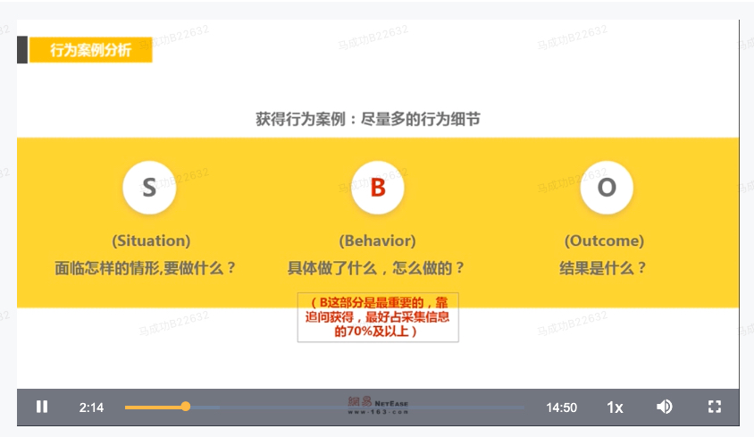

# 面试流程

* [行为面试](https://salon.netease.com/app/course-detail?id=3000501&type=media)
* [面试培训](https://salon.netease.com/app/course-detail?id=2003106&type=media)

## 1. 招聘要求

1. 招优秀的人 不止招聘能干活的人 否则成本会很高
2. 招聘需求
3. 冰山以上 知识经验 专业技能，冰山以下 人才观(软性素质) 职业动机/文化适配
4. 5分钟 40分钟提问 5-10分钟收尾
5. 面试评价不少于50字 优劣势分析 软性素质 面试结论
6. 做有温度的面试官

### 1.1 面试评价

### 1.2 面试礼仪

### 1.3 谷歌面试目标

### 1.4 综合能力拆解-冰山模型

### 1.5 网易人才观

### 1.6 网易面试目标及分工

## 2. 实施面试

1. 通用能力考察高于专业能力考察
2. 业务部门面试 50%专业技能 50%人才观
3. 让候选人举例子 这个例子是有面试目标的 抛出一个问题 让候选人举出一个有代表性的例子
4. 追问 ，防止假案例 含糊语言 关键词（我们，）要聚焦到个人能力 SBO
5. 分析

### 2.1 实施面试-提问

### 2.2 宝洁八大问

### 2.3 行为面试-追问

### 2.4 实施面试-追问-收尾

### 2.5 行为面试-SBO

### 2.6 行为段位

### 2.7 课程总结

